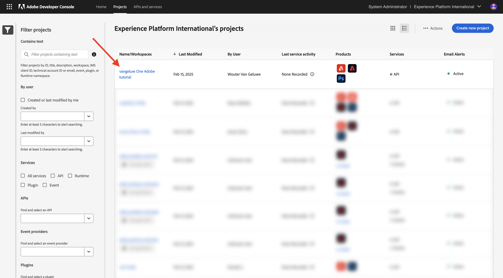
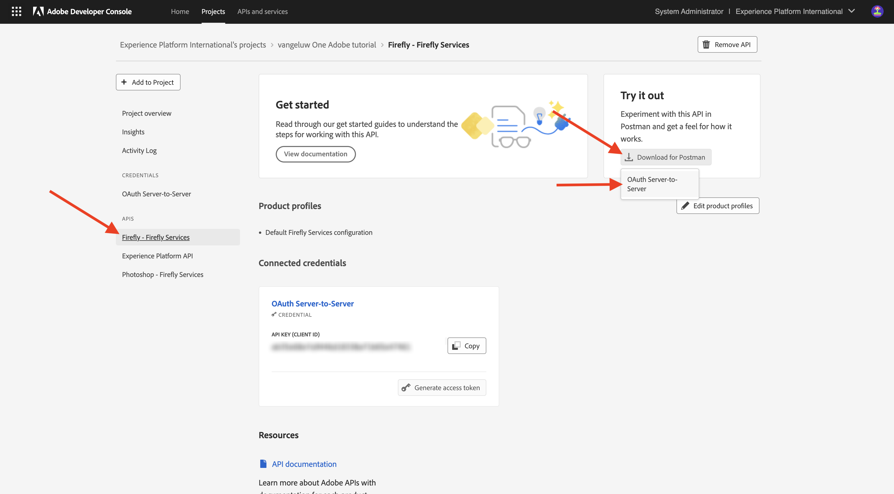
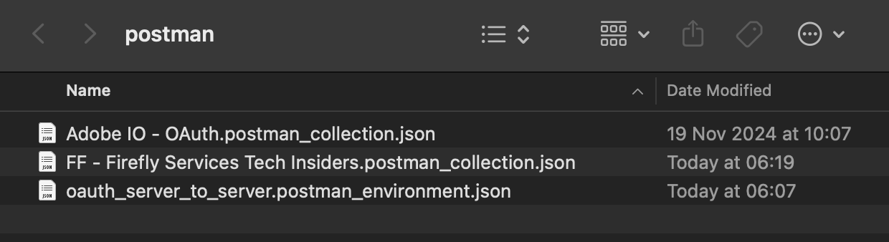
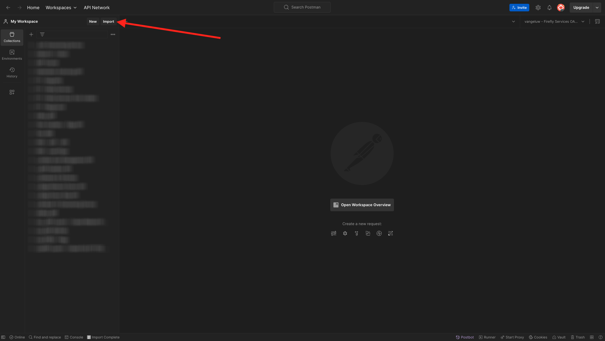
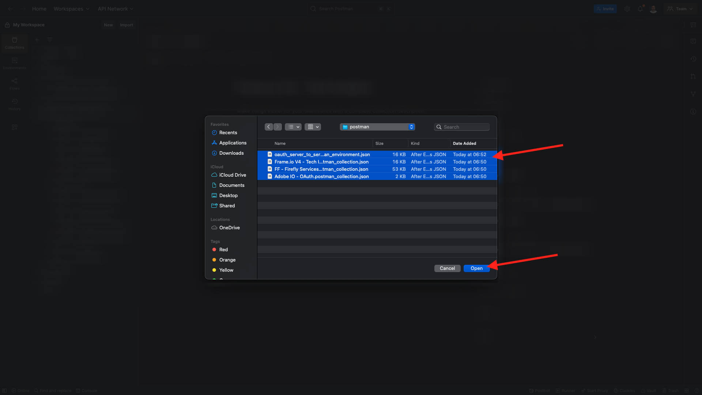
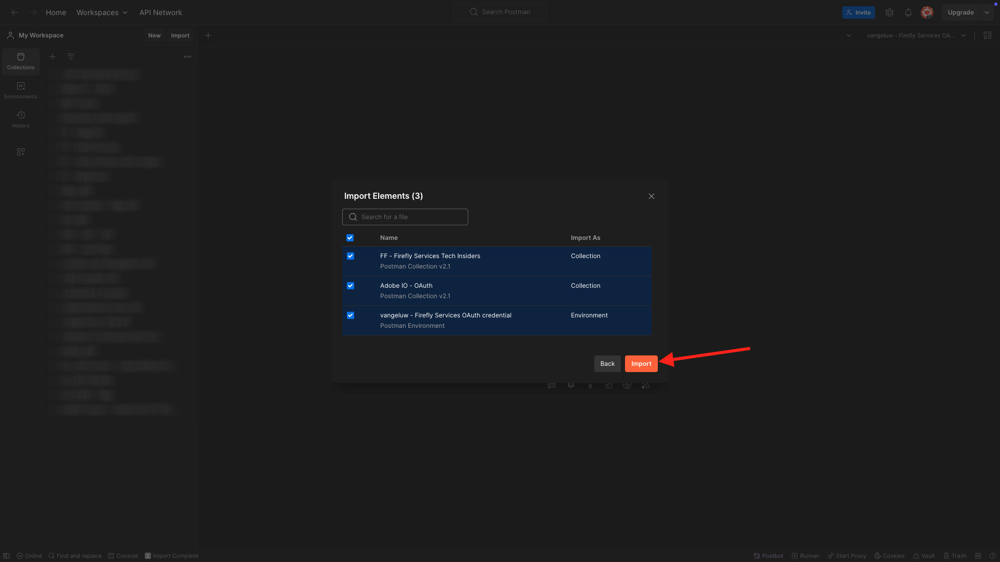
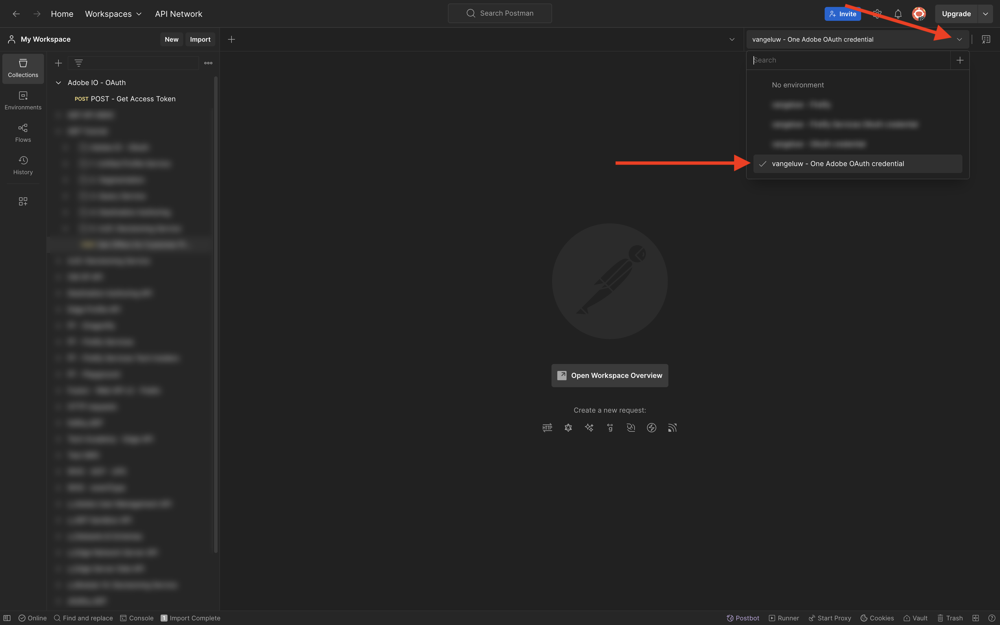
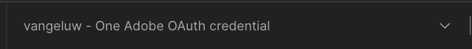
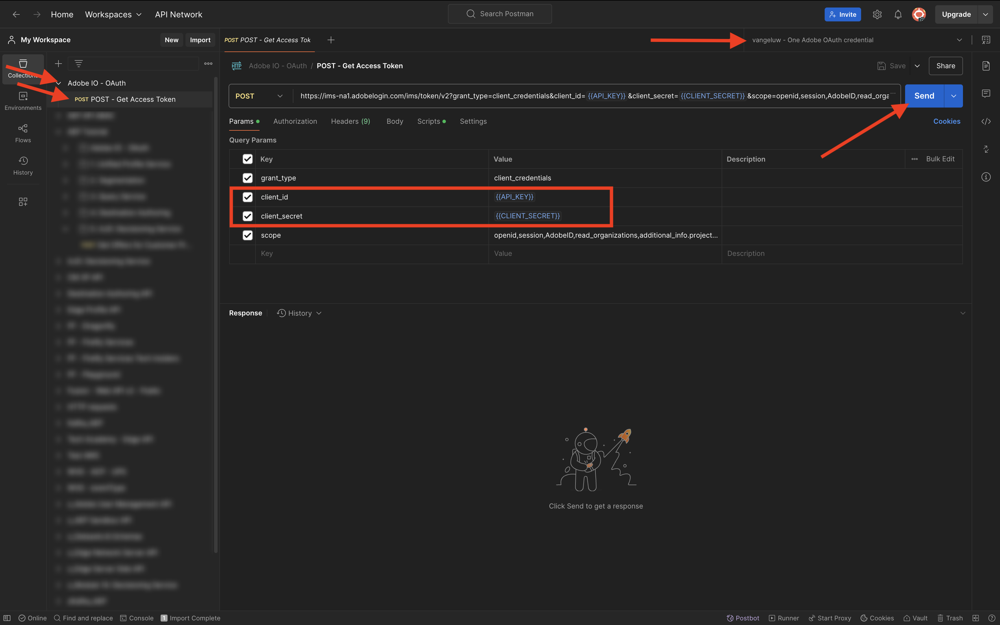
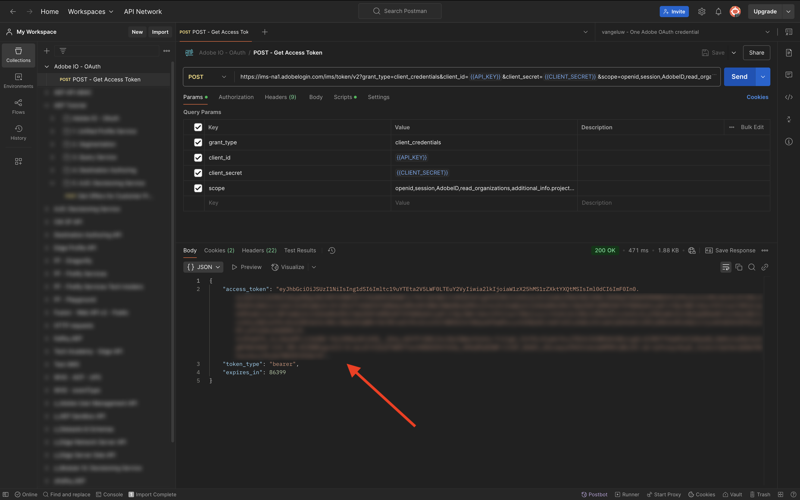

# Option 1: use Postman

>[!IMPORTANT]
>
>If you're an Adobe employee, follow the instructions to [install PostBuster](./ex8.md){target="_blank"}!

## Postman environment download

Go to [https://developer.adobe.com/console/home](https://developer.adobe.com/console/home){target="_blank"} and open your project.

Click the **Firefly - Firefly Services** API. Then, click **Download for Postman** and choose **OAuth Server-to-Server** to download a Postman environment.

## Postman authentication to Adobe I/O

Download and install the relevant version of Postman for your OS at [Postman Downloads](https://www.postman.com/downloads/){target="_blank"}.

Start the application.

In Postman, there are 2 concepts: Environments and Collections.

The environment file contains all of your environmental variables which are more or less consistent. In the environment, you'll find things like the IMSOrg of your Adobe environment, alongside security credentials like your Client ID and others. You downloaded the environment file during the Adobe I/O setup previously and it's named  **`oauth_server_to_server.postman_environment.json`**.
    
The collection contains a number of API requests that you can use. You will use the below collections:

- 1 Collection for Authentication to Adobe I/O
- 1 Collection for the Adobe Firefly Servies exercises in this module
- 1 Collection for the Adobe Frame.io V4 exercises in this module

Download [postman-ff.zip](./../../../assets/postman/postman-ff.zip){target="_blank"} to your local desktop. 

In **postman-ff.zip** file are the following files:

- `Adobe IO - OAuth.postman_collection.json`
- `FF - Firefly Services Tech Insiders.postman_collection.json`
- `Frame.io V4 - Tech Insiders.postman_collection.json`
  
Unzip **postman-ff.zip** and store the following files in a folder on your desktop:

- `Adobe IO - OAuth.postman_collection.json`
- `FF - Firefly Services Tech Insiders.postman_collection.json` 
- `Frame.io V4 - Tech Insiders.postman_collection.json`
- `oauth_server_to_server.postman_environment.json`

In Postman, select **Import**.

Select **Files**.

Choose all the files from the folder, then select **Open** and **Import**. 

Click **Import**.

Now you have everything you need in Postman to start interacting with Firefly Services through the APIs.

## Request an access token

Next, to make sure you're properly authenticated, you need to request an access token.

Make sure that you've got the right environment selected before executing any request by verifying the Environment-dropdown list in the top right corner. The selected Environment should have a name similar to this one, `--aepUserLdap-- One Adobe OAuth Credential`.

The selected Environment should have a name similar to this one, `--aepUserLdap-- One Adobe OAuth Credential`.

Now that your Postman environment and collections are configured and working, you can authenticate from Postman to Adobe I/O.

In the **Adobe IO - OAuth** collection, select the request named **POST - Get Access Token** and select **Send**. 

Notice under **Query Params**, two variables are referenced, `API_KEY` and `CLIENT_SECRET`. These variables are taken from the selected environment, `--aepUserLdap-- One Adobe OAuth Credential`. 

If successful, a response containing a bearer token, an access token, and an expiration window appears in the **Body** section of Postman.

You should see a similar response containing the following information:

| Key     | Value     | 
|:-------------:| :---------------:| 
| token_type          | **bearer** |
| access_token    | **eyJhbGciOiJSUz...** | 
| expires_in          | **86399** |

The Adobe I/O **bearer-token** has a specific value (the very long access_token) and an expiration window and is now valid for 24 hours. This means that after 24 hours, if you want to use Postman to interact with Adobe APIs, you will have to generate a new token by running this request again.

Your Postman environment is now configured and working.

## Next Steps

Go to [Applications to install](./ex9.md){target="_blank"}

Go back to [Getting Started](./getting-started.md){target="_blank"}

Go back to [All modules](./../../../overview.md){target="_blank"}
