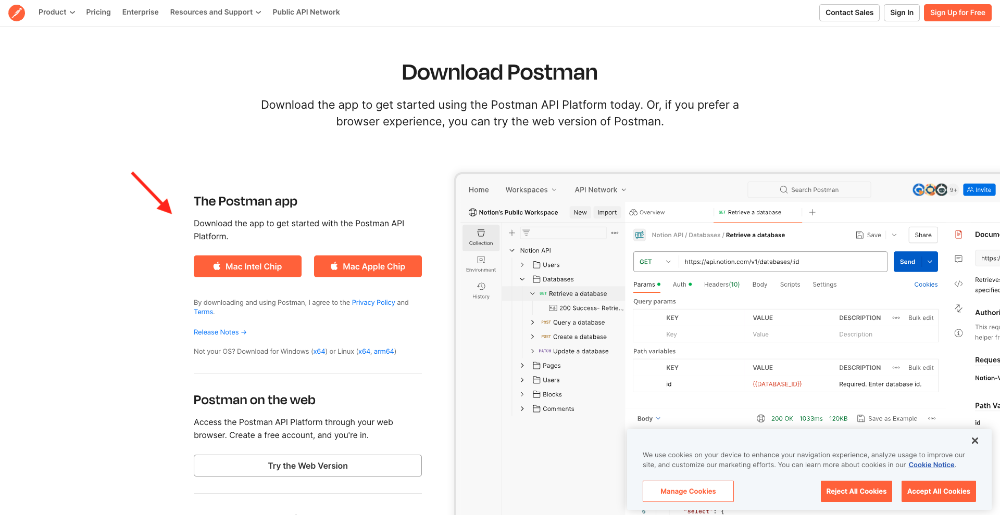

# Option 1: use Postman

>[!IMPORTANT]
>
>If you're an Adobe employee, follow the instructions to [install PostBuster](./ex8.md)!

## Postman setup

Select **Download for Postman**, then choose **OAuth Server-to-Server** to download a Postman environment.

{zoomable="yes"}

Select your project name.

{zoomable="yes"}

Select **Edit Project**.

{zoomable="yes"}

Enter a friendly name for your integration: `--aepUserLdap-- Firefly`and select **Save**.

{zoomable="yes"}

The setup of your Adobe I/O integration is now finished.

{zoomable="yes"}

## Postman authentication to Adobe I/O

>[!IMPORTANT]
>
>If you're an Adobe employee, please follow the instructions here to use [PostBuster](./../../../postbuster.md).

Download and install the relevant version of Postman for your OS at [Postman Downloads](https://www.postman.com/downloads/){target="_blank"}.

{zoomable="yes"}

Start the application.

In Postman, there are 2 concepts: Environments and Collections.

The environment file contains all of your environmental variables which are more or less consistent. In the environment, you'll find things like the IMSOrg of your Adobe environment, alongside security credentials like your Client ID and others. You downloaded the environment file during the Adobe I/O setup previously and it's named  **`oauth_server_to_server.postman_environment.json`**.
    
The Collection contains a number of API requests that you can use. We will use 2 collections

- 1 Collection for Authentication to Adobe I/O
- 1 Collection for the exercises in this module

Download [postman-ff.zip](./../../../assets/postman/postman-ff.zip) to your local desktop. 

{zoomable="yes"}

In **postman-ff.zip** file are the following files:

- `Adobe IO - OAuth.postman_collection.json`
- `FF - Firefly Services Tech Insiders.postman_collection.json`
  
Unzip **postman-ff.zip** and store the following 2 files in a folder on your desktop:

- Adobe IO - OAuth.postman_collection.json 
- FF - Firefly Services Tech Insiders.postman_collection.json 
- oauth_server_to_server.postman_environment.json

{zoomable="yes"}

In Postman, select **Import**.

{zoomable="yes"}

Select **Files**.

{zoomable="yes"}

Choose the three files from the folder, then select **Open** and **Import**. 

{zoomable="yes"}

{zoomable="yes"}

Now you have everything you need in Postman to start interacting with Firefly Services through the APIs.

## Request an access token

Next, to make sure you're properly authenticated, you need to request an access token.

Make sure that you've got the right environment selected before executing any request by verifying the Environment-dropdown list in the top right corner. The selected Environment should have a name similar to this one, `--aepUserLdap-- Firefly Services OAuth Credential`.

{zoomable="yes"}

The selected Environment should have a name similar to this one, `--aepUserLdap-- Firefly Services OAuth Credential`.

{zoomable="yes"}

Now that your Postman environment and collections are configured and working, you can authenticate from Postman to Adobe I/O.

In the **Adobe IO - OAuth** collection, select the request named **POST - Get Access Token** and select **Send**. 

Notice under **Query Params**, two variables are referenced, `API_KEY` and `CLIENT_SECRET`. These variables are taken from the selected environment, `--aepUserLdap-- Firefly Services OAuth Credential`. 

{zoomable="yes"}

If successful, a response containing a bearer token, an access token, and an expiration window appears in the **Body** section of Postman.

{zoomable="yes"}

You should see a similar response containing the following information:

| Key     | Value     | 
|:-------------:| :---------------:| 
| token_type          | **bearer** |
| access_token    | **eyJhbGciOiJSU...** | 
| expires_in          | **86399** |

The Adobe I/O **bearer-token** has a specific value (the very long access_token) and an expiration window and is now valid for 24 hours. This means that after 24 hours, if you want to use Postman to authenticate to Adobe I/O, you will have to generate a new token by running this request again.

Your Postman environment is now setup and working. You've now completed the Getting Started module.

## Next Steps

Go to [Applications to install](./ex9.md){target="_blank"}

Go back to [Getting Started](./getting-started.md){target="_blank"}

Go back to [All modules](./../../../overview.md){target="_blank"}
