# Option 2: PostBuster setup

>[!IMPORTANT]
>
>If you're not an Adobe employee, follow the instructions to [install Postman](./ex7.md). The below instructions are only intended for Adobe employees.

## Install PostBuster

Go to [https://adobe.service-now.com/esc?id=adb_esc_kb_article&sysparm_article=KB0020542](https://adobe.service-now.com/esc?id=adb_esc_kb_article&sysparm_article=KB0020542). 

Click to download the latest release of **PostBuster**.


Download the correct version for your OS.


Once the download has completed and has been installed, open PostBuster. You should then see this. Click **Import**.

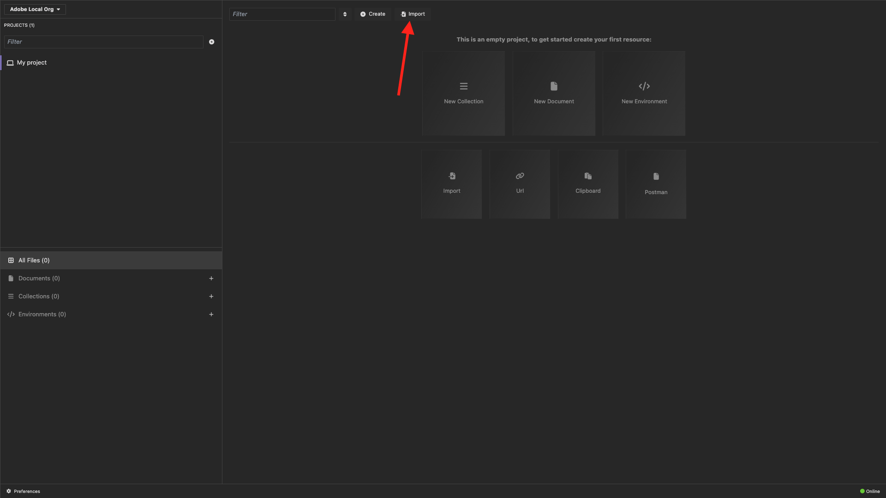

Download [postbuster.json.zip](./../../../assets/postman/postbuster.json.zip) and extract it on your desktop.


Click **Choose a File**.


Select the file **postbuster.json**. Click **Open**.


You should then see this. Click **Scan**.

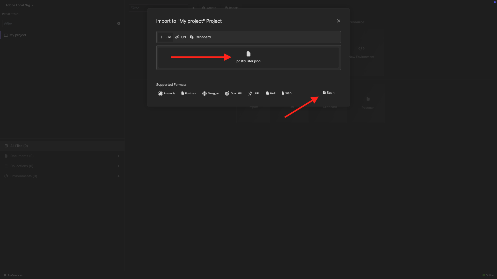

Click **Import**.

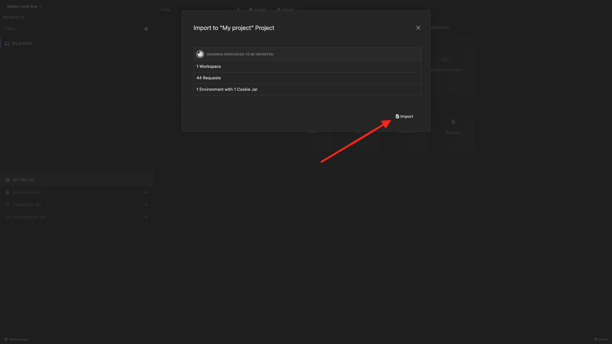

You should then see this. Click to open the imported collection.

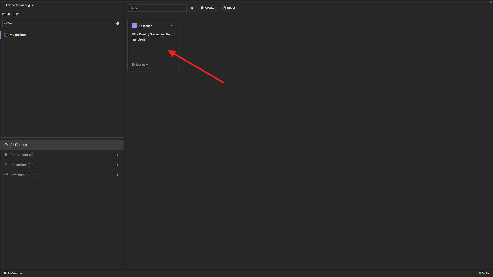

Now you see your collection. You still need to configure an environment to hold some environment variables.

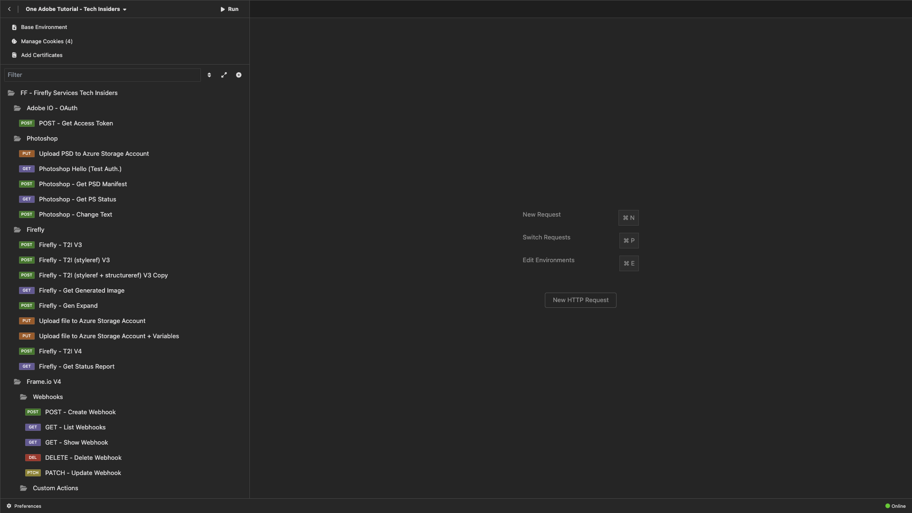

Click **Base Environment** and then click the **edit** icon.

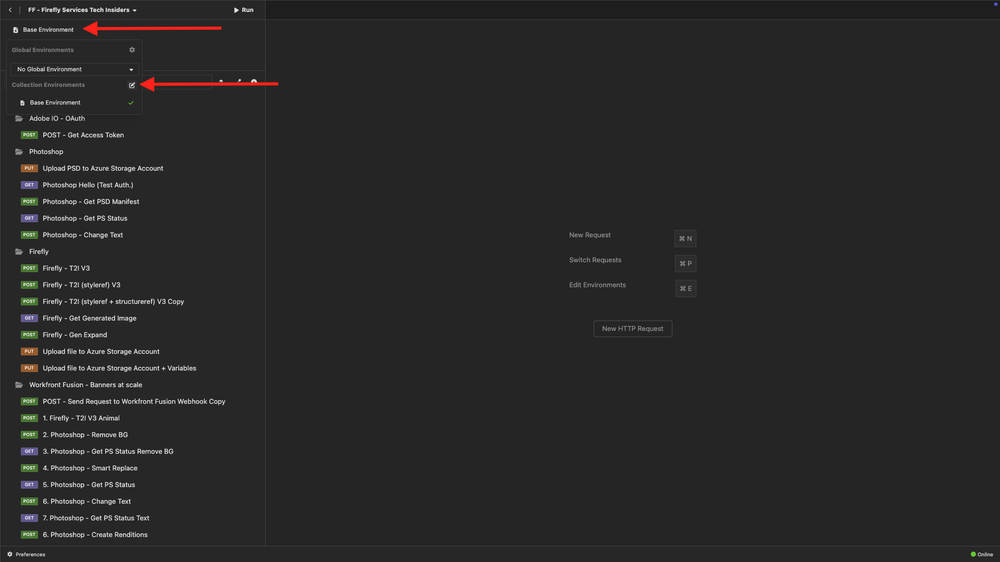

You should then see this.

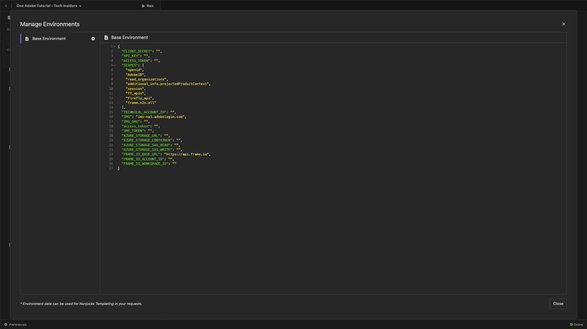

Copy the below environment placeholder and paste it in the **Base Environment**.

```json
{
	"CLIENT_SECRET": "",
	"API_KEY": "",
	"ACCESS_TOKEN": "",
	"SCOPES": [
		"openid",
		"AdobeID",
		"read_organizations", 
		"additional_info.projectedProductContext", 
		"session",
		"ff_apis",
		"firefly_api"
	],
	"TECHNICAL_ACCOUNT_ID": "",
	"IMS": "ims-na1.adobelogin.com",
	"IMS_ORG": "",
	"access_token": "",
	"IMS_TOKEN": "",
	"AZURE_STORAGE_URL": "",
	"AZURE_STORAGE_CONTAINER": "",
	"AZURE_STORAGE_SAS_READ": "",
	"AZURE_STORAGE_SAS_WRITE": ""
}
```

You should then have this.

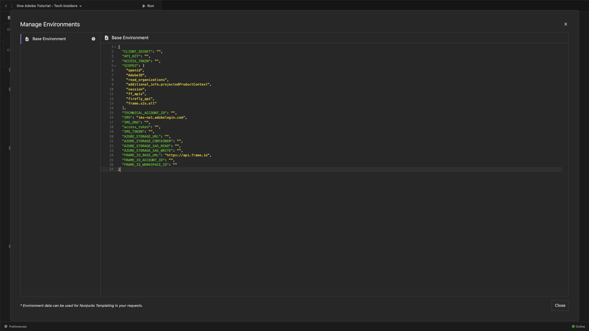

## Enter your Adobe I/O variables

Go to [https://developer.adobe.com/console/home](https://developer.adobe.com/console/home){target="_blank"} and open your project.

{zoomable="yes"}

Go to **OAuth Server-to-Server**. 

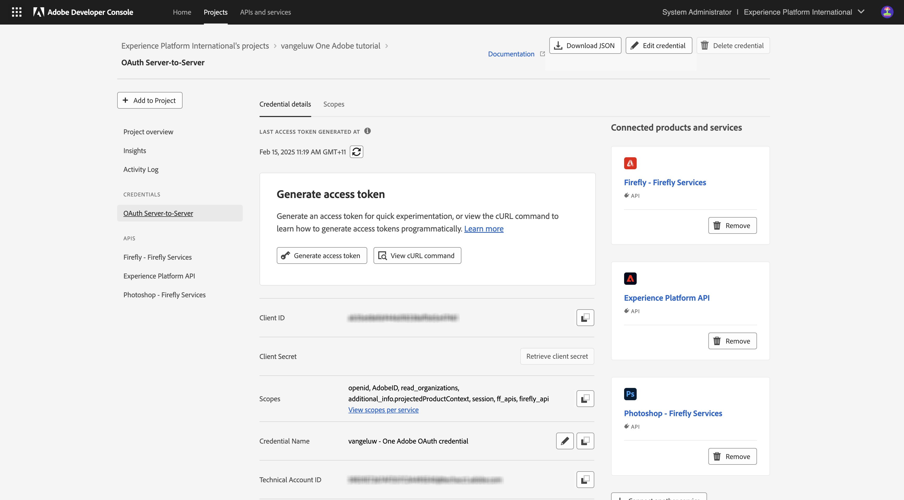{zoomable="yes"}

You now need to copy the following values from your Adobe I/O project and paste them in your PostBuster Base Environment.

- Client ID
- Client Secret (Click **Retrieve Client Secret**)
- Technical Account ID
- Organization ID (Scroll down to find your Organization ID)

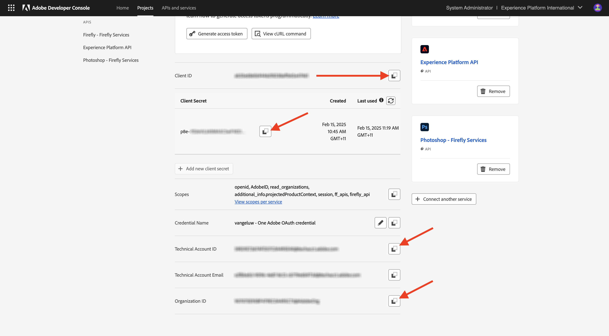{zoomable="yes"}

Copy the above variables one by one, and paste them in your **Base Environment** in PostBuster.

| Variable Name in Adobe I/O     | Variable Name in PostBuster Base Environment      | 
|:-------------:| :---------------:| 
| Client ID          | `API_KEY` |
| Client Secret          | `CLIENT_SECRET` |
| Technical Account ID    | `TECHNICAL_ACCOUNT_ID`|
| Organization ID          | `IMS_ORG` |

After having copied these variables on by one, your PostBuster Base Environment should look like this:

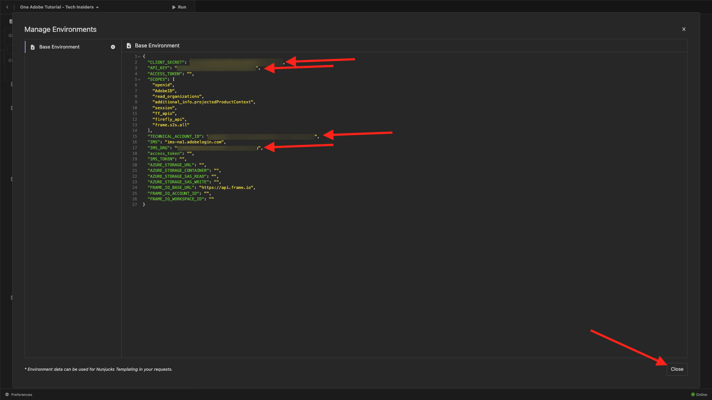{zoomable="yes"}

In the **Adobe IO - OAuth** collection, select the request named **POST - Get Access Token** and select **Send**. 

You should see a similar response containing the following information:

| Key     | Value     | 
|:-------------:| :---------------:| 
| token_type          | **bearer** |
| access_token    | **eyJhbGciOiJS...** | 
| expires_in          | **86399** |

The Adobe I/O **bearer-token** has a specific value (the very long access_token) and an expiration window and is now valid for 24 hours. This means that after 24 hours, if you want to use Postman to interact with Adobe APIs, you will have to generate a new token by running this request again.

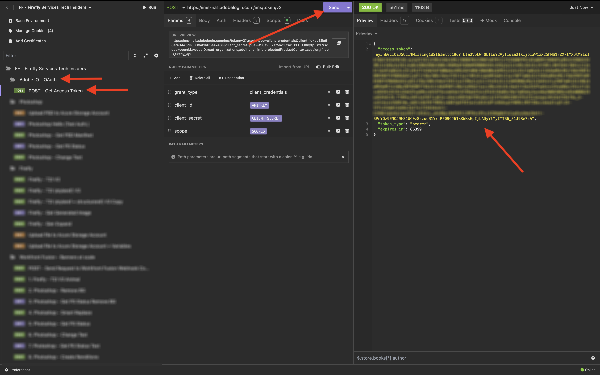{zoomable="yes"}

Your PostBuster environment is now setup and working. You've now completed the Getting Started module.

## Next Steps

Go to [Applications to install](./ex9.md){target="_blank"}

Go back to [Getting Started](./getting-started.md){target="_blank"}

Go back to [All modules](./../../../overview.md){target="_blank"}