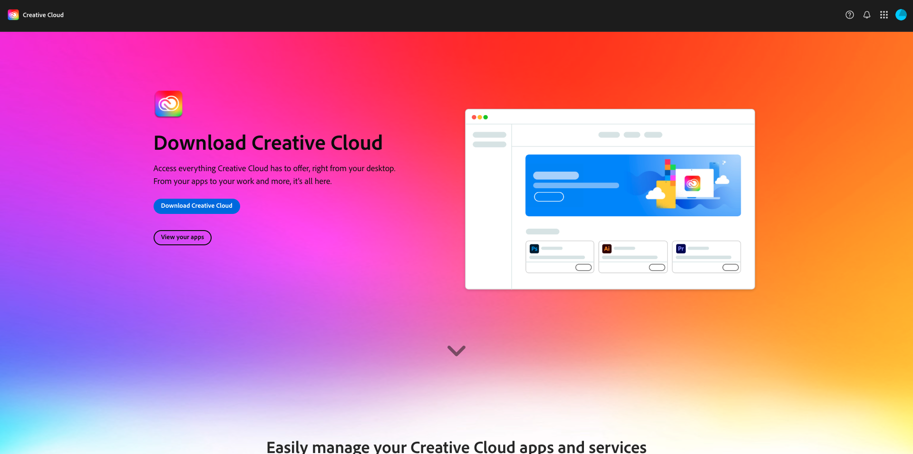
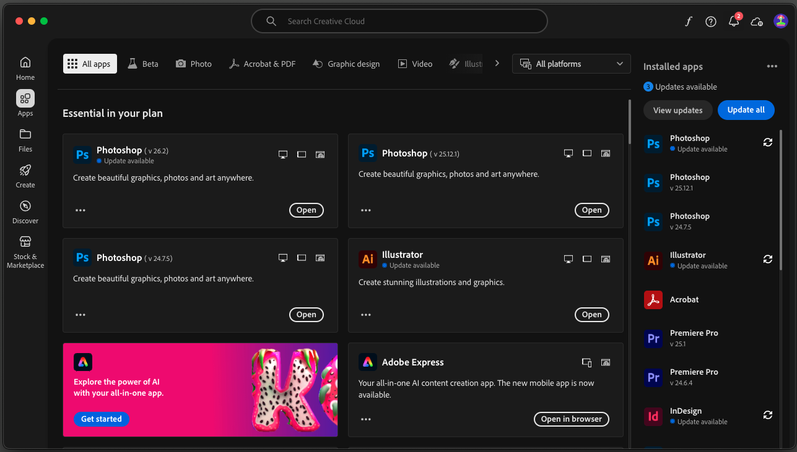
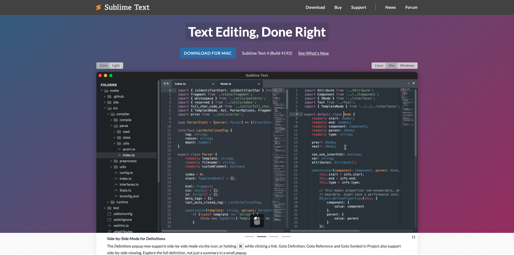
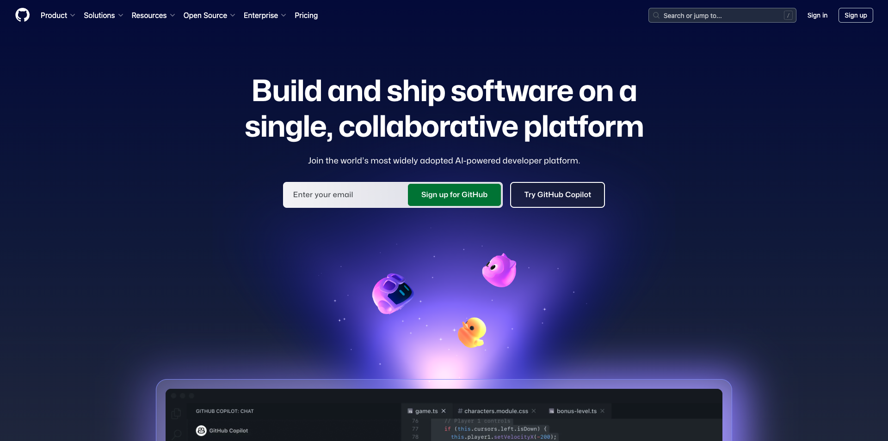

# Applications to install

Below is an overview of the prework that is needed prior to joining a live workshop.

## Adobe Creative Cloud

Go to [https://creativecloud.adobe.com/apps/download/creative-cloud](https://creativecloud.adobe.com/apps/download/creative-cloud). 

## Photoshop

Open the **Adobe Creative Cloud** app, go to **Apps**. Install Photoshop on your computer.

## Visual Studio Code

Go to [https://code.visualstudio.com/](https://code.visualstudio.com/){target="_blank"}, download and install **Visual Studio Code**.

## Text Editor

If you don't have a Text Editor app, you can go to [https://www.sublimetext.com/](https://www.sublimetext.com/){target="_blank"} and download and install this Text Editor.

## GitHub Account

If you don't have a GitHub account yet, go to [https://github.com/](https://github.com/){target="_blank"}, and click **Sign Up**. Use your personal email address and create your account.

## GitHub Desktop

Go to [https://desktop.github.com/download/](https://desktop.github.com/download/){target="_blank"}, download and install **Github Desktop**.

## Azure Storage Explorer

[Download Microsoft Azure Storage Explorer to manage your files](https://azure.microsoft.com/en-us/products/storage/storage-explorer#Download-4){target="_blank"}. Select the correct version for your specific OS, download and install it.

{zoomable="yes"}

You've now finished the Getting Started module.

## Next Steps

Go back to [Getting Started](./getting-started.md){target="_blank"}

Go back to [All modules](./../../../overview.md){target="_blank"}./images
