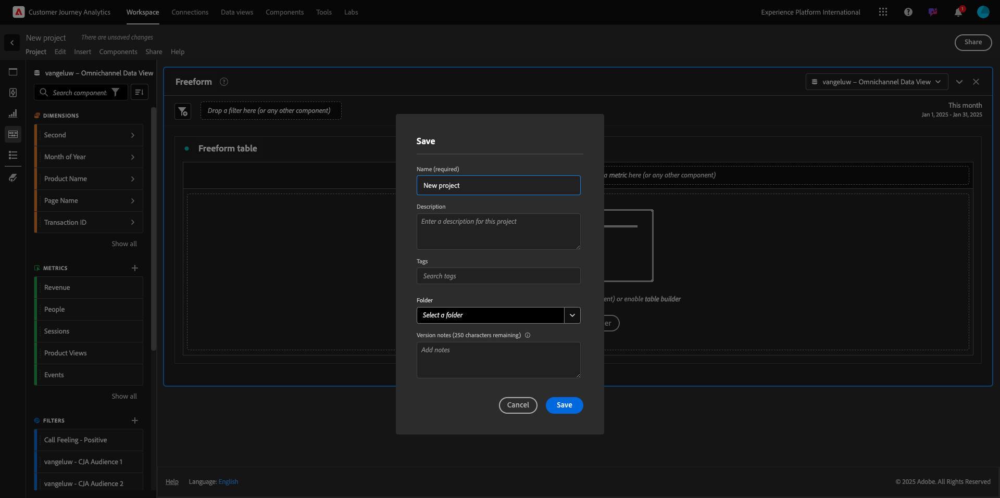
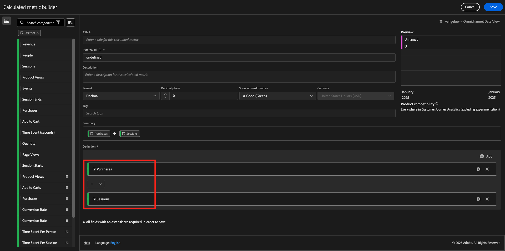

# 1.1.4 Data preparation in Analysis Workspace

## Objectives

- Understand the Analysis Workspace UI in CJA
- Understand the concepts of data preparation in Analysis Workspace
- Learn how to do data calculations

## 1.1.4.1 Analysis Workspace UI in CJA

Analysis Workspace removes all of the typical limitations of a single Analytics report. It provides a robust, flexible canvas for building custom analysis projects. Drag-and-drop any number of data tables, visualizations, and components (dimensions, Metrics, segments, and time granularities) to a project. Instantly create breakdowns and segments, create cohorts for analysis, create alerts, compare segments, do flow and fallout analysis, and curate and schedule reports for sharing with anyone in your business.

Customer Journey Analytics brings this solution on top of Platform data. We highly recommend watching this four-minute overview video:

>[!VIDEO](https://video.tv.adobe.com/v/35109?quality=12&learn=on)

If you haven't used Analysis Workspace before, we highly recommend watching this video:

>[!VIDEO](https://video.tv.adobe.com/v/26266?quality=12&learn=on)

### Create Your Project

Now it's time to create your first CJA workspace. Go to the **Workspace** tab inside of CJA. 
Click **Create project**.

You'll then see this. Select **Blank Workspace project** and then click **Create**.

You'll then see an empty project.

First, make sure to select the correct Data View in the upper right corner of your screen. The Data View to select is `--aepUserLdap-- - Omnichannel Data View`.

Next, you'll save your project and give it a name. You can use the following command to save:

|  OS        | Short cut   | 
| ----------------- |-------------| 
| Windows | Control + S          | 
| Mac | Command + S          | 

You'll see this popup: 

Please use this naming convention:

|  Name       | Description   | 
| ----------------- |-------------| 
| `--aepUserLdap-- - Omnichannel Analysis`| `--aepUserLdap-- - Omnichannel Analysis`|

Next, click **Save**.

## 1.1.4.2 Calculated Metrics

Although we have organized all the components in the Data View, you still need to adapt some of them, so that business users are ready to start their analysis. Also, during any analysis you can create calculated metric to go deeper on the insights finding.

As an example we will create a calculated **Conversion Rate** using the **Purchases** metric/event we defined on the Data View.

### Conversion Rate

Let's start opening the calculated metric builder. Click on the **+** to create your first Calculated Metric in Analysis Workspace.

The **Calculated Metric Builder** will show up:

Find the **Purchases** in the list of Metrics in the left side menu. Under **Metrics** click **Show all**

Now drag an drop the **Purchases** metric in to the calculated metric definition.

Typically, conversion rate means **Conversions / Sessions**. So let's do the same calculation in the calculated Metric definition canvas. Find the **Sessions** metric and drag and drop it into the definition builder, under the **Purchases** event.

Notice that the division operator is automatically selected.

The conversion rate is commonly represented in percentage. So, let's change the format to be percentage and also select 2 decimals.

Finally, Change the name and description of the calculated metric:

| Title         | Description| External ID|    
| ----------------- |-------------| -------------| 
| Conversion Rate | Conversion Rate      | conversionRate|

You will then have this. Click **Save**.

Click **Save** again.

## 1.1.4.3 Calculated Dimensions: Filters (segmentation) & Date Ranges

### Filters: Calculated Dimensions

Calculations are not meant to be only for Metrics. Before starting any analysis it's also interesting to create some **Calculated Dimensions**. This basically meant **segments** back in Adobe Analytics. In Customer Journey Analytics, these segments are called **Filters**. 

Creating filters will help business users to start the analysis with some valuable calculated dimensions. This will automate some tasks as well as helping on the adoption part. Here are some examples:

1. Own Media, Paid Media, 
2. New vs Returning visits
3. Customers with Abandoned Cart

These filters can be created before or during the analysis part (which you'll do in the next exercise). 

### Date Ranges: Calculated Time Dimensions

Time Dimensions are another type of calculated dimensions. Some are already create, but you also have the ability to create your own custom Time Dimensions at the data preparation phase. 

These Calculated Time Dimensions we will help analysts and business users to remember important dates and use them to filter and change the reporting time. Typical questions and doubts that come to our minds when we do analysis:

- When was Black Friday last year? 21th-29th?
- When did we run that TV campaign in December?
- From when to when did we do the 2018 Summer Sales? I want to compare it against 2019. By the way, do you know the exact days in 2019? 

You've now finished the data preparation exercise using CJA Analysis Workspace.

## Next Steps

Go to [1.1.5 Visualization using Customer Journey Analytics](./ex5.md)(./ex2.md){target="_blank"}

Go back to [Customer Journey Analytics](./customer-journey-analytics-build-a-dashboard.md){target="_blank"}

Go back to [All modules](./../../../../overview.md){target="_blank"}
