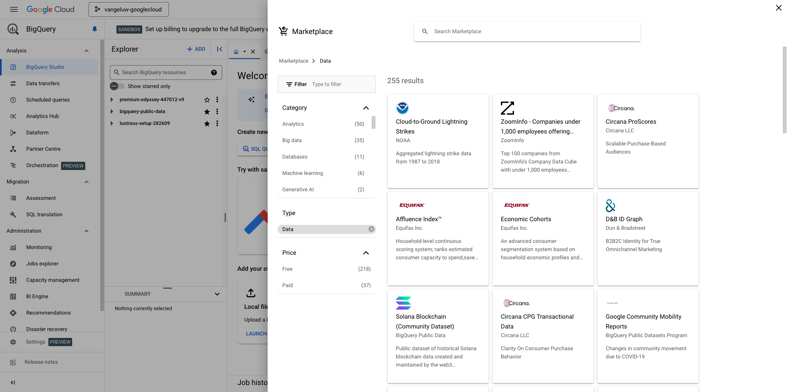

# 1.2.1 Start using Google Cloud Platform

>[!NOTE]
>
>For this exercise, you need access to a Google Cloud Platform environment. If you don't have access to GCP yet, create a new account using your personal email address. 

## 1.2.1.1 Why connect Google BigQuery to Adobe Experience Platform to get Google Analytics data

Google Cloud Platform (GCP) is a suite of public cloud computing services offered by Google. The Google Cloud Platform includes a range of hosted services for compute, storage and application development that run on Google hardware. 

BigQuery is one of these services and it is always included with Google Analytics 360. Google Analytics data is frequently sampled when we try to get data directly from it (API for example). That's why Google includes BigQuery to get unsampled data, so brands can do advanced analysis using SQL and benefit from the power of GCP.

Google Analytics data is loaded daily into BigQuery using a batch-mechanism. As such, it doesn't make any sense to use this GCP/BigQuery integration for Real-time personalization and activation use-cases.

If a brand wants to deliver real-time personalization use-cases based on Google Analytics data, it can collect that data on the website with Google Tag Manager and then stream it to Adobe Experience Platform in real-time. 

The GCP/BigQuery Source Connector should be used to...

- track all customer behavior on the website and load that data in Adobe Experience Platform for analysis, data science and personalization use-cases that don't require real-time activation.
- load Google Analytics historical data into Adobe Experience Platform, again for analysis and data science use-cases

## 1.2.1.2 Your Google Account

>[!NOTE]
>
>For this exercise, you need access to a Google Cloud Platform environment. If you don't have access to GCP yet, create a new account using your personal email address. 

## 1.2.1.3 Select or create a project

Go to [https://console.cloud.google.com/](https://console.cloud.google.com/).

Next, click on **Select a project** or click an existing project.

If you don't have a project yet, click on **NEW PROJECT**. If you already have a project, you can choose to select that one and continue to the next step.

Name your project following this naming convention. Click **CREATE**.

| Convention         |
| ----------------- |
| `--aepUserLdap---googlecloud` | 

Wait until the notification in the top right side of your screen tells you that the creation is finished. Then, click **SELECT PROJECT**.

Next, go to the search bar on top of the screen and type **BigQuery**. Select the first result.

The goal of this module is to get Google Analytics data into Adobe Experience Platform. To do that, you need dummy data in a Google Analytics dataset to start with. 

Click on **+ Add**, and then click **Public datasets** in the right menu.

You'll then see this window: 

Enter the search term **Google Analytics Sample** in the search bar and click the first search result.

You'll see the following screen with a description of the dataset. Click on **VIEW DATASET**.

You'll then be redirected to BigQuery where you'll see this **bigquery-public-data** dataset under **Explorer**.

In **Explorer**, you should now see a number of tables. Feel free to explore them. Go to `google_analytics_sample`.

Click to open the table `ga_sessions`.

Before you continue with the next exercise, please write down the following things in a separate text file on your computer:

| Credential         | Naming| Example|   
| ----------------- |-------------| -------------|
| Project Name | `--aepUserLdap---googlecloud` | vangeluw-googlecloud  |
| Project ID | random | possible-bee-447102-h3 |

You can find your Project Name and Project ID by clicking on your **Project Name** in the top menu bar:

You'll then see your Project ID on the right side:

You can now move to the next exercise where you'll get your hands dirty by querying Google Analytics data.

## Next Steps

Go to [1.2.2 Create your first query in BigQuery](./ex2.md){target="_blank"}

Go back to [Ingest & Analyze Google Analytics data in Adobe Experience Platform with the BigQuery Source Connector](./customer-journey-analytics-bigquery-gcp.md){target="_blank"}

Go back to [All modules](./../../../../overview.md){target="_blank"}
