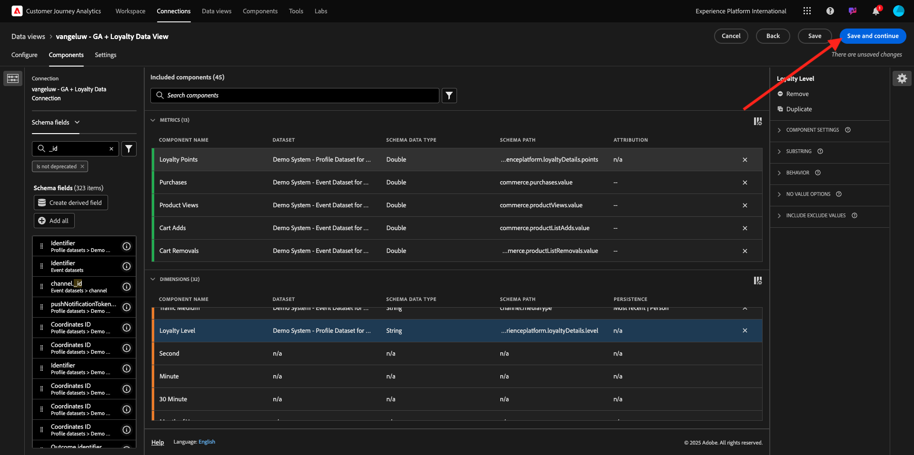
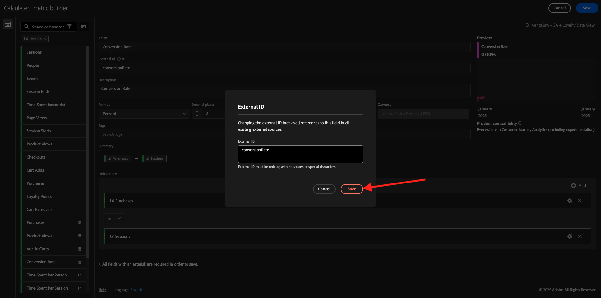
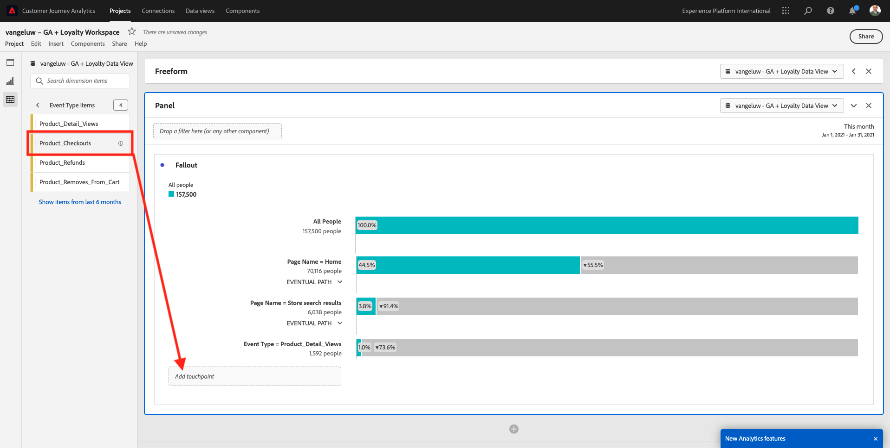
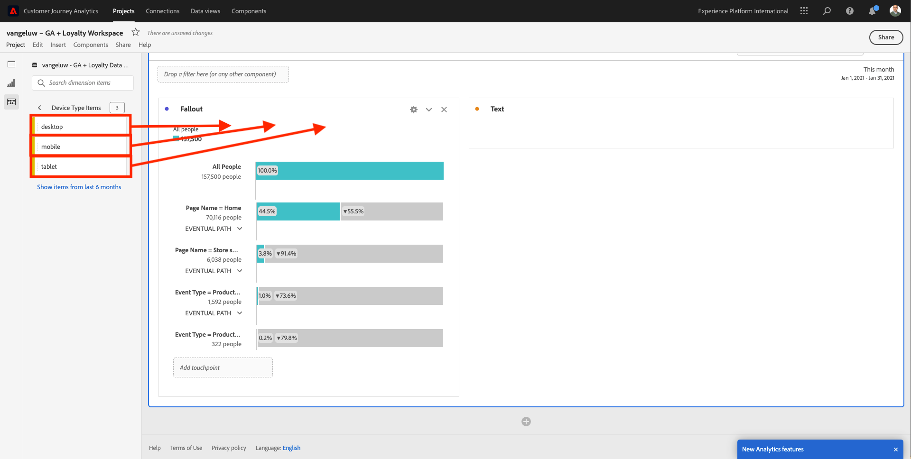

# 4.2.5 Analyze Google Analytics Data using Customer Journey Analytics 

## Objectives

- Connect our BigQuery Data Set to Customer Journey Analytics (CJA)
- Connect and join Google Analytics with Loyalty Data.
- Become familiar with CJA UI

## 4.2.5.1 Create a Connection

Go to [analytics.adobe.com](https://analytics.adobe.com) to access Customer Journey Analytics.

On the Customer Journey Analytics homepage, go to **Connections**. 

Here you can see all the different connections made between CJA and Platform. These connections have the same goal as report suites in Adobe Analytics. However, the collection of the data is totally different. All data is coming from Adobe Experience Platform datasets. 

Click **Create new connection**.

You'll then see the **Create Connection** UI.

For the name, use this : `--aepUserLdap-- - GA + Loyalty Data Connection`. 

You need to select the correct sandbox to use. In the sandbox menu, select your sandbox, which should be `--aepSandboxName--`. In this example, the sandbox to use is **Tech Insiders**.

Set the **Average number of daily events** to **less than 1 million**.

In the dataste menu, you can now start adding datasets. Click **Add datasets**.

The datasets to add are:
- `Demo System - Profile Dataset for CRM (Global v1.1)`
- `Demo System - Event Dataset for BigQuery (Global v1.1)`

Search for both datasets, check their checkbox and then click **Next**.

You'll then see this:

For the dataset `Demo System - Event Dataset for BigQuery (Global v1.1)`, change the **Person ID** to **loyaltyId** and set the **Data source type** to **Web Data**. Enable both options for **Import all new data** and **Backfill all existing data**.

For the dataset `Demo System - Event Dataset for BigQuery (Global v1.1)`, verify that the **Person ID** is set to to **crmId** and set the **Data source type** to **Web Data**. Enable both options for **Import all new data** and **Backfill all existing data**. Click **Add datasets**.

You'll then be here. Click **Save**.

After having created your **Connection** it may take a few hours before your data is available in CJA.

You'll then see your connection in the list of available connections.

## 4.2.5.2 Create a data view

With your connection done, you can now progress to influencing visualization. A difference between Adobe Analytics and CJA, is that CJA needs a data view in order to clean and prepare the data before visualization. 

A data view is similar to the concept of virtual report suites in Adobe Analytics, where you define context-aware visit definitions, filtering and also, how the components are called. 

You'll need a minimum of one data view per connection. However, for some use-cases, it's great to have multiple data views for the same connection, with the goal of giving different insights to different teams. 

If you want your company to become data-driven, you should adapt how data is viewed in each team. Some examples:

- UX metrics only for the UX Design team
- Use the same names for KPIs and Metrics for Google Analytics as for Customer Journey Analytics so that the digital analytics team can speak 1 language only.
- data view filtered to show for instance data for 1 market only, or 1 brand, or only for Mobile Devices.

On the **Connections** screen, check the checkbox in front of the connection you just created. Click **Create data view**.

You'll be redirected to the **Create Data View** workflow.

You can now configure the basic definitions for your data view. Things like Time zone, Session Timeout or the data view filtering (the segmentation part similar to Virtual Report Suites in Adobe Analytics).

The **Connection** you created in the previous exercise is already selected. Your connection is named `--aepUserLdap-- - GA + Loyalty Data Connection`.

Next, give your data view a name following this naming convention: `--aepUserLdap-- - GA + Loyalty Data View`. 

Enter the same value for the description: `--aepUserLdap-- - GA + Loyalty Data View`.

Before doing any analysis or visualization we need to create a data view with all the fields, dimensions and metrics and their attribution settings.

| Field      | Naming Convention|
| ----------------- |-------------|  
| Name Connection | `--aepUserLdap-- - GA + Loyalty Data View`| vangeluw - GA + Loyalty Data View |
| Description | `--aepUserLdap-- - GA + Loyalty Data View` |
| External ID | `--aepUserLdap--GA`|
 
Click **Save and continue**.
 

Click **Save**.

You can now add components to your data view. As you can see, some metrics and dimensions are added automatically.

Add the below components to the data view. Also make sure to update the field names to friendly names. To do that, select the metric or dimension and update the **Component name** field in the right menu.

| Component Type | Component Original Name   | Display Name       | Component Path        | 
| -----------------| -----------------|-----------------|-----------------|
| Metric | commerce.checkouts.value | Checkouts |`commerce.checkouts.value`|
| Metric| commerce.productListRemovals.value | Cart Removals |`commerce.productListRemovals.value`|
| Metric| commerce.productListAdds | Cart Adds |`commerce.productListAdds`|
| Metric| commerce.productViews.value | Product Views |`commerce.productViews.value`|
| Metric| commerce.purchases.value | Purchases |`commerce.purchases.value`|
| Metric| web.webPageDetails.pageViews | Page Views |`web.webPageDetails.pageViews`|
| Metric | points | Loyalty Points |`_experienceplatform.loyaltyDetails.points` |
| Dimension | level | Loyalty Level |`_experienceplatform.loyaltyDetails.level` |
| Dimension | channel.mediaType | Traffic Medium | `channel.mediaType`|
| Dimension | channel.typeAtSource | Traffic Source | `channel.typeAtSource`|
| Dimension | Tracking code | Marketing Channel | `marketing.trackingCode`|
| Dimension | gaid | Google Analytics ID | `_experienceplatform.identification.core.gaid`|
| Dimension | web.webPageDetails.name | Page Title | `web.webPageDetails.name`|
| Dimension | Vendor | Browser | `environment.browserDetails.vendor`|
| Dimension | Type | Device Type | `device.type`|
| Dimension | loyaltyId | Loyalty ID |`_experienceplatform.identification.core.loyaltyId` |
| Dimension| commerce.order.payments.transactionID|Transaction ID  | `commerce.order.payments.transactionID`|
| Dimension| eventType|Event Type  | `eventType`|
| Dimension| timestamp| Timestamp  | `timestamp`|
| Dimension| `_id` |Identifier  |`_id` |

You'll then have something like this:

Next, you need to make some changes to the Person and Session context for some of these components by changing the **Attribution or Persistence Settings**.

Please change the **Attribution Settings** for the below components:

| Component        |   
| -----------------|
| Traffic Source | 
| Marketing Channel | 
| Browser | 
| Traffic Medium | 
| Device Type | 
| Google Analytics ID | 

To do that, select the component, click **Use custom attribution model** and set the **Model** to **Most Recent**, and the **Expiration** to **Person Reporting Window**. Repeat this for all of the above mentioned components.

After making the changes in attribution settings for all of the above mentioned components, you should then have this view. Click **Save and continue**.

On the **Settings** screen, no changes are required. Clickl **Save and finish**.

You are now ready to to analyze Google Analytics data within Adobe Analytics Analysis Workspace. Let's move to the next exercise.

## 4.2.5.3 Create your Project

In Customer Journey Analytics, go to **Workspace**. Click **Create Project**

Select **Blank Workspace Project** and click **Create**.

You now have a blank project:

First, save your project and give it a name. You can use the following command to save:

|  OS        | Short cut   | 
| ----------------- |-------------| 
| Windows | Control + S          | 
| Mac | Command + S          | 

You'll see this popup. Please use this naming convention:

|  Name       | Description    | 
| ----------------- |-------------| 
| `--aepUserLdap-- – GA + Loyalty Workspace`| `--aepUserLdap-- – GA + Loyalty Workspace`|

Next, click **Save**.

Next, make sure to select the correct data view in the upper right corner of your screen. This is the data view you created in the previous exercise, with the naming convention `--aepUserLdap-- - GA + Loyalty Data View`.

### 4.2.5.3.1 Freeform Tables

Freeform tables work, more or less, as pivot tables within Excel. You pick something from the left bar and you drag and drop it into the Freeform and you'll get a table report.

Freeform tables are almost limitless. You can do (almost) anything and this brings so much value when compared to Google Analytics (since this tool has some analysis limitations). This is one of the reasons to load Google Analytics data into another analysis tool.

Let see two examples where you need to use SQL, BigQuery and some time to answer simple questions that are not possible to do within the Google Analytics UI or Google Data Studio:

- How many people arrive to the checkout from Safari Browser split by marketing channel? Please see that the checkout metric is being filtered by the Safari Browser. We just dragged and dropped the variable Browser = Safari on top of the checkout column.

- As an analyst, I can see the Social Marketing Channel has low conversions. I'm using Last Touch attribution as default, but what about First touch? Hovering over any metric, the metric settings are displayed. There I can select the attribution model I want. You can do Attribution in GA (not in data studio) as a standalone activity, but you can't have other metrics or dimensions not related to attribution analysis within the same table.

Let's answer this questions and some more with Analysis Workspace in CJA.

First, select the right date range (**Today**) on the right side of the panel. CLick **Apply**.

>[!NOTE]
>
>If you just created the **Data connection** and **Data view** you might need to wait a couple of hours. CJA needs some time to backfill historical data when there is a big amount of data records. 

Let's drag and drop some dimensions and metrics to analysis the Marketing channels. First use the dimension **Marketing Channel** and drag and drop it to the canvas of the **Freeform table**. (Click on **Show All** in case you don't see the metric immediately in the Metrics menu)

You'll then see this:

Next, you need to add the Metrics to the Freeform Table. You should add these Metrics: **People**, **Sessions**, **Product Views**, **Checkouts**, **Purchases**, **Conversion Rate** (Calculated Metric).

Before you can do that, you need to create the Calculated Metric **Conversion Rate**. To do that, click the **+** icon next to Metrics:

As a name for the Calculated Metric, use **Conversion Rate** and use **conversionRate** for **External ID**. Then drag the Metrics **purchase** and **Sessions** onto the canvas. Set **Format** to **Percent** and **Decimal Places** to **2**. Finally, click **Save**.

Click **Save**.

Next, in order to use all these Metrics in the **Freeform Table**, drag and drop them one by one onto the **Freeform Table**. See the example below.

You'll end up with a table like this one:

As mentioned above, **Freeform tables** give you the freedom you need to perform deep dive analysis. For instance, you can pick any other Dimension to break down a specific Metric inside the table.

As an example, go to dimensions and search and select the **Browser** variable. 

You'll then see an overview of available values for this Dimension.

Pick the Dimension **Safari** and drag and drop it on top of a Metric, for example **Checkouts**. You'll then see this: 

Doing this, you just answered a potential question you had: How many people arrive to the checkout page using Safari, split by Marketing Channel?

Let's now answer the Attribution question.

Find the **Purchase** metric in the table.

Hover over the metric and a **Settings** icon will appear. Click it.

A contextual menu will appear. Check the checkbox for **non-default attribution model**.

In the popup you'll see, you can easily change the attribution models and lookback window (which is quite complex to achieve with SQL).

Select **First Touch** as your attribution model.

Choose **Person** for the Lookback Window.

Now click **Apply**.

You can now see that the attribution model for that particular metric is now First Touch. 

You can do as much breakdown as you want, without limits of types of variable, segments, dimension or date ranges.

Something even more special is the ability to join any dataset from Adobe Experience Platform to enrich the digital behavioural data from Google Analytics. For example, offline, call center, loyalty or CRM data.

To showcase that functionality, let's configure your first breakdown thats combines offline data with online data. Pick the dimension **Loyalty Level** and drag and drop it onto any **Marketing Channel**, for instance, **Organic Search**:

Next, let's analyze which **Device Type** is used by customers that came to the site using **Organic Search** with a **Loyalty Level** that is **Bronze**. Take the Dimension **Device Type** and drag and drop it onto **Bronze**. You'll then see this:

You can see that for your first breakdown, Loyalty Level is used. This dimension comes from a different dataset and different schema than the one that you used for the BigQuery connector. The Person ID **loyaltyID** (Demo System - Event Schema for BigQuery (Global v1.1)) and **loyaltyID** (Demo System - Profile Schema for Loyalty (Global v1.1)) match with each other. Therefor, you can combine Experience Events from Google Analytics with Profile Data from the Loyalty Schema.

We can keep splitting the rows with segments or specific date ranges (maybe to reflect particular TV campaigns) to ask questions to Customer Journey Analytics and get the answers on the go.

Achieving the same end result with SQL and then a third-party visualization tool is quite a challenge. Especially when you're asking questions and trying to get the answers on the fly. Customer Journey Analytics doesn't have this challenge and allows Data Analysts to query the data flexibly and in real-time.

## 4.2.5.3.2 Funnel or fallout analysis

Funnels are a great mechanism to understand the main steps in a customer journey. These steps can also come from offline interactions (for example, from the call center) and then you can combine them with digital touch-points in the same funnel.

Customer Journey Analytics allows you to do that and much more. If you remember Module 13, we where able to right click and do things like:

- Analyze where the users are going after a fallout step
- Create a segment from any point of the funnel
- See the Trend at any stage in a Line Graph visualization

Let's see another thing you can do: How is my Customer Journey Funnel this month against the previous month? What about mobile vs desktop? 

Below you'll create two panels:

- Funnel Analysis (January)
- Funnel Analysis (February)

You'll see that we are comparing a funnel over different periods of time (January and February) split by Device Type.

This type of analysis is not possible within the Google Analytics UI, or is very limited. So CJA again adds lot of value to the data captured by Google Analytics.

To create your first fallout visualization. Please close the current panel to start from with a new one. 

Look at the right side of the panel and click the arrow to close it.

Next, click **+** to create a new panel.

 

Now select the **Fallout** Visualization.

As an analyst, imagine that you want to understand what's happening with your main ecommerce funnel: Home > Internal Search > Product Detail > Checkout > Purchase.

Let's start by adding some new steps to the funnel. To do that, open the **Page Name** dimension.

 

You'll then see all available pages that have been visited.

Drag and drop **Home** to the first step.

As second step, use the **Store search results**

Now you need to add some ecommerce actions. In the Dimensions, search for the Dimension **Event Type** dimension. Click to open the dimension.

Select **Product_Detail_Views** and drag and drop it into the next step.

Select **Product_Checkouts** and drag and drop it into the next step.

Resize your Fallout visualization.

Your fallout visualization is now ready.

To start analyzing and documenting the insights, it's always a good idea to a **Text** visualization. To add a **Text** visualization, click on the **Graph** icon in the left menu to see all available visualizations. Then drag and drop the **Text** visualization onto the canvas. Resize and move it so that it looks like the below image.

And again, resize it to fit the dashboard:

Fallouts visualizations also allow breakdowns. Use the **Device Type** dimension by opening it and drag and drop some of the values on by one onto the visualization:

You'll end up with a more advanced visualization:

Customer Journey Analytics allows you to do that and much more. By right-clicking anywhere in the fallout, you can...

- Analyze where the users are going from a fallout step
- Create a segment from any point of the funnel
- Trend any step in a Line visualization
- Compare any funnel to different periods of time in a visual way.

As an example, do a right-click in any step of the fallout to see some of these analysis options. 

## 4.2.5.3.3 Flow Analysis & Visualization

If you want to do advanced flow analysis using Google Analytics, you need to use SQL to extract the data  and then use a third-party solution for the visualization part. Customer Journey Analytics will help with that.

In this step, you'll configure a flow analysis to answer this question: What are the main contributing channels before a specific Landing Page.  With two drag and drops and one click, as an analyst, you can discover the flow of the user towards the Landing Page with the two last touches of marketing channels.

Other questions that Customer Journey Analytics can help you answer:

- What is the main combination of channels before a specific Landing Page? 
- What causes a user to exit the session when he/she arrives to the Product_Checkout? What where the previous steps?

Let's start with a blank panel again to answers these questions. Close the current panel and click **+**.

Now select the **Flow** visualization. 

Let's now setup a multi-path Marketing Channel Flow Analysis. Drag and drop the **Marketing Channel** dimension onto the **Entry Dimensions** area.

You can now see the first entry paths: 

Click the first path to drill down on it.

You can now see the next path (Marketing Channel). 

Let's do a third drill-down. Click on the first option within the new path, **Referral**.

Now you should see the visualization like this:

Let's complicate things. Imagine you want to analyze what the landing page was after two marketing paths? To do this you can use a secondary dimension to change the last path. Find the **Page Name** dimension and drag and drop it like this:

You'll now see this:

Let's do another flow analysis. This time you'll analyze what happened after a specific exit point. Other Analytics-solutions require the use of SQL/ETL and again, a third-party visualization tool to achieve the same thing. 

Bring a new **Flow Visualization** to the panel. 

You'll then have this:

Find the Dimension **Event Type** and drag and drop it to the **Exit dimension** area. 

Now you can see which **Event Type**-paths drove customers to the exit. 

Let's investigate what happened before the exit from the checkout-action. Click on the **Product_Checkouts** path:

A new action path will appear with some data that is not insightful. 

Let's analyze further! Search the Dimension **Page Name** and drag and drop it to the new generated path.

You have now an advanced flow analysis done in minutes. You can click the different paths to see how they connect from the exit to the previous steps.

You now have a powerful kit to analyze funnels and explore paths of customer behavior across digital but also, offline touch points.

Don't forget to save your changes!

## 4.2.5.4 Share the project

>[!IMPORTANT]
>
>The below content is intended as FYI - You do **NOT** have to share your project with anyone else.

FYI - You can share this project with colleagues to collaborate or to analyze business questions together.

## Next Steps

Go to [Summary & benefits](./summary.md){target="_blank"}

Go back to [Ingest & Analyze Google Analytics data in Adobe Experience Platform with the BigQuery Source Connector](./customer-journey-analytics-bigquery-gcp.md){target="_blank"}

Go back to [All modules](./../../../../overview.md){target="_blank"}