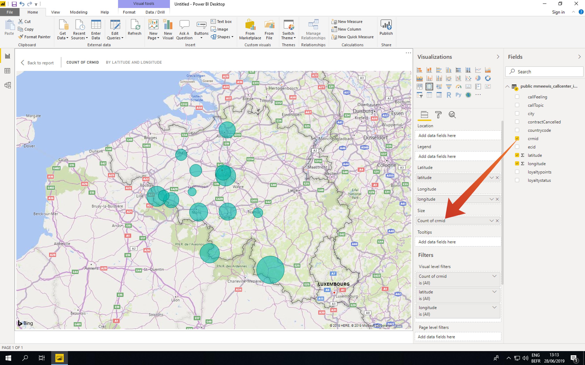

# 2.1.6 Query Service and Power BI

Open Microsoft Power BI Desktop.

Click **Get Data**.

Search for **postgres** (1), select **Postgres** (2) from the list and **Connect** (3).

Go to Adobe Experience Platform, to **Queries** and to **Credentials**.

From the **Credentials** page in Adobe Experience Platform, copy the **Host** and paste it in the **Server** field, and copy the **Database** and paste it in the **Database** field in PowerBI, then click OK (2).

>[!IMPORTANT]
>
>Make sure to include port **:80** at the end of the Server value because the Query Service does not currently use the default PostgreSQL port of 5432.

In the next dialog populate the User name and Password with your Username and Password found in the **Credentials** of Queries in Adobe Experience Platform.

In the Navigator dialog, put your **LDAP** in the search field (1) to locate your CTAS datasets and check the box next to each (2). Then click Load (3).

Make sure the **Report** tab (1) is selected.

Select the map (1) and after it is added to the reporting canvas, enlarge the map (2).

Next we need to define the measures and the dimensions, you do this by dragging fields from the **fields** section onto the corresponding placeholders (located under **visualizations**) as indicated below:

As measure we will use a count of **customerId**. Drag the **crmid** field from the **fields** section into the **Size** placeholder:

Finally, to do some **callTopic** analysis, let's drag the **callTopic** field on to the **Page level filters** placeholder (you might have to scroll in the **visualizations** section);

Select/unselect **callTopics** to investigate:

You've now finished this exercise.

## Next Steps

Go to [2.1.8 Query Service API](./ex8.md){target="_blank"}

Go back to [Query Service](./query-service.md){target="_blank"}

Go back to [All modules](./../../../../overview.md){target="_blank"}
