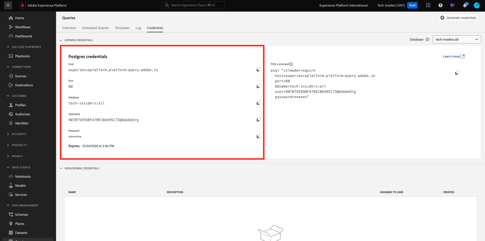
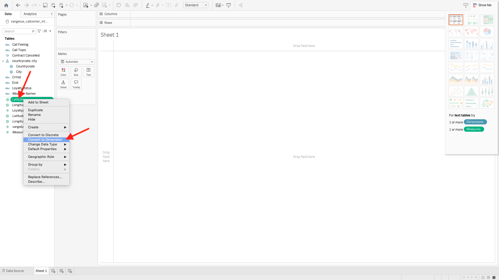
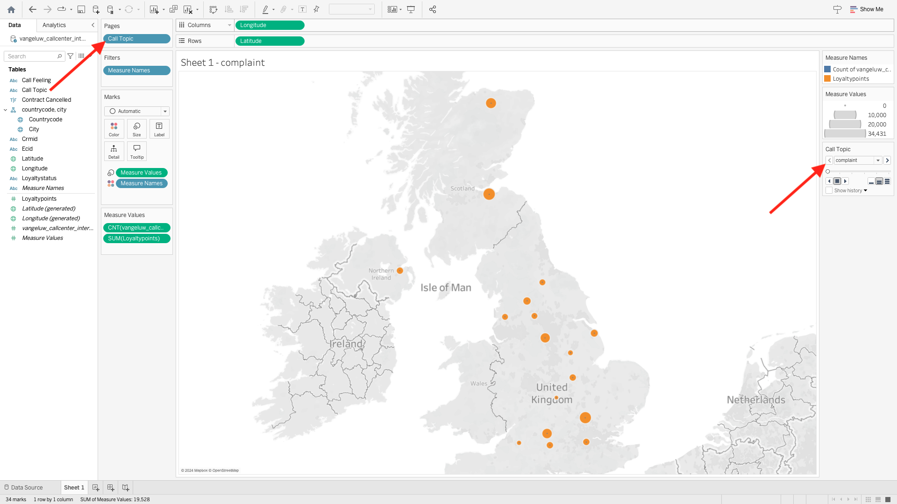

# 2.1.7 Query Service and Tableau

Open Tableau.

In **Connect To a Server**, click **More** and then click **PostgreSQL**.

If you haven't used PostgeSQL with Tableau yet, you may see this. Click **Download Driver**.

Follow the instructions to download and install the PostgreSQL driver.

Once you're finished installing the driver, quit and restart Tableau Desktop. Then after the restart, go to **Connect To a Server** again, click **More** and then click **PostgreSQL** again.

You'll then see this.

Go to Adobe Experience Platform, to **Queries** and to **Credentials**.

From the **Credentials** page in Adobe Experience Platform, copy the **Host** and paste it in the **Server** field, copy the **Database** and paste it in the **Database** field in Tableau, copy the **Port** and paste it in the field **Port**in Tableau, do the same for **Username** and **Password**. Next, click **Sign In**.

In thelist of available tables, locate the table you created in the previous exercise, which is called `--aepUserLdap--_callcenter_interaction_analysis`. Drag it onto the canvas.

You'll then see this. Click **Update Now**.

You'll then see the data from AEP becoming available in Tableau. Click **Sheet 1** to start working with the data.

To visualize your data on the map you need to convert longitude and latitude to dimensions. In **Measures**,  right-click **Latitude**, select **Convert to Dimension** in the menu. Do the same for the **Longitude** measure.

Drag the **Longitude** measure to the **Columns** and the **Latitude** measure to **Rows**. Automatically the map of **Belgium** will appear with little dots representing the cities in out data set.

Select **Measure Names**, click **Add to Sheet**.

You will now have a map, with dots of various sizes. The size indicates the number of call center interactions for that specific city. To vary the size of the dots, navigate to the right panel and open **Measure Values** (using the drop down icon). From the drop down list select **Edit Sizes**. Play around with different sizes.

To further display the data per **Call Topic**, drag the **Call Topic** dimension onto **Pages**. Navigate through the different **Call topics** using the **Call Topic** on the right side of the screen:

You've now finished this exercise.

## Next Steps

Go to [2.1.8 Query Service API](./ex8.md){target="_blank"}

Go back to [Query Service](./query-service.md){target="_blank"}

Go back to [All modules](./../../../../overview.md){target="_blank"}