# 3.1.2 Create schemas, data model and links

You can now configure your federated database in Adobe Experience Platform.

Log in to Adobe Experience Platform by going to this URL: [https://experience.adobe.com/platform](https://experience.adobe.com/platform).

After logging in, you'll land on the homepage of Adobe Experience Platform.

Before you continue, you need to select a **sandbox**. The sandbox to select is named ``--aepSandboxName--``. After selecting the appropriate sandbox, you'll see the screen change and now you're in your dedicated sandbox.

## 3.1.2.1 Set up a Federated database in AEP

Click **Federated databases** in the left menu. Then, click **Add federated database**.

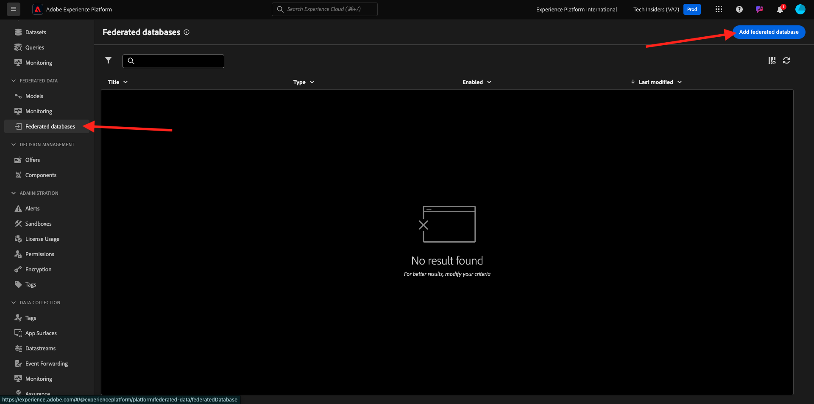

As a **Label**, use `--aepUserLdap-- - CitiSignal Snowflake` and for the type, choose **Snowflake**.

Under details, you need to fill out your credentials, which will look like this:

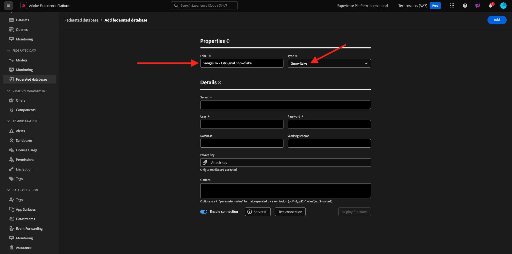

**Server**: 

In Snowflake, go to **Admin > Accounts**. Click the 3 **...** next to your account and click **Manage URLs**.

You'll then see this. Copy the **Current URL** and paste it in the **Server** field in AEP.

**User**: the user name you created earlier, in exercise 1.3.1.1
**Password**: the password you created earlier, in exercise 1.3.1.1
**Database**: use **CITISIGNAL**

So finally, you should have this. Click **Test Connection**. If the test is successful, click **Deploy Functions**, which will create functions on the Snowflake side which are necessary for the workflow engine.
 
Once the connection was successfully tested and functions are deployed, your configuration will be stored.

When you then go back to the **Federated databases** menu, you'll see your connection there.

## 3.1.2.2 Create schemas in AEP

In the left menu, click **Models** and then go to **Schemas**. Click **Create schema**.

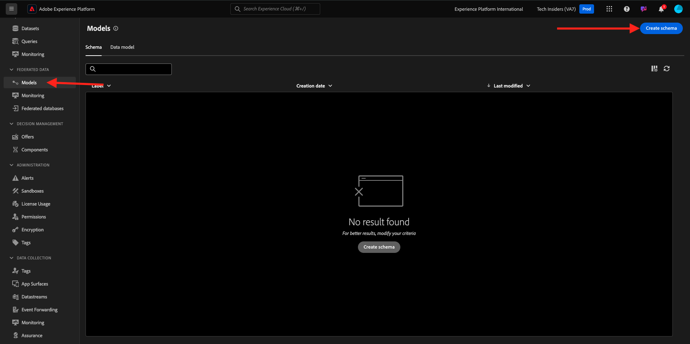

Select your federated database and click **+ Add tables**.

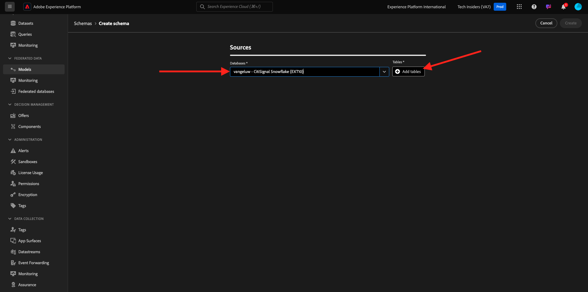

You'll then see this. Select the 5 tables you created in Snowflake before:

- `--aepUserLdap--_HOUSEHOLDS`
- `--aepUserLdap--_MOBILE_DATA_USAGE`
- `--aepUserLdap--_MONTHLY_DATA_USAGE`
- `--aepUserLdap--_PERSONS`
- `--aepUserLdap--_USERS`

Click **Add**.

AEP will then load the information of each table and show it in the UI. 

For each table, you can:

- change the label of the schema
- add a description
- rename all the fields, and set their visibility
- select the primary key for the schema

For this exercise, no changes are needed.

Click **Create**.

You'll then see this. You can click any schema and review the information. As an example, click **--aepUserLdap--_PERSONS**.

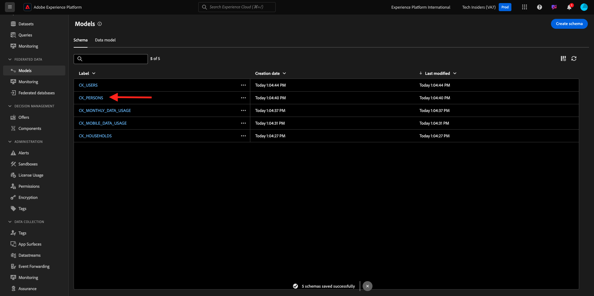

You'll then see this, with the ability to edit the configuration. Click **Data** to see a sample of the data that is in the Snowflake database.

You'll then see a sample of the data.

## 3.1.2.3 Create a model in AEP

In the left menu, go to **Models** and then go to **Data model**. Click **Create data model**.

For the label, use `--aepUserLdap-- - CitiSignal Snowflake Data Model`. Click **Create**.

Click **Add schemas**.

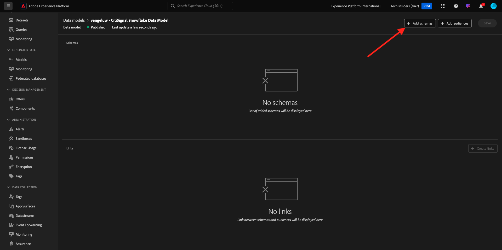

Select your schemas and click **Add**.

You'll then see this. Click **Save**.

### USERS - PERSONS

You can now start defining links between schemas. To start defining a link, you need to click **Create links**. 

First, let's define the link between the tabel `--aepUserLdap--_USERS` and `--aepUserLdap--_PERSONS`.

Click **Add**.

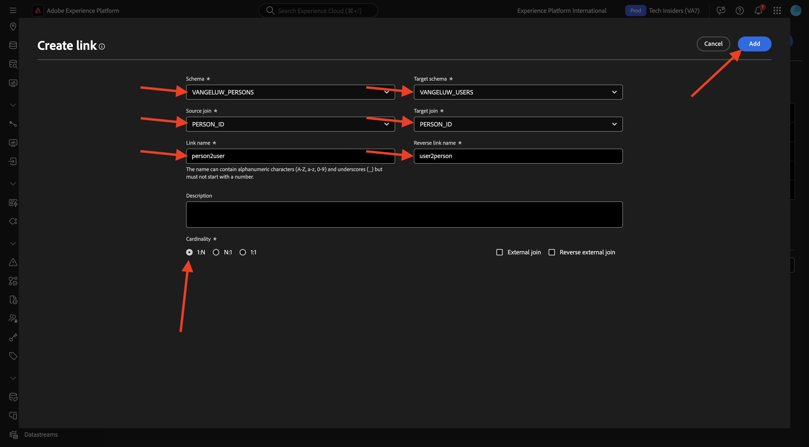

### HOUSEHOLDS - PERSONS

You'll then be back here. Click **Create links** to create another link.

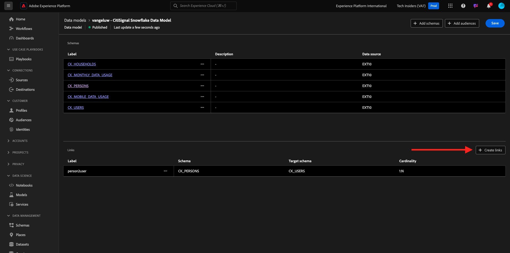

Next, let's define the link between the tabel `--aepUserLdap--_HOUSEHOLDS` and `--aepUserLdap--_PERSONS`.

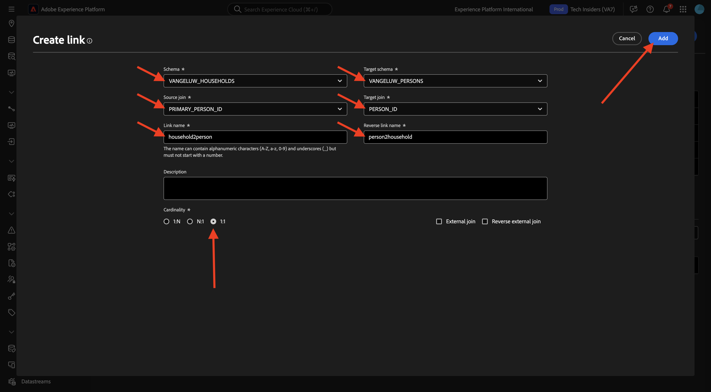

### USERS - MONTHLY_DATA_USAGE

You'll then be back here. Click **Create links** to create another link.

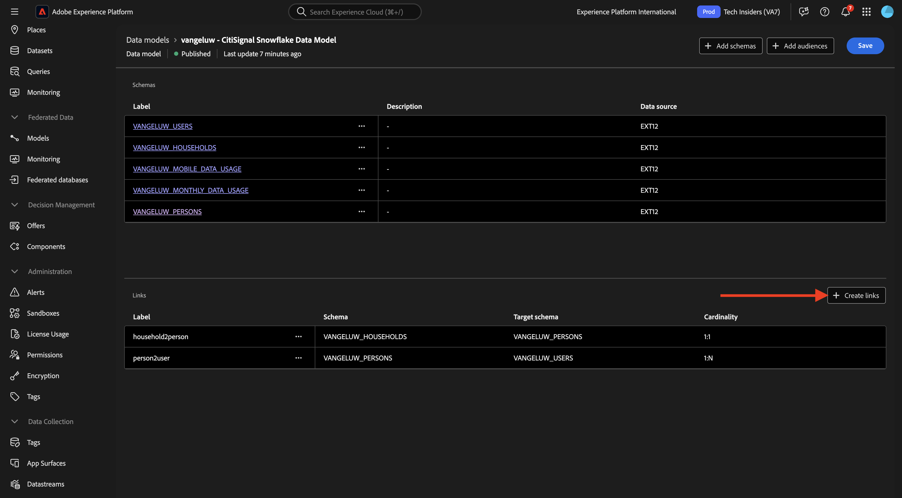

Next, let's define the link between the tabel `--aepUserLdap--_USERS` and `--aepUserLdap--_MONTHLY_DATA_USAGE`.

### USERS - HOUSEHOLDS

You'll then be back here. Click **Create links** to create another link.

Next, let's define the link between the tabel `--aepUserLdap--_USERS` and `--aepUserLdap--_HOUSEHOLDS`.

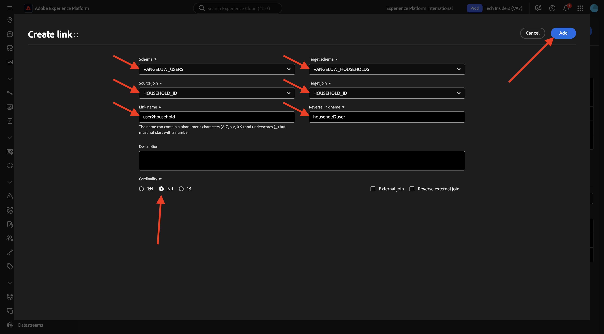

### USERS - MOBILE_DATA_USAGE

You'll then be back here. Click **Create links** to create another link.

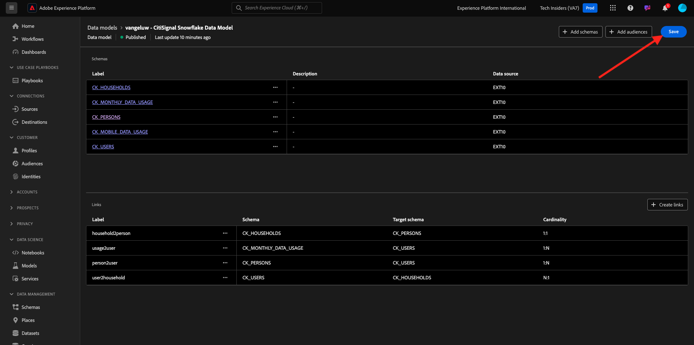

Next, let's define the link between the tabel `--aepUserLdap--_USERS` and `--aepUserLdap--_MOBILE_DATA_USAGE`.

You should then see this. Click **Save**.

Your setup in AEP is now done. You can now start using your federated data in a federated audience composition.

Next Step: [3.1.3 Create a federated composition](./ex3.md)

[Go Back to Module 3.1](./fac.md)

[Go Back to All Modules](../../../overview.md)
