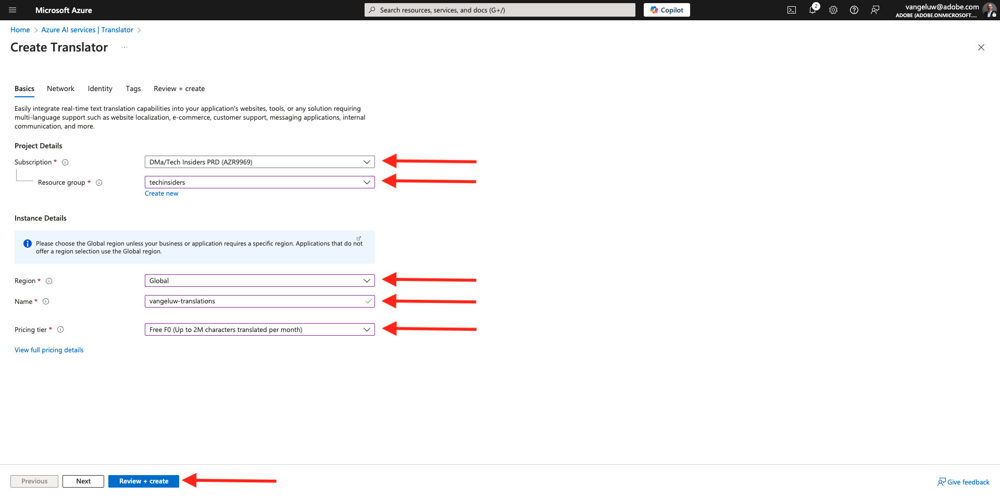
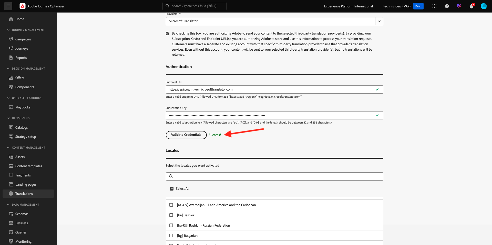
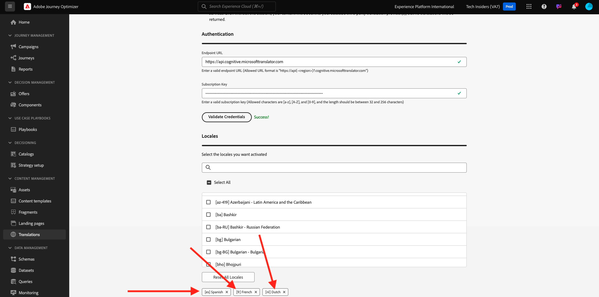
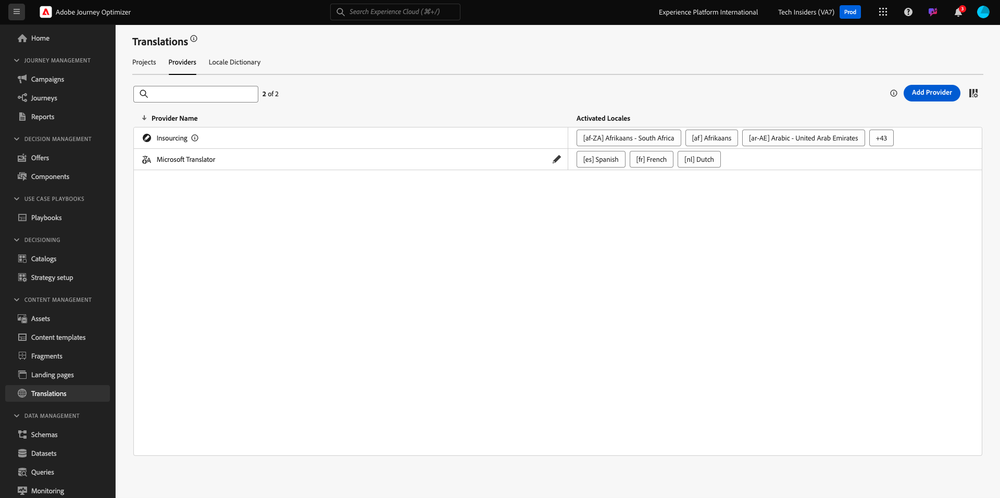

# 3.2.1 Translations Provider

## 3.2.1.1 Configure Microsoft Azure Translator

Go to [https://portal.azure.com/#home](https://portal.azure.com/#home).

In the search bar, enter `translators`. Then, click **+ Create**.

Select **Create Translator**.

Choose your **Subscription ID** and **Resource group**.
Set **Region** to **Global**.
Set **Pricing Tier** to **Free F0**.

Select **Review + create**.

Select **Create**.

Select **Go to resource**.

In the left menu, go to **Resource Management** > **Keys and Endpoint**. Click to copy your key.

## 3.2.1.2 Locale Dictionary

Go to [https://experience.adobe.com/](https://experience.adobe.com/). Click **Journey Optimizer**.

In the left menu, go to **Translations** and then go to **Locale Dictionary**. If you see this message, click **Add Default Locales**.

You should then see this.

## 3.2.1.3 Configure Translations Provider in AJO

In the left menu, go to **Translations** and then go to **Providers**. Click **Add Provider**.

Under **Providers**, select **Microsoft Translator**. Check the checkbox to enable the usage of the translation provider. Paste the key you copied from Microsoft Azure Translators. Then, click **Validate Credentials**.

Your credentials should then be successfully validated. If they are, scroll down to select the languages for translation.

Make sure to select `[es] Spanish`, `[fr] French`, `[nl] Dutch`.

Scroll up and click **Save**.

Your Translations Provider is now ready to be used.

[Go Back to Module 3.2](./ajotranslationsvcs.md)

[Go Back to All Modules](../../../overview.md)
