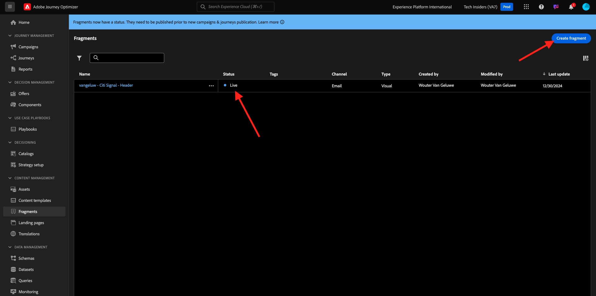
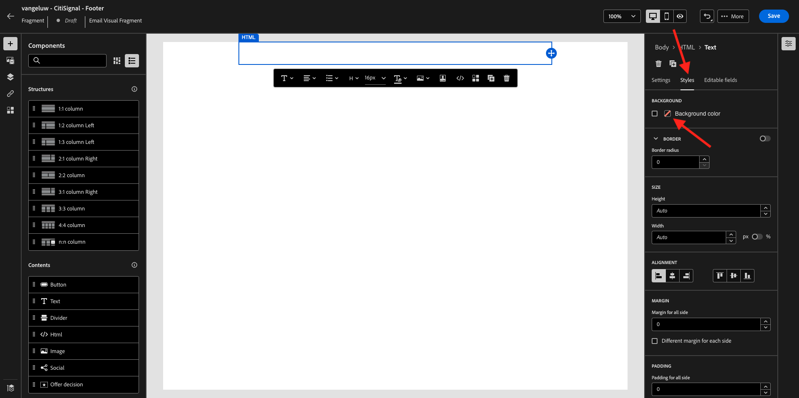
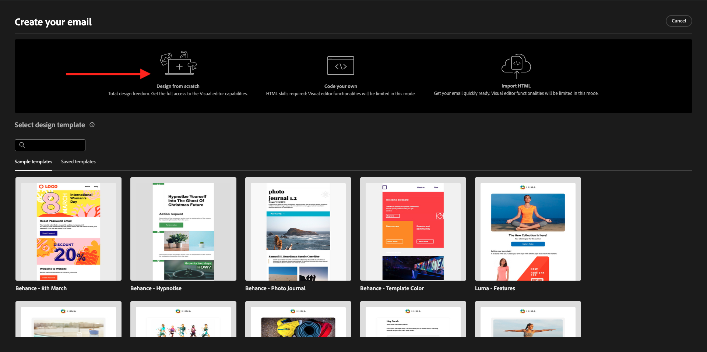

# 3.2.2 Create your Campaign

Go to [https://experience.adobe.com/](https://experience.adobe.com/). Click **Journey Optimizer**.


You'll be redirected to the **Home**  view in Journey Optimizer. First, make sure you're using the correct sandbox. The sandbox to use is called `--aepSandboxName--`.


## 3.2.2.1 Create your Header fragment

In the left menu, click **Fragments**. A Fragment is a reusable component within Journey Optimizer, which avoids duplication and facilitates future changes that should impact all messages, such as changes to a header or footer in an email message.

Click **Create fragment**.


Enter the name `--aepUserLdap-- - CitiSignal - Header` and select the **Type: Visual Fragment**. Click **Create**.


You'll then see this. In the left menu, you'll find the structure components that you can use to define the structure of the email (rows and columns).

Drag and drop a **1:1 column** from the menu into the canvas. This will be the placeholder for the logo image.


Next, you can use Content Components to add content inside these blocks. Drag and drop an **Image** component in the first cell on the first row. Click **Browse**.


You'll then see a popup opening, showing you your AEM Assets Media Library. Go to the folder **citi-signal-images**, click to select the image **CitiSignal-Logo-White.png** and click **Select**.

>[!NOTE]
>
>If you don't see the Citi Signal images in your AEM Assets Library, you can find them [here](../../../assets/ajo/CitiSignal-images.zip). Download them to your desktop, create the folder **citi-signal-images** and upload all the images in that folder.


You'll then see this. Your image is white, and isn't showing yet. You should now define a background color to make the image show correctly. Click **Styles**, then click the **Background color** box.


In the popup, change the **Hex** color code to **#8821F4** and then change focus by clicking into the **100%** field. You'll then see the new color applied to the image.


The image is also a bit to big right now. Let's change the width by sliding the **Width** switcher to **40%**.


Your header fragment is now ready. Click **Save** and then click the arrow to go back to the previous screen.


Your fragment needs to be published before it can be used. Click **Publish**.


After a couple of minutes, you'll see that you fragment's status has changed to **Live**. 
Next, you should create a new fragment for the footer of your email messages. Click **Create fragment**.



## 3.2.2.2 Create your Footer fragment

Click **Create fragment**.


Enter the name `--aepUserLdap-- - CitiSignal - Footer` and select the **Type: Visual Fragment**. Click **Create**.


You'll then see this. In the left menu, you'll find the structure components that you can use to define the structure of the email (rows and columns).

Drag and drop a **1:1 column** from the menu into the canvas. This will be the placeholder for the footer content.


Next, you can use Content Components to add content inside these blocks. Drag and drop an **HTML** component in the first cell on the first row. Click the component to select it and then, click the **</>** icon to edit the HTML source code.


You'll then see this.


Copy the below HTML code fragment and paste it in the **Edit HTML** window in Journey Optimizer.

```html
<!--[if mso]><table cellpadding="0" cellspacing="0" border="0" width="100%"><tr><td style="text-align: center;" ><![endif]-->
<table style="width: auto; display: inline-block;">
  <tbody>
    <tr class="component-social-container">
      <td style="padding: 5px">
        <a style="text-decoration: none;" href="https://www.facebook.com" data-component-social-icon-id="facebook">
        
        </a>
      </td>
      <td style="padding: 5px">
        <a style="text-decoration: none;" href="https://x.com" data-component-social-icon-id="twitter">
        
        </a>
      </td>
      <td style="padding: 5px">
        <a style="text-decoration: none;" href="https://www.instagram.com" data-component-social-icon-id="instagram">
         
        </a>
      </td>
    </tr>
  </tbody>
</table>
<!--[if mso]></td></tr></table><![endif]-->
```

You'll then have this. On lines 7, 12 and 17 you now need to insert a image file, using the assets in your AEM Assets library.


Make sure that your cursor is located on line 7, and then click **Assets** in the left menu. Click **Open asset selector** to select your image.


Open the folder **citi-signal-images** and click to select the image **Icon_Facebook.png**. Click **Select**.


Make sure that your cursor is located on line 12, and then click **Open asset selector** to select your image.


Open the folder **citi-signal-images** and click to select the image **Icon_X.png**. Click **Select**.


Make sure that your cursor is located on line 17, and then click **Open asset selector** to select your image.


Open the folder **citi-signal-images** and click to select the image **Icon_Instagram.png**. Click **Select**.


You'll then see this. Click **Save**.


You'll then be back in the editor. Your icons aren't visible yet because the background and the image files are all in white. To change the background color, go to **Styles** and click the **Background color** checkbox.



Change the **Hex** color code to **#000000**.


Change the alignment to be centered.

 

Let's add some other parts to the footer. Drag and drop an **Image** component above the HTML component you just created. Click **Browse**.

 

Click to select the image file **`CitiSignal_Footer_Logo.png`** and click **Select**.


Go to **Styles** and click the **Background color** checkbox, let's change it to black again. Change the **Hex** color code to **#000000**.

 

Change the width to **20%** and verify that the alignment is set to be centered.


Next, drag and drop a **Text** component under the HTML component you created. Click **Browse**.


Copy and paste the below text by replacing the placeholder text.

```

1234 N. South Street, Anywhere, US 12345

Unsubscribe

©2024 CitiSignal, Inc and its affiliates. All rights reserved.

```

Set the **Text alignment** to be centered.


Change the **Font color** to white, **#FFFFFF**.


Change the **Background color** to black, **#000000**.


Select the text **Unsubscribe** in the footer, and click the **Link** icon in the menu bar. Set the **Type** to **External Opt-out/Unsubscription** and set the url to **https://aepdemo.net/unsubscribe.html** (it's not allowed to have a blank URL for the unsubscribe link).


You'll then have this. Your footer is now ready. Click **Save** and then click the arrow to go back to the previous page.


Click **Publish** to publish your footer so it can be used in an email.


After a couple of minutes, you'll see that the status of your footer has changed to **Live**.


## 3.2.2.3 Create Fiber journey

You'll now create a journey. Unlike event-based journeys which rely on incoming experience events, this journey will focus on reading an existing audience and will target a whole audience once with unique content like newsletters, one-off promotions or specific campaigns. 

In the menu, go to **Journeys** and click **Create journey**.


On the journey creation screen, set the **Name** to `--aepUserLdap-- - Fiber`. Click **Save**.


In the **Orchestration** menu, drag and drop the **Read Audience** object onto the canvas.


Click the **edit** icon to select an audience.


For the **Audience**, select the audience you created in the previous step, `--aepUserLdap-- - CitiSignal Eligible for Fiber`. Click **Save**.


You should then see this. Set the **Namespace** to **Email**. Click **Save**.


Under **Actions**, drag and drop the **Email** action onto the canvas.


Set the **Category** to **Marketing** and select a **Configuration** for **Email**. Click **Edit content**.


You'll then see this. Click the **edit** icon next to the **Subject line**.


Set the subject line to:

```
{{profile.person.name.firstName}}, here's your Fiber offer!
```

Click **Save**.


You should then see this. Next, click **Edit email body**.


Choose **Design from scratch**.



You'll then see this. In the left menu, you'll find the structure components that you can use to define the structure of the email (rows and columns).

Drag and drop 2 times a **1:1 column** on the canvas, which should give you this structure:


In the left menu, go to **Fragments**. Drag the header you created earlier onto the first component in the canvas. Drag the footer you created earlier onto the last component in the canvas.


Click the **+** icon in the left menu. Go to **Contents** to start adding content onto the canvas.


Drag and drop a **Text** component on the second row. 


Select the default text in that component **Please type your text here.** and replace it by the below text. Change the alignment to **Center alignment**.

```javascript

Hi {{profile.person.name.firstName}}

As a CitiSignal member, you're part of a dynamic community that's constantly evolving to meet your needs. We're committed to delivering innovative solutions that enhance your digital lifestyle and keep you ahead of the curve.

Stay connected.

```


Drag and drop an **Image** component on the 3rd and 4th row. Click **Browse** on the 3rd row.


Open the folder **citi-signal-images**, click to select the image **Offer_AirPods.jpg**, and click **Select**.


Click **Browse** on the image placeholder on the 4th row.


Open the folder **citi-signal-images**, click to select the image **Offer_Phone.jpg**, and click **Select**.


Drag and drop a **Text** component on the 3rd and 4th row. 


Select the default text in the component on the 3rd row **Please type your text here.** and replace it by the below text.

```javascript

Get AirPods for free:

Experience seamless connectivity like never before with CitiSignal. Sign up for select premium plans and receive a complimentary pair of Apple AirPods. Stay connected in style with our unbeatable offer.

```

Select the default text in the component on the 4th row **Please type your text here.** and replace it by the below text.

```javascript

We'll pay off your phone:

Make the switch to CitiSignal and say goodbye to phone payments! Switching to CitiSignal has never been more rewarding. Say farewell to hefty phone bills as we help pay off your phone, up to 800$!

```


Your basic newsletter email is now ready. Click **Save**.

Go back to the campaign dashboard by clicking the **arrow** next to the subject line text in the top-left corner.


Click **Review to activate**.


You may then get this error. If that is the case, then you may need to wait up to 24 hours until the audience has been evaluated, and then try to activate your campaign again. You may also need to update the schedule of your campaign to run at a later time.

Click **Activate**.


Once acivated, your campaign will then be scheduled to run.


Your campaign is now activated. Your newsletter email message will be sent as you defined it in your schedule, and your campaign will stop as soon as the last email has been sent.

You should also receive the email on the email address you used for the demo profile you created earlier.


You have finished this exercise.

## Next Steps

Go to [3.2.3 ...](./ex3.md)

Go back to [Module 3.2](./ajotranslationsvcs.md){target="_blank"}

Go back to [All modules](./../../../overview.md){target="_blank"}
