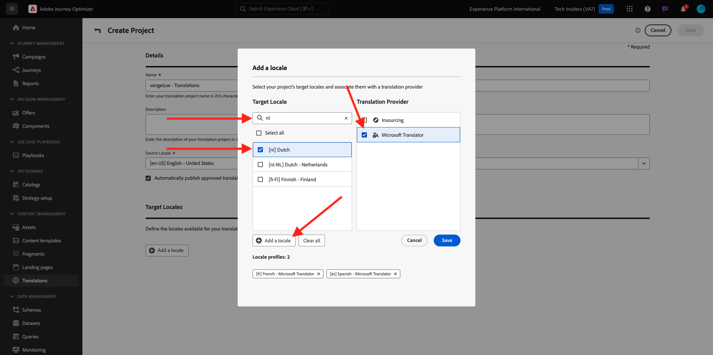

# 3.2.2 Translations Project

## 3.2.1.1 Configure Microsoft Azure Translator

Go to [https://experience.adobe.com/](https://experience.adobe.com/). Click **Journey Optimizer**.

In the left menu, go to **Translations** and then go to **Locale Dictionary**. If you see this message, click **Create Project**.

Enter the name `--aepUserLdap-- - Translations`, set the **Source Locale** to `[en-US] English - United States` and check the checkbox to enable **Automatically publish approved translations**. Next, click **+ Add a locale**.

Search for `fr`, enable the checkbox for `[fr] French` and then enable the checkbox for **Microsoft Translator**. Click **+ Add a locale**.

Search for `es`, enable the checkbox for `[es] Spanish` and then enable the checkbox for **Microsoft Translator**. Click **+ Add a locale**.

Search for `nl`, enable the checkbox for `[nl] Spanish` and then enable the checkbox for **Microsoft Translator**. Click **+ Add a locale**.

Click **Save**.

Your **Translations** project is now ready to be used.

[Go Back to Module 3.2](./ajotranslationsvcs.md)

[Go Back to All Modules](../../../overview.md)
