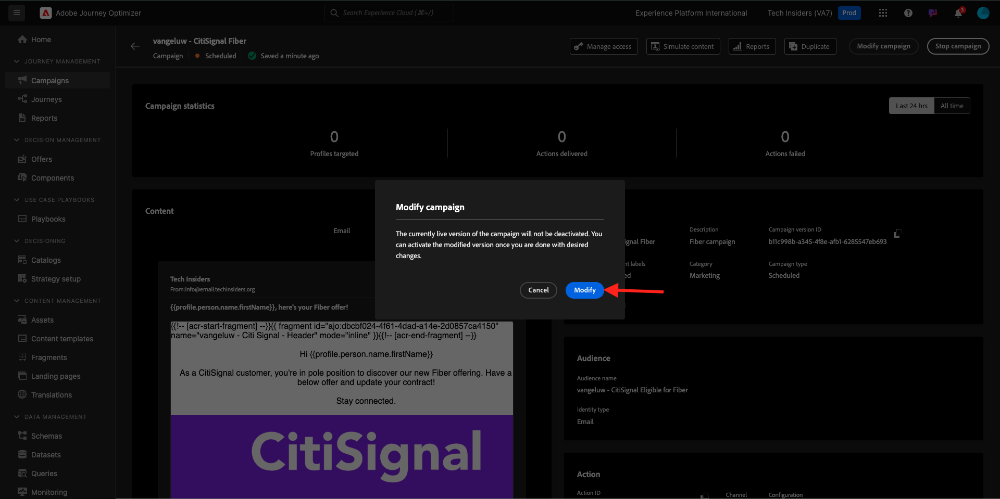
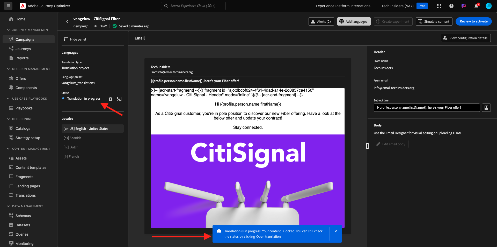
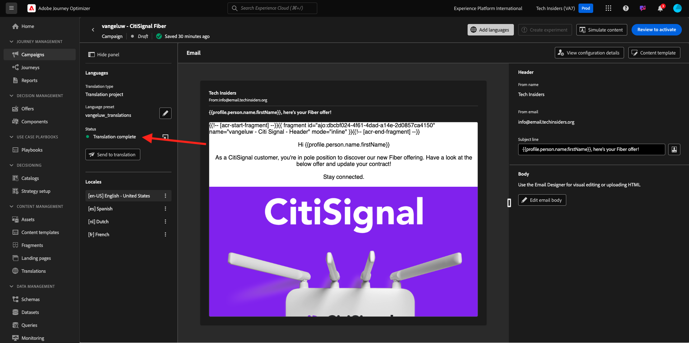
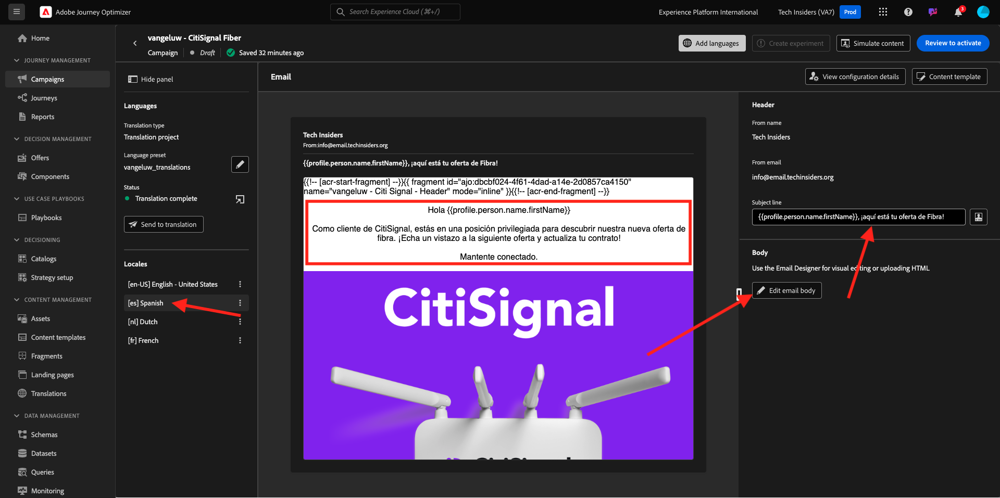

# 3.2.3 Add Languages to your Email

Go to [https://experience.adobe.com/](https://experience.adobe.com/). Click **Journey Optimizer**.

You'll be redirected to the **Home**  view in Journey Optimizer. First, make sure you're using the correct sandbox. The sandbox to use is called `--aepSandboxName--`.

Go to **Campaigns** and click to open the campaign you just created.

Click **Modify campaign**.

Click **Modify**.

Scroll down to the **Email** action and click **Edit content**.

Click **Add languages**.

Select your **Language settings**, which are named `--aepUserLdap--_translations`. Click **Select**.

You should then see this. Click **Send to translation**.

You should then see a message like this. The **Send to translation** workflow has now been started and will take a couple of minutes to complete.
You'll see that the status changes to **Translation in progress**.

After a couple of minutes, the status of the translations workflow will change to **Translation complete**.

Click the **`[es] Spanish`** translation. You'll then see the updated text in the email preview and also n the **Subject line**.
In case it's needed, you can still review and update the translation directly in the **Subject line** field. 

Click **Edit email body** to review the translation inside the email.

You can change the text manually in case the translation would need to be reviewed.

Go back to the campaign overview by clicking the **arrow** next to the subject line text in the top-left corner.

You should then be back here. There's no need to activate this campaign again.

Go back to the campaign by clicking the **arrow** in the top left corner.

Please ensure that your campaign is in the **Stopped** state.

You've now finished this exercise.

## Next Steps

Go to [Summary & Benefits](./summary.md)

Go back to [Module 3.2](./ajotranslationsvcs.md){target="_blank"}

Go back to [All modules](./../../../overview.md){target="_blank"}
