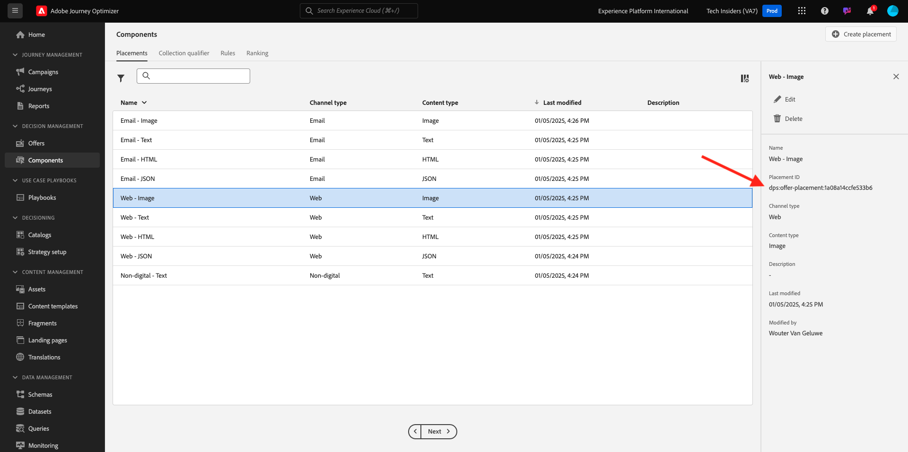
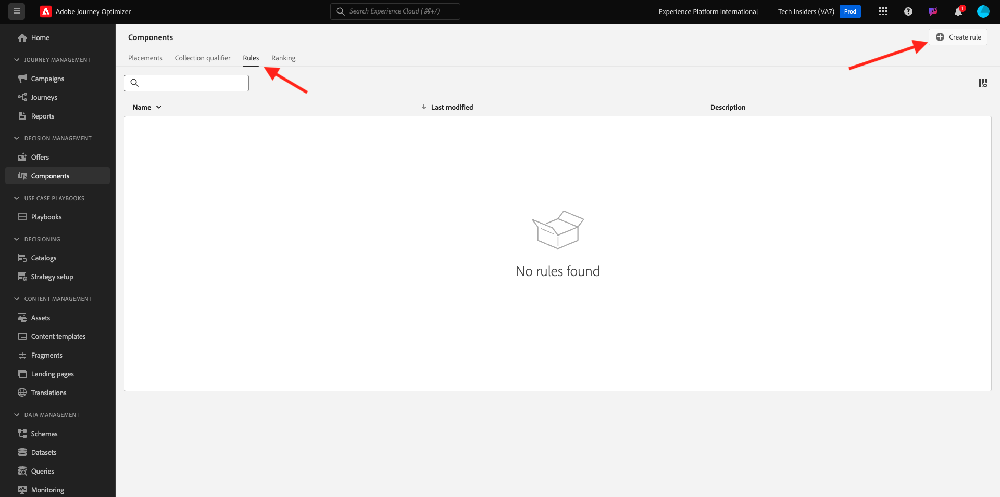
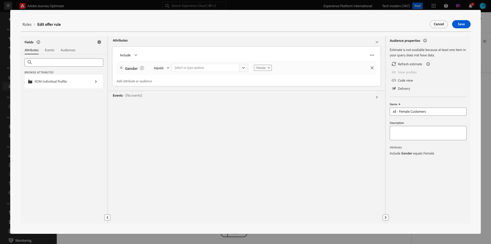

# 3.3.1 Offer Decisioning 101

## 3.3.1.1 Terminology

To get a better understanding about Offer Decisioning, we highly recommend you to read the [overview](https://experienceleague.adobe.com/docs/journey-optimizer/using/offer-decisioniong/get-started-decision/starting-offer-decisioning.html?lang=en) on how the Offer Decisioning Application Service works with Adobe Experience Platform.

Working with Offer Decisioning, you need to understand the following concepts:

| Term                      | Explanation                                                                                                                                                                                                                                              |
| ------------------------- | -------------------------------------------------------------------------------------------------------------------------------------------------------------------------------------------------------------------------------------------------------- |
| **Offer**                 | An offer is a marketing message that may have rules associated with it that specify who is eligible to see the offer. An offer has a status: draft, approved or archived.                                                                                |
| **Placement**             | The combination of location (or Channel Type) and context (or Content Type) in which an offer appears for an end-user. Effectively it is the combination of Text, HTML, Image, JSON in Mobile, Web, Social, Instant Messaging, and non-Digital channels. |
| **Rule**                  | The logic that defines and controls the eligibility of end-users for an offer.                                                                                                                                                                           |
| **Personalized Offer**    | A customizable marketing message based on eligibility rules and constraints.                                                                                                                                                                             |
| **Fallback Offer**        | The default offer displayed when an end-user is not eligible for any of the offers in the collection used.                                                                                                                                               |
| **Capping**               | Used in an offer definition to define how many times an offer can be presented in total and to a specific user.                                                                                                                                          |
| **Priority**              | Level to determine the priority rank from a result set of offers.                                                                                                                                                                                        |
| **Collection**            | Used to filter out a sub-set of offers from the personalized offer list to speed up the offer decisioning process.                                                                                                                                       |
| **Decision**              | A combination of a set of offers, placement and profile the marketer wants the decision engine to provide the best offer for.                                                                                                                            |
| **AEM Assets Essentials** | A universal and centralized experience for storing, finding, and selecting assets across Adobe Experience Cloud Solutions and Adobe Experience Platform.                                                                                                 |

{style="table-layout:auto"}

## 3.3.1.2 Offer Decisioning

Login to Adobe Journey Optimizer by going to [Adobe Experience Cloud](https://experience.adobe.com). Click **Journey Optimizer**.

You'll be redirected to the **Home**  view in Journey Optimizer. First, make sure you're using the correct sandbox. The sandbox to use is called `--aepSandboxName--`. You'll then be in the **Home** view of your sandbox `--aepSandboxName--`.

In the left menu, click **Offers**. You'll now see the Offers menu, which contains things like Offers, Collections and Decisions.

Click **Components**. You'll now see things like Placements, Collection qualifier, Rules and Rankings.

## 3.3.1.3 Placements

Go to **Placements**.

In the **Placements** tab you can define your placements for your offers. When you define a decision the placement defines where the resulting offer will appear (Channel Type) and in what shape or form (Content Type).

If you don't see any placements in your environment, please create them as indicated below and in the screenshot.

| Name                   | Channel Type | Content Type |
| ---------------------- | ------------ | ------------ |
| **Non-digital - Text** | Non-digital  | Text         |
| **Web - JSON**         | Web          | JSON         |
| **Web - HTML**         | Web          | HTML         |
| **Web - Text**         | Web          | Text         |
| **Web - Image**        | Web          | Image        |
| **Email - JSON**       | Email        | JSON         |
| **Email - HTML**       | Email        | HTML         |
| **Email - Text**       | Email        | Text         |
| **Email - Image**      | Email        | Image        |

{style="table-layout:auto"}

**Note**: Please do not change anything to the placements already available.

Click on any Placement to visualize its settings.

You'll now see all fields of the Placement:

- **Name** of the Placement
- **Placement ID**
- **Channel Type** for the Placement
- **Content Type** of the Placement, which can be **Text**, **HTML**, **Image** or **JSON**
- **Description** field allowing to add additional description for the Placement

## 3.3.1.4 Decision Rules

A Rule (also called eligibility rule) is the equivalent of an **audience**. A Rule is in fact an audience itself with the only difference that a Rule can be used with an Offer to provide the best offer to a profile in Adobe Experience Platform.

As you already know how to define audiences based on the previous enablement modules, let's just quickly revisit the Segmentation Environment:

Go to **Rules**. Click **+ Create Rule**.

 
You'll then see the Audience creation interface of Adobe Experience Platform.

You can now access all fields that are part of the Union Schema for the Real-time Customer Profile and can build out any rule.

It's also good to know that you can simply reuse already defined audiences in Adobe Experience Platform, by going to **Audiences** > ``--aepTenantId--``.

You'll then see this:

 

If you wish, you can now configure your own Rules. For this exercise, you'll need two rules:

- all - Male Customers
- all - Female Customers

If these rules don't exist yet, please to create them. If they already exist, please use those rules and don't create new rules.

The attribute to use to build the rule is **XDM Individual Profile** > **Person** > **Gender**.

As an example, here's the rule definition for the rule **all - Male Customers**:

As an example, here's the rule definition for the rule **all - Female Customers**:

## 3.3.1.5 Offers

Go to **Offers** and select **Offers**. Click **+ Create Offer**.

You'll then see this popup. 

Don't create any offers now - you'll do that in the next exercise.

You now see that there are two types of offers:

- Personalized Offers
- Fallback Offers

A Personalized Offer is specific content that should be shown in a specific situation. A Personalized Offer is specifically built to deliver a personal and contextual experience if specific criteria are met.

A Fallback Offer is an offer that is shown if the criteria for Personalized Offers aren't met. 

## 3.3.1.6 Decisions

A Decision combines placements, a collection of personalized offers and a fallback offer to ultimately be used by the Offer Decisioning engine to find the best offer for a specific profile, based on each of the individual personalized offer characteristics like priority, eligibility constraint and total / user capping.

To configure your **Decision**, click **Decisions**.

In the next exercise, you'll configure your own offers and decision.

Next Step: [3.3.2 Configure your Offers and Decision](./ex2.md)

[Go Back to Module 3.3](./offer-decisioning.md)

[Go Back to All Modules](./../../../overview.md)
