# 3.3.2 Configure your offers and decision

## 3.3.2.1 Create your personalized offers

In this exercise, you'll create four **Personalized Offers**. Here are the details to take into account when creating those offers:

|Name | Date Range | Image Link for Email | Image Link for Web | Text | Priority | Eligibility  | Language| Capping Frequency| Image Name|
|-----|------------|----------------------|--------------------|------|:--------:|--------------|:-------:|:-------:|:-------:|
|`--aepUserLdap-- - AirPods Max` | today - 1 month later | https://bit.ly/4a9RJ5d | Choose from Assets Library |`{{ profile.person.name.firstName }}, 10% discount on AirPods Max`| 25 | all - Female Customers   | English (United States) | 3|Apple AirPods Max- Female.jpg|
|`--aepUserLdap-- - Galaxy S24` | today - 1 month later  | https://bit.ly/3W8yuDv | Choose from Assets Library|`{{ profile.person.name.firstName }}, 5% discount on Galaxy S24`| 15 | all - Female Customers   | English (United States) | 3| Galaxy S24 – Female.jpg|
|`--aepUserLdap-- - Apple Watch` | today - 1 month later | https://bit.ly/4fGwfxX | https://bit.ly/4fGwfxX|`{{ profile.person.name.firstName }}, 10% discount on Apple Watch`| 25 | all - Male Customers | English (United States) | 3| Apple Watch - Male.jpg|
|`--aepUserLdap-- - Galaxy Watch 7` | today - 1 month later | https://bit.ly/4gTrkeo | Choose from Assets Library| `{{ profile.person.name.firstName }}, 5% discount on Galaxy Watch 7`| 15 | all - Male Customers  | English (United States) | 3| Galaxy Watch7 - Male.jpg|

{style="table-layout:auto"}

Login to Adobe Journey Optimizer by going to [Adobe Experience Cloud](https://experience.adobe.com). Click **Journey Optimizer**.

You'll be redirected to the **Home**  view in Journey Optimizer. First, make sure you're using the correct sandbox. The sandbox to use is called `--aepSandboxName--`. You'll then be in the **Home** view of your sandbox `--aepSandboxName--`.

In the left menu, click **Offers** and then go to **Offers**. Click **+ Create Offer**.

You'll then see this popup. Select **Personalized offer** and click **Next**.

You're now on the **Details** view. 

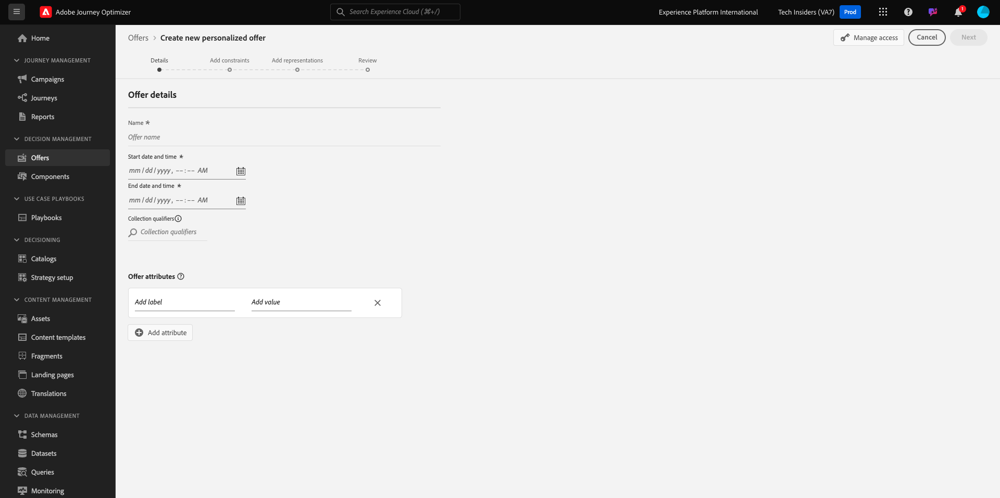

In this case, you need to configure the offer `--aepUserLdap-- - AirPods Max`. Use the information in the table above to fill out the fields. In this example, the name of the Personalized Offer is **vangeluw - AirPods Max**. Also, set the **Start date and time** to today, and set the **End date and time** to a date in a month from now.

Once done, you should have this. Click **Next**.

You'll then see this:

Select **By defined decision rule** and click the **+** icon to add the rule **all - Female Customers**.

Fill out the **Priority** as indicated in the above table. Next, click **+ Create capping** to define the number of times this offer can be shown to a customer.

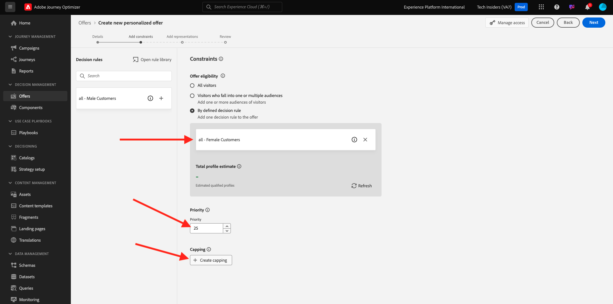

For the capping, select the following:

- **Choose capping event**: **Decision event**
- **Capping type**: **Per profile (Apply cap for each profile)**
- **Capping event count**: **3**
- **Reset capping frequency**: **Daily**
- **Every**: **1 day**

This will ensure that this offer won't be shown more than 3 times per day per customer.

Click **Create**.

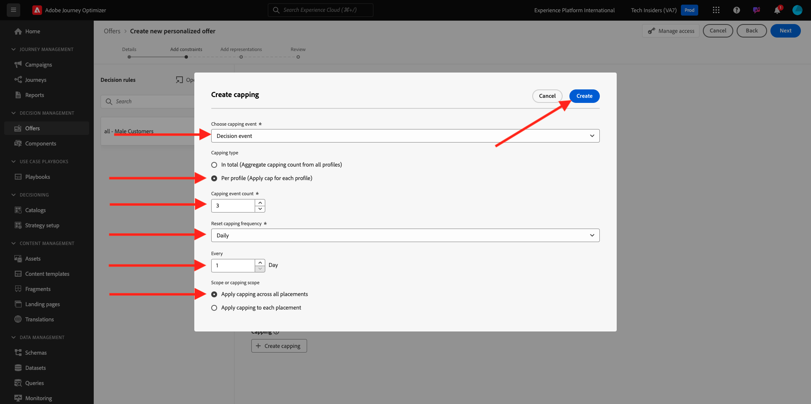

You'll then be back here. Click **Next**.

You now need to create **Representations**. Representations are a combination of a **Placement** and a real asset.

For **Representation 1**, select:

- Channel: Web
- Placement: Web - Image
- Content: URL
- Public location: copy the URL from the column **Image Link for Web** in the above table

Alternatively, you can select **Asset library** for the content and then click **Browse**.

You'll then see a popup of the Assets Library, go to the folder **enablement-assets** and select the image file **Apple AirPods Max - Female.jpg**. Then, click **Select**.

You'll then see this. Click **+ Add Representation**.

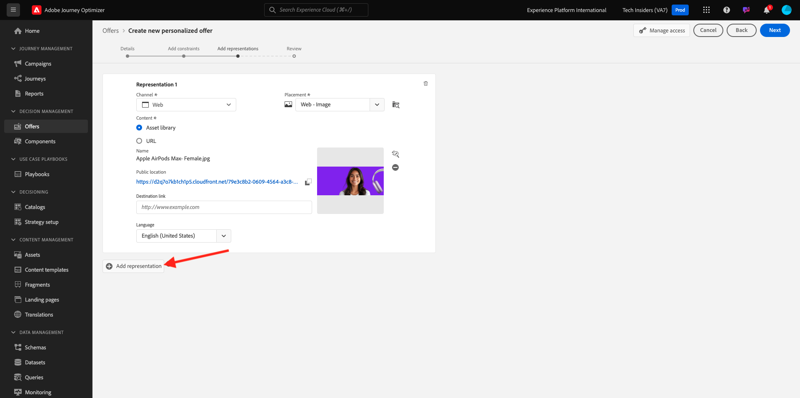

For **Representation 2**, select:

- Channel: Email
- Placement: Email - Image
- Content: URL
- Public location: select **Asset library**. Click **Browse**

You'll then see a popup of the Assets Library, go to the folder **enablement-assets** and select the image file **Apple AirPods Max - Female.jpg**. Then, click **Select**.

You'll then see this. Next, click **+ Add representation**.

For **Representation 3**, select:

- Channel: Non-digital
- Placement: Non-digital - Text

Next, you need to add content. In this case that means adding the text to be used as a call to action.

Select **Custom** and click **Add Content**.

You'll then see this popup.

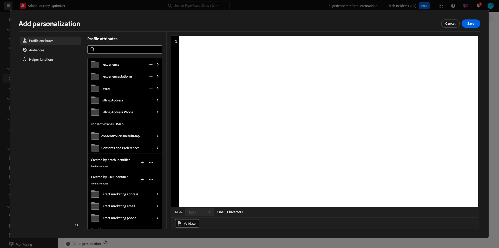

Look at the **Text** field from the above table and enter that text here, in this case: `{{ profile.person.name.firstName }}, 10% discount on AirPods Max`.

You'll also notice that you can select any profile attribute and include it as a dynamic field in the offer text. In this example, the field `{{ profile.person.name.firstName }}` will ensure that the first name of the customer that will receive this offer will be included in the offer text.

You'll then see this. Click **Save**.

You now have this. Click **Next**.

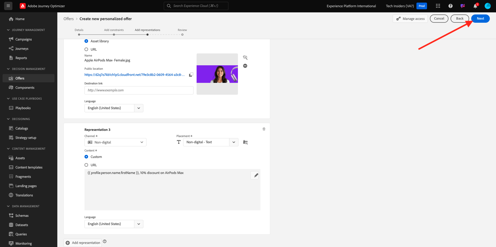

You'll then see an overview of your new **Personalized Offer**. Click **Finish**.

Click **Save and approve**. 

You'll then see your newly created Personalized Offer become available in the Offers Overview:

You should now repeat the above steps to create the three other Personalized Offers for the products that you can find in the above table.

When done, your **Offer Overviews** screen for **Personalized Offers** should show all your offers.

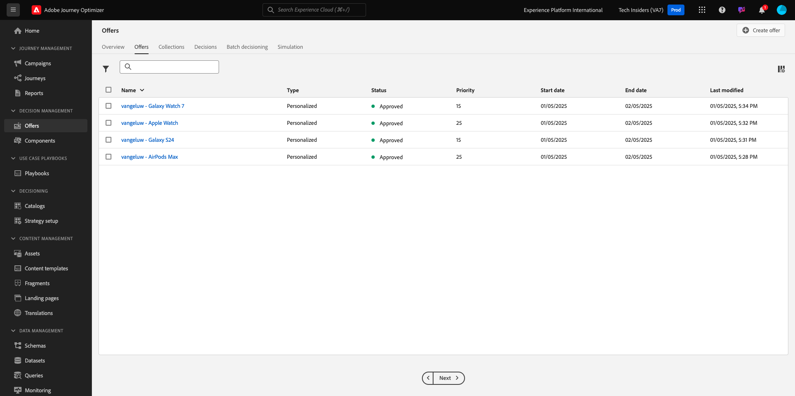

## 3.3.2.2 Create your fallback offer

After having created four Personalized Offers, you should now configure a **Fallback Offer**.

Make sure you're in the **Offers** view. Click **+ Create Offer**.

You'll then see this popup. Select **Fallback offer** and click **Next**.

You'll then see this. Enter this name for your fallback offer: `--aepUserLdap-- - CitiSignal Fallback Offer`. Click **Next**.

You now need to create **Representations**. Representations are a combination of a **Placement** and a real asset.

For **Representation 1**, select:

- **Channel**: **Web**
- **Placement**: **Web - Image**
- **Content**: **Asset library**

Click **Browse** to select your image.

You'll then see a popup of the Assets Library, go to the folder **citi-signal-images** and select the image file **App-Banner-Ad.jpg**. Then, click **Select**.

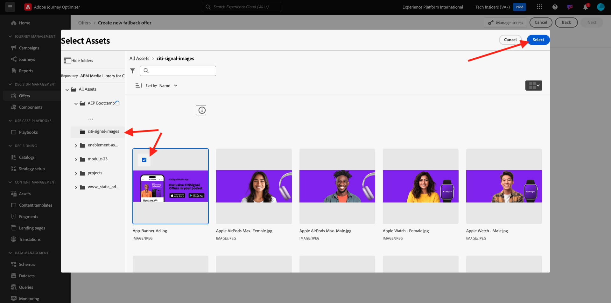

You'll then see this. Click **+ Add representation**.

For **Representation 2**, select:

- **Channel**: **Email**
- **Placement**: **Email - Image**
- **Content**: **Asset library**

Click **Browse** to select your image.

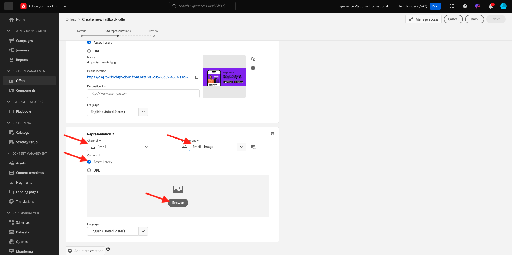

You'll then see a popup of the Assets Library, go to the folder **citi-signal-images** and select the image file **App-Banner-Ad.jpg**. Then, click **Select**.

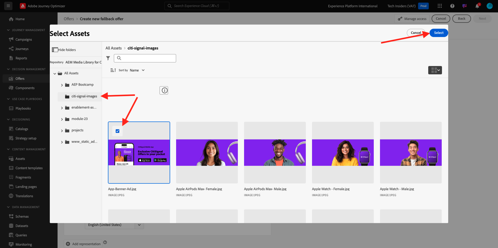

You'll then see this. Click **+ Add representation**.

For **Representation 3**, select:

- **Channel**: **Non-digital**
- **Placement**: **Non-digital - Text**
- **Content**: **Custom**

Click **Add Content**.

You'll then see this popup. Enter the text `{{ profile.person.name.firstName }}, download the CitiSignal app now!` and click **Save**.

You'll then see this. Click **Next**.

You'll then see an overview of your new **Fallback Offer**. Click **Finish**.

Finally, click **Save and approve**.

In your **Offer Overviews** screen, you'll now see this:

## 3.3.2.3 Create your collection

A Collection is used to **filter** out a sub-set of offers from the personalized offer list and use that as part of an Decision in order to speed up the decision process. 

Go to **Collections**. Click **+ Create Collection**.

You'l then see this popup. Configure your Collection like this. Click **Next**.

- Collection name: use `--aepUserLdap-- - CitiSignal Collection`
- Select **Create static collection**.

Click **Next**.

In the next screen, select the four **Personalized Offers** you created in the previous exercise. Click **Save**.

You'll now see this:

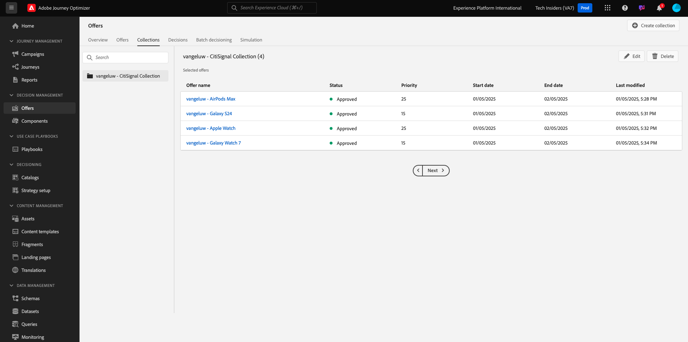

## 3.3.2.4 Create your decision

A Decision combines Placements, a Collection of Personalized Offers and a Fallback Offer to ultimately be used by the Offer Decisioning engine to find the best offer for a specific profile, based on each of the individual personalized offer characteristics like priority, eligibility constraint and total / user capping.

To configure your **Decision**, go to **Decisions**. Click **+ Create Decision**.

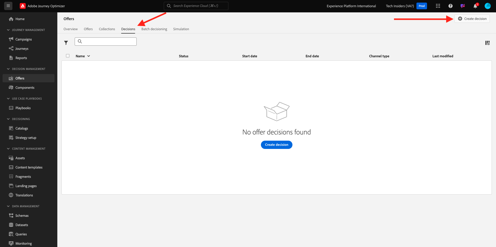

You'll then see this. Fill out the fields like this. Click **Next**.

- Name: `--aepUserLdap-- - CitiSignal Decision`
- Start date and time: today
- End date and time: today + 1 month

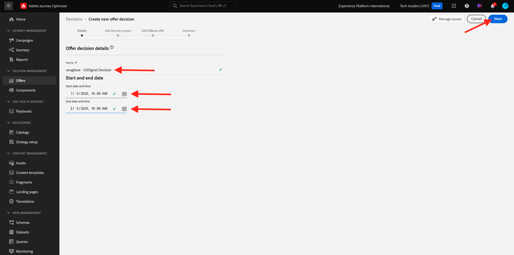

In the next screen, you need to add placements into decision scopes. You'll need to create decision scopes for the placements **Web - Image**, **Email - Image** and **Non-digital - Text**.

First, create the decision scope for **Non-digital - Text** by selecting that placement in the dropdown. Then, click the **Add** button to add evaluation criteria.

Select your collection `--aepUserLdap-- - CitiSignal Collection` and click **Add**.

You'll then see this. Click the **+** button to add a new decision scope.

Select the placement **Web - Image** and add your collection `--aepUserLdap-- - CitiSignal Collection` under evaluation criteria. Then, click the **+** button again to add a new decision scope.

Select the placement **Email - Image** and add your collection `--aepUserLdap-- - CitiSignal Collection` under evaluation criteria. Then, click **Next**.

You now need to select your **Fallback Offer**, which is named `--aepUserLdap-- - CitiSignal Fallback Offer`. Click **Next**.

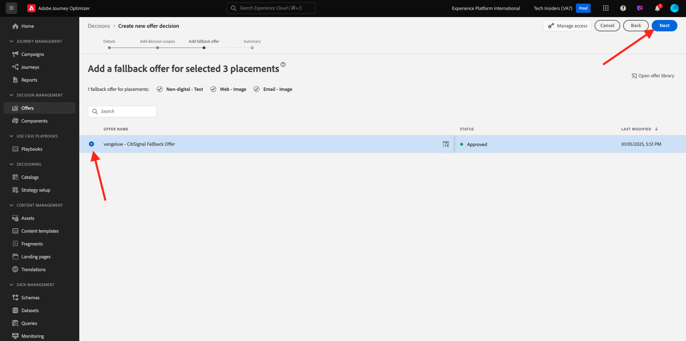

Review your decision. Click **Finish**.

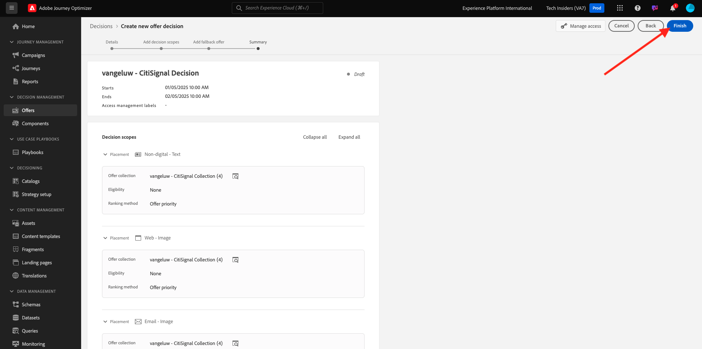

In the popup, click **Save and activate**.

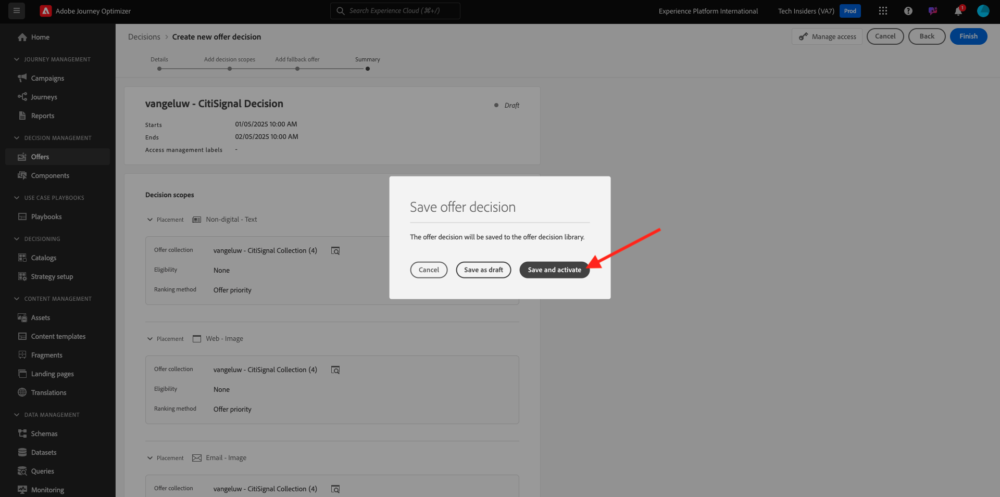

And finally, you'll now see your decision in the overview:

You've now successfully configured your decision. Your decision is now live, and can be used to deliver optimized and personalized offers to your customers, in real-time.

Next Step: [3.3.3 Prepare your Data Collection Client property and Web SDK setup for Offer Decisioning](./ex3.md)

[Go Back to Module 3.3](./offer-decisioning.md)

[Go Back to All Modules](./../../../overview.md)
