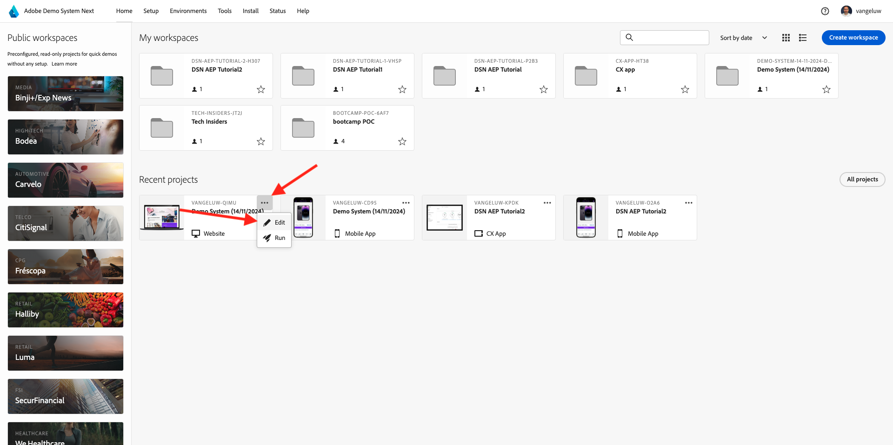
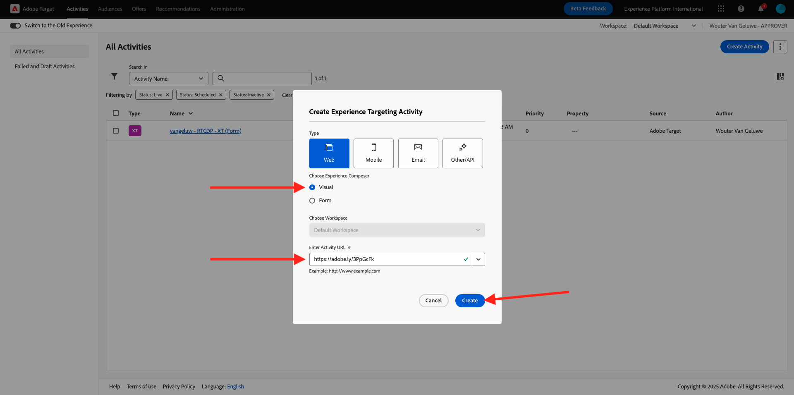
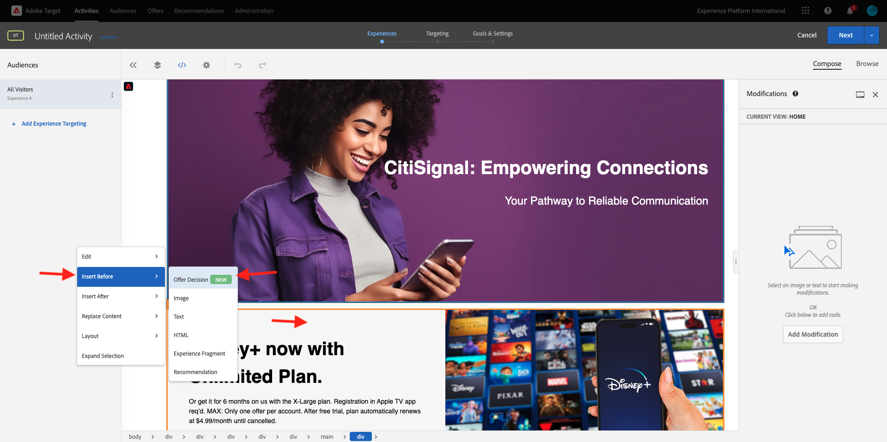
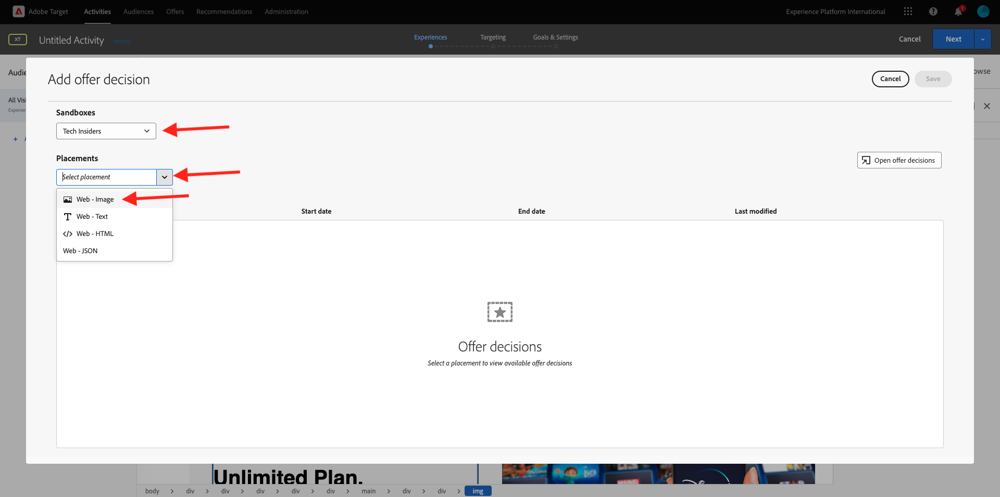
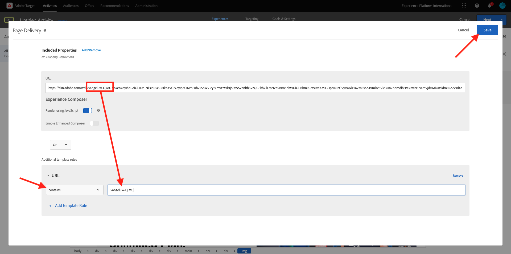
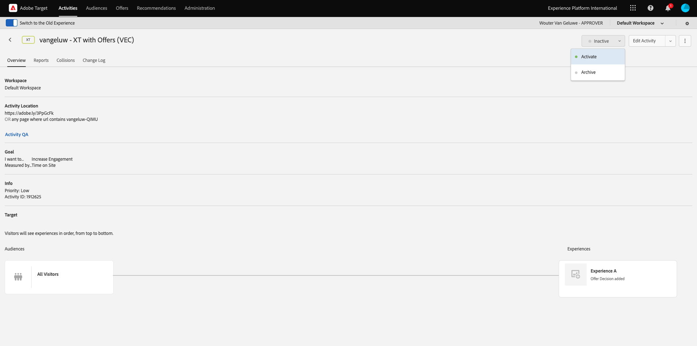

# 3.3.4 Combine Adobe Target and Offer Decisioning

## 3.3.4.1 Collect your demo project's shareable link

In order to load the demo website project in Adobe Target, you first need to collect a special link that will allow Adobe Target to load your demo website project.

To do that, go to [https://dsn.adobe.com/projects](https://builder.adobedemo.com/projects). After logging in with your Adobe ID, you'll see this. Click your website project to open it.

You'll now see this. Go to **Share**. Click **Generate Link** and then copy the link to your clipboard.

Go to [https://bitly.com](https://bitly.com), paste the link you copied and click **Create your link**. 

You'll now get a shortened link, which looks like this: `https://adobe.ly/3PpGcFk`. You'll need that link in the next exercise.

## 3.3.4.2 Collect

Now go to the Adobe Experience Cloud homepage by going to [https://experiencecloud.adobe.com/](https://experiencecloud.adobe.com/). Click **Target**.

On the **Adobe Target** homepage, you'll see all existing Activities. Click **Create Activity** and then click **Experience Targeting**.

Now select **Visual** and paste your shortened link in the field **Enter Activity URL**. Click **Create**.

You'll then see your demo website project being loaded in the Visuel Experience Composer.

>[!NOTE]
>
>In case your website isn't loading correctly, please install and enable this Chrome extension: **Adobe Target VEC Helper** from the Chrome Web Store, then try again.

Click the area that holds the Disney+ offer. Make sure to select the full **Container**. Click **Insert Before** and then select **Offer Decision**.

You'll then see this popup. Select your sandbox `--aepSandboxName--` and then select the placement **Web - Image**.

Next, select your decision `--aepUserLdap-- - CitiSignal Decision`. Click **Save**.

You'll then see this. Click **Review Rule**.

Make sure the add an additional template rule **URL** **contains** **your-project-name**. Click **Save**.

You'll then see this. Click **Next**.

Enter a name for your offer, use this name: `--aepUserLdap-- - XT with Offers (VEC)`. Click **Next**.

You'll then see this. Define your **Goal Metric** as indicated. Click **Save & Close**.

Your offer is now created and is being published. Once your offer is published, you can acitvate it.

Next Step: [3.3.5 Use your decision in an email and sms](./ex5.md)

[Go Back to Module 3.3](./offer-decisioning.md)

[Go Back to All Modules](./../../../overview.md)
