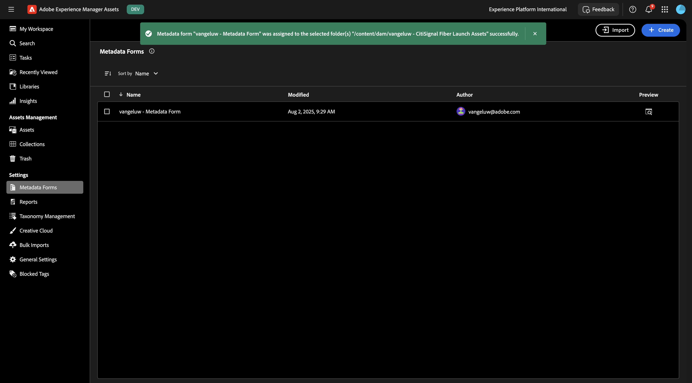

# 1.2.1 Workfront + AEM Assets CS Metadata Integration

Go to [https://experience.adobe.com/](https://experience.adobe.com/){target="_blank"}. Click to open **Workfront**.

You'll then see this.

## 1.2.1.1 Configure your AEM Assets Integration

Click the **menu** icon and then select **Setup**.

In the left menu, scroll down to **Documents** and then click **Experience Manager Assets**. Click **+ Add Experience Manager integration**.

For the name of your integration, use `--aepUserLdap-- - CitiSignal AEM`.

Open the **Experience Manager repository** dropdown and select your AEM CS instance, which should be named `--aepUserLdap-- - CitiSignal`.

Under **Metadata**, configure the following mapping:

| Workfront Field | Experience Manager Assets field|
| --------------- | ------------------------------ | 
| **Document** > **Name** | **wm:documentName** | 
| **Project** > **Name** | **wm:projectName** | 
| **Project** > **Description** | **wm:projectDescription** | 
| **Document Request** > **Status** | **wm:wm:documentStatus** | 
| **Task** > **Name** | **wm:taskName** | 
| **Task** > **Description** | **wm:taskDescription** | 
| **Project** > **ID** | **wm:projectId** | 

Enable the switch for **Sync object metadata**.

Click **Save**.

Your integration from Workfront to AEM Assets CS is now configured.

## 1.2.1.2 Configure Metadata integration with AEM Assets

Next, you need to configure AEM Assets CS so that the metadata fields from the asset in Workfront will be shared with AEM Assets CS.

To do that, go to [https://experience.adobe.com/](https://experience.adobe.com/). Click **Experience Manager Assets**.

Click to select your AEM Assets environment, which should be named `--aepUserLdap-- - CitiSignal dev`.

You should then see this. In the left menu, go to **Assets**.

Next, click **Create Folder**.

Name your folder `--aepUserLdap-- - CitiSignal Fiber Launch Assets` and click **Create**.

Next, go to **Metadata Forms** in the left menu and then click **Create**.

Use the name `--aepUserLdap-- - Metadata Form` and click **Create**.

Add 7 new **Single Line Text** fields to the form and select the first field. Then, click the **Schema** icon next to the **Metadata property** field for the first field.

You'll then see this popup. In the search field, enter `wm:project` and then select the field **Project Name**. Click **Select**.

Change the label of the field to `Project Name`. Click **Save**.

Go to the second field and click the **Schema** icon next to the **Metadata property** field.

In the search field, enter `wm:project` and then select the field **Project Description**. Click **Select**.

Change the label of the field to `Project Description`.

Next, select the third field and click the **Schema** icon next to the **Metadata property** field again. 

You'll then see this popup again. In the search field, enter `wm:project` and then select the field **Project ID**. Click **Select**.

Change the label of the field to `Project ID`.

Next, select the fourth field and click the **Schema** icon next to the **Metadata property** field again. 

You'll then see this popup again. In the search field, enter `wm:document` and then select the field **Project ID**. Click **Select**.

Change the label of the field to `Document Status`.

Next, select the fifth field and click the **Schema** icon next to the **Metadata property** field again. 

You'll then see this popup again. In the search field, enter `wm:document` and then select the field **Project ID**. Click **Select**.

Change the label of the field to `Document Name`.

Next, select the sixth field and click the **Schema** icon next to the **Metadata property** field again. 

You'll then see this popup again. In the search field, enter `wm:task` and then select the field **Task Name**. Click **Select**.

Change the label of the field to `Task Name`.

Next, select the seventh field and click the **Schema** icon next to the **Metadata property** field again. 

You'll then see this popup again. In the search field, enter `wm:task` and then select the field **Task Description**. Click **Select**.

Change the label of the field to `Task Description`.

Change the **Tab name** on the form to `--aepUserLdap-- - Workfront Metadata`. 

Click **Save** and **Close**.

Your **Metadata Form** is now configured.

Next, you need to assign the Metadata Form to the folder you created before. Check the checkbox for your Metadata Form and click **Assign to Folder(s)**.

Select your folder, which should be named `--aepUserLdap-- - CitiSignal Fiber Launch Assets`. Click **Assign**.

The Metadata Form is now assigned to your folder successfully.

Next Step: [1.2.2 Proofing with Workfront](./ex2.md){target="_blank"}

Go Back to [Workflow Management with Adobe Workfront](./workfront.md){target="_blank"}

[Go Back to All Modules](./../../../overview.md){target="_blank"}
