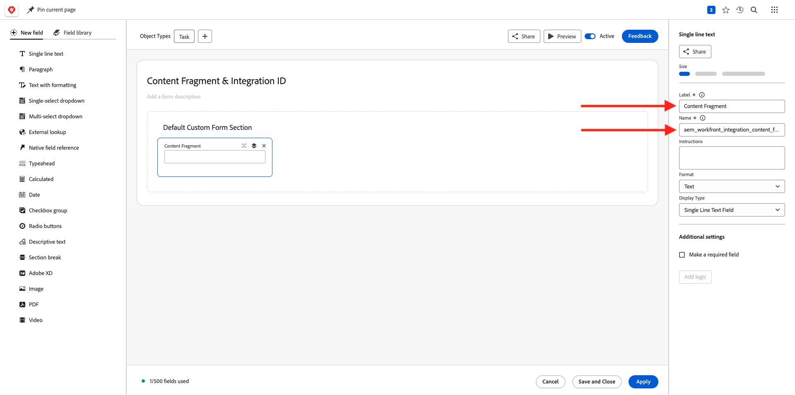
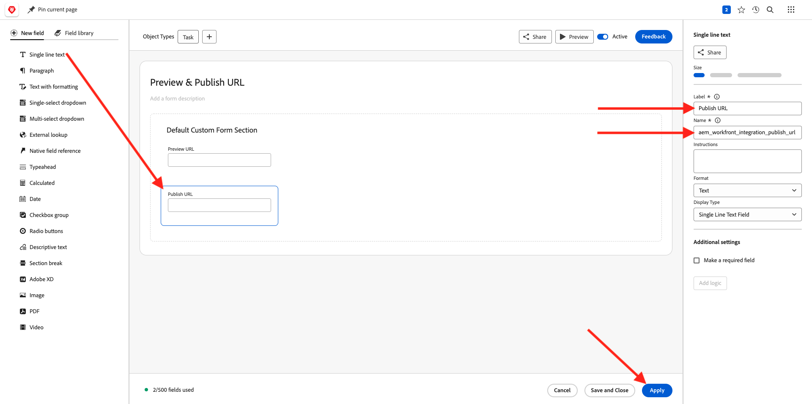

# 1.2.1 Getting started with Workfront

Log in to Adobe Workfront by going to [https://experienceplatform.my.workfront.com/](https://experienceplatform.my.workfront.com/){target="_blank"}.

You then see this.

## 1.2.1.1 Configure your AEM Assets Integration

Click the 9 dots **hamburger** icon and then select **Setup**.

In the left menu, scroll down to **Documents** and then click **Experience Manager Assets**.

Click **+ Add Experience Manager integration**.

For the name of your integration, use `--aepUserLdap-- - Citi Signal AEM`.

Open the **Experience Manager repository** dropdown and select your AEM CS instance, which should be named `--aepUserLdap-- - Citi Signal`.

Under **Metadata**, configure the following mapping:

| Workfront Field | Experience Manager Assets field|
| --------------- | ------------------------------ | 
| **Document** > **Name** | **wm:documentName** | 
| **Project** > **Description** | **wm:projectDescription** | 
| **Task** > **Name** | **wm:taskName** | 
| **Task** > **Description** | **wm:taskDescription** | 

Enable the switch for **Sync object metadata**.

Click **Save**.

Your integration from Workfront to AEM Assets CS is now configured.

## 1.2.1.2 Configure Metadata integration with AEM Assets

Next, you need to configure AEM Assets so that the metadata fields from the asset in Workfront will be shared with AEM.

To do that, go to [https://experience.adobe.com/](https://experience.adobe.com/). Click **Experience Manager Assets**.

Click to select your AEM Assets environment, which should be named `--aepUserLdap-- - Citi Signal dev`.

You should then see this. In the left menu, go to **Assets** and click **Create Folder**.

Name your folder `--aepUserLdap-- - Workfront Assets` and click **Create**.

Next, go to **Metadata Forms** in the left menu and then click **Create**.

Use the name `--aepUserLdap-- - Metadata Form` and click **Create**.

Add 3 new **Single Line Text** fields to the form and select the first field. Then, click the **Schema** icon next to the **Metadata property** field.

In the search field, enter `wm:project` and then select the field **Project Description**. Click **Select**.

Change the label of the field to **Project Description**.

Next, select the 2nd **Single Line Text** field and click the **Schema** icon next to the **Metadata property** field again. 

You'll then see this popup again. In the search field, enter `wm:project` and then select the field **Project ID**. Click **Select**.

Change the label of the field to **Project ID**.

Select the 3rd **Single Line Text** field and click the **Schema** icon next to the **Metadata property** field again. 

You'll then see this popup again. In the search field, enter `wm:project` and then select the field **Project Name**. Click **Select**.

Change the label of the field to **Project Name**. Click **Save**.

Change the **Tab name** on the form to `--aepUserLdap-- - Workfront Metadata`. Click **Save** and **Close**.

Your **Metadata Form** is now configured.

Next, you need to assign the Metadata Form to the folder you created before. Check the checkbox for your Metadata Form and click **Assign to Folder(s)**.

Select your folder, which should be named `--aepUserLdap-- - Workfront Assets`. Click **Assign**.

The Metadata Form is now assigned to your folder successfully.

## 1.2.1.2 Configure your AEM Sites Integration

>[!NOTE]
>
>This plugin is currently in **Early Access** mode and isn't generally available yet. 
>
>This plugin may already be installed in the Workfront instance your using. If it is already installed, you can review the below instructions but there's no need to change anything in your configuration then.

Go to [https://experience.adobe.com/#/@experienceplatform/aem/extension-manager/universal-editor](https://experience.adobe.com/#/@experienceplatform/aem/extension-manager/universal-editor){target="_blank"}.

Make sure the **toggle** for this plugin is set to **Enabled**. Then, click the **gear** icon.

You'll see an **Extension configuration** popup. Configure the following fields to use this plugin.

| Key | Value|
| --------------- | ------------------------------ | 
| **`IMS_ENV`** | **PROD** | 
| **`WORKFRONT_INSTANCE_URL`** | **https://experienceplatform.my.workfront.com** | 
| **`SHOW_CUSTOM_FORMS`** | **'{"previewUrl": true, "publishUrl": true}'** | 

Click **Save**.

Go back to your Workfront UI and click the 9 dots **hamburger** icon. Select **Setup**.

In the left menu, go to **Custom Forms** and select **Form**. Click **+ New custom form**.

Select **Task** and click **Continue**.

You'll then see an empty custom form. Enter the form name `Content Fragment & Integration ID`.

Drag and drop a new **Single line text** field onto the canvas.

Configure the new field like this:

- **Label**: **Content Fragment**
- **Name**: **`aem_workfront_integration_content_fragment`**

Add a new **Single line text** field onto the canvas and configure the new field like this:

- **Label**: **Integration ID**
- **Name**: **`aem_workfront_integration_id`**

Click **Apply**.

You now need to configure a second custom form. Click **+ New custom form**.

Select **Task** and click **Continue**.

You'll then see an empty custom form. Enter the form name `Preview & Publish URL`.

Drag and drop a new **Single line text** field onto the canvas.

Configure the new field like this:

- **Label**: **Preview URL**
- **Name**: **`aem_workfront_integration_preview_url`**

Add a new **Single line text** field onto the canvas and configure the new field like this:

- **Label**: **Publish URL**
- **Name**: **`aem_workfront_integration_publish_url`**

Click **Apply**.

You should then have 2 custom forms available.

Next Step: [1.2.2 Proofing with Workfront](./ex2.md){target="_blank"}

Go Back to [Workflow Management with Adobe Workfront](./workfront.md){target="_blank"}

[Go Back to All Modules](./../../../overview.md){target="_blank"}
