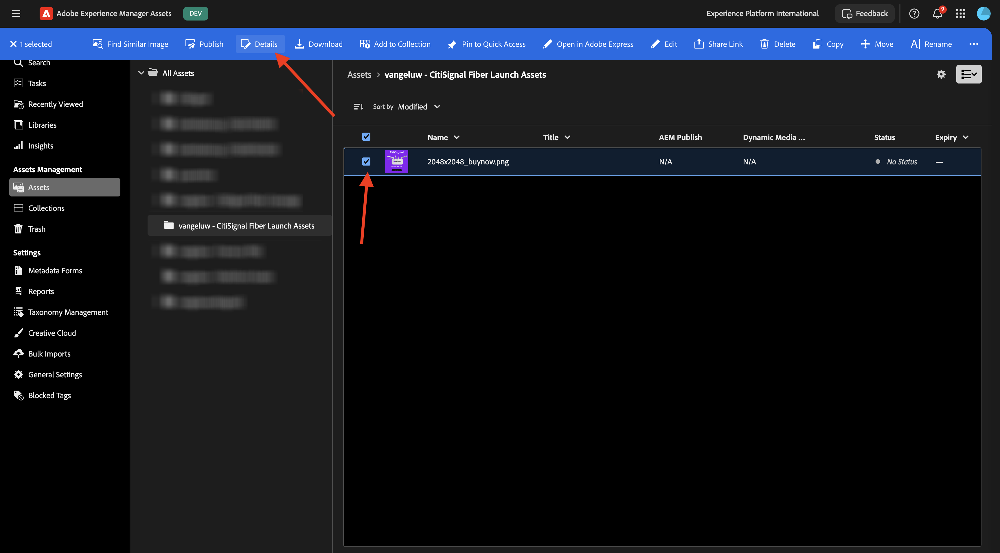

# 1.2.2 Proofing with Workfront

>[!IMPORTANT]
>
>If you have previously configured an AEM CS Program with an AEM Assets CS environment, it may be that your AEM CS sandbox was hibernated. Given that dehibernating such a sandbox takes 10-15 minutes, it would be a good idea to start the dehibernation process now so that you don't have to wait for it at a later time.

## 1.2.2.1 Create a new Approval Flow

Go back to **Adobe Workfront**. Click the **menu** icon and select **Proofing**.

Go to **Workflows**, click **+ New** and then select **New template**.

Set the **Template name** to `--aepUserLdap-- - Approval Workflow` and set the **Template owner** to yourself.

Scroll down, and under **Stages** > **Stage 1**, change the **Proof Creator** role to **Reviewer & Approver**. You can also add anyone else, so as an example, add yourself by selecting your user and set the **Role** of **Reviewer & Approver**.

Click **Create**.

Your basic approval workflow is now ready to be used.

## 1.2.2.2 Enable Workfront Blueprint

In the next step, you will create a new project using a template. Adobe Workfront provides you with a number of available blueprints that just require to be activated.

For CitiSignal's use case, the blueprint **Integrated Campaign Execution** is the one you need to use.

In order to install that blueprint, open the menu and select **Blueprints**.

Select the filter **Marketing** and then scroll down to find the blueprint **Integrated Campaign Execution**. Click **Install**.

Click **Continue**.

Change the **Project Template Name** to `--aepUserLdap-- - Integrated Campaign Execution`.

Click **Install as is...**.

You should then see this. Installing may take a couple of minutes.

After a couple of minutes, the blueprint will be installed.

## 1.2.2.3 Create a new Project

Open the **menu** and go to **Programs**.

Click to the program you created before, which is named `--aepUserLdap-- CitiSignal Fiber Launch`.

>[!NOTE]
>
>You created a program as part of the exercise on [Workfront Planning](./../module1.1/ex1.md) with the automation you created and ran. If you haven't done that yet, you can find the instructions there.

In your program, go to **Projects**. Click **+ New Project** and then select **New Project from Template**.

Select the template `--aepUserLdap-- - Integrated Campaign Execution` and click **Use template**.

You should then see this. Change the name to `--aepUserLdap-- - CitiSignal Fiber Launch Winter 2026` and click **Create project**.

Your project is now created. Go to **Project Details**.

Go to **Project Details**. Click to select the current text under **Description**.

Set the description to `The CitiSignal Fiber Launch project is used to plan the upcoming launch of CitiSignal Fiber.`

Click **Save Changes**.

Your project is now ready to be used.

The tasks and dependencies in the project have been created based on the template that you chose and you have been set as the. owner of the project. The status of the project has been set to **Planning**. You can change the status of the project by selecting another value in the list.

## 1.2.2.4 Create a new Task

Hover over the task **Begin to Create Design Templates** and click the 3 dots **...**.

Select the option **Insert Task Below**.

Enter this name for your task: `Create layout using approved assets and copy`. 

Set the field **Assignments** to the role **Designer**.
Set the field **Duration** to **5 days**.
Set the field predecessor to **9**.
Enter a date for the fields **Start on** and **Due on**.

Click somewhere else in the screen to save the new task.

You should then see this. Click the task to open it.

Go to **task Details** and set the field **Description** to: `This task is used to track the progress of the creation of the assets for the CitiSignal Fiber Launch Campaign.`

Click **Save Changes**.

You should then see this. Click on the **Project** field to go back to your project.

In the **Project** view, go to **Workload Balancer**.

Click **Bulk Assignments**.

Select the **Role assignment** of **Designer** and then click in the field **User to assign**. This will show all users that have a **Designer** role in your Workfront instance. In this case, select the fictitious user **Melissa Jenkins**.

Click **Assign**. The user you selected will now be assigned to the tasks in the project that are linked to the **Designer** role.

The tasks are now assigned. Click **Tasks** to go back to the **Tasks** overview page.

Click the task you created, which is named 
**Create layout using approved assets and copy**.

You will now start working on this task as part of this exercise. You can see that Melissa Jenkins is assigned to this task at the moment. To change that to yourself, click the **Assignments** field and select **Assign to me**.

Click **Save**.

Click **Work on it**.

You should then see this.

As part of this task, you need to create a new image and then upload it as a document in Workfront. You'll now create that asset yourself using Adobe Express.

## 1.2.2.5 Add a new Document to your Project and start the approval flow

For this exercise, you need to download and use this asset: [timetravelnow.png](./images/timetravelnow.png)

Go to **Documents** for your Task. Click **+ Add new** and then select **Document**.

Click to select the file `timetravelnow.png`. Click **Open**.

You should then have this.

Hover over the uploaded document. Click **Create proof** and then choose **Advanced Proof**.

In the **new proof** window, select **Automated** and then select the workflow template that you created before, which should be named `--aepUserLdap-- - Approval Workflow`. Click **Create Proof**.

Click **Open Proof**

You can now review the proof. Select **Add comment** to add a remark that requires the document to be changed.

Enter your comment and click **Post**. Next, click **Make a decision**.

Select **Changes required** and click **make decision**.

Go back to your **Task** and the **Document**. You'll see the text **Changes required** also appear there.

You now need to make design changes and upload a new version of the image.

## 1.2.2.6 Add a new version of your Document to your Task

For this exercise, you need to download and use this asset: [getonboard.png](./images/getonboard.png)

In your Task view in Adobe Workfront, select the old image file that wasn't approved. Then, click **+ Add new**, select **Version** and then choose **Document**.

Click to select the file `getonboardnow.png`. Click **Open**.

You should then have this. Click **Create proof** and then select **Advanced Proof** again.

You'll then see this. The **Workflow template** is now preselected as Workfront assumes that the previous approval workflow is still valid. Click **Create Proof**.

Select **Open Proof**.

You can now see 2 versions of the file next to eachother. Click the **Compare Proofs** button.

You should then see both versions of the image next to eachother. Click **Make decision**. 

Select **Approved** and click **Make decision** again.

Close the **Compare Proofs** view by closing the left version of the image. Click the **Task Name** to go back to the Task overview.

You'll then be back in your Task view, with an approved asset. This asset now needs to be shared towards AEM Assets.

Select the approved document. Click the **Share arrow** icon and select your AEM Assets integration, which should be named `--aepUserLdap-- - CitiSignal AEM+ACCS`.

Double-click the folder you created before, which should be named `--aepUserLdap-- - CitiSignal Fiber Campaign`.

Click **Select folder**.

After 1-2 minutes, your document will now be published into AEM Assets. You'll see an AEM icon next to your document name.

Click **Mark as done** to finish this task.

You should then see this.

## 1.2.2.7 View your file in AEM Assets

Go to your folder in AEM Assets CS, which is named `--aepUserLdap-- - CitiSignal Fiber Campaign`.

Select the image, and then choose **Details**.

You'll then see the Metadata Form your created earlier, with the values that have been populated automatically by the integration between Workfront and AEM Assets.

Go Back to [Workflow Management with Adobe Workfront](./workfront.md){target="_blank"}

[Go Back to All Modules](./../../../overview.md){target="_blank"}
