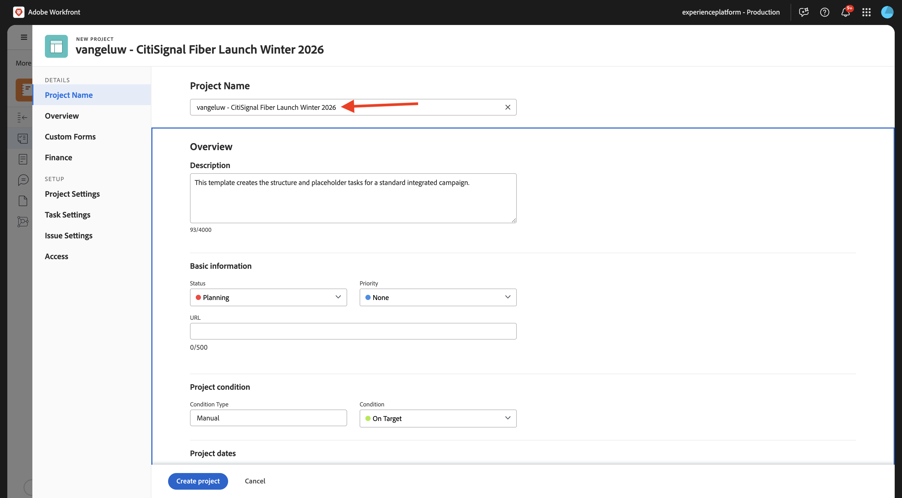

# 1.2.2 Proofing with Workfront

>[!IMPORTANT]
>
>If you have previously configured an AEM CS Program with an AEM Assets CS environment, it may be that your AEM CS sandbox was hibernated. Given that dehibernating such a sandbox takes 10-15 minutes, it would be a good idea to start the dehibernation process now so that you don't have to wait for it at a later time.

## 1.2.2.1 Create a new Approval Flow

Go back to **Adobe Workfront**. Click the **menu** icon and select **Proofing**.

Go to **Workflows**, click **+ New** and then select **New template**.

Set the **Template name** to `--aepUserLdap-- - Approval Workflow` and set the **Template owner** to yourself.

Scroll down, and under **Stages** > **Stage 1**, add yourself with the **Role** of **Reviewer & Approver**.

Click **Create**.

Your basic approval workflow is now ready to be used.

## 1.2.2.2 Create a new Project

Open the **menu** and go to **Programs**.

Click to the program you created before, which is named `--aepUserLdap-- CitiSignal Fiber Launch`.

>[!NOTE]
>
>You created a program as part of the exercise on [Workfront Planning](./../module1.1/ex1.md) with the automation you created and ran. If you haven't done that yet, you can find the instructions there.

In your program, go to **Projects**. Click **+ New Project** and then select **New Project**.

You should then see this. Change the name to `--aepUserLdap-- - CitiSignal Fiber Launch`.

Go to **Project Details**. Click **+Add** under **Description**.

Set the description to `The CitiSignal Fiber Launch project is used to plan the upcoming launch of CitiSignal Fiber.`

Click **Save Changes**.

Your project is now created.

## 1.2.2.3 Create a new Task

Go to **Tasks** and click **+ New Task**.

Enter this name for your task: `Create assets for Fiber campaign`. 

Set the field **Description** to: `This task is used to track the progress of the creation of the assets for the CitiSignal Fiber Launch Campaign.`

Click **Create Task**.

You should then see this.

In the column **Assignment**, add your own name.

The task will then be assigned to you.

## 1.2.2.4 Add a new Document to your Task go through the approval flow

Click the **Workfront** logo to go back to the overview page. You should then see the project you just created appear in the overview. Click your project to open it.

In **Tasks**, click to open the task.

Go to **Documents**. Click **+ Add new** and then select **Document**.

Download [this file](./images/2048x2048.png) to your desktop.

{width="50px" align="left"}

Select the file **2048x2048.png** and click **Open**.

You should then have this. Hover over the uploaded document. Click **Create proof** and then choose **Advanced Proof**.

In the **new proof** window, select **Automated** and then select the workflow template that you created before, which should be named `--aepUserLdap-- - Approval Workflow`. Click **Create Proof**.

Click **Work on it**.

Click **Open Proof**

You can now review the proof. Select **Add comment** to add a remark that requires the document to be changed.

Enter your comment and click **Post**. Click **Close**.

Next, you need to change your role from **Reviewer** to **Reviewer & Approver**. To do that, go back to your Task and click **Proofing Workflow**.

Change your role from **Reviewer** to **Reviewer & Approver**.

Go back to your Task and open the proof again. You now see a new button, **Make decision**. Click it.

Select **Changes required** and click **make decision**.

Go back to your **Task** and the **Document**. You now need to upload a second image that takes into account the comments that were provided.

Download [this file](./images/2048x2048_buynow.png) to your desktop.

{width="50px" align="left"}

In your Task view, select the old image file that wasn't approved. Then, click **+ Add new**, select **Version** and then select **Document**.

Select the fle **2048x2048_buynow.png** and click **Open**.

You should then have this. Click **Create proof** and then select **Advanced Proof** again.

You'll then see this. The **Workflow template** is now preselected as Workfront assumes that the previous approval workflow is still valid. Click **Create Proof**.

Select **Open Proof**.

You can now see 2 versions of the file next to eachother.

Click **Make decision**, select **Approved** and click **Make decision** again.

Click the **Task Name** to go back to the Task overview.

You'll then be back in your Task view, with an approved asset. This asset now needs to be shared towards AEM Assets.

Select the approved document. Click the **Share arrow** icon and select your AEM Assets integration, which should be named `--aepUserLdap-- - CitiSignal AEM`.

Double-click the folder you created before, which should be named `--aepUserLdap-- - CitiSignal Fiber Launch Assets`.

Click **Select folder**.

After 1-2 minutes, your document will now be published into AEM Assets. You'll see an AEM icon next to your document name.

Click **Mark as done** to finish this task.

You should then see this.

## 1.2.2.5 View your file in AEM Assets

Go to your folder in AEM Assets CS, which is named `--aepUserLdap-- - CitiSignal Fiber Launch Assets`.

Select the image, and then choose **Details**.

You'll then see the Metadata Form your created earlier, with the values that have been populated automatically by the integration between Workfront and AEM Assets.

Go Back to [Workflow Management with Adobe Workfront](./workfront.md){target="_blank"}

[Go Back to All Modules](./../../../overview.md){target="_blank"}
