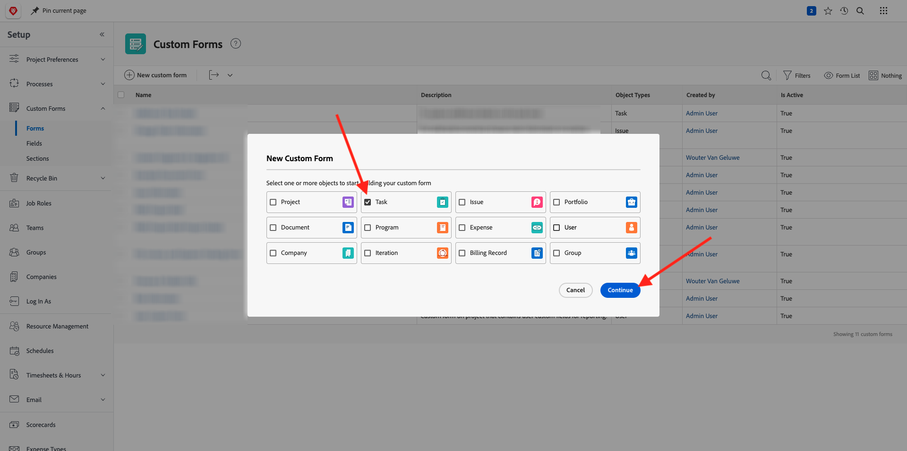
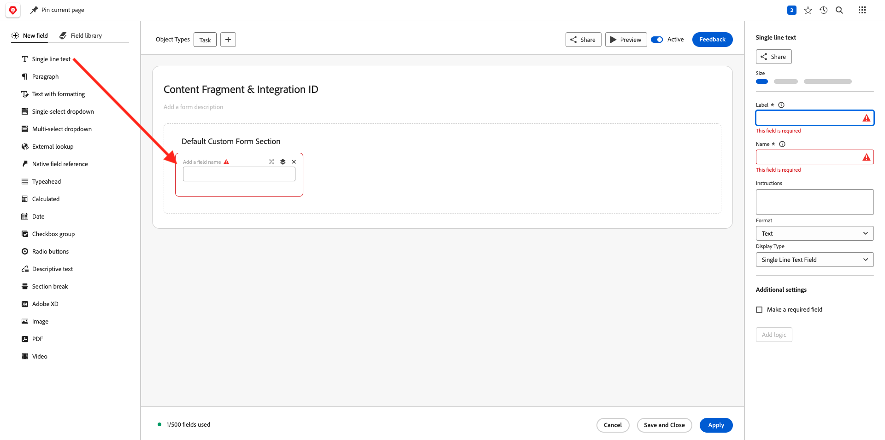
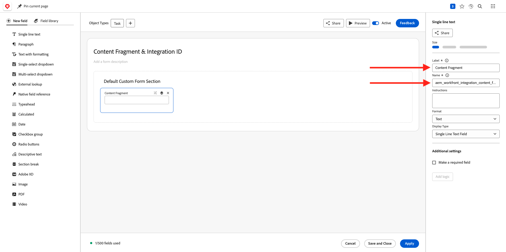
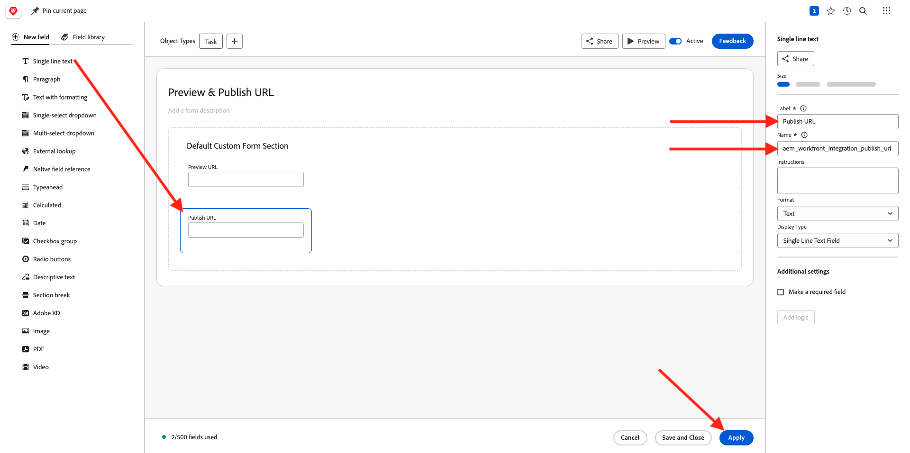
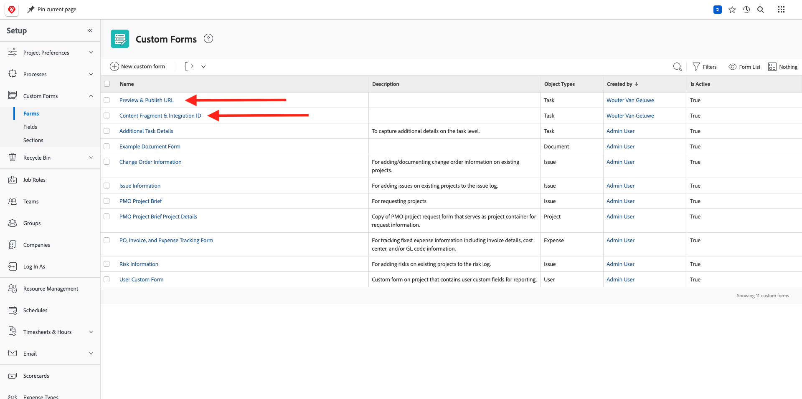

# 1.2.4 Workfront + AEM Sites

Log in to Adobe Workfront by going to [https://experienceplatform.my.workfront.com/](https://experienceplatform.my.workfront.com/){target="_blank"}.

You then see this.

## 1.2.4.1 Configure your AEM Sites Integration

>[!NOTE]
>
>This plugin is currently in **Early Access** mode and isn't generally available yet. 
>
>This plugin may already be installed in the Workfront instance your using. If it is already installed, you can review the below instructions but there's no need to change anything in your configuration then.

Go to [https://experience.adobe.com/#/@experienceplatform/aem/extension-manager/universal-editor](https://experience.adobe.com/#/@experienceplatform/aem/extension-manager/universal-editor){target="_blank"}.

Make sure the **toggle** for this plugin is set to **Enabled**. Then, click the **gear** icon.

You'll see an **Extension configuration** popup. Configure the following fields to use this plugin.

| Key | Value|
| --------------- | ------------------------------ | 
| **`IMS_ENV`** | **PROD** | 
| **`WORKFRONT_INSTANCE_URL`** | **https://experienceplatform.my.workfront.com** | 
| **`SHOW_CUSTOM_FORMS`** | **'{"previewUrl": true, "publishUrl": true}'** | 

Click **Save**.

Go back to your Workfront UI and click the 9 dots **hamburger** icon. Select **Setup**.

In the left menu, go to **Custom Forms** and select **Form**. Click **+ New custom form**.

Select **Task** and click **Continue**.

You'll then see an empty custom form. Enter the form name `Content Fragment & Integration ID`.

Drag and drop a new **Single line text** field onto the canvas.

Configure the new field like this:

- **Label**: **Content Fragment**
- **Name**: **`aem_workfront_integration_content_fragment`**

Add a new **Single line text** field onto the canvas and configure the new field like this:

- **Label**: **Integration ID**
- **Name**: **`aem_workfront_integration_id`**

Click **Apply**.

You now need to configure a second custom form. Click **+ New custom form**.

Select **Task** and click **Continue**.

You'll then see an empty custom form. Enter the form name `Preview & Publish URL`.

Drag and drop a new **Single line text** field onto the canvas.

Configure the new field like this:

- **Label**: **Preview URL**
- **Name**: **`aem_workfront_integration_preview_url`**

Add a new **Single line text** field onto the canvas and configure the new field like this:

- **Label**: **Publish URL**
- **Name**: **`aem_workfront_integration_publish_url`**

Click **Apply**.

You should then have 2 custom forms available.

Next Step: [1.2.2 Proofing with Workfront](./ex2.md){target="_blank"}

Go Back to [Workflow Management with Adobe Workfront](./workfront.md){target="_blank"}

[Go Back to All Modules](./../../../overview.md){target="_blank"}
