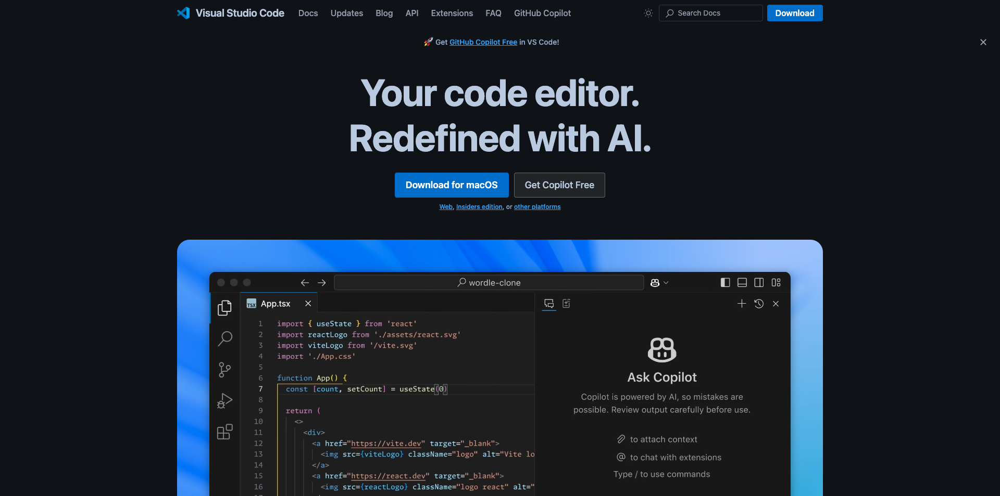

# Prework

Below is an overview of the prework that is needed prior to joining a live workshop.

## 1. Install Adobe Creative Cloud

Go to [https://creativecloud.adobe.com/apps/download/creative-cloud](https://creativecloud.adobe.com/apps/download/creative-cloud). 

## 2. Photoshop

Open the **Adobe Creative Cloud** app, go to **Apps**. Install Photoshop on your computer.

## 3. Postman

Go to [https://www.postman.com/downloads/](https://www.postman.com/downloads/). 

Download and install the relevant version of Postman for your OS.

Log in to Postman using your personal account.

## 4. Visual Studio Code

Go to [https://code.visualstudio.com/](https://code.visualstudio.com/){target="_blank"}, download and install **Visual Studio Code**.

## 5. A Text Editor of choice

If you don't have a Text Editor app, you can go to [https://www.sublimetext.com/](https://www.sublimetext.com/){target="_blank"} and download and install this Text Editor.

## 6. GitHub Account

If you don't have a GitHub account yet, go to [https://github.com/](https://github.com/){target="_blank"}, and click **Sign Up**. Use your personal email address and create your account.

## 7. GitHub Desktop

Go to [https://desktop.github.com/download/](https://desktop.github.com/download/){target="_blank"}, download and install **Github Desktop**.

>[!NOTE]
>
>{width="50px" align="left"}
>
>If you have questions, want to share general feedback of have suggestions on future content, please contact Tech Insiders directly, by sending an email to **techinsiders@adobe.com**.

[Go Back to All Modules](./overview.md)
