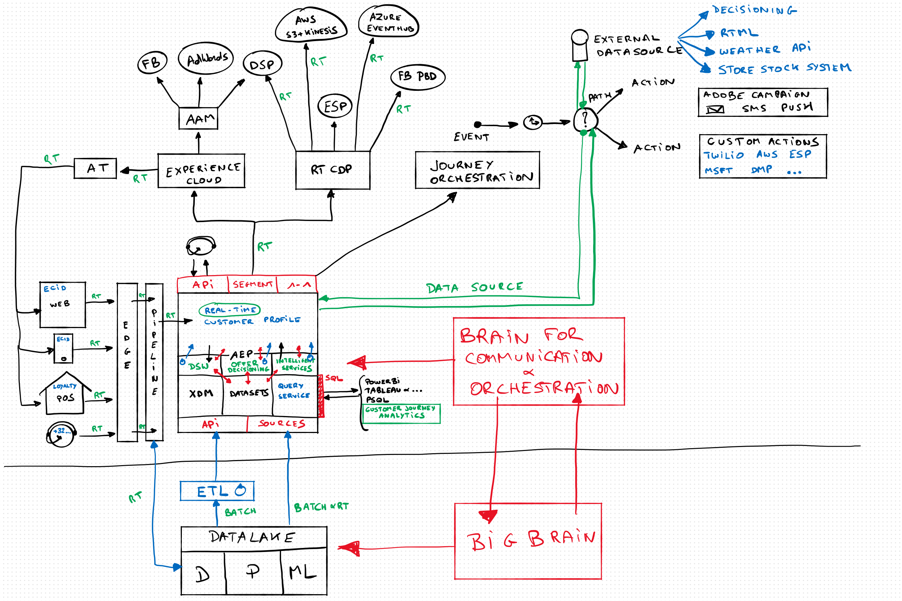

# Architecture

**Author: [Wouter Van Geluwe](https://www.linkedin.com/in/woutervangeluwe/)**

## Learning Objectives

- Learn how to ...

## Prerequisites

- No prerequisites

## Introduction Video

>[!VIDEO](https://video.tv.adobe.com/v/32553?quality=12&learn=on)

## Architecture Overview

[Go Back to All Modules](./overview.md)
