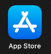
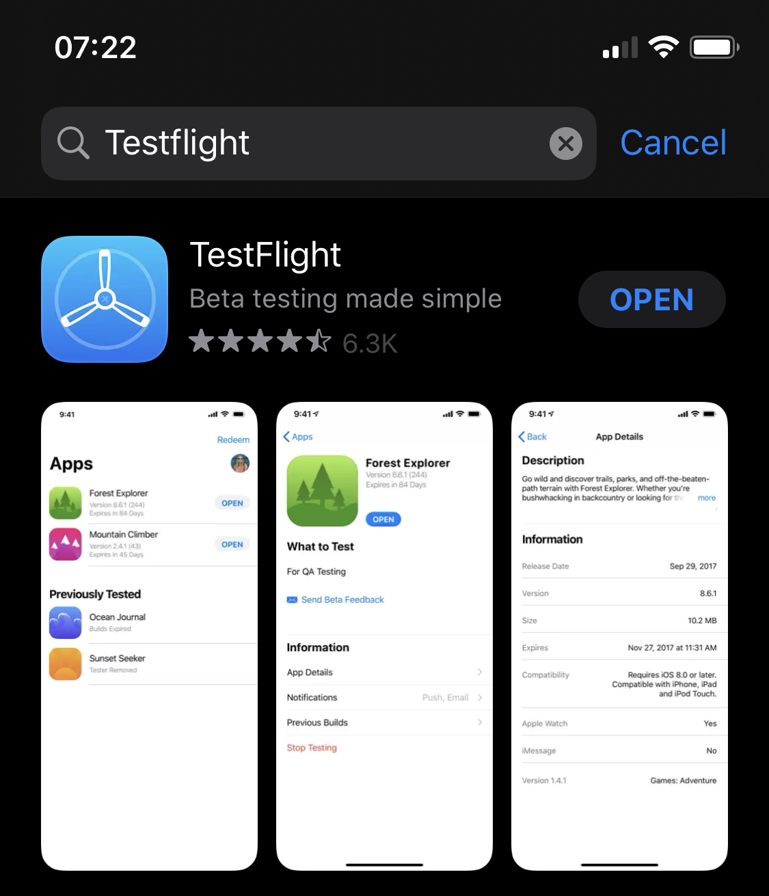
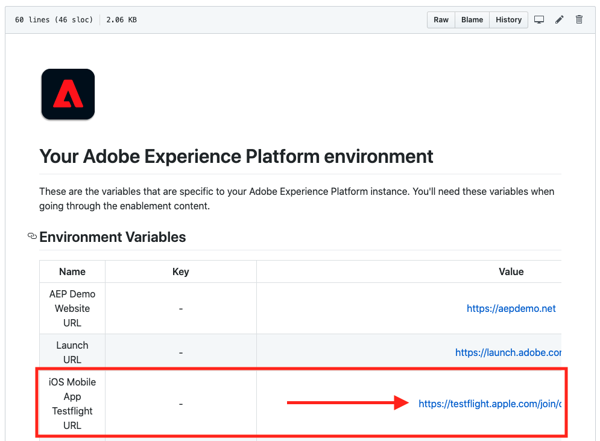
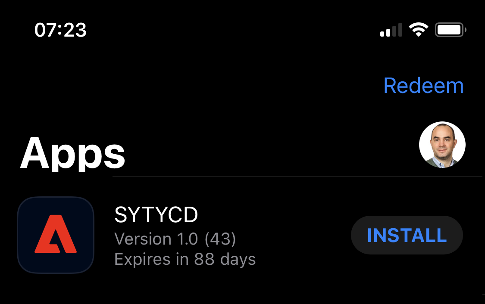
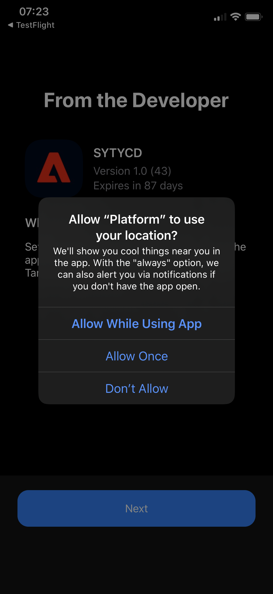
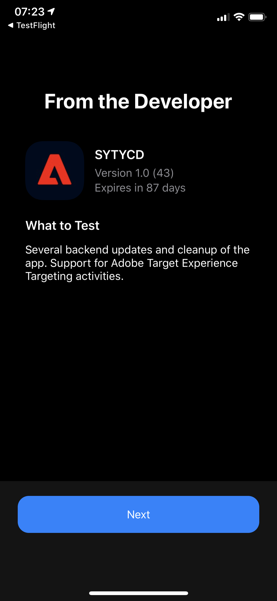
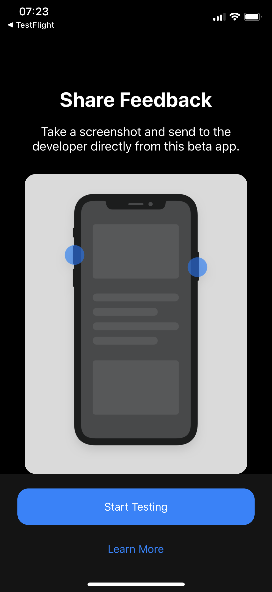
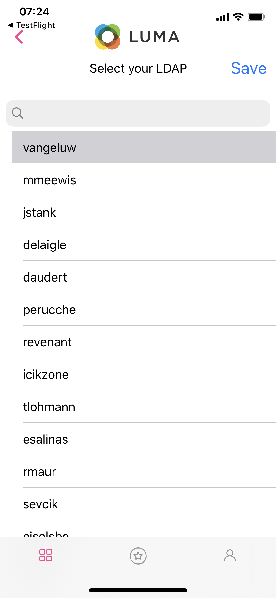
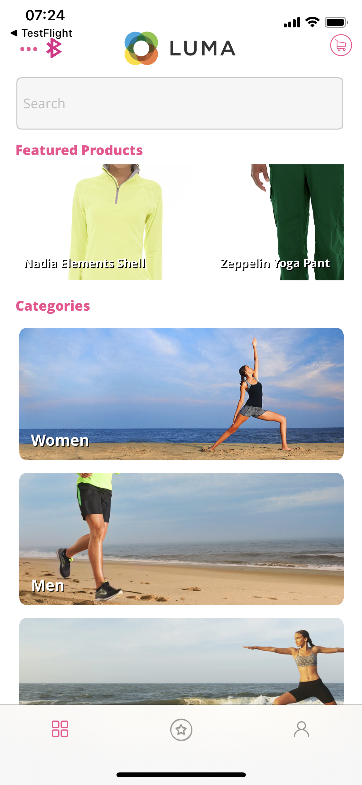

# Exercise 2: Install the Mobile Application (iOS)

In this exercise, the goal is to install the Mobile Application (iOS).

On your iPhone, go to the App Store.

Search for ``Testflight``.

Install the app TestFlight on your iPhone.

Next, [go to your Environment Variables](../../environment.md). You'll find a link there, search for ``iOS Mobile App Testflight URL`` as indicated in the screenshot.

Click that link directly from your iPhone or iPad to get access to the app. Sometimes, you have to click this link twice on your iPhone/iPad.

The mobile app should then become available in the TestFlight-app.

In the TestFlight-app, click on the ``INSTALL``-button.

After installing the app, open the mobile app.

You'll have to respond to 3 questions asking for your permission to track your location, to send you push notifications and use Bluetooth. If you'd like to use iBeacons in combination with your mobile app to track your location and if you'd like to receive personalized push notifications, please accept both questions.

Click ``Allow While Using App`` so that the application can track your location when you're using the app.

Click ``Allow`` to receive push notifications.

Click ``OK`` so that the application can use Bluetooth.

Click ``Next``.

Click ``Start Testing``.

The app will then require you to select your LDAP. Please select the appropriate LDAP and click ``Save``.

After selecting your ``LDAP``, the app will automatically load the default brand, which is ``Luma Retail``. This process takes about 15 seconds.

Your mobile app will now display the brand ``Luma Retail``.

You now have the Mobile App installed, please continue with Module 1.

[Go Back to Module 0](./README.md)

[Go Back to All Modules](../../README.md)
