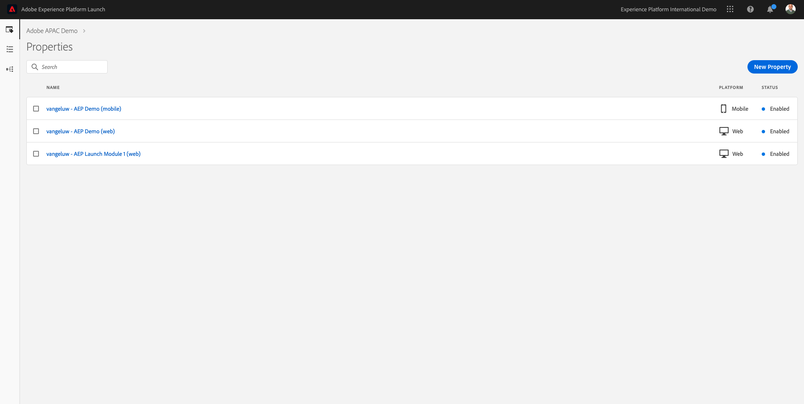
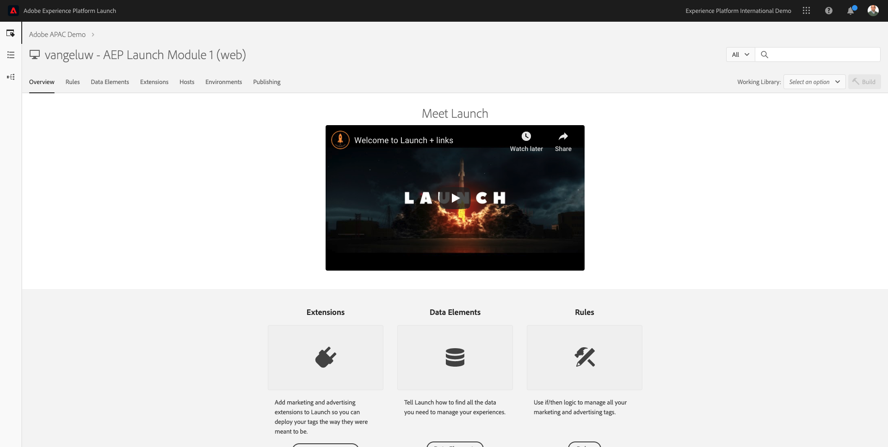
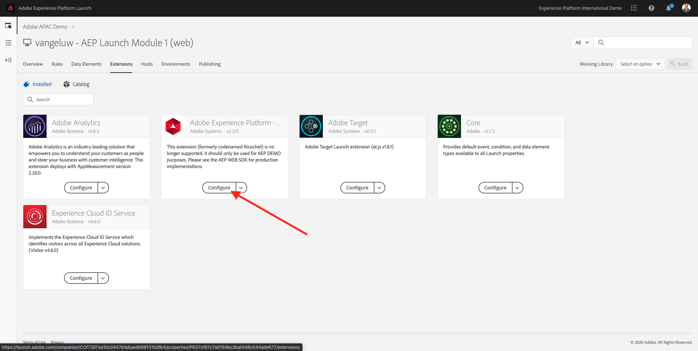
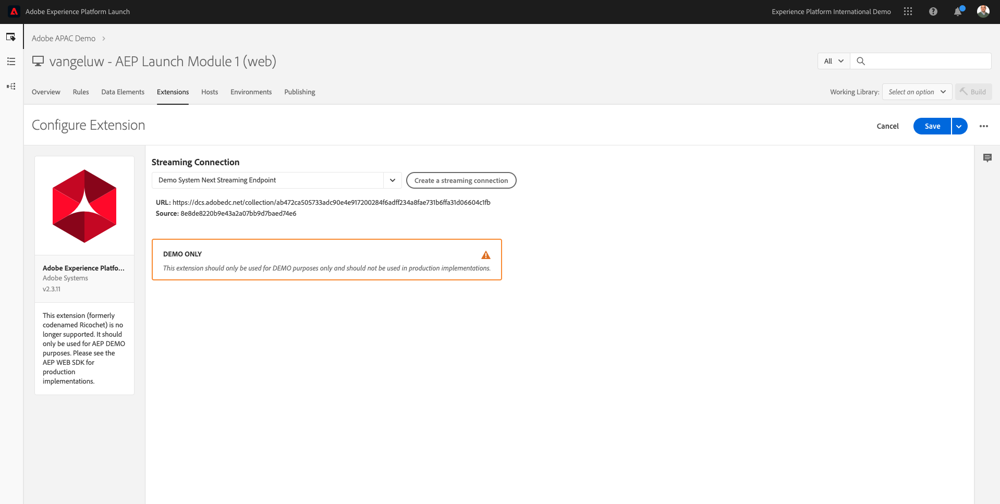
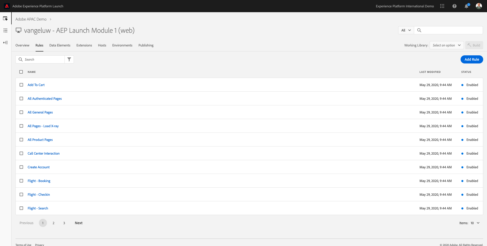
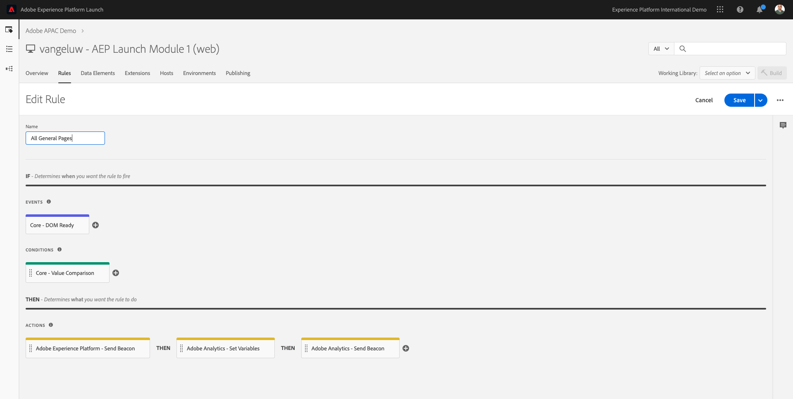
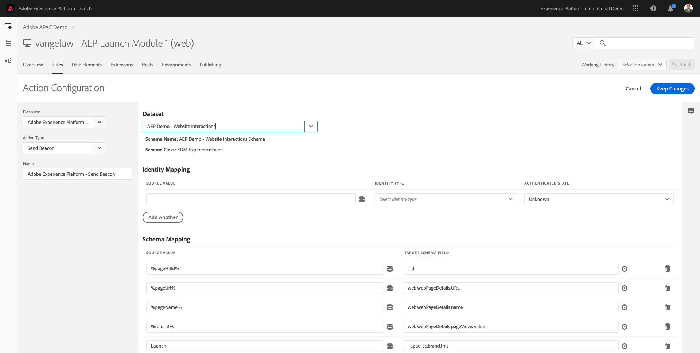
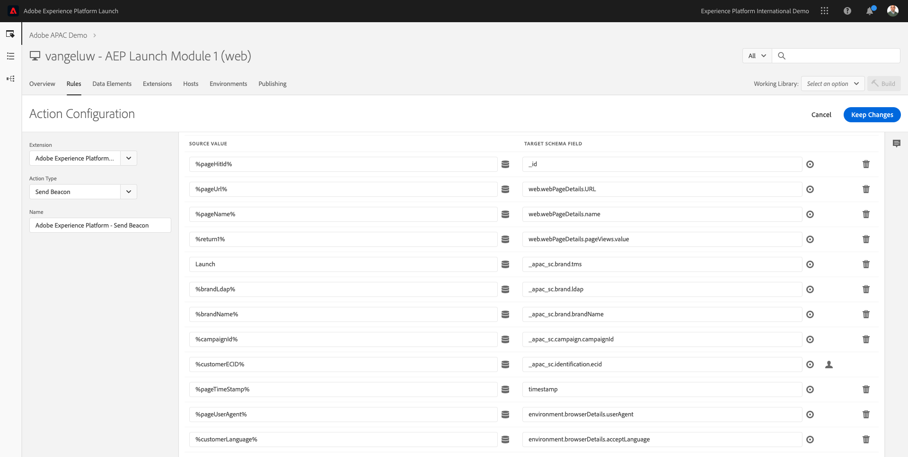

# Exercise 4 - Use Launch and the Adobe Experience Platform Extension

In this exercise, you'll use an existing Launch property and update 1 Launch Rule to capture customer behavior and send it to Adobe Experience Platform using the new Adobe Experience Platform extension.

The URL to login to Launch is: [https://launch.adobe.com](https://launch.adobe.com)

## Story

After defining what the answer to the questions ```Who is this customer?``` and ```What does this customer do?``` should look like and creating a bucket to hold the data as answers, you should make sure that that data can be sent somewhere in real-time so that it can be consumed in real-time by Adobe Experience Platform.
To send data to Adobe Experience Platform, you'll use Launch.

## Exercise 4.1 - Find your Launch Property

Log in to Launch by going to this URL: [https://launch.adobe.com](https://launch.adobe.com)



In the list of Launch Properties, you'll see a Launch property that is named ``AEP Launch Module 1``.

Locate that Launch Property and click it to open it. After opening it, you'll see this:



## Exercise 4.2 - Explore the Adobe Experience Platform Extension for Launch

From the Launch menu, click on ``Extensions``. You'll see these 4 Extensions already configured. Let's have a quick look at the ``Adobe Experience Platform``-extension.



The goal of this exercise is not to fully configure a Launch property, instead the goal is to zoom in on what needs to happen in Launch to easily ingest data into Adobe Experience Platform. Several extensions, data elements and rules are already prebuilt into your Launch property.

Click the ``Configure``-button on the Adobe Experience Platform - extension to open it.



What you see here is the DCS Streaming Endpoint. The DCS Streaming Endpoint is a ``door`` on the Adobe Pipeline. The Adobe Pipeline is built on Apache Kafka. With this Launch extension, data will be sent directly from the website onto the Adobe Pipeline in real-time.

This DCS Streaming Endpoint expects data to be modeled in the XDM Standard. Let's now have a look at how you can use Launch to map client-side data elements to an XDM-Schema, by making use of a rule.

## Exercise 4.3 - View Rule: All General Pages

In the Launch Menu, click on ```Rules```.

In the ```Rules``` - screen, you'll find several already partially configured Launch Rules.



Open the ``All General Pages``-rule that sends a beacon to Adobe Experience Platform.

Click the ```All General Pages``` - rule to open it.



As you can see, the Event and Condition to trigger the rule are already defined, and also 3 actions.

Open the ```Action``` named ``Adobe Experience Platform - Send Beacon``.

You'll then see this:



You can see that the dataset that is selected here is **AEP Demo - Website Interactions**, similar to the one you created in the previous exercise.

You can also see the Schema Mapping. In Schema Mapping, these fields have been connected to each other. The ``Source Value`` refers to a Data Element in Launch, while the ``Target Value`` refers to an XDM field, just like the fields you defined in the previous exercises.

| Source Value                 | Target Schema Field               |
|:-------------------------------------------| :------------------ |
|%pageHitId%|_id|
|%pageName%|web.webPageDetails.name|
|%pageTimeStamp%|timestamp|
|%return1%|web.webPageDetails.pageViews.value|
|%pageUserAgent%|environment.browserDetails.userAgent|
|%customerLanguage%|environment.browserDetails.acceptLanguage|
|%customerECID%|\<aepTenantId\>.identification.ecid|



Click ```Cancel``` to leave this configuration without changing it.

This gives you an idea on how data is collected from a website and ingested into Adobe Experience Platform, in the XDM-language.

---

Next Step: [Exercise 5 - Data Ingestion from Offline Sources](./ex5.md)

[Go Back to Module 1](./README.md)

[Go Back to All Modules](../../README.md)
