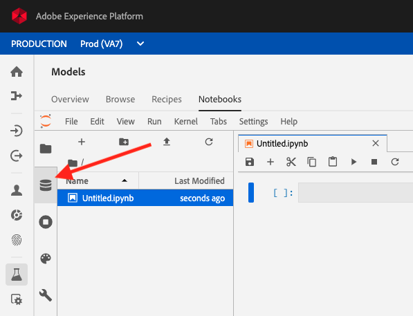

# 10.2 Churn Prediction: Data Preparation

## Open Adobe Experience Platform and Jupyter Notebooks

To start preparing data for modeling, we must first read the data into Data Science Workspace. To do that, let's go to Adobe Experience Platform. you can login in Adobe Experience Platform by going here: [https://platform.adobe.com](https://platform.adobe.com)

After logging in with your Adobe ID, you'll be on the homepage of Adobe Experience Platform.


From the menu on the left side, select **Models**.


In **Models**, click on **Notebooks**.


Jupyter Notebooks will then start loading, which might take 2-3 minutes.


Finally, you'll be able to work with Jupyter Notebooks.


Jupyter Notebooks is an open-source standard data science tool where one can write code in languages like Python, Pyspark, Spark and R.

Let's open a blank Python 3 notebook by clicking this button:


Once the Python 3 notebook is opened, you should see this:


## Reading a dataset in Python

An Adobe Experience Platform dataset can be easily read in Python from a Jupyter Notebook in Data Science Workspace.
First, click on the datasets icon in Jupyter Notebooks.



Double-click on **Datasets**.


You'll then see a list of datasets.
In the list of datasets, search for the dataset named **EMEA DSW - Churn Input Data**.


Next, double-click on the dataset name **EMEA DSW - Churn Input Data**. Jupyter Notebooks will now automatically generate the code needed to read this data from Adobe Experience Platform into this Python notebook.


Note: The limit in the code snippet is 100. Only 100 values will be read into the data when you execute this code. You can increase the number of records to 200000. The code now should look like

```python
from platform_sdk.dataset_reader import DatasetReader
from datetime import date
dataset_reader = DatasetReader(PLATFORM_SDK_CLIENT_CONTEXT, dataset_id="5dd2ee272a371e18a8fa7ebd")
df0 = dataset_reader.limit(200000).read()
df0.head()
```


Execute the code by clicking the play button at the top of the Jupyter notebook. Executing this code will take several minutes.
While the code is running, you should wait until it's finished.
You can see that an action is ongoing by verifying the Python status at the top right of your notebook.

This indicated that a cell is running:


When the action is finished, you'll see this:


The result of executing the cell and loading the data from that dataset is that you now have a data-frame (df0) available that contains data.


Before going further with data exploration, we need to import certain libraries.

In your Jupyter notebook, click the **+** - button to create a new, empty cell.


You'll then have a new, empty cell.


Copy the below code snippet and paste it in your new, empty cell.

```python
import warnings
warnings.filterwarnings('ignore')
from subprocess import check_output
import logging
logger = logging.getLogger()
logger.setLevel(logging.CRITICAL)
import seaborn as sns
from numpy import median
import matplotlib.pyplot as plt
%matplotlib inline
```


Execute the code by clicking the play button at the top of the Jupyter notebook.


After executing the cell, you'll see a new empty cell being created.


Next, we want to have a look at the summary stats for all the numerical variables. This is done using the **describe()** function.

Copy the below code snippet and paste it in the new, empty cell.

```python
df0.describe()
```


Execute the code by clicking the play button at the top of the Jupyter notebook.


The result will look like this:


## Loading notebooks

For the next exercises, we'll use Jupyter notebooks that have been prepared for you already.
Download the zip-file located [here](./resources/dsw-mod10.zip) and unzip its content to the desktop of your computer.


Open the folder **dsw**. In this folder, you'll find 3 notebooks.


You need to select these 3 notebooks and drag them into Jupyter Notebooks.


Once all 3 notebooks appear in Jupyter Notebooks, you can continue with the next step.


Open the notebook **Mod10 - Data Exploration.ipynb**.


Execute all cells one by one. The code outlines steps to explore data, build visualizations and gain insights about your data.

Next Step: [10.3 Feature Engineering and Model Building](./ex3.md)

[Go Back to Module 10](./data-science-workspace-churn-prediction-model.md)

[Go Back to All Modules](../../overview.md)
