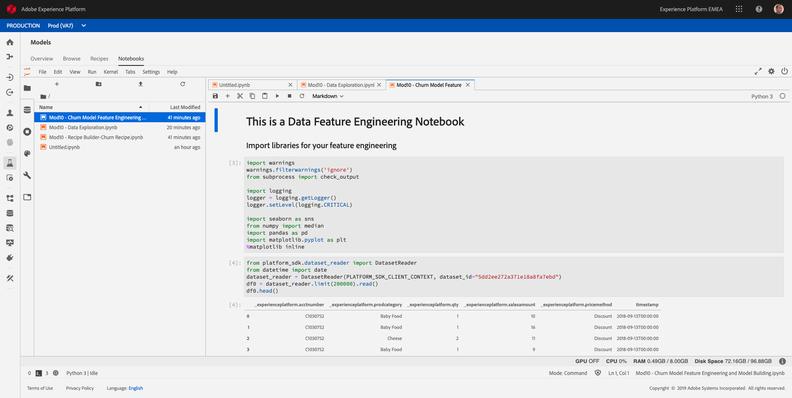

# 10.3 - Feature Engineering and Model Building

In this exercise, a Data Scientist creates the Target variable and create some independent, explanatory variables to add as inputs to the model.

Open the notebook **Mod10 - Churn Model Feature Engineering and Model Building.ipynb**.

Execute all cells one by one. The cells detail steps to explore data, build visualizations and gain insights about your data.

Follow the step by step process for model building. Notice the independent variables like number of orders and revenue metrics created for the observation time period.

Two models are outlined in this ExerciseLogistic Regression and Random Forrest Regressor. Depending on the accuracy of the model, one can choose the model and use it to score the data set and build recipe.

Next Step: [10.4 - Experimentation - Recipe Building](./ex4.md)

[Go Back to Module 10](./data-science-workspace-churn-prediction-model.md)

[Go Back to All Modules](../../README.md)
