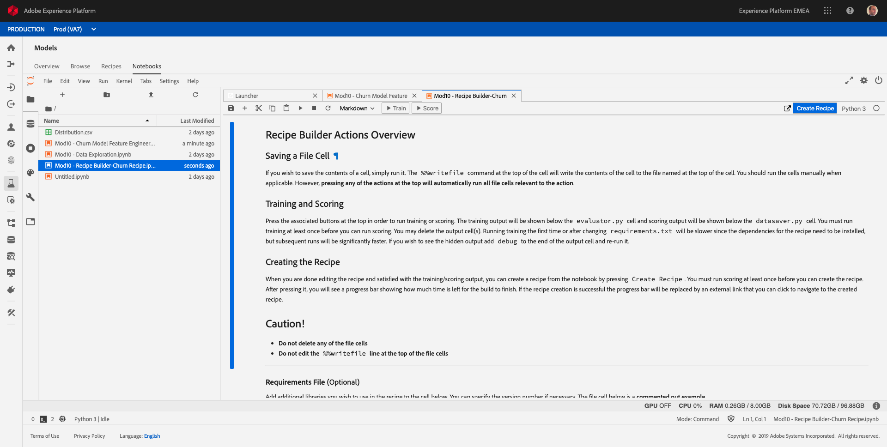
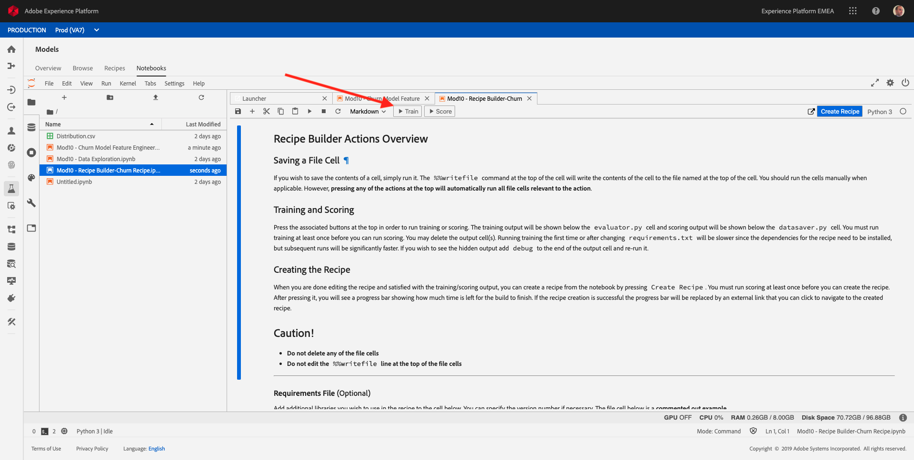
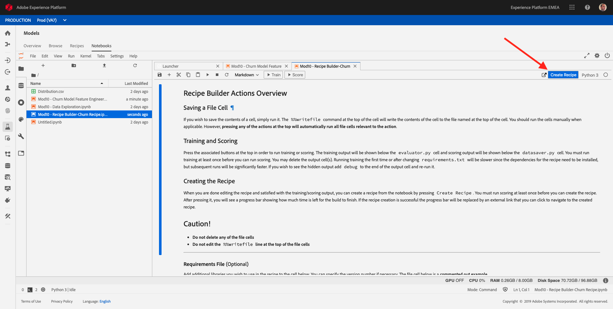
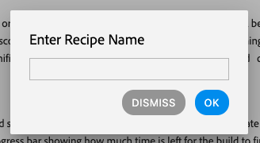
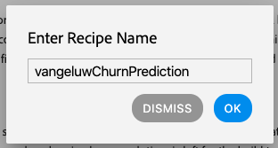
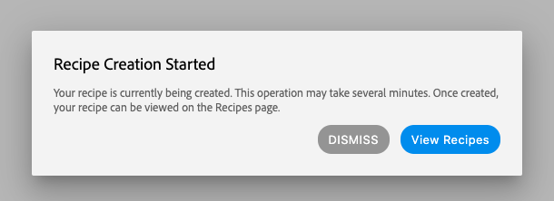
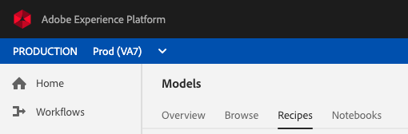
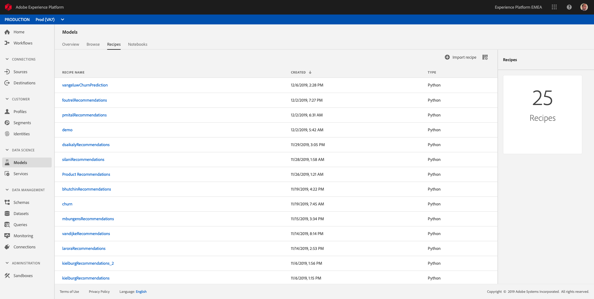

# 10.4 Experimentation - Recipe Building

## What is a Recipe

A recipe is a proprietary algorithm or an ensemble of algorithms to help solve a specific business problem.

The feature engineering and model that you have prepared in the previous exercises can be converted into a recipe which can be used to train multiple datasets by changing a set of hyper-parameters, like the learning rate, estimators, etc. to evaluate which training run gives the maximum accuracy and recall.

Open the notebook **Mod10 - Recipe Builder-Churn Recipe.ipynb**.

Notice that the recipe has all the feature engineering code used to build the model from previous exercises.

The recipe has 3 parts for execution - Train, Score and Create Recipe. You should be able to view these options once you open the above code.

## Train the model

Click on Train - This will take a few minutes to complete. Once you see **TRAINING SUCCESSFUL!** in your file, you can move to the next step.

## Score the model

Click on Score - Wait until you see scoring successful and you see an output of the data with the scores.Once you see **SCORING SUCCESSFUL!** in your file, you can move to the next step.

## Create a recipe from the model

When you are satisfied with the outputs of training and scoring, you can create a recipe. Click the **Create Recipe** button to start the process.

Creating a recipe enables you to test your model at scale.

After clicking the **Create Recipe** button, you have to enter a name for your recipe.

As a naming convention, please use:

* **ldap**ChurnPrediction

Replace **ldap** with your ldap.

Example: for ldap **vangeluw**, the name of your recipe should be: **vangeluwChurnPrediction**.

After entering a Recipe Name, click **OK**.

A second popup is shown, telling you that your Recipe is being created. This could take up to 5 minutes, please wait until the process finishes.

For now, click the **Dismiss** button.

You can view the progress of the recipe creation process in the top right corner of Jupyter Notebooks.

...

After a couple of minutes, the recipe creation is finished and you can find your recipe in the **Recipes** - section. To go there, click on **Recipes** in the ML Models menu.

You'll find your recipe in the list.

From this list, your Recipe can be used to experiment but no coding is required beyond this stage anymore.

[Go Back to Module 10](./data-science-workspace-churn-prediction-model.md)

[Go Back to All Modules](../../overview.md)
