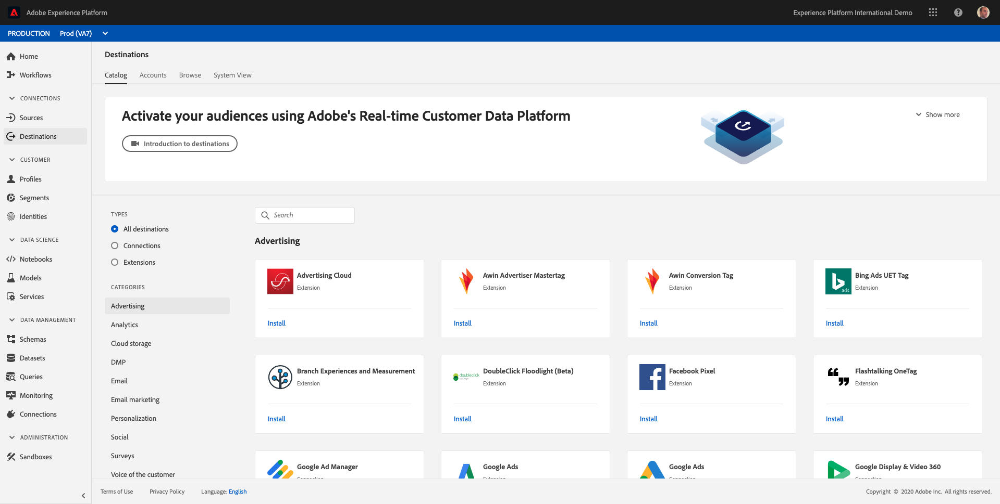
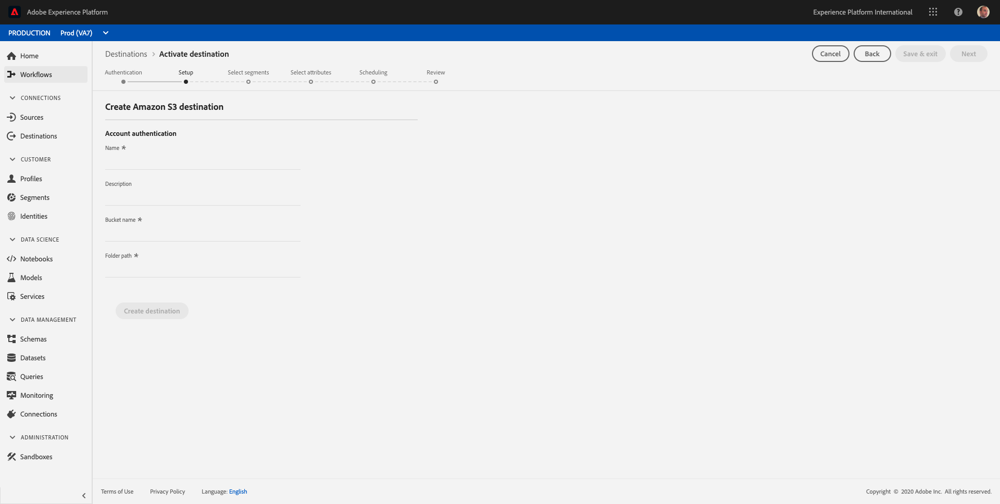
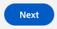
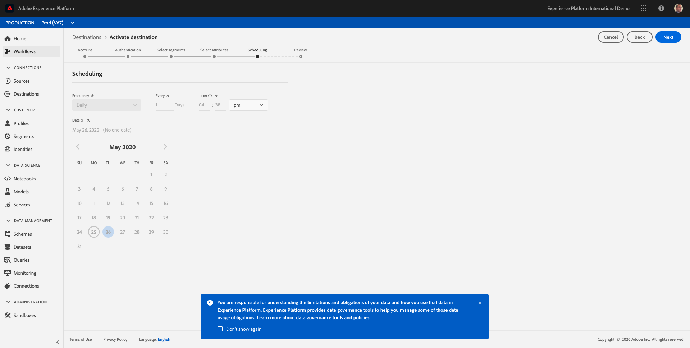
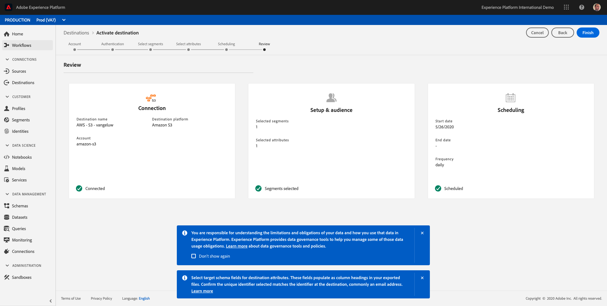

# 11.5 Take Action: send your segment to an S3-destination

Adobe Experience Platform also has the ability to share Audiences to Email Marketing Destinations such as Salesforce Marketing Cloud, Oracle Eloqua, Oracle Responsys and Adobe Campaign.

You can use FTP or SFTP as part of the dedicated destinations for each of these Email Marketing Destinations, or you can use AWS S3 to exchange lists of customers between Adobe Experience Platform and these Email Marketing Destinations.

In this module, you'll configure such a destination by making use of an AWS S3 bucket.

Log in to Adobe Experience Platform by going to this URL: [https://platform.adobe.com](https://platform.adobe.com)

After logging in, you'll land on the homepage of Adobe Experience Platform.

Before you continue, make sure you are in the `Production Prod`-environment in the blue line on top of your screen.

In the left menu, go to **Destinations**.

You'll then see the **Destinations** homepage.

Select the type **Connections**.

Click on **Amazon S3** and then click on **+ Connect Destination**.

Select **New Account** as Account Type. Please use these credentials to connect to the S3 bucket:

| Access Key ID             | Secret Access Key             |
|:-----------------------:| :-----------------------:|
| AKIA3EIEWDZXSSDIAWK5D |Cm5Ln5yWDgBGHNGj0osDvaCtvmAL3EdXAF38jiSfvo|

Click **Connect to destination**.

You'll then see a visual confirmation that this destination is now connected.

Click **Next**.

On the next screen, you have to provide a name and folder so that Adobe Experience Platform can connect to the S3 bucket.

As a naming convention, please use the following:

| Access Key ID             | Secret Access Key             |
|:-----------------------:| :-----------------------:|
| Name |AWS - S3 - ldap, replace **ldap** with your ldap.|
| Description |AWS - S3 - ldap, replace **ldap** with your ldap.|
| Bucket Name |aepsfmc|
| Folder Path |arn:aws:s3:::aepsfmc|

Click **Create Destination** to create your connection.

You'll see a confirmation that the destination has been created.

Click **Next**.

After creating the destination, you can select segments to send to your AWS S3 destination.

In the list of segments, search for the segment you created in 1 and select it.

Click **Next**.

You can now select attributes for the export towards AWS S3. Click **+ Add New Field**.

Click the icon as indicated in the screenshot to open the Union Schema with all available fields.

In the popup, you'll see the Union Schema and you can select any field from the Union Schema to include it in the export. In this example, the field **personalEmail.address** is selected to be part of the export.

Click **Select** to add the field.

You can add as many fields as required.

Once you've added all fields, click **Next**.

The export to AWS S3 will run once every 24 hours.

Click **Next**.

Review your configuration.

Click **Finish** to finish your configuration.

You'll then be back at the Destination Activation screen and you'll see your segment added to this destination.

if you'd like to add more segment exports, you can click **Edit Activation** to restart the process and add more segments.

Next Step: [11.6 Take Action: send your segment to Adobe Target](./ex6.md)

[Go Back to Module 11](./real-time-cdp-build-a-segment-take-action.md)

[Go Back to All Modules](../../overview.md)
