# 11.6 - Take Action: send your segment to Adobe Target

Adobe Experience Platform also has the ability to share Audiences directly with the Adobe Experience Cloud Core Service **People - Audience Library**.

This means that all segments built in Adobe Experience Platform will popup in the Experience Cloud Core Service **People - Audience Library**.

Go to the Adobe Experience Cloud homepage by going to [http://experiencecloud.adobe.com/](http://experiencecloud.adobe.com/).

Open the menu by clicking the **nine dots**-icon in the upper right corner of your screen. Then click **People** in the menu.

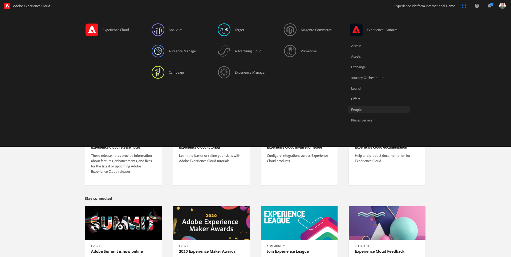

On the next page, you'll see the **Audience Library**, which will show all available segments, including the Adobe Experience Platform segments. You can also see the segment you created in 1.

Now that all Adobe Experience Platform segments are available in the Adobe Experience Cloud **Audience Library**, this also means that they can be used by Adobe Experience Cloud solutions for activation.

Let's go back to the Adobe Experience Cloud homepage by going to [http://experiencecloud.adobe.com/](http://experiencecloud.adobe.com/).

Click **Adobe Target** to open it.

On the **Adobe Target**-homepage, you'll see all existing Activities.

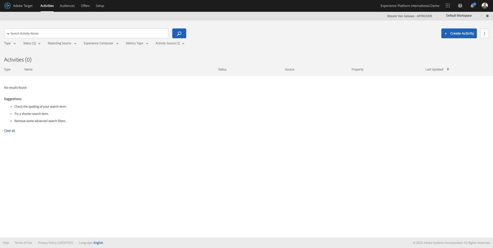

Click **+ Create Activity** to create a new Activity.

Select **Experience Targeting**.

>[!IMPORTANT]
> Due to the nature of the SYTYCD website, which always redirects every visit to the Admin-page, it's important to already have the SYTYCD website open and your brand already selected in another tab in the same browser-window as the one where you're going to define your Adobe Target Activity. If you don't have the Brand already selected in another tab in the same browser window, you won't be able to continue with the next step.
>
>[!IMPORTANT] Fill out the details, like the **Activity URL**. **TIP** Adobe Target doesn't like localhost connections, so for this use-case, please use [https://platformdemo.net](https://platformdemo.net) -related web pages as Activity URL

Click **Next**.

You're now in the Visual Experience Composer, and should see the SYTYCD-website with the Brand that you already selected.

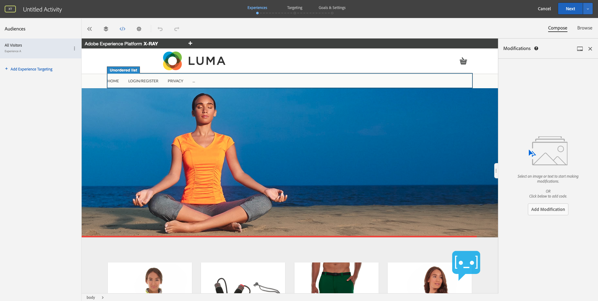

The default audience is currently **All Visitors**. Click on the **3 dots** next to **All Visitors** and click **Change Audience**.

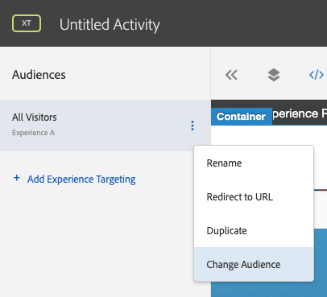

You're now seeing the Adobe Experience Cloud **Audience Library**, and all Adobe Experience Platform segments are part of this list. Select the segment you previously created in Adobe Experience Platform.

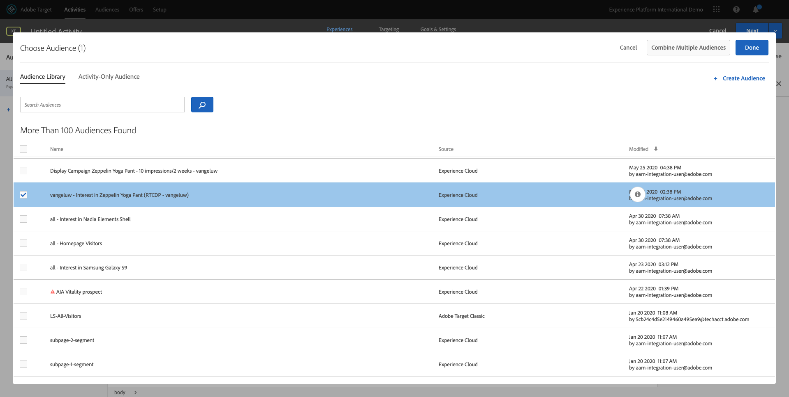

Click **Done**.

Your Adobe Experience Platform segment is now part of this Experience Targeting Activity.

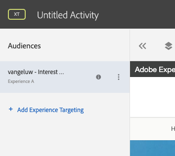

Let's now change the Hero Image. Click the Hero Image, go to **Replace Content**, then click **Image**.

You'll then see all available images. Pick an image.

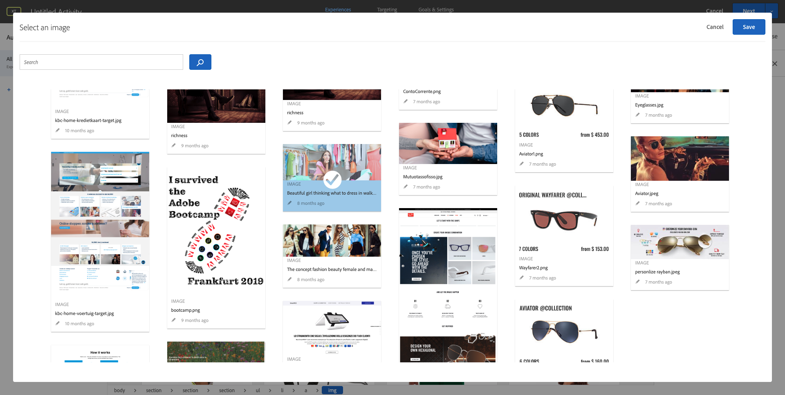

Click **Save**.

You'll then see the new experience with the new image, for your selected Audience.

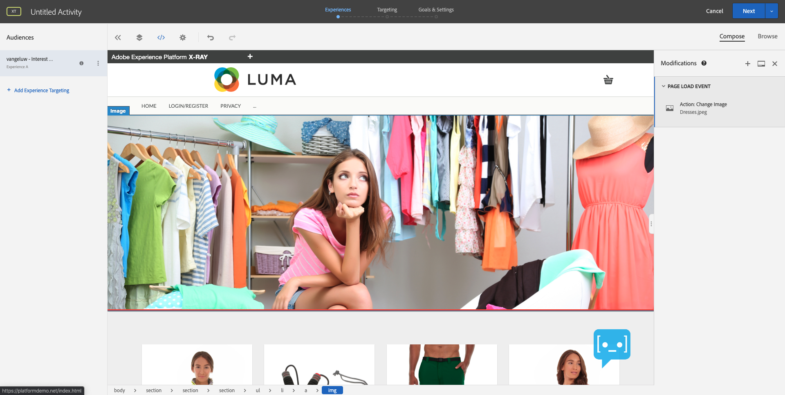

Click the title of your Activity in the upper left corner to rename it.

As a naming convention, we'll use:

* ldap - Module 11 - XT

Replace **ldap** with your ldap.

Click **Next**.

On the next screen, click **Next**.

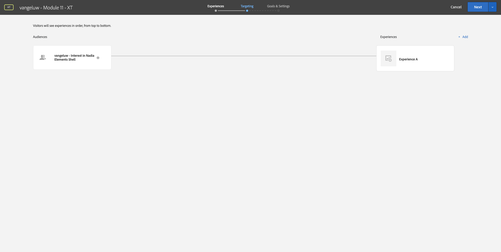

On the **Goals & Settings** - page, go to **Goal Metrics**.

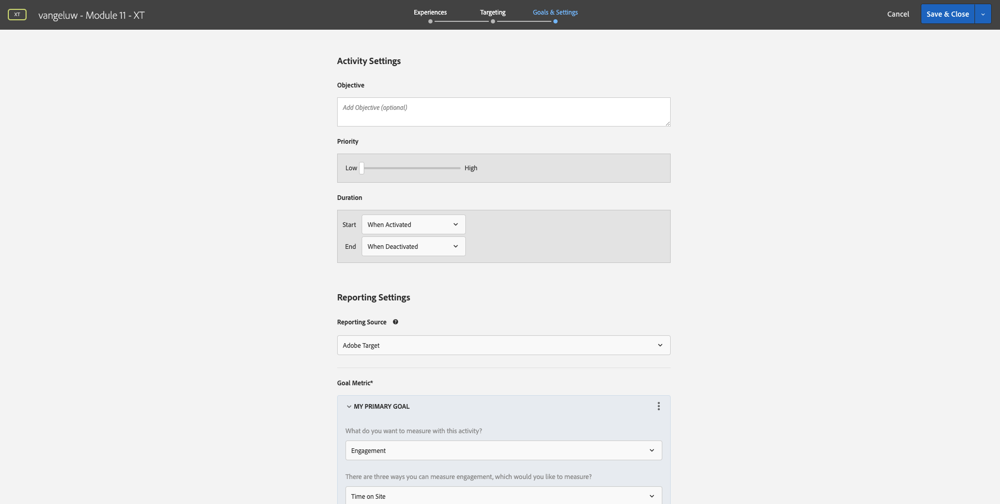

Set the Primary Goal to **Engagement** - **Time On Site**.

Click **Save & Close**.

You're now on the **Activity Overview**-page.

You still need to activate your Activity.

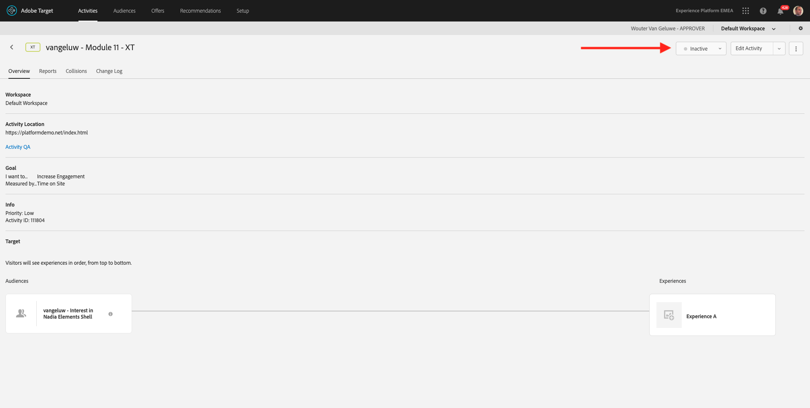

Click on the field **Inactive** and select **Activate**.

You'll then get a visual confirmation that your activity is now live.

[Go Back to Module 11](./real-time-cdp-build-a-segment-take-action.md)

[Go Back to All Modules](../../README.md)
