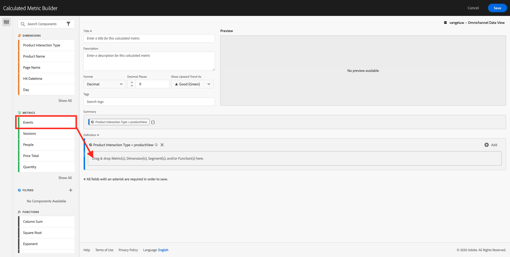
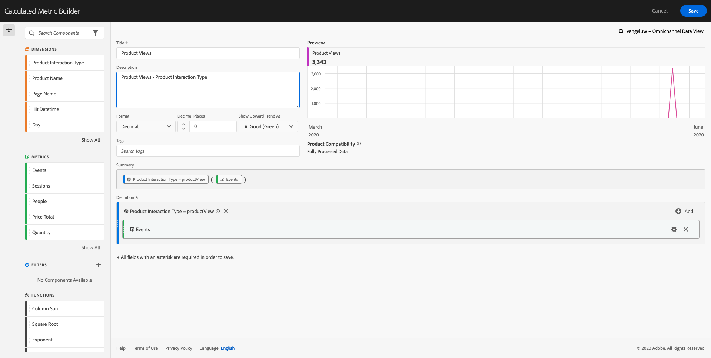
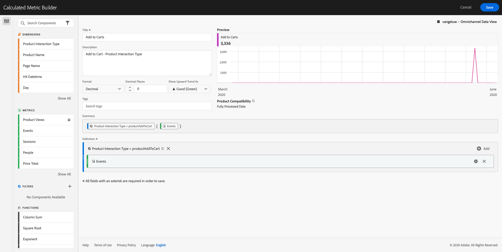
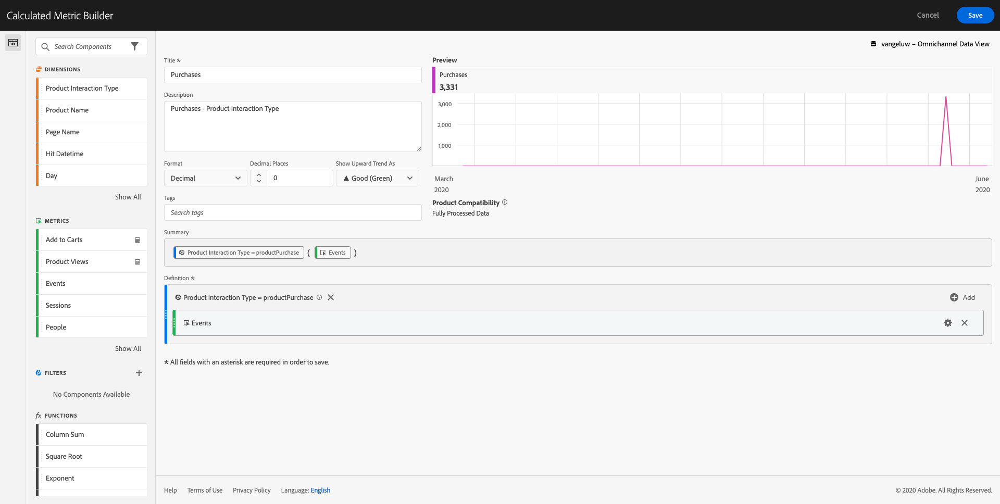
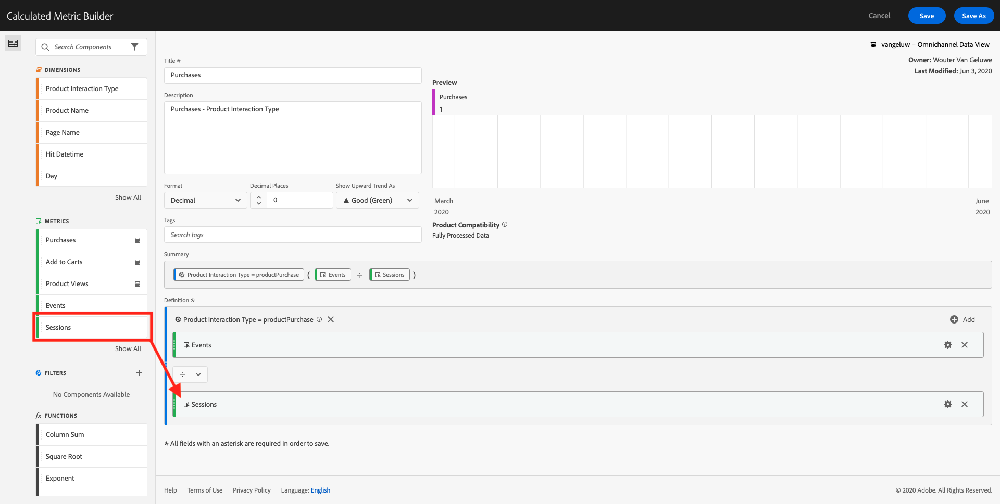

# Exercise 13.4 - Data preparation in Analysis Workspace

## Objectives

* Understand the Analysis Workspace UI in CJA
* Understand the concepts of data preparation in Analysis Workspace
* Learn how to do data calculations

## Exercise 13.4.1 Analysis Workspace UI in CJA

Analysis Workspace removes all of the typical limitations of a single Analytics report. It provides a robust, flexible canvas for building custom analysis projects. Drag-and-drop any number of data tables, visualizations, and components (dimensions, Metrics, segments, and time granularities) to a project. Instantly create breakdowns and segments, create cohorts for analysis, create alerts, compare segments, do flow and fallout analysis, and curate and schedule reports for sharing with anyone in your business.

Customer Journey Analytics brings this solution on top of AEP data. We highly recommend to watch this 4 minute video of CJA overview: [https://www.youtube.com/watch?v=Y2Jo43NM-Oo
](https://www.youtube.com/watch?v=Y2Jo43NM-Oo)

If you haven't use Adobe Analytics before, we highly recommend to watch this video: [https://www.youtube.com/watch?v=IHOy-QsvVcA
](https://www.youtube.com/watch?v=IHOy-QsvVcA)

### Create Your Project

Now it's time to create your first CJA project. Go to the projects tab inside of CJA.


Click on create a new project.


You'll then see an empty project.


First, make sure to select the correct Data View in the upper right corner of your screen. In this example, the Data View to select is ``vangeluw - Omnichannel Data View``.


Next, you'll save your project and give it a name. You can use the following command to save:

|  OS        | Short cut      |
| ----------------- |-------------|
| Windows | Control + S          |
| Mac | Command + S          |

You'll see this popup:


Please use this naming convenction:

|  Name       | Description     |
| ----------------- |-------------|
| ldap - Omnichannel Analysis| ldap - Omnichannel Analysis|

Next, click ``Save Project``.


## Exercise 13.4.2 Calculated Metrics

Although we have organized all the components in the Data View, you still need to adapt some of them, so that business users are ready to start their analysis.

If you remember, we didn't specifically bring in Metrics such us Add to Cart, Product View or Purchases into the Data View.
However, we do have a dimension called: ``Product Interaction Type``. So, let's derive these interaction types by creating 3 calculated Metrics.

Back in module 7, [Query Service](./../../modules/module7/README.md), you created a SQL query to get the interactions funnel:

**Query & Result**

```text
all=>
all=> select _experienceplatform.productData.productInteraction, count(*)
all-> from   emea_ee_dataset_api
all-> where  _experienceplatform.brand.brandName like 'Luma Telco'
all-> and    _experienceplatform.productData.productInteraction is not null
all-> group  by _experienceplatform.productData.productInteraction;

 productinteraction | count(1)
--------------------+----------
 productView        |     2260
 productAddToCart   |      554
 productPurchase    |      251
(3 rows)

all=>  
```

The goal in CJA is to avoid using SQL queries, but still have access to the same components using real analytics power through a User Interface.

### Product Views

Let's start with first Metric: ``Product Views``. Click on the ``+`` to create your first calculated Metric.


The ``Calculated Metric Builder`` will show up:


Within the components, on the left side, please search ``Product Interaction Type``.


Then drag and drop it in to the Calculated Metric's ``Definition`` canvas.

You'll now see a popup. In the popup, in the dropdown, find and select ``productView``.


Next, click ``Done``.


Now we must quantify this interaction. To do this select the Metric ``Events (occurences)``, then drag and drop it inside the filter. This will allow us to understand how many times the ``productView`` interaction has occurred.



To finish, add a name and description.

| Title         | Description |
| ----------------- |-------------|
| Product Views | Product Views - Product Interaction Type      |

You'll then see this:



Click ``Save`` to save your calculated Metric.


Next, repeat the same process for ``productAddToCart`` and ``productPurchase``.

### Add to Cart

| Product Interaction Type | Name         | Description |
| ----------------- |-------------| -------------|
| productAddToCart|Add to Carts | Add to Cart - Product Interaction Type     |

The Metric definition should look like this:



### Purchases

| Product Interaction Type | Name         | Description |
| ----------------- |-------------| -------------|
| productPurchase|Purchases | Purchases - Product Interaction Type     |

The Metric definition should look like this:



Don't forget to ``Save`` each Calculated Metric.


### Conversion Rate

To finish this exercise, let's create a last calculated Metric: ``Conversion Rate``.

Find the ``Purchase`` Calculated Metric we've just created in the list of Metrics in the left side menu. Click on the ``info``-icon.


Now click on the ``edit``-icon.


Typically, conversion rate means ``Conversions / Sessions``. So let's do the same calculation in the calculated Metric definition canvas. Find the ``Sessions``-metric and drag and drop it into the definition builder.



Notice that the division operator is automatically selected.


The conversion rate is commonly represented in percentage. So, let's change the format to be percentage and also select 2 decimals.


Change the name and description:

| Name         | Description |
| ----------------- |-------------|
| Conversion Rate | Conversion Rate - Product Interaction Type      |


Now click ``Save As`` to save your new Calculated Metric without overwriting the original one..


## Exercise 13.4.3 Calculated Dimensions: Filters (segmentation) & Date Ranges

### Filters: Calculated Time Dimensions

Calculations are not meant to be only for Metrics. Before starting any analysis it's also interesting to create some ``Calculated Dimensions``. This basically meant ``segments`` back in Adobe Analytics. In CJA, these segments are called ``Filters``. The change on the name wants to avoid any confusion with Adobe Experience Platform audiencies / segments that at some point (roadmap) will be available as well in CJA.


Creating filters will help business users to start the analysis with some valuable calculated dimensions. This will automate some tasks as well as helping on the adoption part. Here are some examples:

1. Own Media, Paid Media,
2. New vs Returning visits
3. Customers with Abandoned Cart

As you can see, these filters can help to understand groups of values (1) and segments created directly in CJA (2 and 3).

These filters can be created before or during the analysis part (which you'll do in the next exercise).

### Date Ranges: Calculated Time Dimensions

Time Dimensions are another type of calculated dimensions. Some are already create, but you also have the ability to create your own custom Time Dimensions at the data preparation phase.

These Calculated Time Dimensions we will help analysts and business users to remember important dates and use them to filter and change the reporting time. Typical questions and doubts that come to our minds when we do analysis:

* When was Black Friday last year? 21th-29th?
* When did we run that TV campaign in December?
* From when to when did we do the 2018 Summer Sales? I want to compare it against 2019. By the way, do you know the exact days in 2019?


You've now finished the data preparation exercise using CJA Analysis Workspace.

Next Step: [Exercise 13.5 - Visualization using Analysis WorkSpace](./ex5.md)

[Go Back to Module 13](./README.md)

[Go Back to All Modules](./../../README.md)
