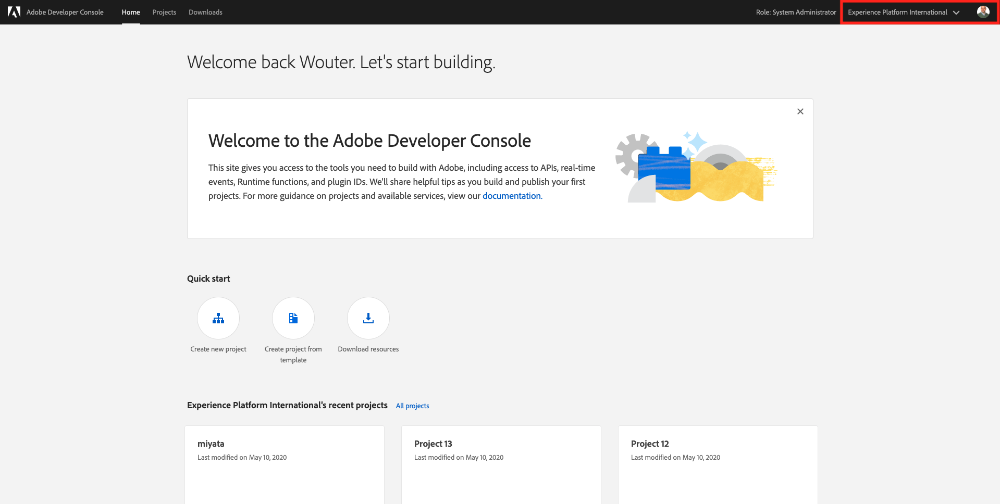
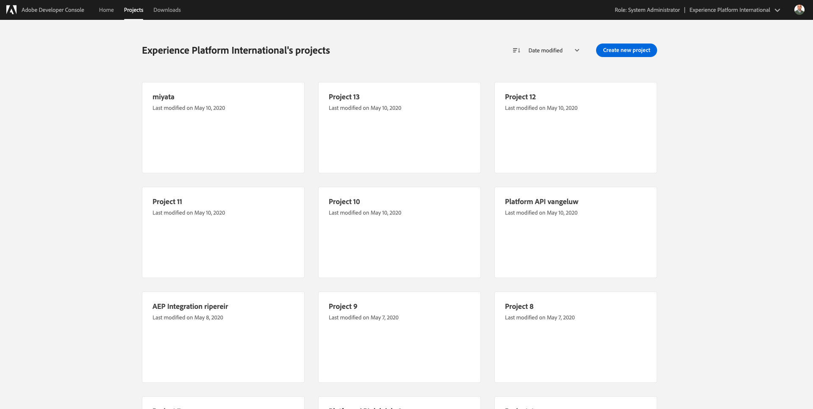
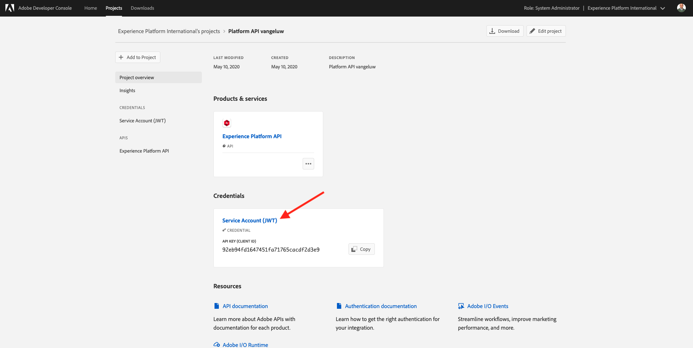
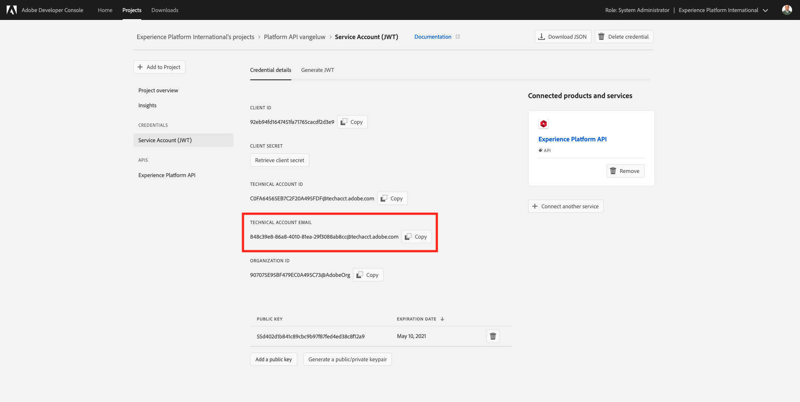

# Exercise 14.0 - Get Access to the Offers API

## Objectives

- In this exercise, you need to manually request access for your Adobe IO integration to be allowed to use the Offers APIs.

## Exercise 14.0.1 - Retrieve your Technical Account Email

Go to [https://console.adobe.io/home](https://console.adobe.io/home)

Be sure to verify you're in the ``Experience Platform International``-org.

Go to ``Projects``.

Scroll down to find your specific Adobe IO Integration.

Click your Adobe IO Integration to open it.

Once you've opened it, you'll see this:

Click ``Service Account (JWT)``.

Scroll down to locate the ``Technical Account Email``.

(Please don't mix this up with the Technical Account ID. For this to work, we require the ``Technical Account Email``.)

Copy the ``Technical Account Email``.

## Exercise 14.0.2 - Submit your Technical Account Email

In the ``SYTYCD``-Admin UI, click the menu option ``Technical Account Email``.

On the next page, paste your ``Technical Account Email`` in the input field.

Click ``Submit``.

You're now able to interact with the Offer APIs through your existing Adobe IO Integration. (You might have to request a new JWT Token in Postman to re-authenticate with the new Product Profile. You can do this in exercise 14.2)

[Next Step: Exercise 14.1 - Offers Decisioning Engine UI](./ex1.md)

[Go Back to Module 14](./README.md)

[Go Back to All Modules](../../README.md)
