# Exercise 14.1 - Offers UI

## Objectives

- Understand the Offers Decisioning Engine web based user interface.

- Learn how to define
  - containers,
  - placements,
  - decision rules,
  - personalised and fallback offers,
  - offer filters,
  - activities.

As mentioned before, not all of these concepts you can yet define through the UI.

To work through this and remaining exercises, you need to login to the Offers. To do this:

1. Go to https://experience.adobe.com and login with your Adobe ID and password.
2. Ensure you select **Experience Platform EMEA** as the organisation to work in.
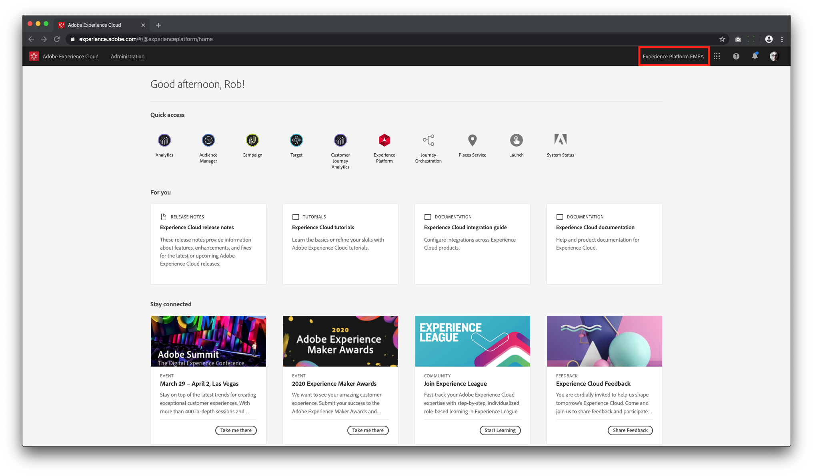
3. Click on the infamous nine-dots right of the organisation name to open the Adobe Experience Cloud rail, and select **Offers**.
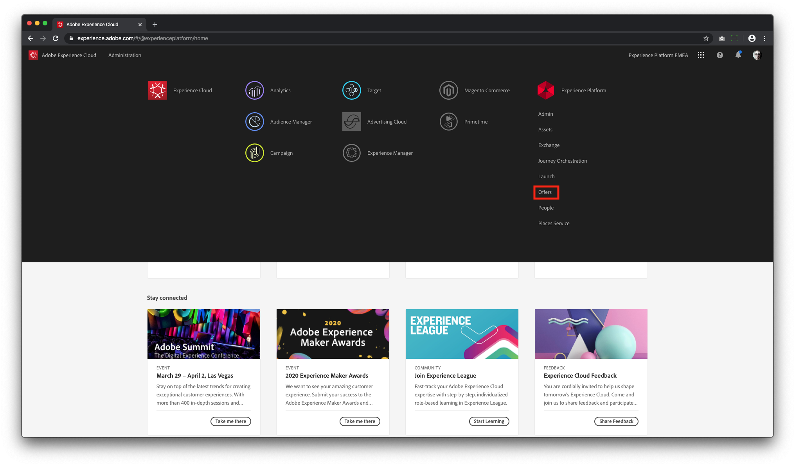
4. You will end up in the main screen of Offers, titled **Offer Library**

## Exercise 14.1.1 - Containers

You do all your definition of objects in Offers in the context of a container. You can have many containers that live alongside each other; in our lab we will only use one container, named **Decisioning**.

1. On the right top of the screen you will see a dropdown titled **Decisioning**.
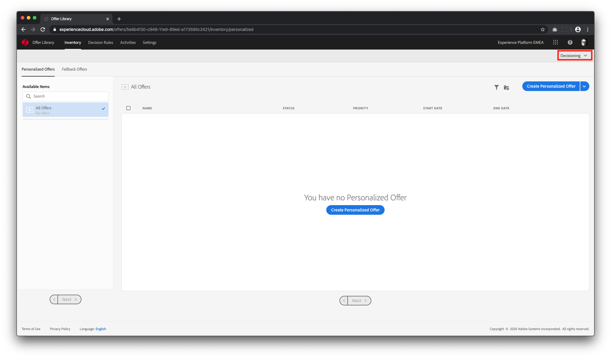
From this dropdown you could select the container to work in. In our environment, we only do have one container, titled **Decisioning** so there is nothing to pick from.

## Exercise 14.1.2 - Placements

In the **Settings** tab you can define your placements (context) for your offers. When you define an activity the placement defines where the resulting offer (personalized or fallback) will appear (channel) and in what shape or form (component type).

We have already defined placements for this lab but you can still inspect what is there. 
**Note**: Please do not change anything to the placements already available, as this might break the remainder of this lab not only for you but also for others.

To inspect a placement:

1. Click on **Settings** tab at the top of the main **Offers Library** screen.
2. Select **Placements** in the left rail. You will see the **Placements** list.

   1. Select the **Image for Email** entry.
   2. Click on the three dots (**...**) in the **Image for Email** enty.

   3. Click on **Edit**.
3. The **Edit Placement** screen shows and allows you to edit:
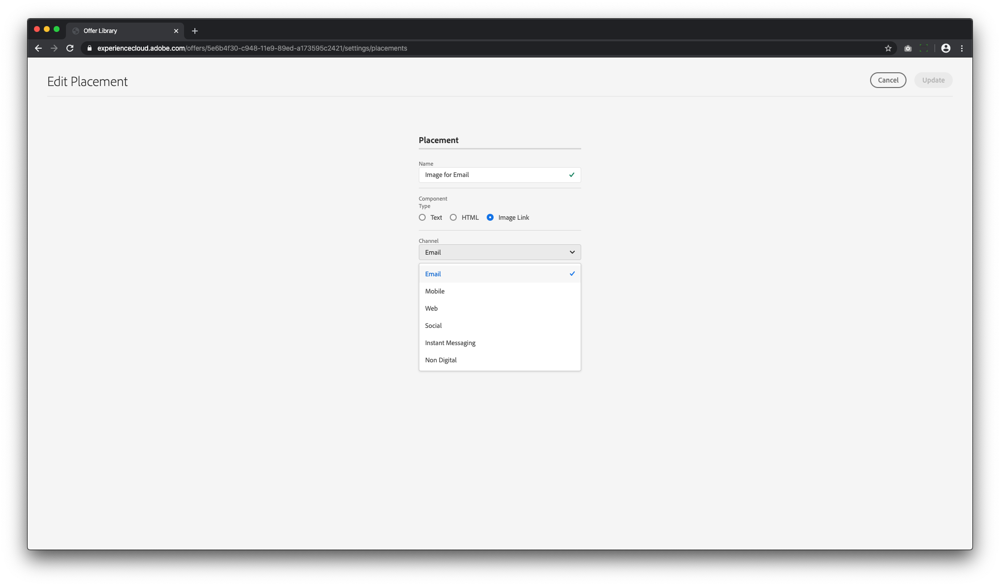
   1. The **Name** of the placement.
   2. The **Component Type** of the placement, which can be **Text**, **HTML** or **Image Link**.
   3. The **Channel** for the placement, which can be picked from a list.
   4. A **Description** field allowing to add additional description for the placement.
4. Click on **Cancel** to leave the placement definition unchanged.

## Exercise 14.1.3 - Decision Rules

A decision rule (or eligibility rule) is the defined equivalent to a **segment rule** you defined as part of AEP's UI. It is in fact a segment rule itself with the only difference that a decision rule can be teamed up with an offer to provide the best offer to a proile in AEP.

As you already know how to define these, we just quickly revisit the UI:

1. Click on **Decision Rules** at the top bar of the **Offer Library** screen.
2. In the **Decision Rules** screen, click on the three dots (**...**) in any of the decision rules already available, e.g. **Female Profiles**.
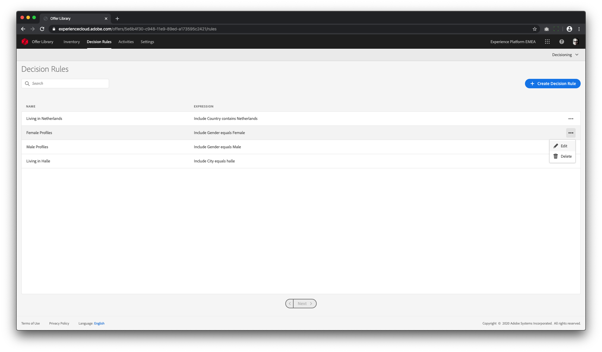
3. Click on **Edit**.
4. You will see the **Edit Decision Rule** screen which should look very familiar to you....
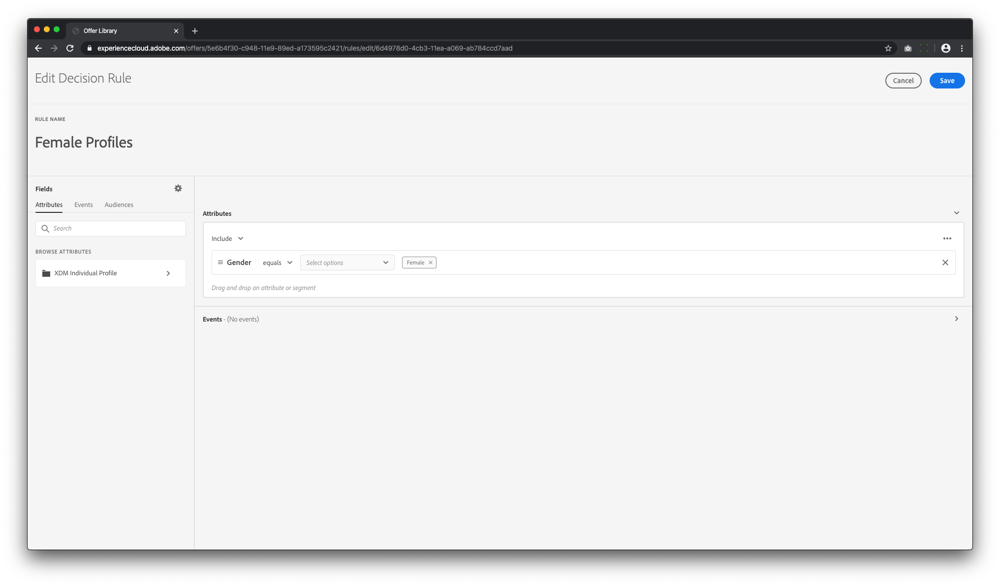

Also interesting to know, you can simply reuse already defined segments in Adobe Experience Platform, by going to **Audiences** > **Experience Platform**.

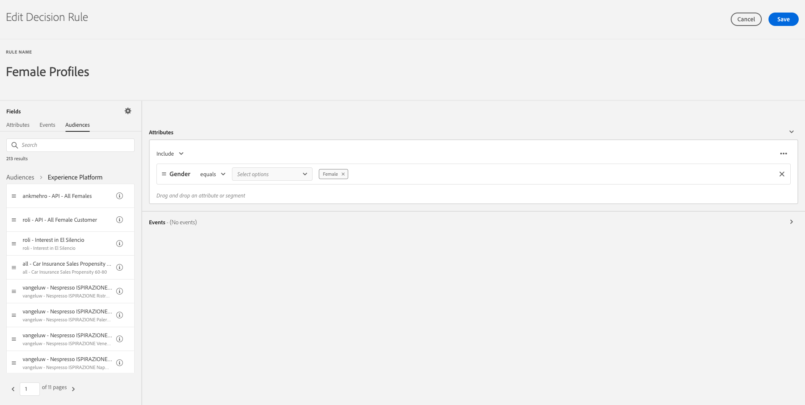

Click ``Cancel`` to go back to the previous screen.

## Exercise 14.1.4 - Create Offers

In this exercise you will create specific offers that only you will use in the remainder of this module.
**Note**: For this exercise and a proper working of the rest of the module, it is **very important** to identify your offers properly using your LDAP name. You will be instructed accordingly.

To do this:

1. Click on **Inventory** at the top of the main interface of **Offers Library**. You will see a screen with two tabs: **Personalized Offers** and **Fallback Offers**. Ensure the **Personalized Offers** tab is active.
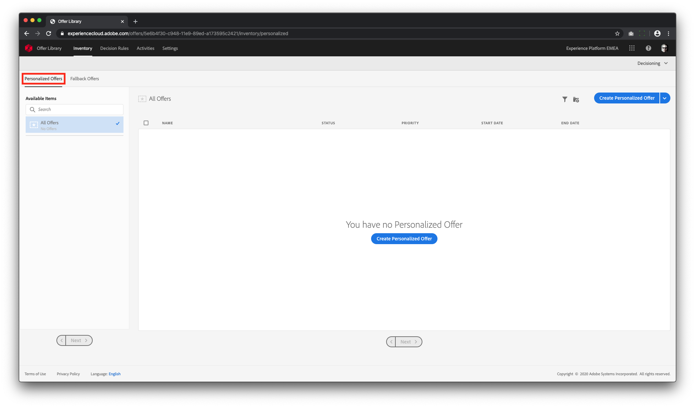
You might see offers defined by other participants in this module.
2. Click on **Create Personalized Offer** to create a new personalized offer. In the **Personalized offer** screen:
   1. Ensure the **Representations** tab is active (by default). Provide a name for your offer like: `ldap - El Paso Tank`, where `ldap` is your LDAP id, e.g. `rmaur - El Paso Tank`.
   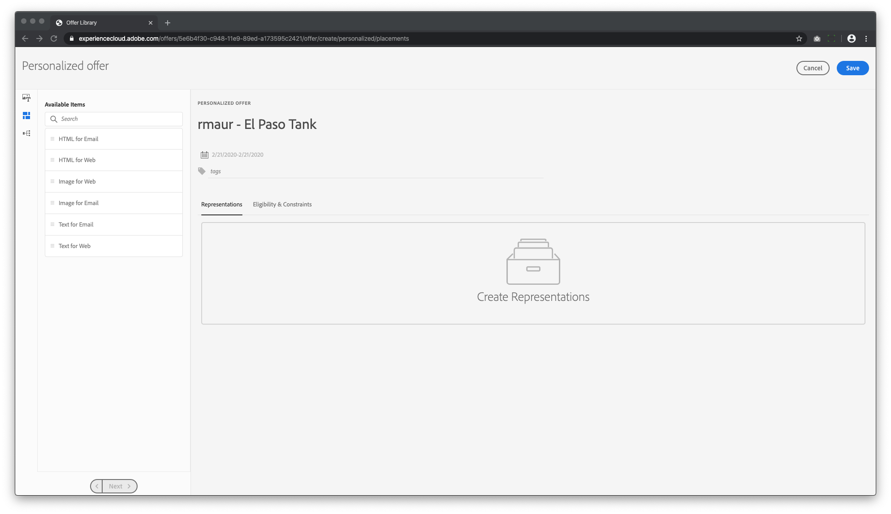
   2. Provide a date range by clicking on the calendar icon and specifying a relevant data range. **Note**: your offer will not be taken into account when you request the next best offer outside of this date range. Use today as a start data and a day one month in the future as the end date.
   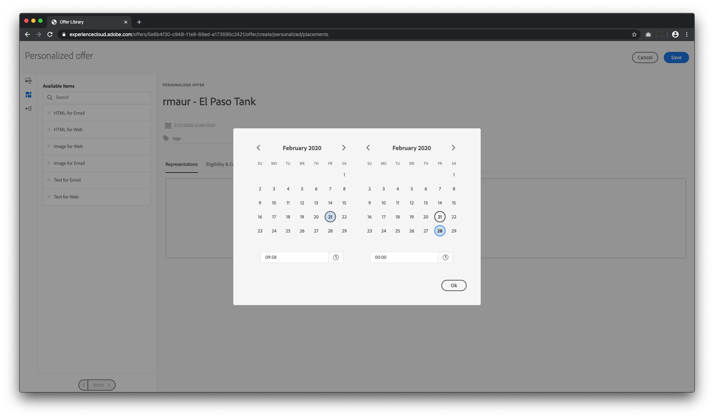
   3. Ensure you have selected the **Available Items** pane on the left rail (middle icon). Drag and drop **Image for Web** from the **Available Items** list into the **Create Representations** box.
   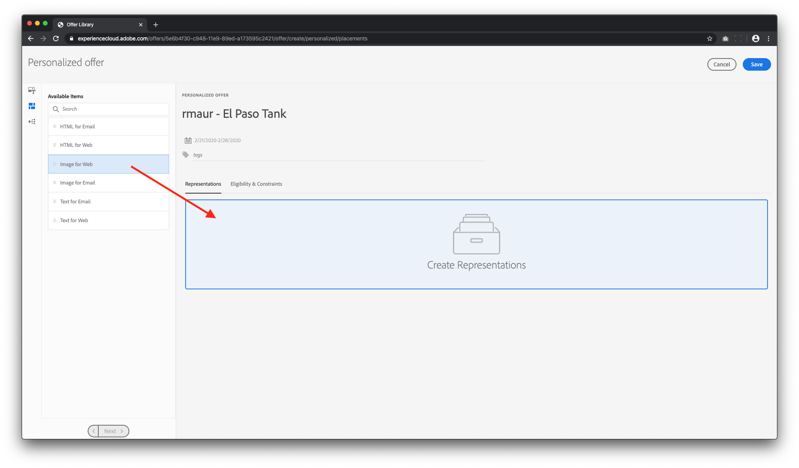
   Your screen will look like:
   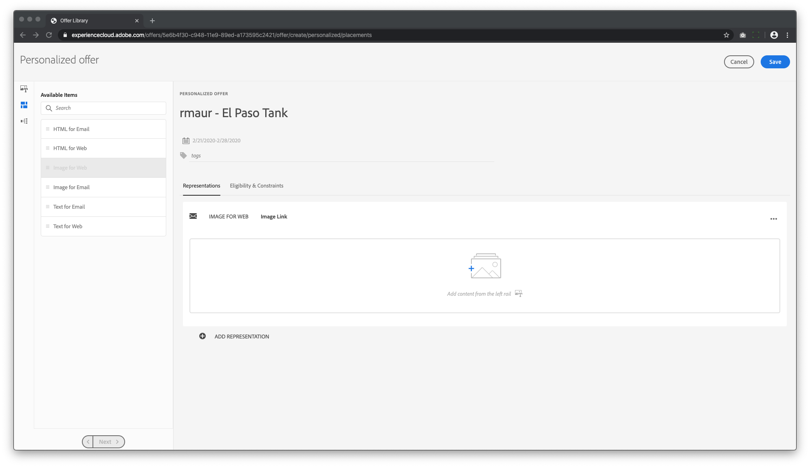
   4. Repeat step 3 but now for **Image for Email**. Drop **Image for Email** below the **IMAGE FOR WEB Image Link** box.
   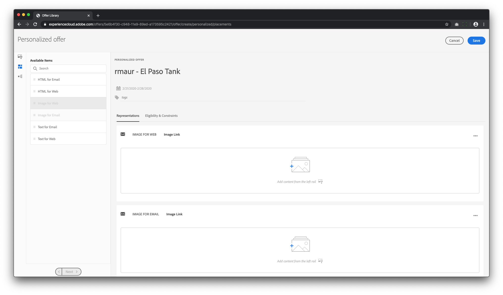
   5. Switch to the **Libray** pane (top icon) in the left rail. Here you can find the content for your offers. Double-click on **La Boutique** and then on **Offers**.
   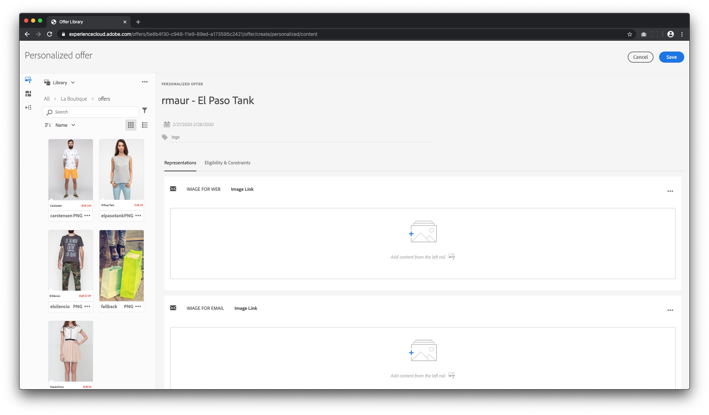
   6. Drag and drop the **elpasotank PNG** image and drop it onto the **Image for Web** container. Repeat this for the **Image for Email** container. For each container, also define the language as **en - English**.
   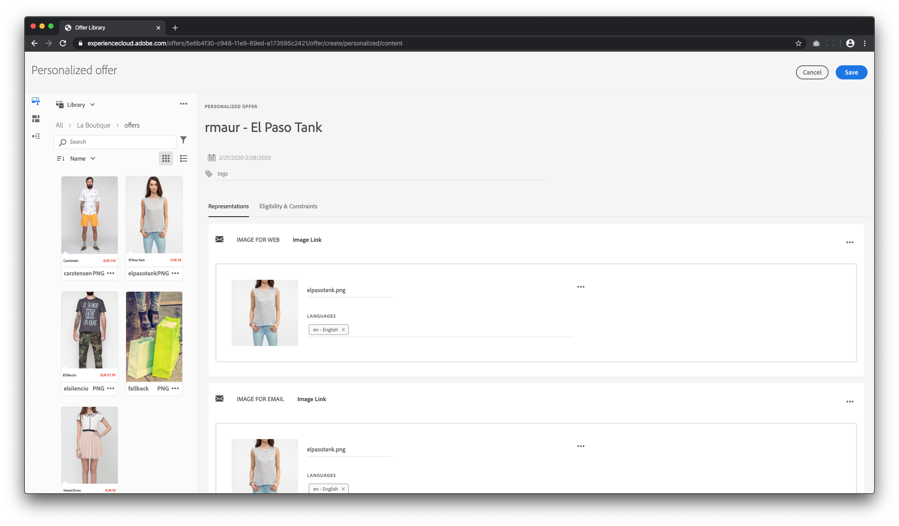
   7. Switch over to the **Eligibility & Constraints** tab. Set the **Priority** to any value you want. The value is considered from highest to lowest. E.g. set value to `25`.
   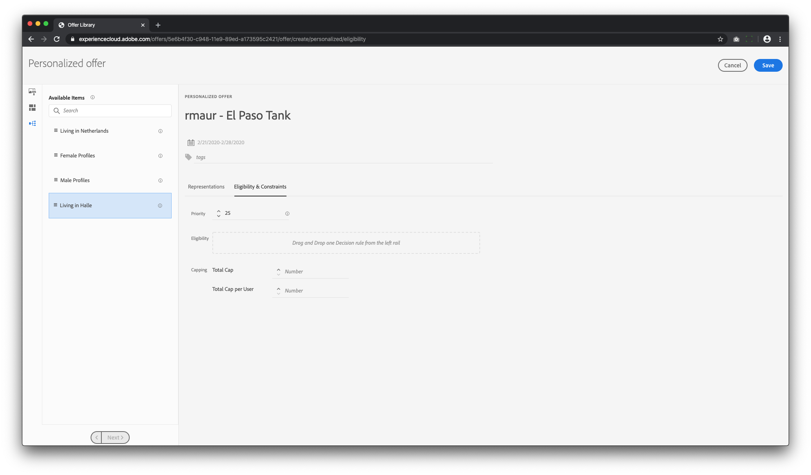
   8. Drag an drop **Female Profiles** into the **Eligibility** container.
   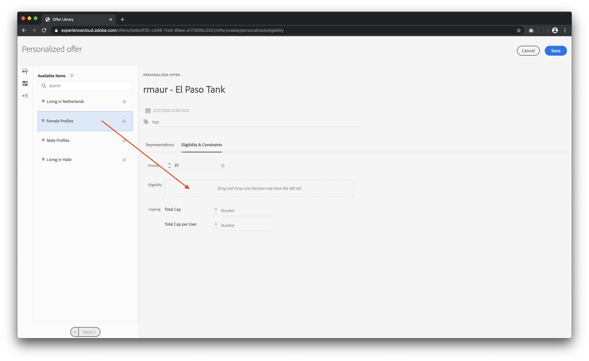
   Your screen should look like:
   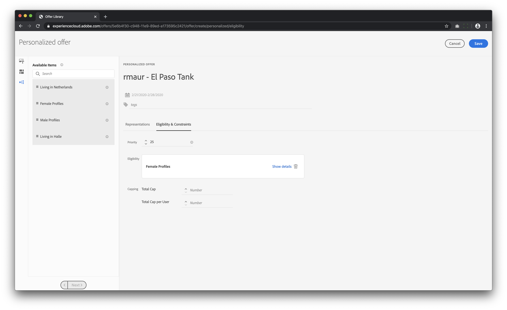
   9. Enter a **Total Cap** and a **Total Cap per User**; e.g. `100` and `10` respectively.
   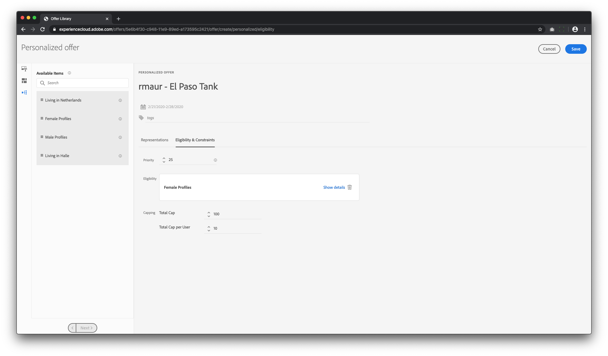
   10. Click **Save** to finish the definition of this offer. In the **Save offer** dialog, click on **Approve and Save** to save your offer.
3. Repeat all steps above for three other offers you need to create. See table below for all the data you need to provide for the four offers:

Name | Date Range | Image for Web / Email | Priority | Eligibility | Total Cap |  Cap/User | Language | Remark
---------|----------|---------|:-------:|---------|:-------:|:-------:|---------|---------
 *ldap* - El Paso Tank | now - 1 month later | elpasotank.png | 25 | Female Profiles | 100 | 10 | en-English | *already created as part of above exercise*
 *ldap* - Marais Dress | now - 1 month later  | maraisdress.png | 15 | Female Profiles | 100 | 10 | en-English |
 *ldap* - Carstensen | now - 1 month later | carstensen.png | 25 | Male Profiles | 100 | 10 | en-English |
 *ldap* - El Silencio | now - 1 month later | elsilencio.png | 15 | Male Profiles | 100 | 10 | en-English |

When having entered all details around the four personalised offers, your **Inventory** screen for **Personalized Offers** should show your offers.
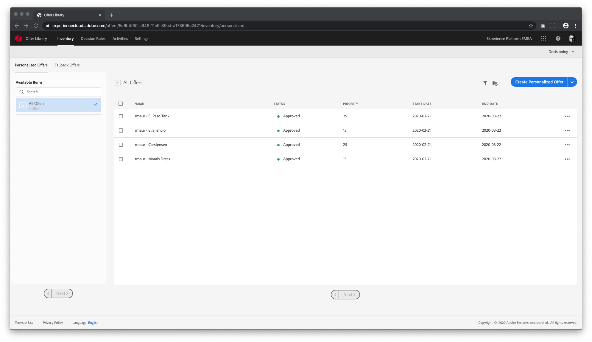

## Exercise 14.1.5 - Create Fallback Offer

1. Click on **Inventory** at the top of the main interface of **Offers Library**. You will see a screen with two tabs: **Personalized Offers** and **Fallback Offers**. Ensure the **Fallback Offers** tab is active.
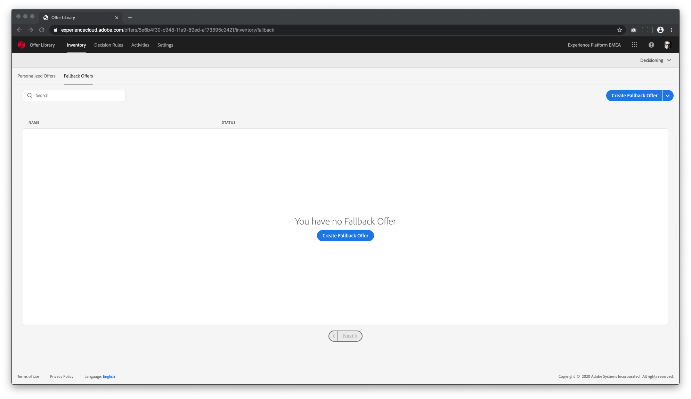
You might see other fallback offers defined by other participants in this module.

2. Click on **Create Fallback Offer** to create a new fallback offer. In the **Fallback offer** screen:
   1. Provide a name for your fallback offer: `ldap - Fallback Offer`, where `ldap` is your LDAP id, e.g. `rmaur`.
   
   2. Ensure you have selected the **Available Items** pane on the left rail (bottom icon). Drag and drop **Image for Web** from the **Available Items** list into the **Create Representations** box.
   
   Your screen will look like:
   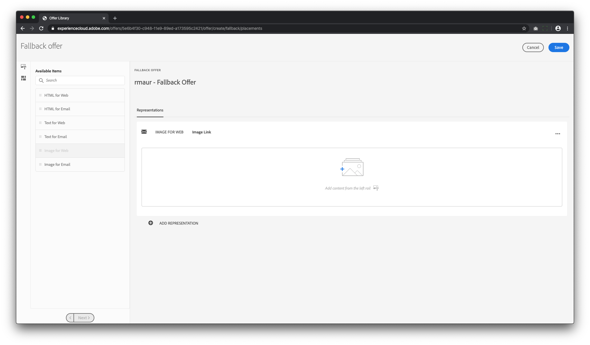
   3. Repeat step 2 but now for **Image for Email**. Drop **Image for Email** below the **IMAGE FOR WEB Image Link** box.
   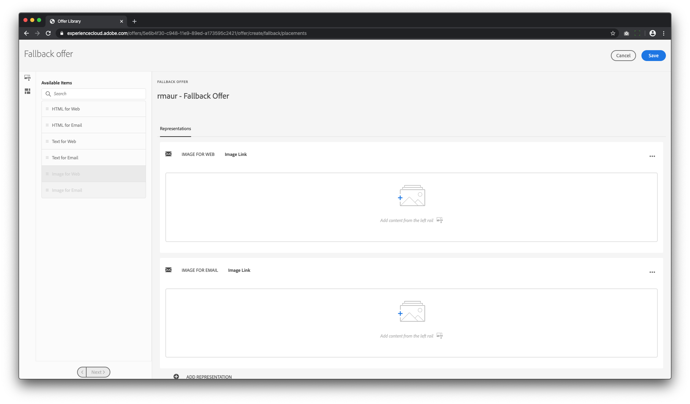
   4. Switch to the **Libray** pane (top icon) in the left rail. Here you can find the content for your offers. Double-click on **La Boutique** and then on **Offers**.
   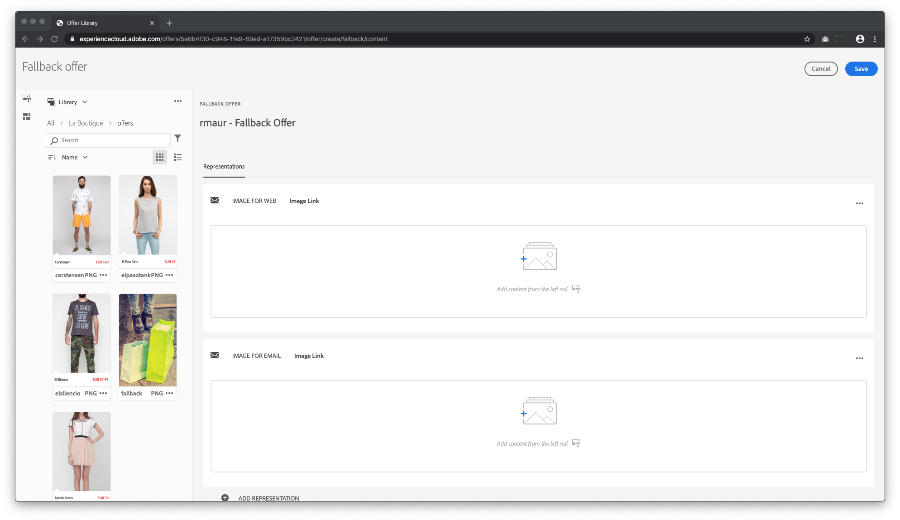
   5. Drag and drop the **fallback PNG** image and drop it onto the **Image for Web** container. Repeat this for the **Image for Email** container. For each container, also define the language as **en - English**.
   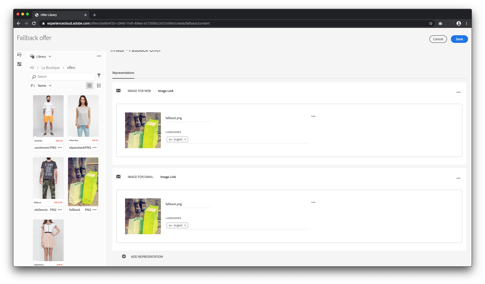
   6. Click **Save** to finish the definition of this offer. In the **Save offer** dialog, click on **Approve and Save** to save your offer.
   7. For obvious reasons, the fallback offer does not have an **Eligibility & Constraints** panel....
3. After you saved your fallback offer, your   **Inventory** screen for **Fallback Offers** should show your fallback offers.
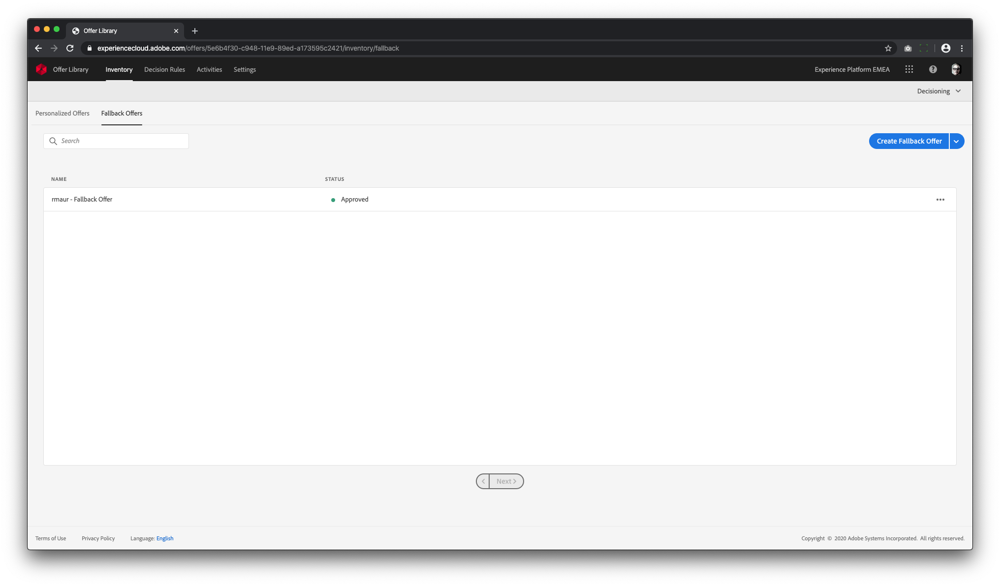

## Exercise 14.1.6 - Offer Filters

An offer filter is used to **filter** out a sub-set of offers from the personalized offer list and use that as part of an offer activity in order to speed up the decision process. Offer filters are shown in the left rail at the **Personalized Offers** tab of the **Inventory** screen.

Currently, the UI does not provide functionality to manage offer filters. We will create an offer filter as part of the API exercices of this module.

## Exercise 14.1.7 - Activity

An activity combines placement, offer filter (set of offers to take into account) and fallback offer to  ultimately be used by the Offer Decisioning Engine to find the best offer for a specific profile, based on each of the individual personalised offer characteristics like priority, eligibility constraint and total / user capping.

Currently, the UI does not provide the functionality to manage activities. You can go tho the **Activities** tab of the **Offer Library** and you might see activities, but there is no way to create a new activity. We will create an activity as part of the API exercises of this module.

---

[Next Step: Exercise 14.2 - Offers API](./ex2.md)

[Go Back to Module 14](./README.md)

[Go Back to All Modules](./../../README.md)