# Exercise 14.2 - Offers API

## Objectives

- Understand the Offers API and how to use it to circumvent the current UI limitations.
- Understand in more detail how the Offers Decisioning Engine works.

## Exercise 14.2.1 - Set up Postman

To use the Offers API, we will use Postman and a specific collection. Please follow these steps to set you up:

1. Open Postman and select the environment you have used before as part of the AEP enablement. Refer to [this section](../module2/prerequisites/ex2.md) for more details on how to setup Postman.
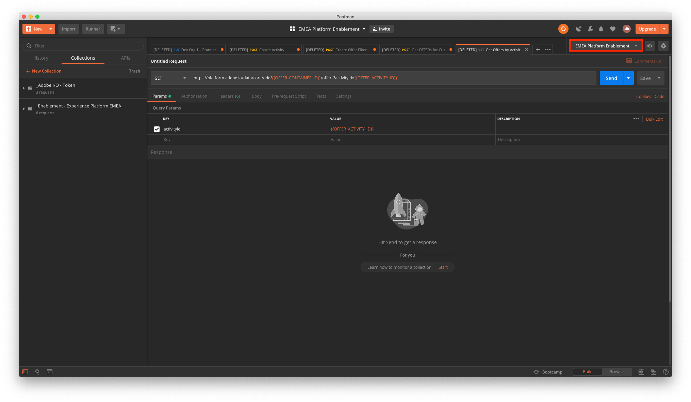
2. Download the [Decisioning Service collection](./postman/_Decisioning%20Service.postman_collection.json) to your local computer.
3. Import the `_Decisioning Service.postman_collection.json` file into Postman:
   1. Click on **Import**.
   2. In the **Import** dialog select the **Import File** tab and click **Choose Files**.
   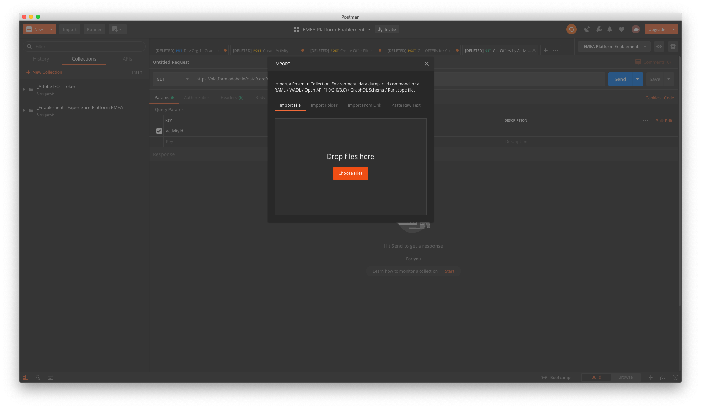
   3. Select the downloaded file from step 2 in the file selection dialog and click **Open**.
   The **_Decisioning Service** collection will be available in the right pane in Postman,
   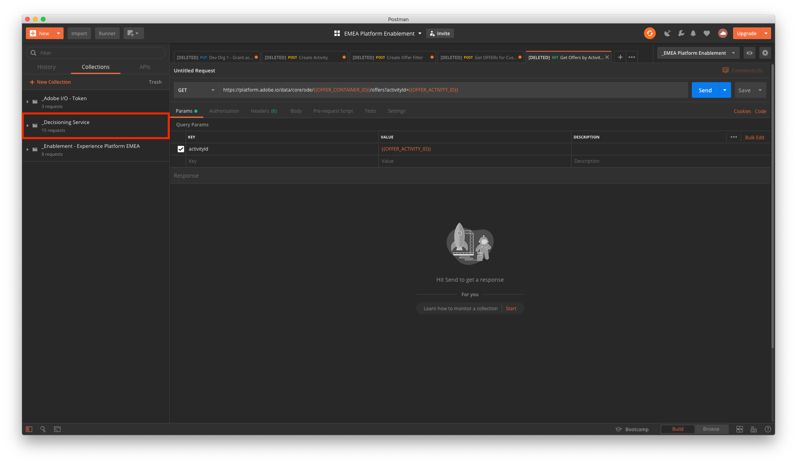
4. Unfold the **_Decisioning Service** collection to reveal all API calls.
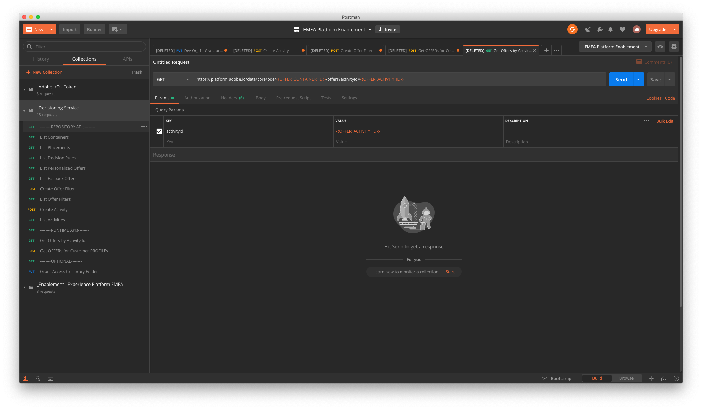

We are almost ready to use the Offers Decisioning Engine API's, but before we do that we need:

1. A valid access token. If you do not have one, use the first two calls in the **_Adobe I/O - Token** collection:
   1. Select **INIT: Load Crypto Library for RS256** and click **Send**.
   2. Select **IMS: JWT Generate_Auth** and click **Send**.
   You should see a valid access token.
   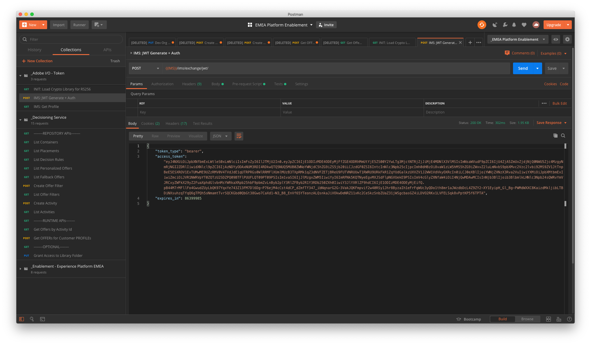
2. To add a new Postman environment variable to contain your LDAP name. To do so:
   1. Open your **_EMEA Platform Enablement** environment by clicking on the gear icon to the right top of the Postman application. This will open the **Manage Environments** dialog.
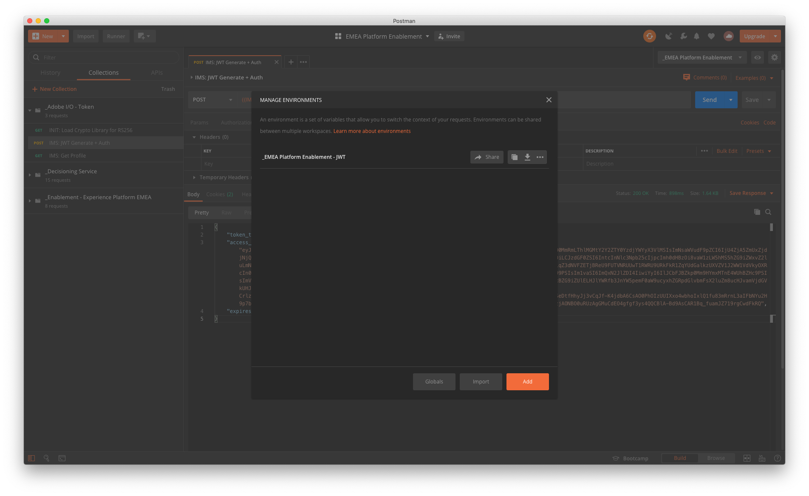
3. Click on the **_EMEA Platform Enablement** entry, this will allow you to manage your environment variables.
4. Add a new environment name `LDAP` and provide your LDAP name (e.g. `rmaur`) as **Initial Value** as well as **Current Value**
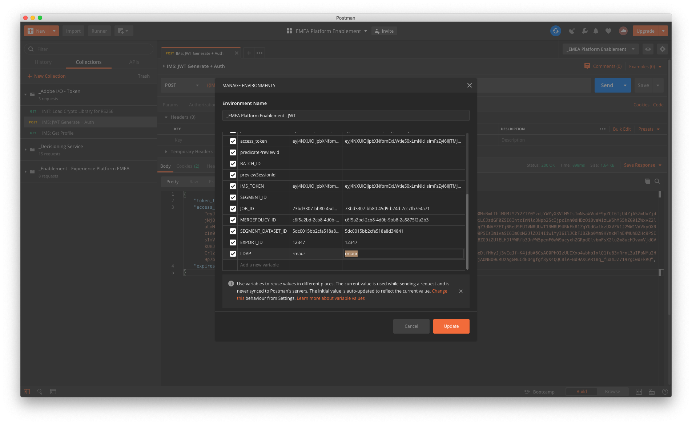
5. Click on **Update** to save the new environment name. Then close the **Manage Environments** dialog.

## Exercise 14.2.2 - List API's

The first set of API's are all about listing what is currently available in the Offer Decisioning Engine.

### Exercise 14.2.2.1 - List Containers

To list the containers available:

1. Select **List Containers** and click **Send**.
2. You will see the JSON output specifying the list of containers.
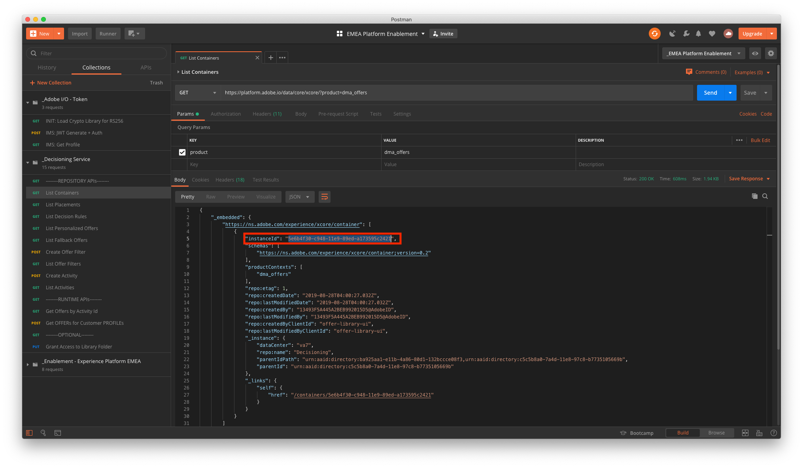
3. The **Tests** script associated with this request will create a new environment variable, named `OFFER_CONTAINER_ID` with the value of `instance_id` from the response. E.g. `5e6b4f30-c948-11e9-89ed-a173595c2421`.
4. To verify, view your current set of environment variables by clicking on the view button next to the name of the **_EMEA Platform Enablement** dropdown environment selector.
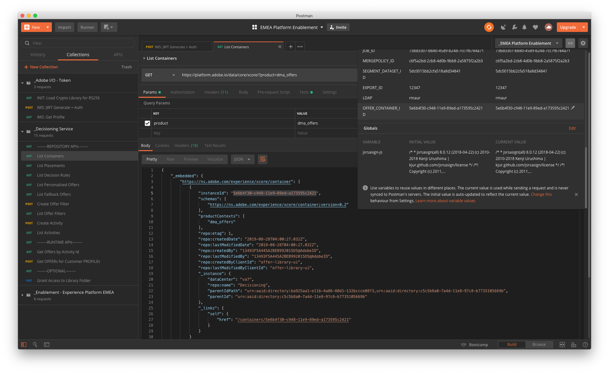

### Exercise 14.2.2.2 - List Placements

To list the placements available:

1. Select **List Placements** and click **Send**.
2. The six placements we saw in the UI are returned. The **Tests** script associated with this request will add six placements with their respective names and id's as environment variables.
3. To verify, view the six placement environment variables by clicking on the view button next to the name of the **_EMEA Platform Enablement** dropdown environment selector.
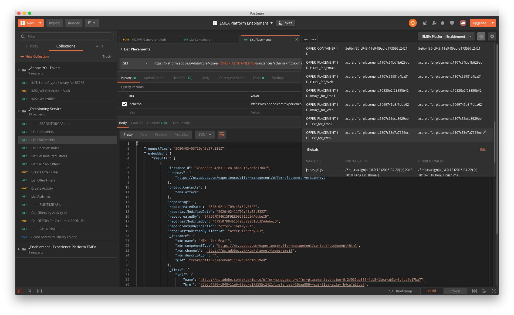

### Exercise 14.2.2.3 - List Decision Rules

To list the decision rules you have defined in the Offers Decisioning Engine:

1. Select **List Decision Rules** and click **Send**.
2. You will see a response returned, listing the decision rules.
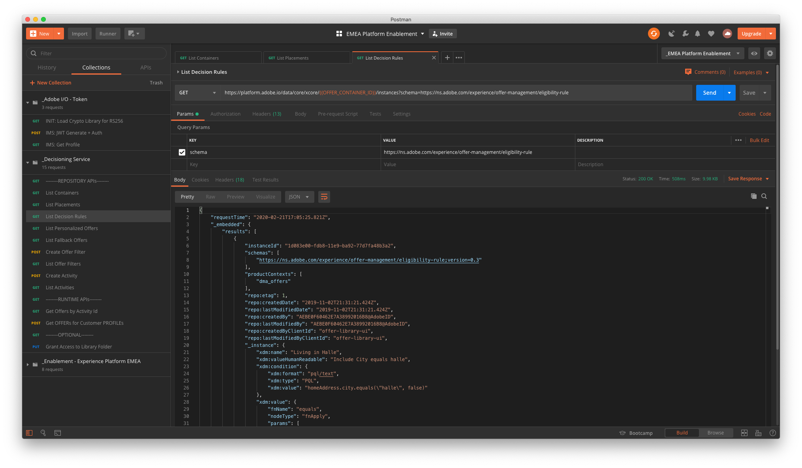
We do not need to track of these id's because they are part of the offers we have defined in the UI. Remember, we used these rules as eligibility constraints in our offer definition.

### Exercise 14.2.2.4 - List Personalized Offers

To list the personalized offers you have defined in the Offers Decisioning Engine:

1. Select **List Personalized Offers** and click **Send**.
2. The **Tests** script associated with this request will add the four offers belonging to your LDAP name as environment variables.
3. To verify, view your four personalized offers by clicking on the view button next to the name of the **_EMEA Platform Enablement** dropdown environment selector.
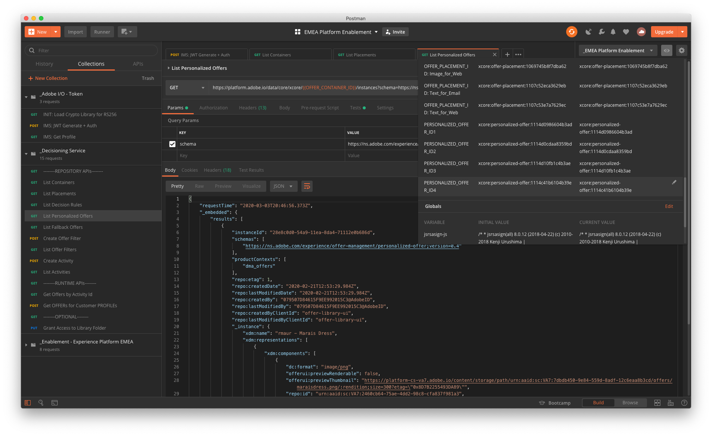

### Exercise 14.2.2.5 - List Fallback Offers

To list the fallback offers you have defined in the Offers Decisioning Engine:

1. Select **List Fallback Offers** and click **Send**.
2. The **Tests** script associated with this request will add the fallback offer belonging to your LDAP name as an environment variable.
3. To verify, view your fallback offer by clicking on the view button next to the name of the **_EMEA Platform Enablement** dropdown environment selector.
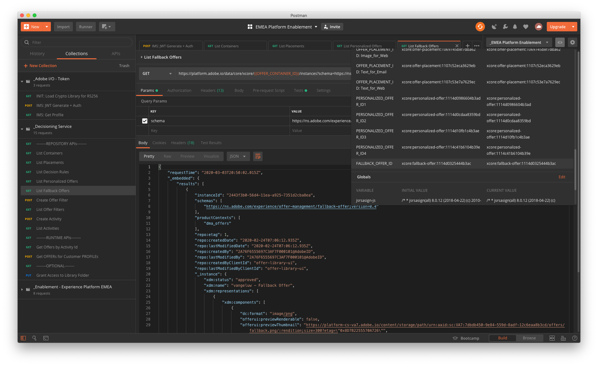

## Exercise 14.2.3 - Offer Filter

As we have noticed in Exercise 14.1, the UI currently does not allow you to create an offer filter, which is the way to limit the number of offers you take into account when finding the next best offer for a profile.
We will create an offer filter through the API.

### Exercise 14.2.3.1 - Create Offer Filter

To create an offer filter:

1. Select **Create Offer Filter** in the left rail.
2. Click on **Body** to define the payload for the request.

You will see that the offer filter will use your four personalized offer environment variables (`PERSONALIZED_OFFER_IDx`). We will also use your `LDAP` Postman environment variable to give your offer filter your personal name (e.g. `rmaur - La Boutique Offer Filter`).
3. Click on **Send** to create the offer filter.
4. The **Tests** script associated with this request will add the offer filter id as an environment variable.
5. To verify, view your offer filter id by clicking on the view button next to the name of the **_EMEA Platform Enablement** dropdown environment selector.
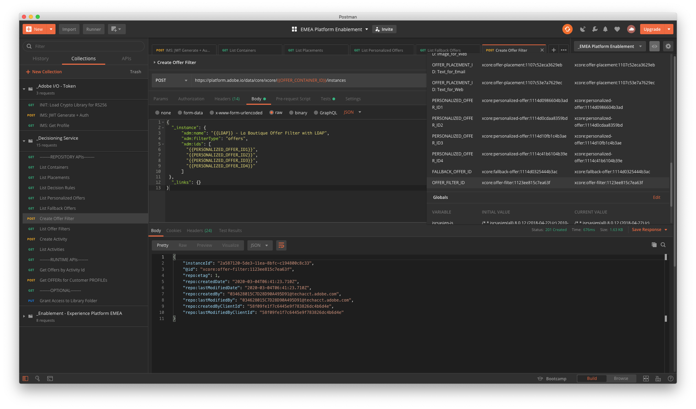

### Exercise 14.2.3.2 - List Offer Filters

You can also list all offer filters and find your offer filter back by searching for your offer filter name. To do so:

1. Select **List Offer Filters** and click **Send**.
2. In the response you will see your offer filter name and id as well as which personalized offer id's belong to the filter.
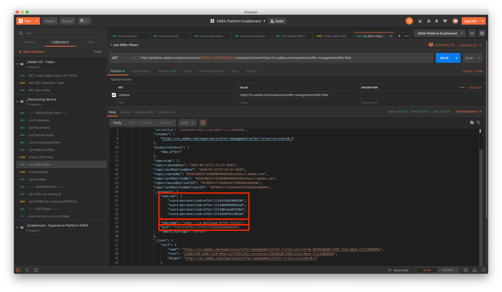

### Exercise 14.2.3.3 - Show Offer Filters

Although you cannot manage offer filters, you still can see offers filters in the UI after having used the API to create them.

1. Go to **Personalized Offers** tab in **Offer Library** screen. You will notice your offer filter in the left rail.
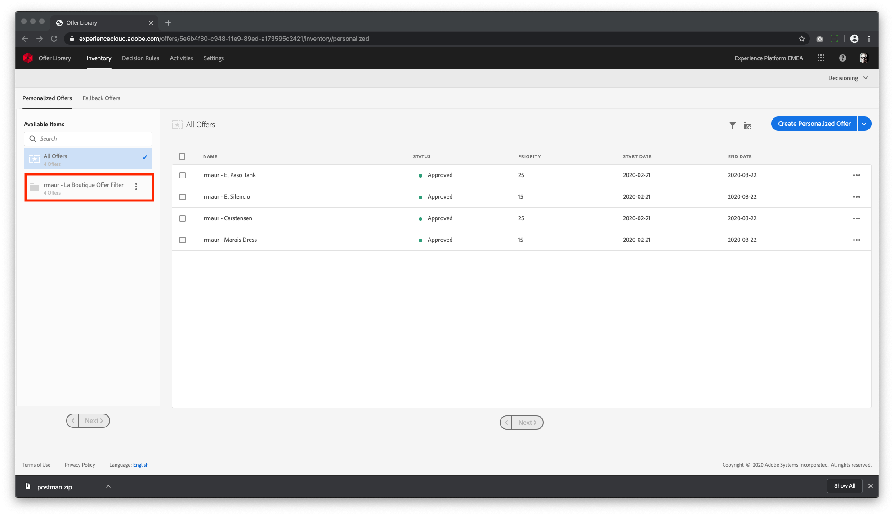
2. You will notice that there is currently a bug in the UI. Selecting the offer filter does not show only your offers, as defined with the filter, but actually shows all offers.

## Exercise 14.2.4 - Activity

An activity combines placement, offer filter (set of offers to take into account) and fallback offer to ultimately be used by the Offer Decisioning Engine to find the best offer for a specific profile, based on each of the individual personalized offer characteristics like priority, eligibility constraint and total / user capping.

As we have noticed in Exercise 14.1, the UI currently does not allow you to create an activity, so we will do this through the API.

### Exercise 14.2.4.1 - Create Activity

To create an activity:

1. In Postman, select **Create Activity** in the left rail.
2. Click on **Body** to define the payload for the request.
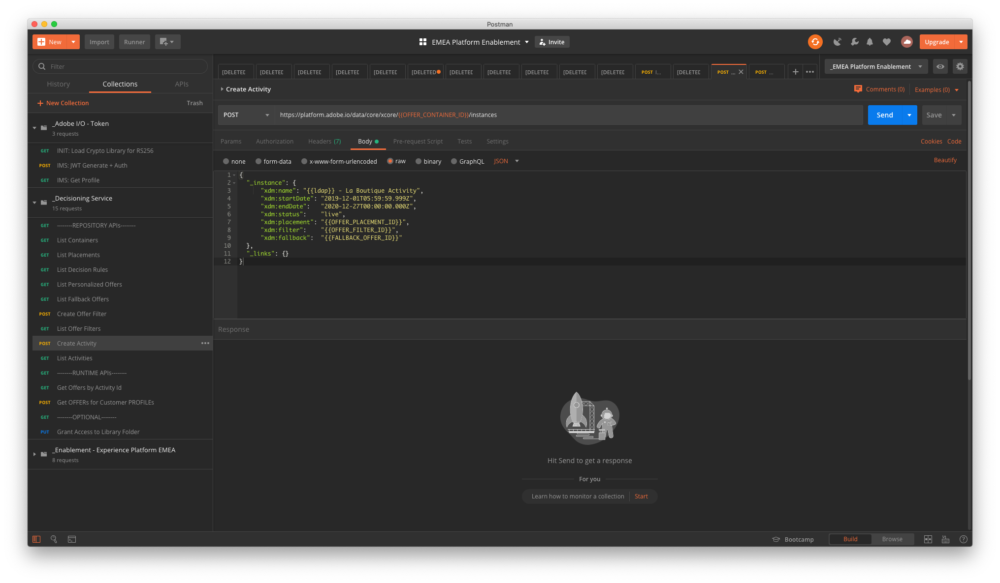
3. In the payload we have to specify tne name, placement, offer filter and fallback offer:
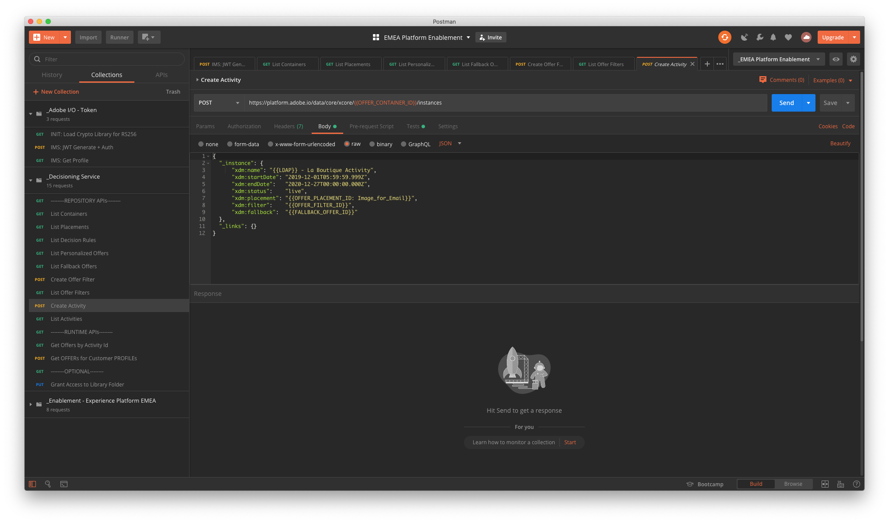
   1. The `xd:name` will use your LDAP name as defined using the `LDAP` environment variable, e.g. `rmaur - La Boutique Activity` to specify the name
   2. The `xdm:placement` will use the value of the environment variable `OFFER_PLACEMENT_ID: Image_For_Email`, to specify the placement.
   3. The `xdm:filter` will use the value of the environment variable `OFFER_FILTER_ID` to specify the offer filter.
   4. The `xdm:fallback` will use the value of the environment variable `FALLBACK_OFFER_ID` to specify the fallback offer.
4. Click on **Send** to create the activity.
5. The **Tests** script associated with this request will add the offer activity id as an environment variable.
6. To verify, view your offer activity id by clicking on the view button next to the name of the **_EMEA Platform Enablement** dropdown environment selector.
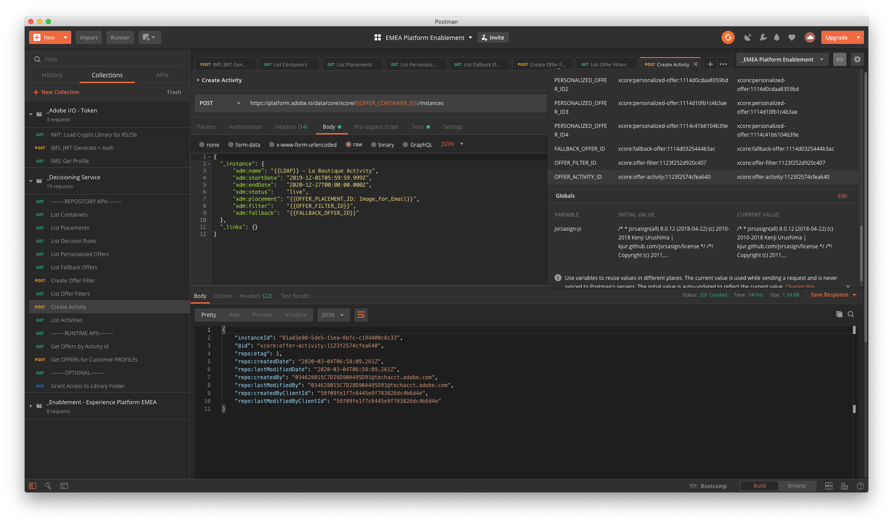

### Exercise 14.2.4.2 - List Activities

You can also list all other activities and find your activity back by searching for your activity name.
To do so:

1. Select **List Activities** and click **Send**.
2. In the response you will see your activity name and id.
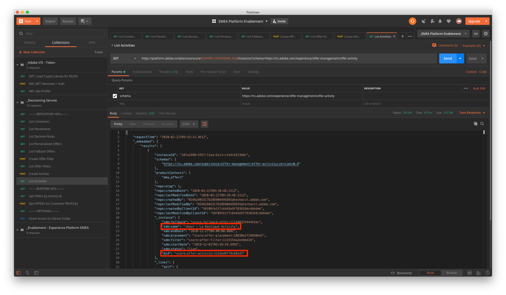

### Exercise 14.2.4.3 - Show Activities

Although you cannot manage activities, you still can see activities in the UI after having used the API to create them.

1. Click on the **Activities** tab in the **Offer Library** screen. You will notice your activity in the list.

## Exercise 14.2.5 - Get Offers by Activity Id

To see what offers are associated with your activity, you can use the API to get offers by activity id.
To do so:

1. In Postman, select **Get Offers by Activity Id** in the left rail and click on **Send**.
2. In the result you will see your four personalized offer id's as well as your fallback offer id.
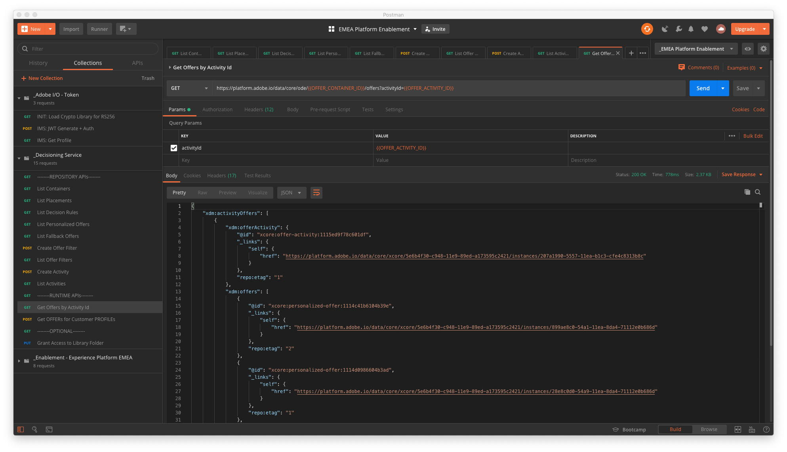

## Exercise 14.2.6 - Get Next Best Offer for Profile

Finally, finally we have come to the state where we can request the Offer Decisioning Engine to provide us with the next best offer for a specific profile. And in case there is no such next best offer, provide the fallback offer. We will use the activity we just defined and a profile we have created as part of a SYTYCD demo scenario.

To do so:

1. Select **Get OFFERs for Customer PROFILEs** from the left rail.
2. Click on **Body** to define the payload for the request.
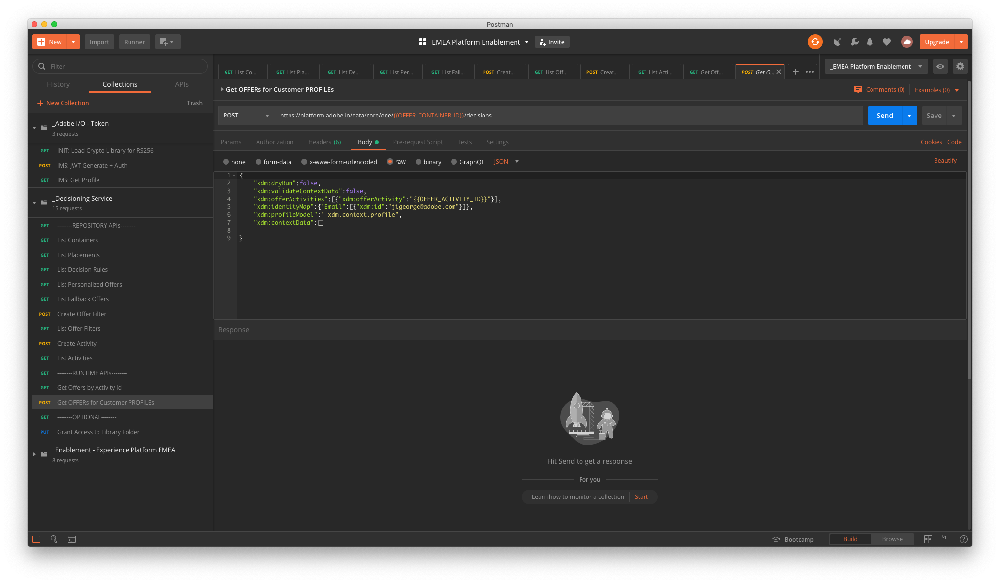
3. In the payload, modify the email address with the email address of an existing profile you have created as part of any the SYTYCD demos you have done, e.g. `rmaur+09022020-1@adobetest.com`.
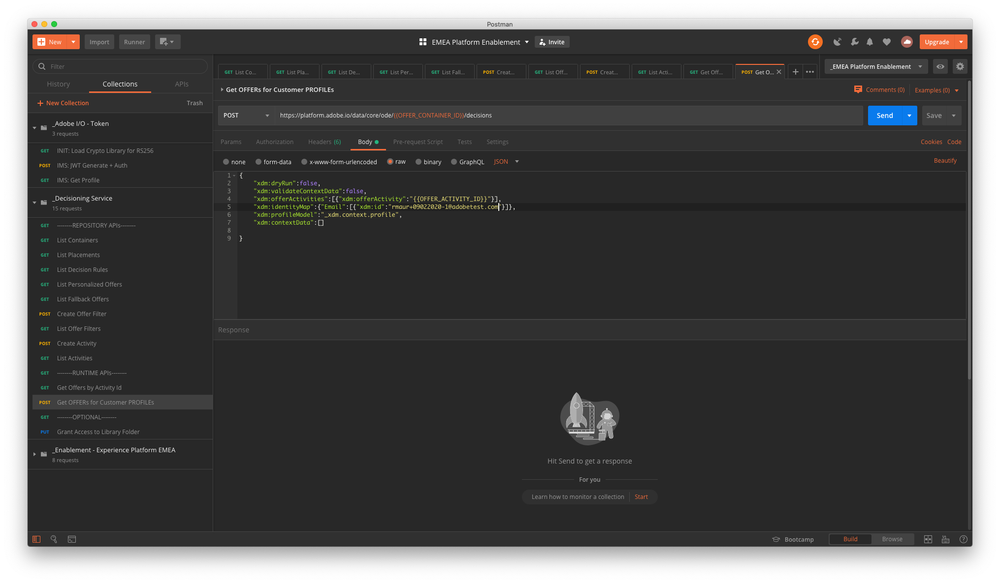
4. Click on **Send** to request the next best offer.
5. In the response you will see:
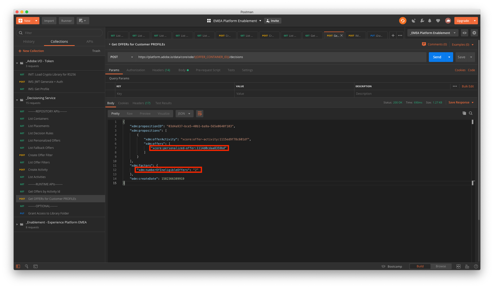
   1. The personalized offer id returned, e.g. `xcore:personalized-offer:1114d0cdaa8359bd`, which translates to the **rmaur - Carstensen** offer. In our example the profiles' gender is male and as a result the profile qualifies for offers with eligibility criteria (decision rule) **Male Profiles** of which **rmaur - Carstensen** has the highest priority (**25**).
   2. An indication of the number of offers the profile is not eligible for (**2**), due to not qualifying for the **Female Profiles** decision rule.
6. (optional) You can modify the **Priority** for the offers in the **Offers Library** at the **Personalized Offers** tab to see if you get a different result, using this API call.

[Next Step: Exercise 14.3 - Using Web UI](./ex3.md)

[Go Back to Module 14](./README.md)

[Go Back to All Modules](./../../README.md)
