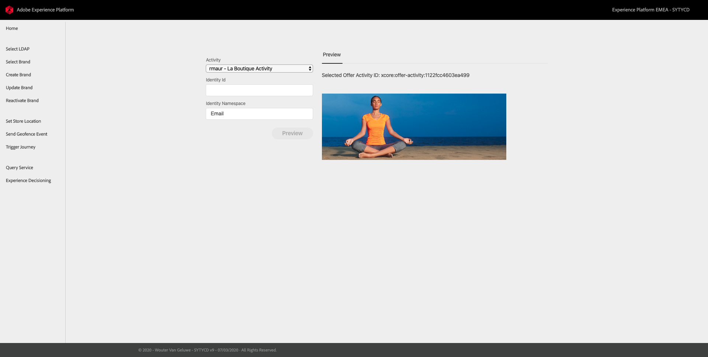
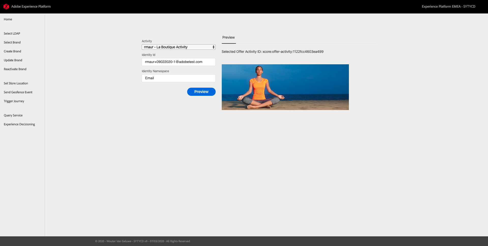
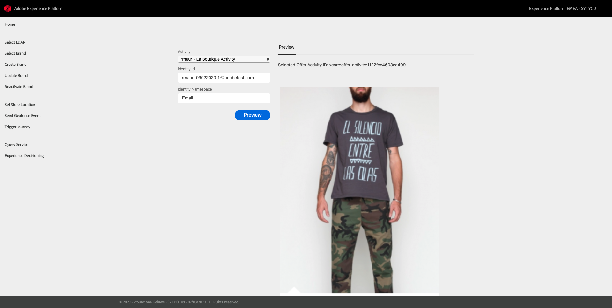
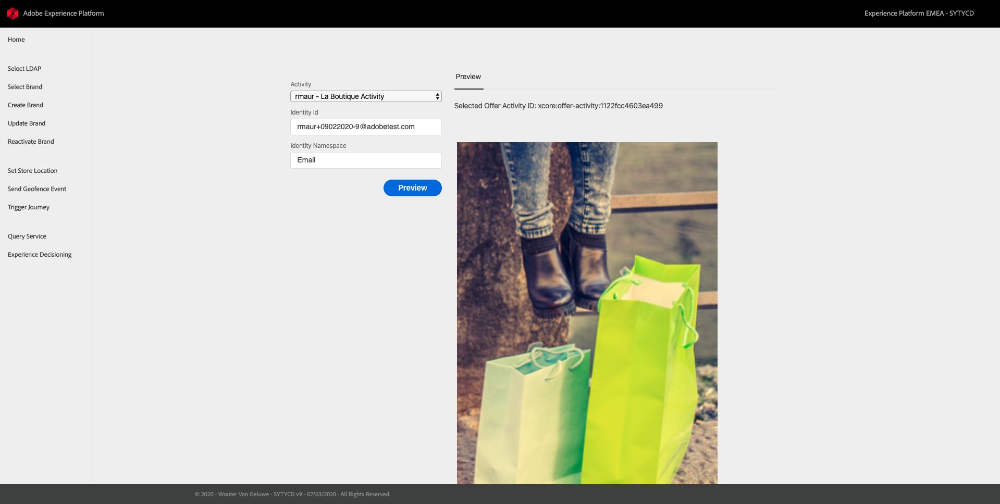
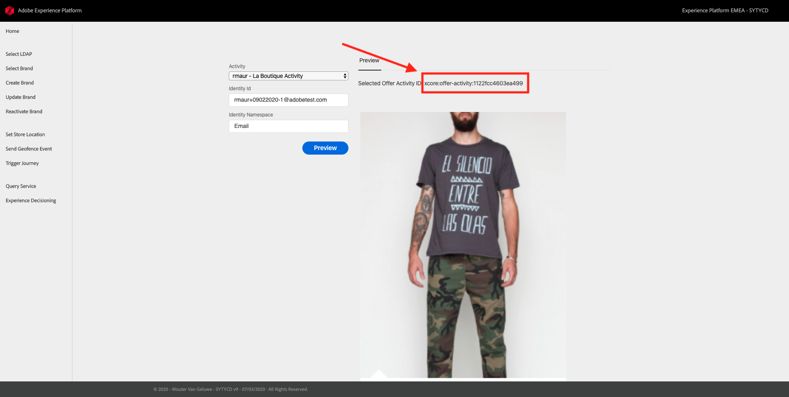

# Exercise 14.3 - Using Web App

## Objectives

* See how a sample web app can use the Offer Decisioning Engine to show next best offers.

## Exercise 14.3.1 - Use the Web App

Go to [https://platformdemo.net/admin_ode.html](https://platformdemo.net/admin_ode.html)

You will see the main screen of the web app.

Provide details:

   1. Select your activity from the **Activity** dropdown listbox, e.g. `rmaur - La Boutique Activity`.
   2. Enter your **Identity Id**, i.e. email address in case you are using the email identity namespace. E.g. `rmaur+09022020-1@adobetest.com`.
   3. Specify the **Identity Namespace**, e.g. `Email`.

Click on **Preview**. A preview of the next best offers should be shown.

Repeat the previous steps for a non-existing profile and you will see a preview of the fallback offer you have defined in earlier steps of this module.

You've now completed Module 14!

**To mark completion of Module 14, follow the instructions here:** <!--[How is completion measured?](./../../release/completion.md)-->

You'll need your Offer Activity ID to mark completion, it looks like this ``xcore:offer-activity:1122fcc4603ea499`` and you can find it here:

[Go Back to Module 14](./README.md)

[Go Back to All Modules](../../README.md)
