# Exercise 15.2 - Interact with data in Adobe Experience Platform from a local JupyterLab environment

In this exercise, you'll install Anaconda on your local machine so you can run Jupyter Notebooks on your local machine, to then interact with the data in Adobe Experience Platform through the Query Service.

## Business Context

With Adobe Experience Platform Data Science Workspace we're making Jupyter Notebooks available natively on top of Adobe Experience Platform. With this, Data Scientists can now read data from and write data to Platform natively.

Many data scientists however still prefer to work on their local machines for data exploration and model building. This is a pattern that Adobe Experience Platform also supports through Adobe Experience Platform Query Service. With this, data scientists can load data from Platform directly in their local environment of choice.

## Prerequisites

For this exercise, we're using ``Anaconda Navigator`` which you can download and install from [here](https://docs.anaconda.com/anaconda/install/).

If you're using a MacBook, please make sure to have ``brew`` installed. You can find installation instructions for ``brew`` here: [https://brew.sh/](https://brew.sh/)

Also, after installing ``brew``, you'll need to install the ``postgres``-package, by running the ``brew install postgres``-command in a Terminal window.

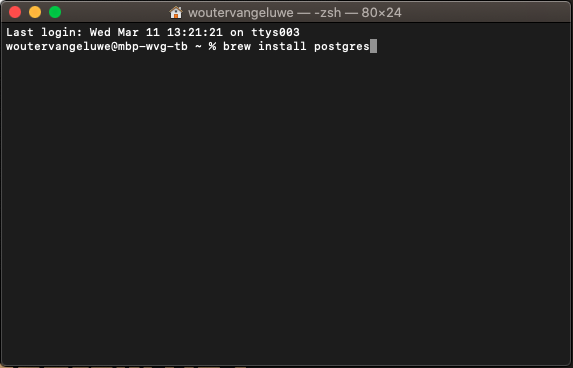

The following are alternative ways to make sure you have the required packages installed on your machine:

Run this command in a Terminal window: (try these commands first)

- ``sudo easy_install pip``
- ``pip install psycopg2-binary``

Run this command in a Terminal window:

- ``conda install psycopg2``

Run these 2 commands in a Terminal window:

- ``$ /opt/anaconda3/bin/python -m pip install ipykernel``
- ``$ /opt/anaconda3/bin/python -m  ipykernel install``

## Exercise

After installing Anaconda, open Anaconda and you'll see the below page.

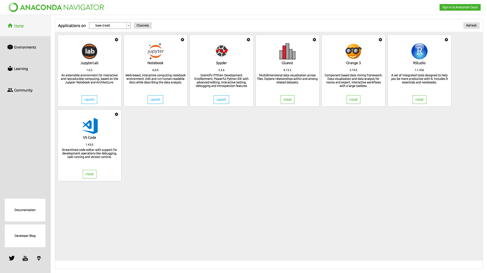

Click on the ``Launch`` - button for JupyterLab.

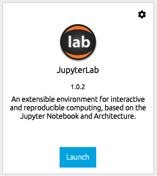

After that, your browser should open and show you the JupterLab startpage.

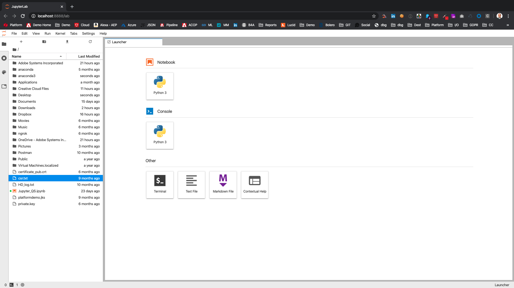

Download [this notebook](./downloads/Jupyter_QS_LumaInsurance.ipynb.zip) and unzip it to the desktop of your local computer.

Click the ``Upload`` - icon in JupyterLab.

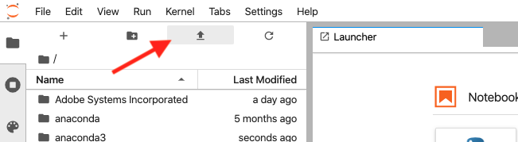

Select the notebook you just downloaded, ``Jupyter_QS.ipynb``,  from your computer's desktop.

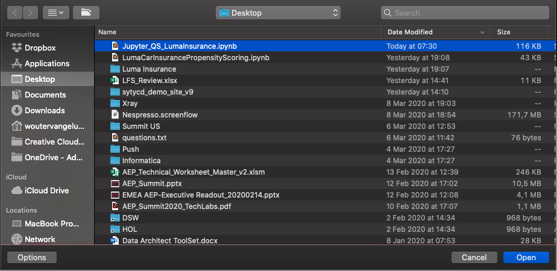

You'll then see the notebook ``Jupyter_QS_LumaInsurance.ipynb``.

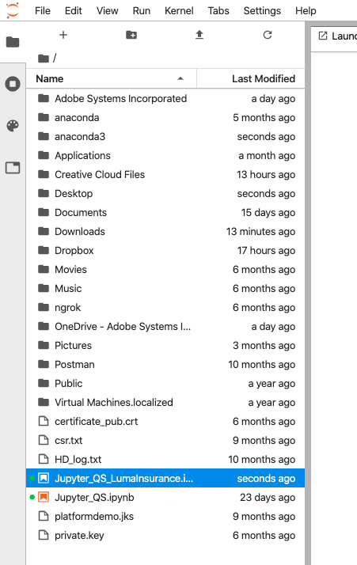

Double-click the notebook ``Jupyter_QS_LumaInsurance.ipynb`` to open it.

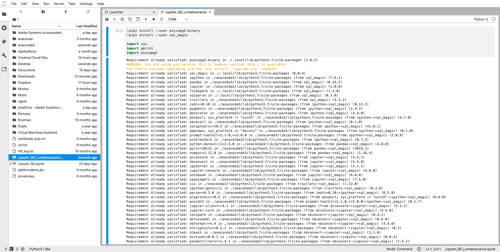

Go to the first cell and Go to the first cell and click the ``Play`` - icon to execute this cell. If you run into an error with this cell, please verify the alternative ways of installing postgres as mentioned above in the section ``Prerequisites``.

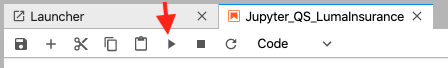

This cell will download and install 2 external libraries that are required to support ``PostgreSQL``. Executing this cell the first time may take a couple of minutes.

FYI: if you get an error on loading ``psycopg2``, you will need to install ``postgres`` on your computer by opening a terminal window and executing the command ``brew install postgres`` (which assumes you have 'brew' already installed on your MacBook).

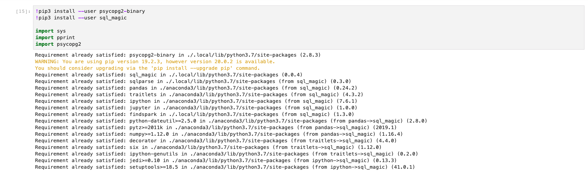

You'll see all the packages being loaded and then you can go to the next cell, which will connect to Adobe Experience Platform Query Service. In order to connect, you'll have to update the ``password`` in the next cell as the password is only valid 24 hours.

To retrieve the Query Service password, go into Adobe Experience Platform, to ``Queries`` > ``Credentials`` > ``Postgres Credentials``.

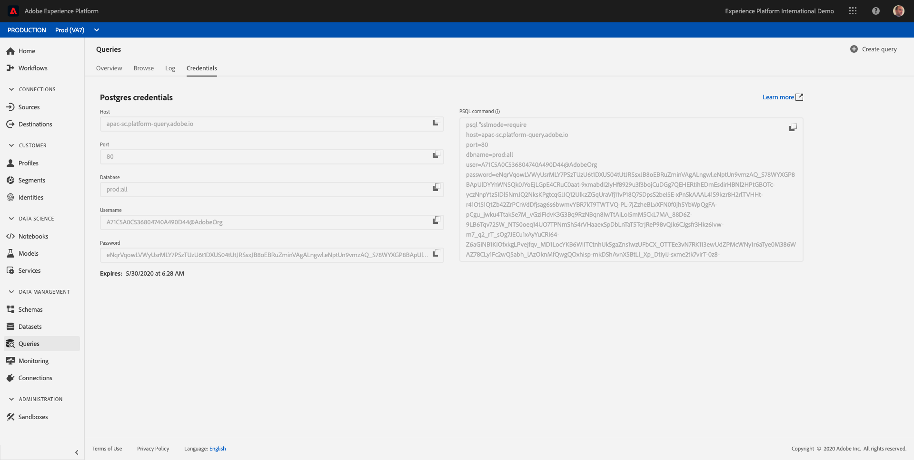

Paste the new password by replacing the current password and click the ``Play`` - icon to execute this cell. This might take 1-2 minutes.

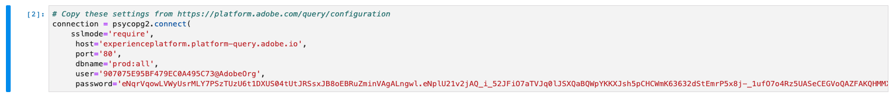

Go to the next cell. Click the ``Play`` - icon to execute this cell.

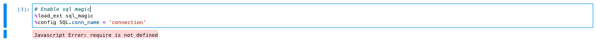

Go to the next cell. This cell will load all datasets from Adobe Experience Platform. Click the ``Play`` - icon to execute this cell. This might take 1-2 minutes.

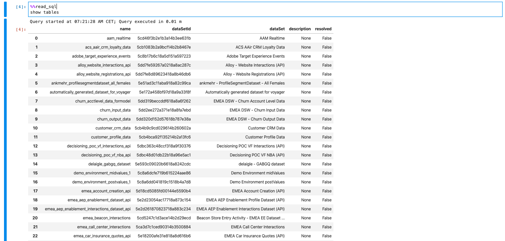

Go to the next cell. This cell will load the ``AEP Demo - Car Insurance Interactions`` - dataset from Adobe Experience Platform into a dataframe. Click the ``Play`` - icon to execute this cell. This might take 1-2 minutes.

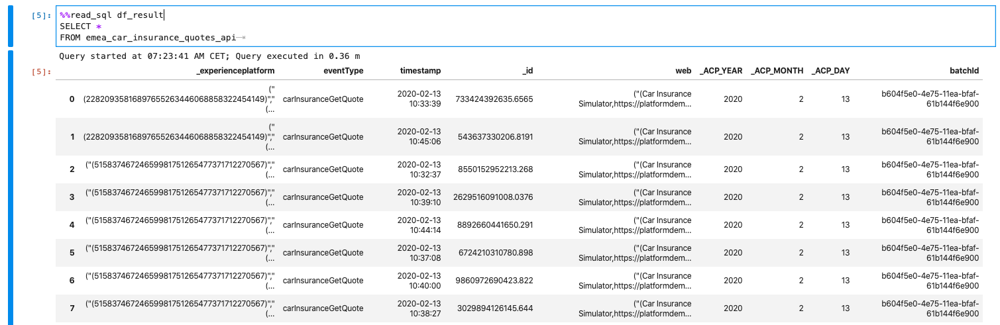

The ``AEP Demo - Car Insurance Interactions`` - dataset is now assigned to a dataframe, and now a data scientist can continue Exploration, Visualization and Model Development based on this dataframe.

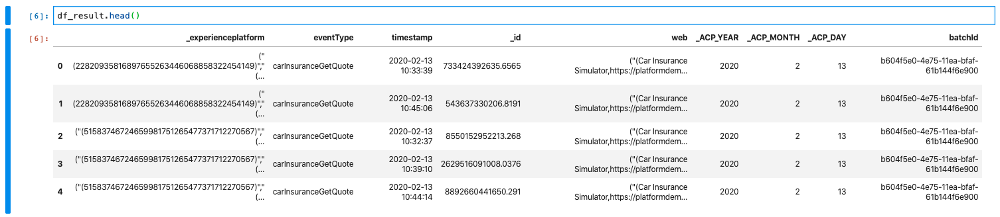

---

Next Step: [Exercise 15.3 - Operationalize your model using a Recipe](./ex3.md)

[Go Back to Module 15](./README.md)

[Go Back to All Modules](../../README.md)
