# 15.3 - Operationalize your model using a Recipe

In this exercise, you'll take your model and operationalize it in Adobe Experience Platform by creating a Recipe.

The Recipe Builder Notebook is one of our recent innovations that templatizes your model to automatically package and operationalize it. The notebook has multiple templated cells that you fit your model code into:

* The requirements and configuration cells allow you to add additional libraries and configure datasets and tuning parameters for your model
* The evaluator cell enables you to split your data and evaluate the performance of your model
* The training and scoring data loader cells allow you to load the data you need for training and scoring
* Finally, the pipeline cell contains logic required for both training and scoring your model.

We have streamlined the steps needed to operationalize a model by giving you the ability to train, evaluate and score it at scale and then package it in one seamless flow on Adobe Experience Platform. Packaging to a Recipe also allows you to use the same code with different datasets to power different use cases in your organizations. Our specific use case revolves around using the recommendations model code for users searching for products to purchase on the website.

Go to [https://platform.adobe.com](https://platform.adobe.com)

You'll see the **Adobe Experience Platform**-homepage.

In the left menu, click **Notebooks**.

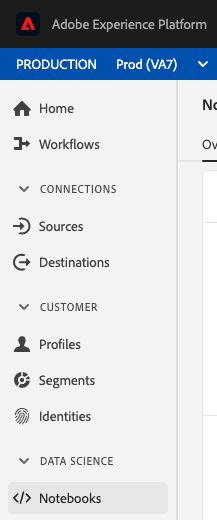

Jupyter Notebooks will now be opened inside the Adobe Experience Platform UI.

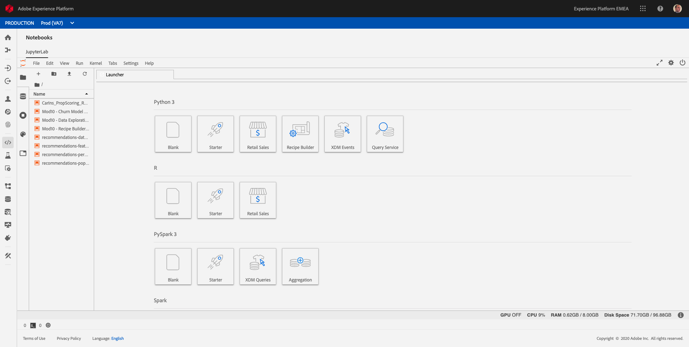

Download [this notebook](./downloads/LumaCarInsurancePropensityScoringRecipe.ipynb.zip) and unzip its content to the desktop of your local computer.

Drag & drop the notebook from your desktop into the Notebooks-area in Jupyter Notebooks.

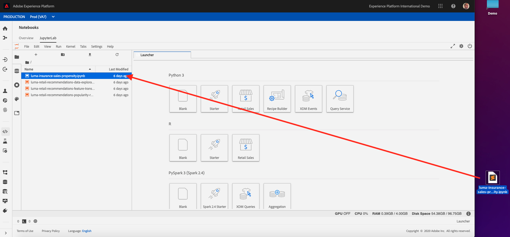

In Jupyter Notebooks, now open the notebook you just imported, named **luma-insurance-sales-propensity.ipynb** by double-clicking it.

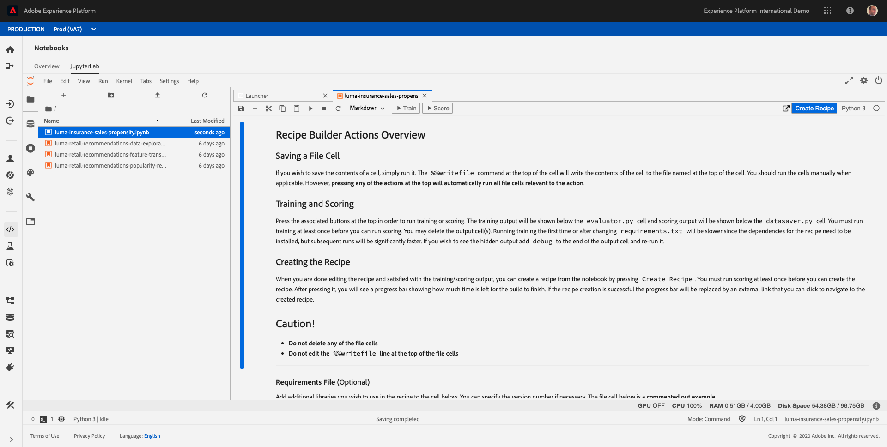

In this notebook, we'll do the following:

* Train a model
* Score a model
* Create a recipe from the model

Let's have a look at all steps in detail...

## Train a model

Training a model is done by clicking the **Train** - button.

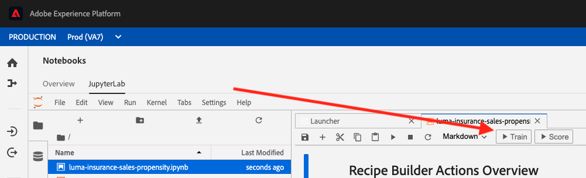

Click **Train** on the top toolbar to create a training run in the notebook. This executes the training data loader, pipeline and evaluator cells and generates evaluation metrics to gauge model performance. A log of commands and outputs from the training script will appear in the notebook (under the Evaluator - cell).

After clicking **Train**, the Training Run will start and will need a couple of minutes to complete.

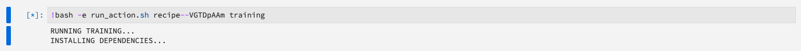
...
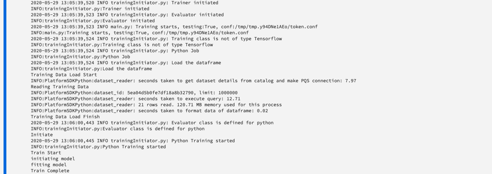
...
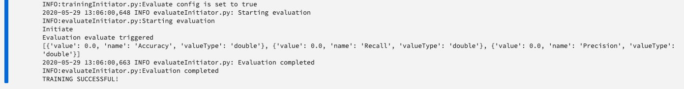

When you click **Train**, the following cells are executed:

* Requirements File
* Configuration Files - Training
* Training Data Loader File
* Pipeline File
* Evaluator File

## Score a model

Scoring a model is done by clicking the **Score** - button.

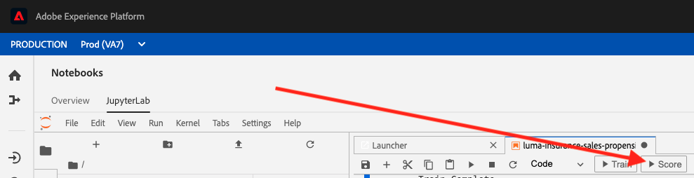

Click **Score** on the top toolbar to create a training run in the cell. This executes the scoring data loader, pipeline and evaluator cells and generates evaluation metrics to gauge model performance. A log of commands and outputs from the training script will appear in the notebook (under the `pipeline.py` cell).

After clicking **Score**, the Training Run will start and will need a couple of minutes to complete.

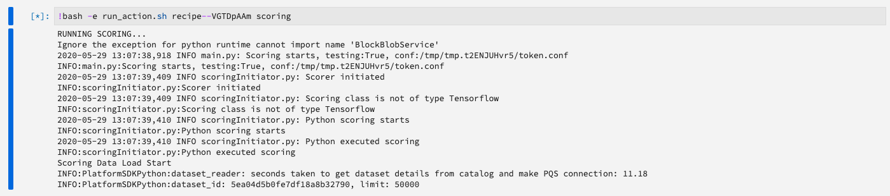
...
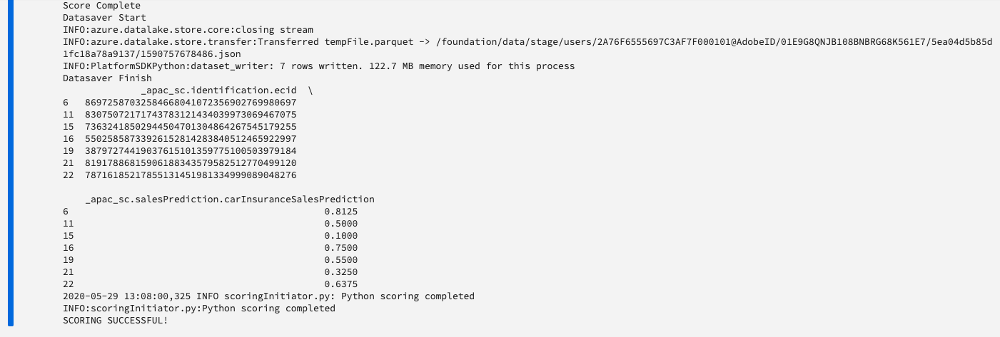

When you click **Score**, the following cells are executed:

* Requirements File
* Configuration Files - Scoring
* Scoring Data Loader File
* Pipeline File
* Evaluator File

Additionally, at the end of the Scoring Run, the output with recommendations is stored in Adobe Experience Platform, in the **AEP Demo - ML Predictions**-Dataset.

You can verify this [here](https://platform.adobe.com/dataset).

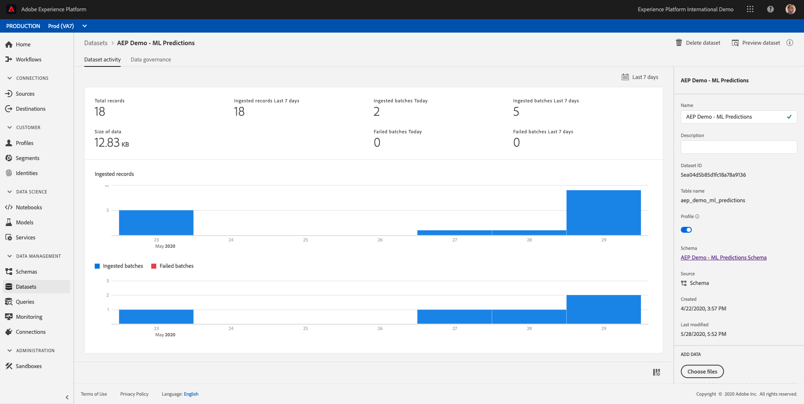

## Create a recipe from the model

Creating a recipe is done by clicking the **Create Recipe** - button.

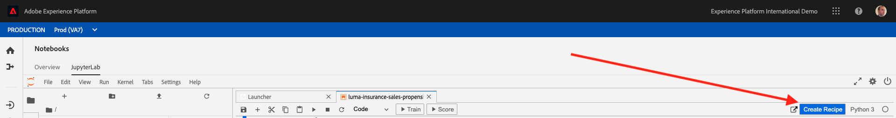

When you are satisfied with the outputs of training and scoring, you can create a recipe. Click the **Create Recipe** - button to start the process.

Creating a recipe enables you to test your model at scale.

After clicking the **Create Recipe** - button, you have to enter a name for your recipe.

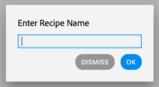

As a naming convention, please use:

* **ldap**CarInsurancePropensity

Replace **ldap** with your ldap.

Example: for ldap **vangeluw**, the name of your recipe should be: **vangeluwCarInsurancePropensity**.

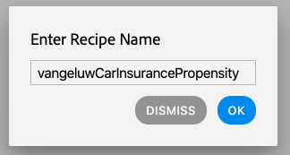

After entering a Recipe Name, click **OK**.

A second popup is shown, telling you that your Recipe is being created. This could take up to 5 minutes, please wait until the process finishes.

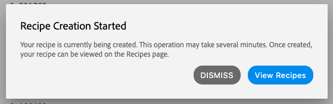

For now, click the **Dismiss** - button.

You can view the progress of the recipe creation process in the top right corner of Jupyter Notebooks.

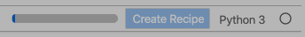

Don't do anything else, you need to keep this browser window open on the Notebook with the Recipe Creation process ongoing.

After a couple of minutes, the recipe creation is finished.

Click **View Recipes** on the popup-window.

You'll then see all available Recipes, which now includes your Recipe as well.

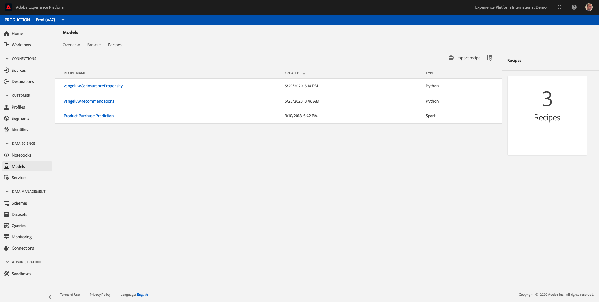

Now that you've created your recipe, let's continue with the next exercise, in which you'll start scalable training and experimentation.

Next Step: [15.4 - Train and Score your Recipe](./ex4.md)

[Go Back to Module 15](./data-science-workspace-car-insurance-sales-propensity.md)

[Go Back to All Modules](../../README.md)
