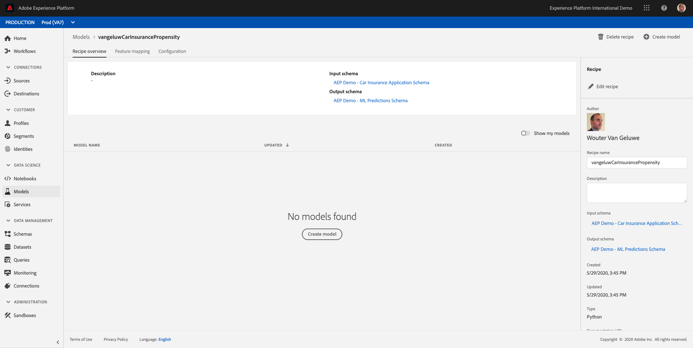
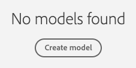
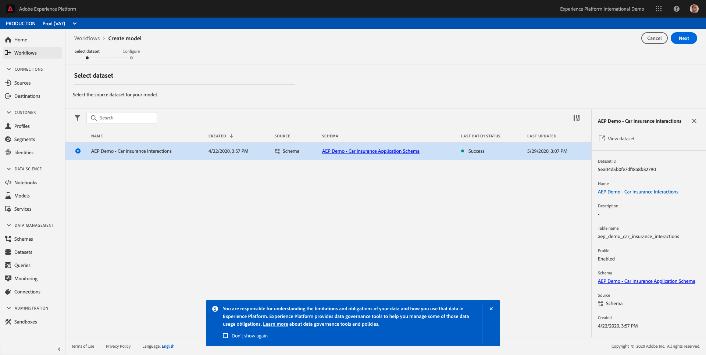
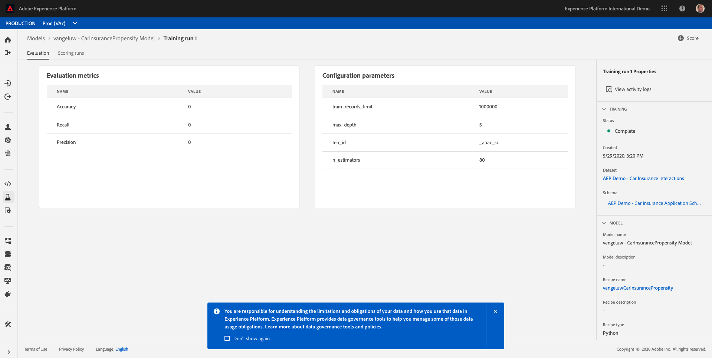
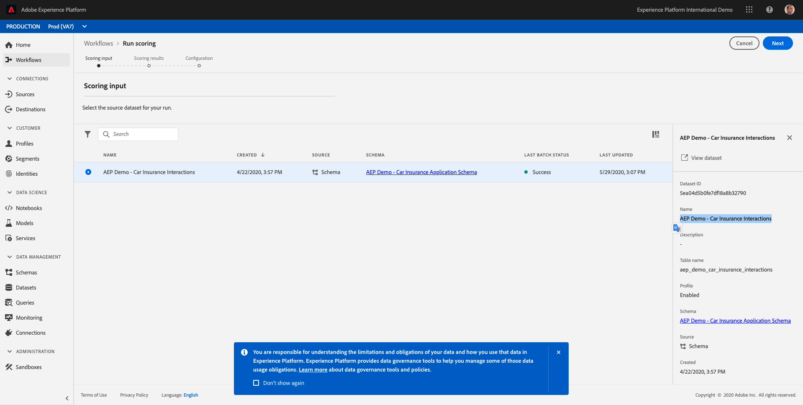
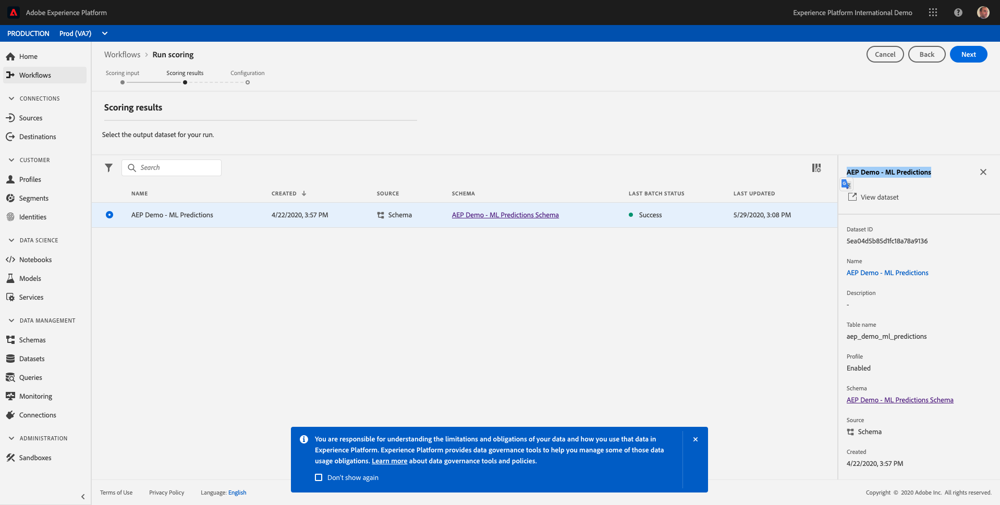
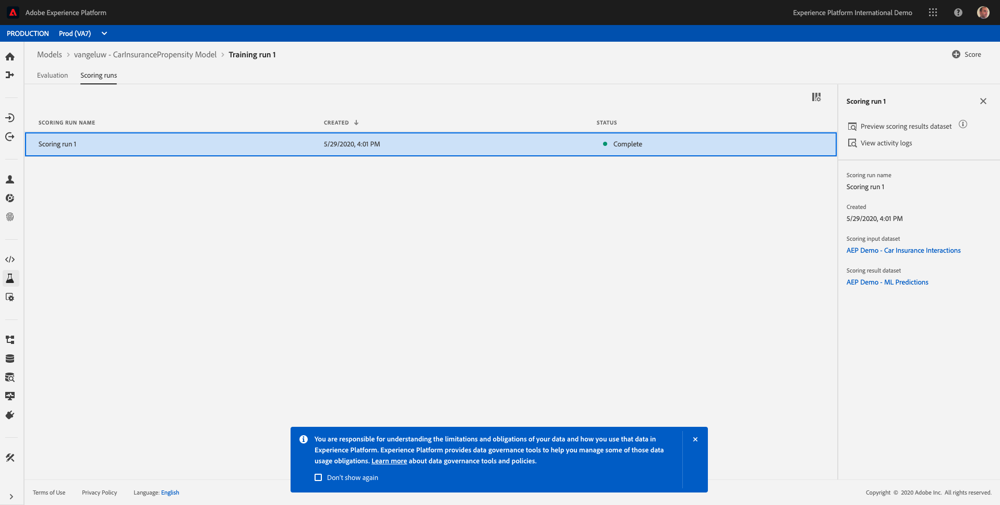
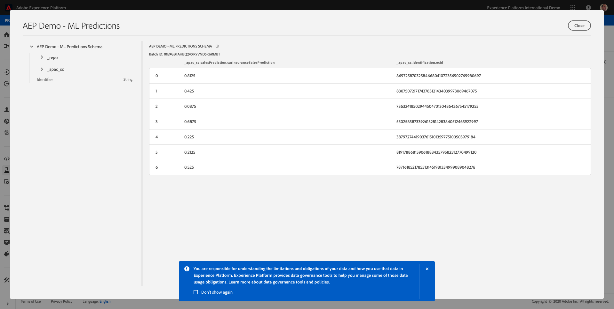

# 15.4 Train and Score your Recipe

After creating a Recipe, you can now Train and Score your Recipe without having to touch code again.

## 15.4.1 Train a Model based on a Recipe

Login to Adobe Experience Platform: [https://platform.adobe.com](https://platform.adobe.com)

From the left menu, click on **Models**.

In this exercise, we'll use a prebuilt recipe to create a Model for Car Insurance Sales Predictions.

In the top menu, click on **Recipes**.

In Recipes, you'll find multiple recipes. Look for your own recipe in the list, which should be named **ldapCarInsurancePropensity**.

Click the **ldapCarInsurancePropensity** - recipe to open it.

You now need to create your own Model, based on the **ldapCarInsurancePropensity** - recipe.

To do that, click on the **Create a Model** - button.

To train this model, you need to provide it with an Input Dataset. In our case, the dataset to use is called **AEP Demo - Car Insurance Interactions**. Select it from the list.

Click **Next** to continue.

In the next step, you need to define a name for your Model. As a naming convention, let's use: **ldap -  CarInsurancePropensity Model** and replace **ldap** with your ldap.

Example: for ldap vangeluw, the name become **vangeluw - CarInsurancePropensity Model**.

We can also hyper-tune the Model by changing the Model Configuration. To do that, you can f.i. change the **n_estimators** or the **max_depth**.

If you want to update the Model's Configuration parameters, double-click one of the parameters and give it a new value.

Next, click **Finish** to finish your configuration.

After a couple of seconds, you'll be reverted back to the Model's homepage where you'll see a Training Run 1 with a status of **Pending**. The process to finish the training run can take 5+ minutes.

After 1-2 minutes, your Training Run's status will change to **Running**.

And 1-2 minutes later, the Training Run's status will change to **Complete**.

Once the Training Run has completed, you'll see an Accuracy Metric that indicates how successful the model is. (Due to the lack of training data, accuracy doesn't say much in this demo situation).
  

Training a model requires more then one run. All Training Runs will be visible on this page and you'll be able to compare their results, so you can decide which one is the most successful.

## 15.4.2 Score a Model based on a Recipe

After training a model, we can use the model to score and as such, have the model calculate Car Insurance Sales Propensity scores which can be activated through targeting.

To start scoring, let's re-open Training Run 1 by clicking it.

After opening Training Run 1, you'll see a full overview of the Training Run, and in the future, more visualization options will be added.

To score, you have to click the **+ Score** - button in the top right corner of your screen.

In the next step, you again have to select an Input Dataset. Let's choose the **AEP Demo - Car Insurance Interactions**-dataset.

After selecting the Input Dataset, click **Next**.

In the next step, you need to select a dataset to which Platform will output results. In this case, select the **AEP Demo - ML Predictions**-dataset.

After selecting the Output Dataset, click **Next**.

In the next screen, you can again specify/change some of the Model's Configuration parameters.

After updating the Model's Configuration parameters, click **Finish**.

A **Scoring Run** is now created, and has a status of **Running**.

And 1-2 minutes later, the Scoring Run's status will change to **Complete**.

And finally, let's preview the results. Click on **Scoring Run 1**

Next, click the **Preview Scoring Results Dataset**.

Next Step: [15.5 Publish your Recipe as a Scheduled Service](./ex5.md)

[Go Back to Module 15](./data-science-workspace-car-insurance-sales-propensity.md)

[Go Back to All Modules](../../overview.md)
