# Exercise 16.4 - Load data from BigQuery into Adobe Experience Platform

## Objectives

- Map BigQuery data to an XDM Schema
- Load BigQuery data into Adobe Experience Platform
- Become familiar with the BigQuery Source Connector UI

## Before you start

After exercise 16.3, you should have this page open in Adobe Experience Platform:

**If you have it open, continue with exercise 16.4.1.**

**If you don't have it open, go to [Adobe Experience Platform](https://platform.adobe.com/home).**

In the left menu, go to sources. You'll then see the ``Sources``-homepage. In the ``Sources``-menu, click on ``Databases``.

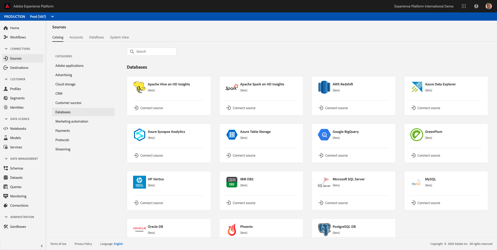

Select the ``Google BigQuery`` Source Connector and click on ``+ Connect source``.

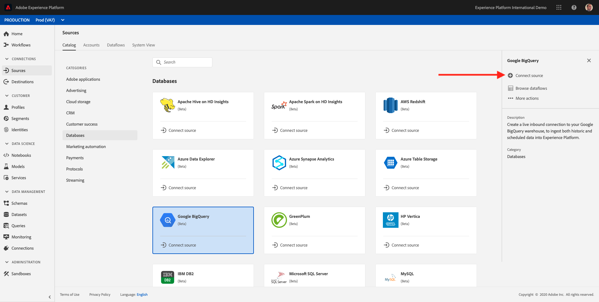

You'll then see the Google BiqQuery Account selection screen.

Select your account and click ``Next``.

You'll then see the ``Add data``-view. You can now continue with exercise 16.4.1.

## 16.4.1 BigQuery Table Selection

In the ``Add data``-view, select your BigQuery-dataset.

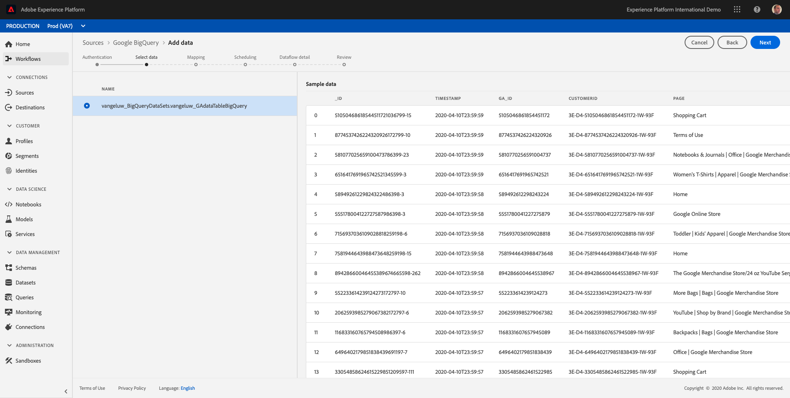

You can now see a sample data preview of the Google Analytics-data in BigQuery.

Click ``Next``.

## 16.4.2 XDM mapping

You'll now see this:

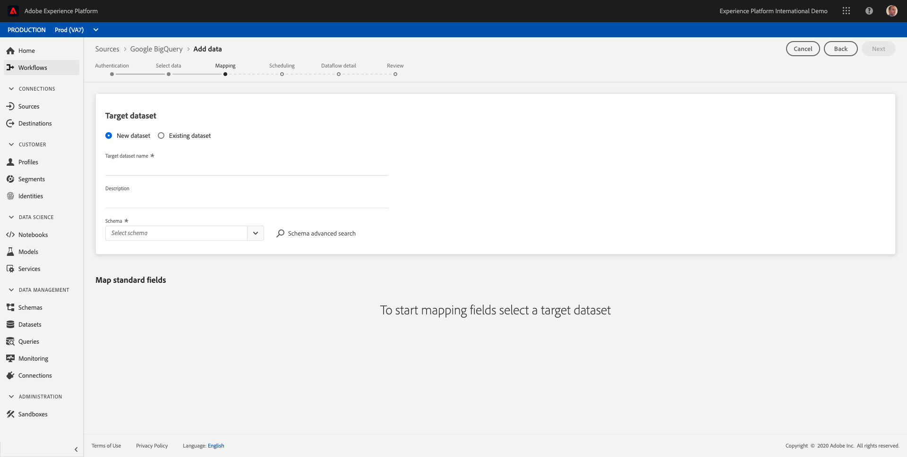

You now have to either create a new dataset or select an existing dataset to load the Google Analytics data into. For this exercise, a dataset and schema have already been created. You do not need to create a new schema or dataset.

Select ``Use existing dataset``.

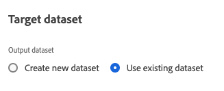

Click the dataset icon to select an existing dataset:

Search for the dataset named ``AEP Demo - BigQuery Website Interactions`` and select it.

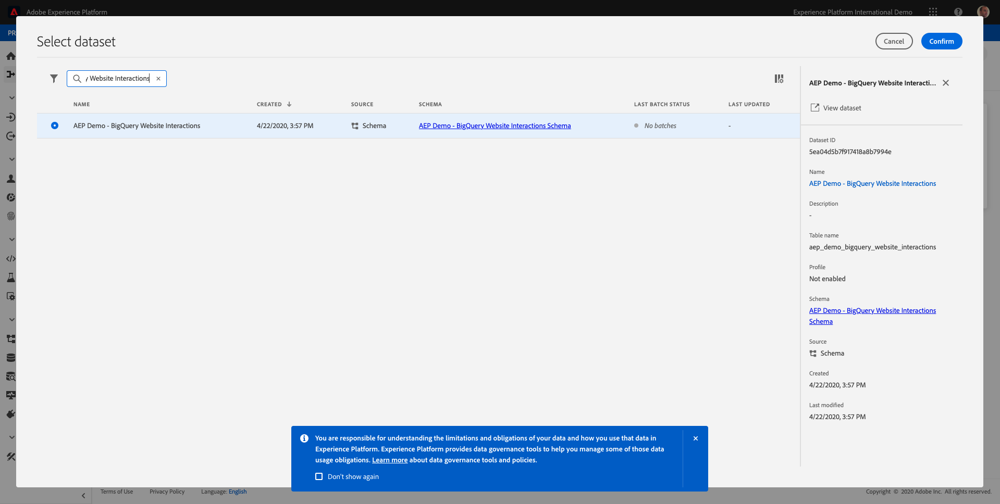

Next, click ``Confirm``.

You now need to map every ``Source Field`` from Google Analytics/BigQuery to an XDM ``Target Field``, field by field.

Use the below mapping table for this exercise.

| Source Field        | Target Field |
| ----------------- |-------------|
| \_id | \_id |
| timeStamp | timestamp |
| GA\_ID | \<aepTenantId>.identification.gaid |
| customerID | \<aepTenantId>.identification.crmId |
| Page | \<aepTenantId>.gabqdata.page.pagetitle |
| Landing_Page | \<aepTenantId>.gabqdata.page.landingpage |
| Exit_Page | \<aepTenantId>.gabqdata.page.exitpage |
| Device | \<aepTenantId>.gabqdata.useragent.device |
| Browser | \<aepTenantId>.gabqdata.useragent.browser |
| MarketingChannel | \<aepTenantId>.gabqdata.traffic.marketingchannel |
| TrafficSource | \<aepTenantId>.gabqdata.traffic.trafficsource |
| TrafficMedium | \<aepTenantId>.gabqdata.traffic.trafficmedium |
| TransactionID | \<aepTenantId>.gabqdata.commerce.transactionid |
| Ecommerce\_Action\_Type | \<aepTenantId>.gabqdata.commerce.actiontype |
| Entries | \<aepTenantId>.gabqdata.behaviourevents.entries |
| Pageviews | \<aepTenantId>.gabqdata.behaviourevents.pageviews |
| Exits | \<aepTenantId>.gabqdata.behaviourevents.exits |
| Bounces | \<aepTenantId>.gabqdata.behaviourevents.bounces |
| Unique\_Purchases | \<aepTenantId>.gabqdata.commerce.commerceevents.purchase |
| Product\_Detail\_Views | \<aepTenantId>.gabqdata.commerce.commerceevents.productdetail |
| Adds\_To\_Cart | \<aepTenantId>.gabqdata.commerce.commerceevents.addtocart |
| Product\_Removes\_From\_Cart | \<aepTenantId>.gabqdata.commerce.commerceevents.removeproduct |
| Product\_Checkouts | \<aepTenantId>.gabqdata.commerce.commerceevents.checkout |
| Product\_Refunds | \<aepTenantId>.gabqdata.commerce.commerceevents.refund |

After copying and pasting the above mapping into the Adobe Experience Platform UI, please verify if you don't see any errors due to typos or leading/trailing spaces.

You now have a ``Mapping`` like this one:

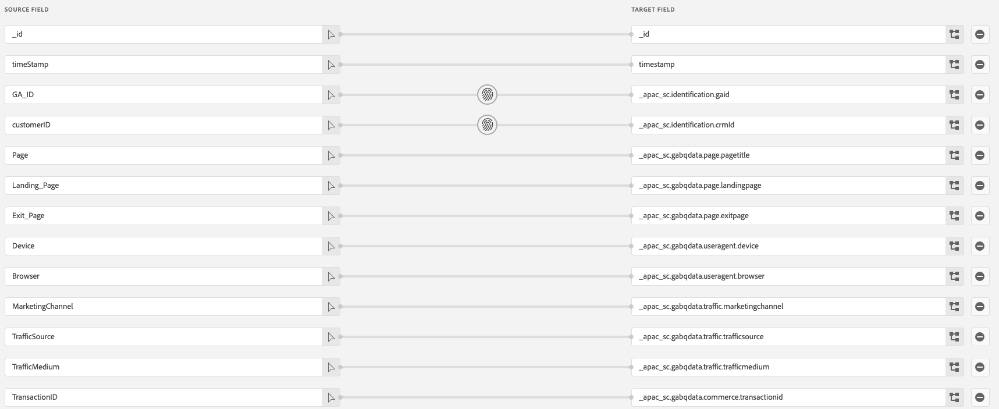

The source fields ``GA_ID`` and ``customerID`` are mapped to an Identifier in this XDM Schema. This will allow you to enrich Google Analytics data (web/app behavior data) with other datasets such as Loyalty or Call Center-data.

Click ``Next``.

## 16.4.3 Connection and the data ingestion scheduling

You'll now see the ``Scheduling``-tab:

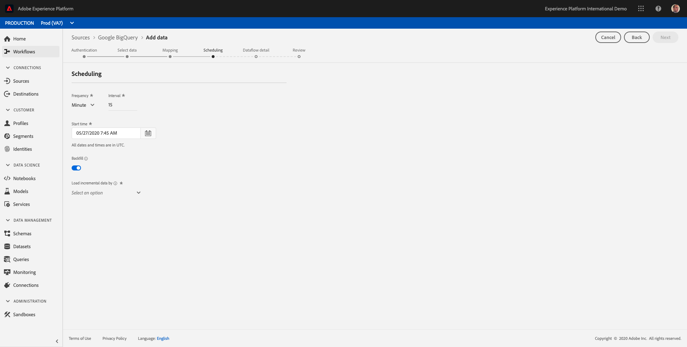

In the ``Scheduling``-tab, you are able to define a frequency for the data ingestion process for this ``Mapping`` and data.

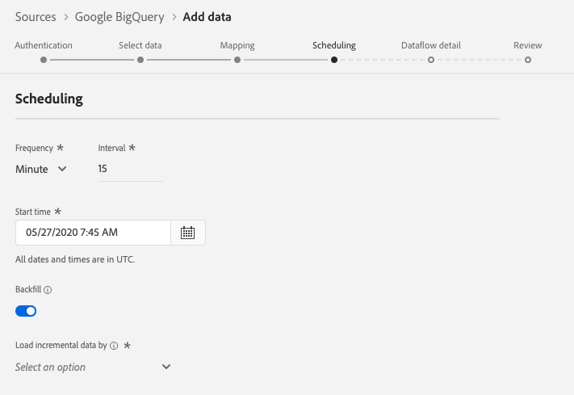

As you're using demo-data in Google BigQuery that won't be refreshed, there's no real need for setting a schedule in this exercise. You do have to select something, and to avoid too many useless data ingestion processes, you need to set the frequency like this:

- Frequency: ``Week``
- Interval: ``200``

**Important**: be sure you activate the ``Backfill``-switch.

Last but not least, you must define a ``delta``-field.

The ``delta``-field is used to schedule the connection and upload only new rows that come into your BigQuery-dataset. A delta field is typically always a timestamp-column. So for future scheduled data ingestions, only the rows with a new, more recent timestamp will be ingested.

Select ``timeStamp`` as the delta-field.

Click ``Next``.

## 16.4.4 Review and launch connection

In the ``Dataset flow detail``-view. you need to name your connection, which will help you to find it later.

Please use this naming convention:

| Field         | Naming| Example|
| ----------------- |-------------| -------------|
| Dataset flow name| DataFlow - ldap - BigQuery Website Interaction | DataFlow - vangeluw - BigQuery Website Interaction  |
| Description | DataFlow - ldap - BigQuery Website Interaction | DataFlow - vangeluw - BigQuery Website Interaction |

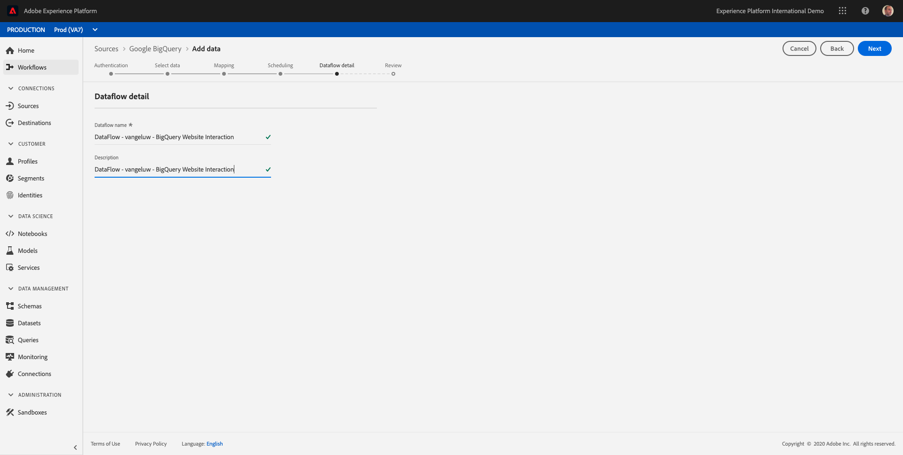

Click ``Next``.

You now see a detailed overview of your connection. Make sure everything is correct before you continue, as some settings can't be changed anymore afterwards, like f.i. the XDM mapping.

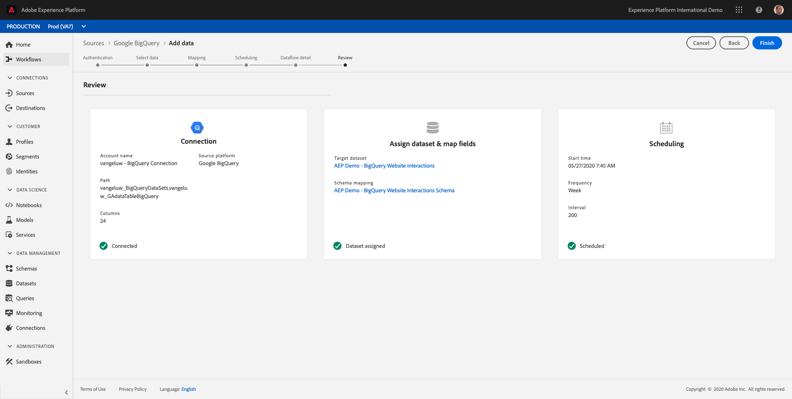

Click ``Finish``.

Setting up the connection may take some time, so don't worry if you see this:

Once the connection has been created, you'll see this:

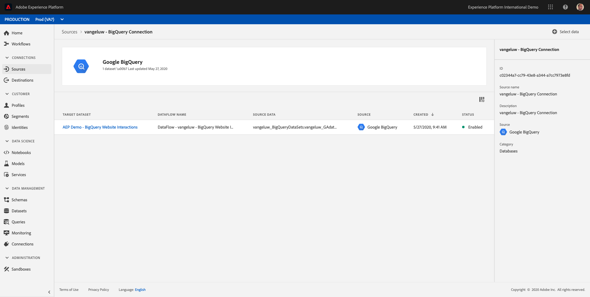

You're now ready to continue with the next exercise, in which you'll use Customer Journey Analytics to build powerful visualizations on top of Google Analytics data.

Exercise 16.5 - [Analyze Google Analytics Data using Customer Journey Analytics](./ex5.md)

[Go Back to Module 16](./README.md)

[Go Back to All Modules](../../README.md)
