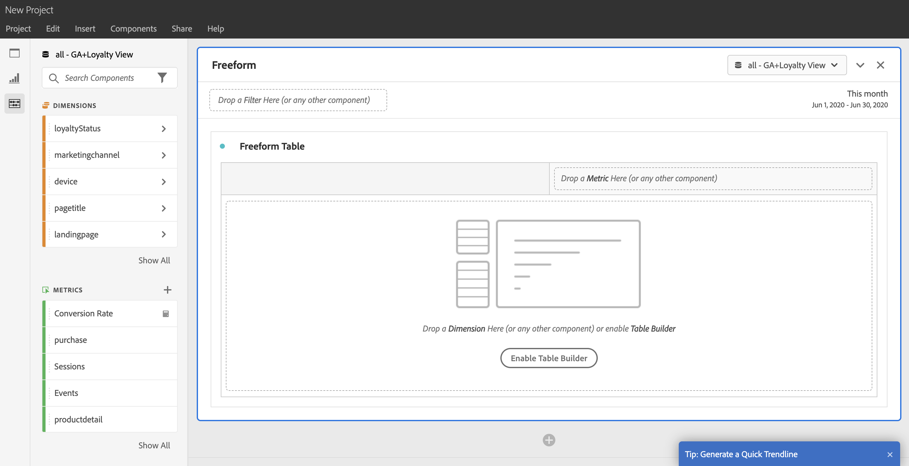
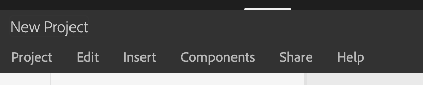
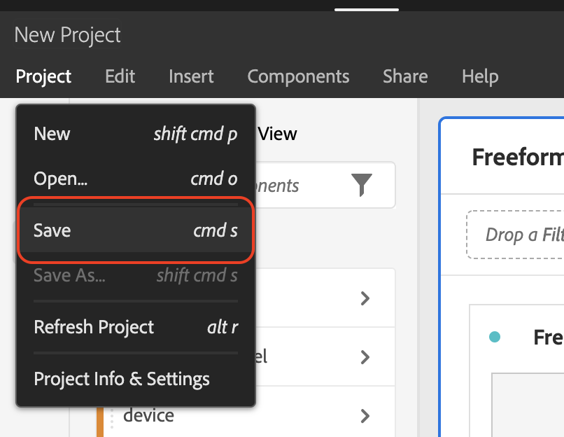
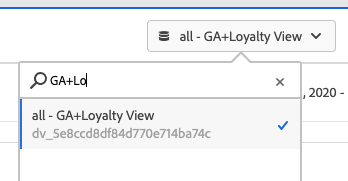

# Exercise 16.5 - Analyze Google Analytics Data using Customer Journey Analytics

## Objectives

- Understand & Use the Customer Journey Analytics UI
- Become familiar with the main Customer Journey Analytics Visualizations
- Understand the value of using Customer Journey Analytics and Adobe Experience Platform to report on Google Analytics Data

## Context

Google Analytics is one of the most used web analytics applications in the world, however is not the most powerful one. We all know Adobe Analytics and its capabilities. 

Thanks to Adobe Experience Platform and the BigQuery Source Connector we can now bring Google Analytics data into Customer Journey Analytics. In addition, we're also able to enrich Google Analytics data by joining it with other data sources such as CRM, Call Center or Loyalty data within Customer Journey Analytics.

## 16.5.1 Log in to Customer Journey Analytics

Go to [analytics.adobe.com](https://experience.adobe.com/#/@experienceplatform/platform/analytics/#/workspace) to access Customer Journey Analytics.

You'll the see the Customer Journey Analytics workspace home page. Please select the project ``ldap - Google Analytics``.

The project ``ldap - Google Analytics`` has been shared to you. However, if you don't see the project with your ldap, please send an email to **sytycd-admins@adobe.com**.

You'll then see this:

## 16.5.2 Behind the scenes of the Analysis Workspace Project

The Customer Journey Analytics-project has been curated by the team behind the Team International AEP Enablement.

The goal of this project is to showcase the analysis we can do using Google Analytics data in combination with the other datasets we have available in Adobe Experience Platform.

We have built a Connection in Customer Journey Analytics that combines the Google Analytics-data that was ingested through the BigQuery Source Connectors (``BigQuery - Website Interactions``-dataset) as part of the previous exercise, and Loyalty Data. 

This Connection is called: ``all - GA + Loyalty Connection`` and you can review it by going through the ``Connections``-tab in Customer Journey Analytics.

When you open this Connection, you'll see these datasets being combined:

These 2 datasets are combined thanks to the identifiers they have: ``CRMID``and ``LoyaltyID``. We used these to fields as the Person ID within the data connection.

Then we created a Data View ``all - GA+Loyalty View`` which is then used for the Customer Journey Analytics-project ``ldap - Google Analytics``.

## 16.5.3 Customer Journey Analytics use-cases with Google Analytics data

To use this project and learn each use case, simply open each panel within Customer Journey Analytics. You'll see all the panels closed. Please click on the arrow to open one by one.

The goal in this section, is to read the explanation on the left side within the ``Text visualization`` on each panel and then see the ``visualization-analysis use case`` on the right side.

Feel free to play around with the visualizations and edit them to check how they have been built. You can also add new dimensions and metrics to complement the analysis.

Once you have finished going through the exercises in your Customer Journey Analytics project, you've successfully finished this module.

Congratulations, you've now finished Module 16!

---

[Go Back to Module 16](./README.md)

[Go Back to All Modules](./../../README.md)
