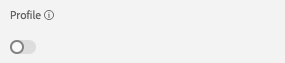
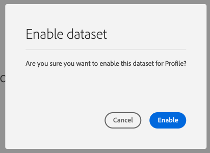
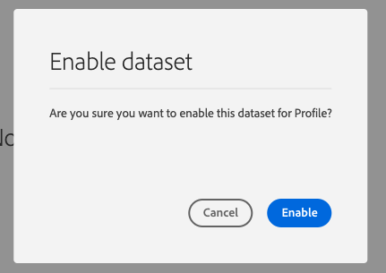

# 2.3 Configure Datasets

In this exercise, you'll configure the required datasets to capture and store profile information and customer behavior. Every dataset that you create in this will use one of the schemas that you built in the previous step.

The URL to login to Adobe Experience Platform is: [https://platform.adobe.com](https://platform.adobe.com).

## Story

After defining what the answer to the questions **Who is this customer?** and **What does this customer do?** should look like, you now need to create a bucket that uses that information, to receive and validate data that was sent to Adobe Experience Platform.

## 2.3.1 - Create Datasets

You now need to create 2 datasets:

* 1 dataset to capture the information that answers the **Who is this customer?** - question.
* 1 dataset to capture the information that answers the **What does this customer do?** - question.

Log in to Adobe Experience Platform by going to this URL: [https://platform.adobe.com](https://platform.adobe.com)
After logging in, you'll land on the homepage of Adobe Experience Platform.

Before you continue, you need to select your own **sandbox**. You can do this by clicking the text **Production Prod (VA7)** in the blue line on top of your screen.

From the list of available sandboxes, select the sandbox that matches the number you've been assigned.

After selecting the appropriate sandbox, you'll see the screen change and now you're in your dedicated sandbox.

In Adobe Experience Platform, click on **Datasets** in the menu on the left side of your screen.

In Datasets, you'll see that no datasets exist yet. 

**Let's start by creating the dataset to capture the Website Registration Information.**

You should create a new dataset. To create a new dataset, click on the button **+ Create Dataset**.

After clicking the **+ Create Dataset** button, you'll see the following screen. 

You have to define a dataset from the schema that you defined in the previous step. Click the **Create Dataset from Schema** - option.

In the next screen, you have to select the schema that you created in 1, **Platform Demo - Website Registrations Schema**.

After selecting the schema, click **Next** to continue.

Let's give a name to your dataset. 

As the name for our dataset, we'll use this:
**Platform Demo - Website Registrations**
  
That should give you something like this:

Click **Finish** to finish your dataset configuration.

Go back to the Datasets overview. You'll now see 1 dataset.

**Next, you'll have to configure a 2nd dataset to capture Website Interactions.**

You should create a new dataset. To create a new dataset, click on the button **+ Create Dataset**.

After clicking the **+ Create Dataset** button, you'll see the following screen. 

You have to define a dataset from the schema that you defined in the previous step. Click the **Create Dataset from Schema** - option.

In the next screen, you have to select the schema that you created in 2.2, **Platform Demo - Website Interactions Schema**.

After selecting the schema, click **Next** to continue.

Let's give a name to your dataset. 

As the name for our dataset, we'll use this:
**Platform Demo - Website Interactions**
  
That should give you something like this:

Click **Finish** to finish your dataset configuration.

You should now have created 2 datasets, and you should see both of them in the Datasets Overview screen.

You now have to enable your datasets to be part of Adobe Experience Platform's Real-time Customer Profile.

Open you dataset **Platform Demo - Website Registrations** by clicking on it.

Locate the Profile switcher icon on the right side of the screen.

Click the Profile switcher to enable this dataset for Profile.

Click the **Enable**.

Your dataset is now enabled for Profile.

Open you dataset **Platform Demo - Website Interactions** by clicking on it.

Locate the Profile switcher icon on the right side of the screen.

Click the Profile switcher to enable Profile.

Click Enable.

Your dataset is now enabled for Profile.

With the datasets created and configured for Profile, you can now continue with the Launch configuration to capture data on your website.

Next Step: [2.4 - Use Launch and the Adobe Experience Platform Extension](./ex4.md)

[Go Back to Module 2](./data-ingestion.md)

[Go Back to All Modules](../../overview.md)
