# Exercise 4 - Create a segment - UI

In this exercise, you'll create a segment by making use of Adobe Experience Platform's new unified segmentation experience.

The URL to login to Adobe Experience Platform is: [https://platform.adobe.com](https://platform.adobe.com)

## Story

In the real-time customer profile, all profile data is shown alongside behavioral and transactional data and the view will also be enriched with existing segment memberships. The data that is shown here comes from anywhere, from any Adobe Solution to any external solution. This is the most powerful view of Adobe Experience Platform: the true Experience System of Record.

Log in to Adobe Experience Platform by going to this URL: [https://platform.adobe.com](https://platform.adobe.com)

After logging in, you'll land on the homepage of Adobe Experience Platform.


Before you continue, make sure you are in the ``Production Prod (VA7)``-environment in the blue line on top of your screen.

In the menu on the left side, go to ```Segments```.

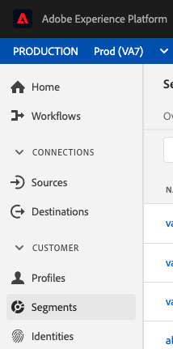

On this page, you can see an overview of all existing segments.

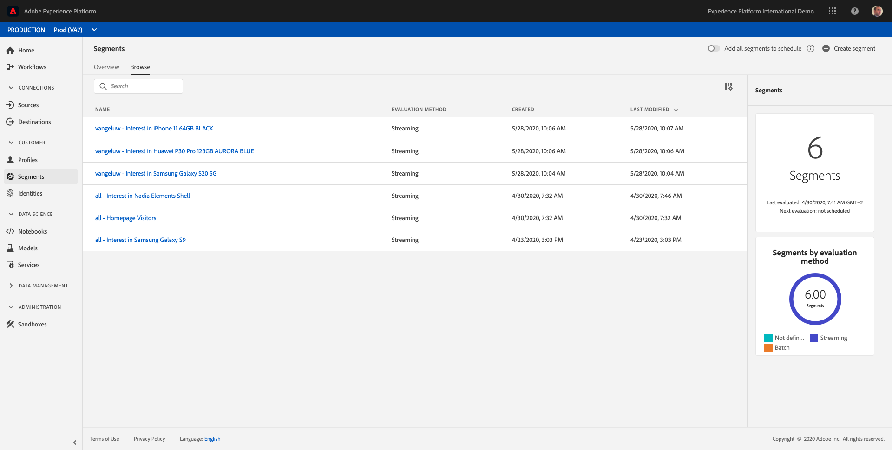

Click on the ``Create Segment``-button to start creating a new segment.

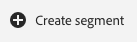

Once you're in the new segment builder, you immediately notice the ```Attributes``` - menu option and the ```XDM Individual Profile```-reference.

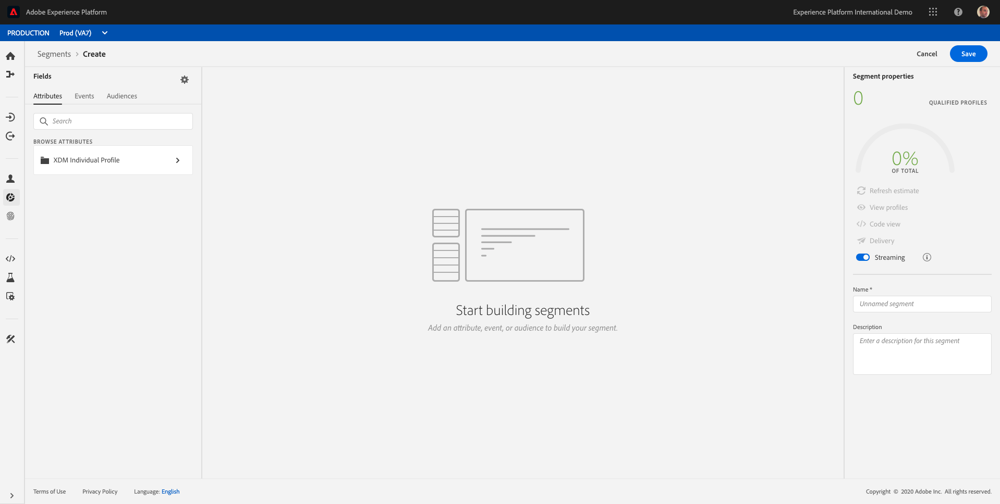

Since XDM is the language that powers the experience business, XDM is also the foundation for the new segment builder. All data that is ingested in Platform should be mapped against XDM, and as such, all data becomes part of the same data model regardless of where that data comes from. This gives us a big advantage when building segments, as from this one segment builder UI, we can combine data from any origin in the same workflow. Segments built within this new, unified segmentation environment can be sent to solutions like Adobe Target, Adobe Campaign and Adobe Audience Manager for activation.

Let's build a segment which includes all **male** customers.

To get to the attribute gender, you need to understand and know XDM.

Gender is an attribute of Person, which can be found under Attributes. So to get there, you'll start by clicking on ``XDM Individual Profile``.

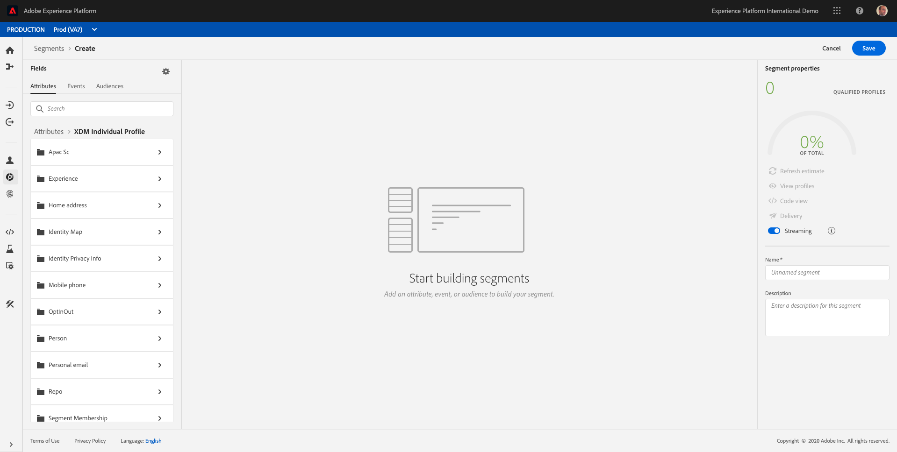

From the XDM Individual Profile-window, you can select Person now.

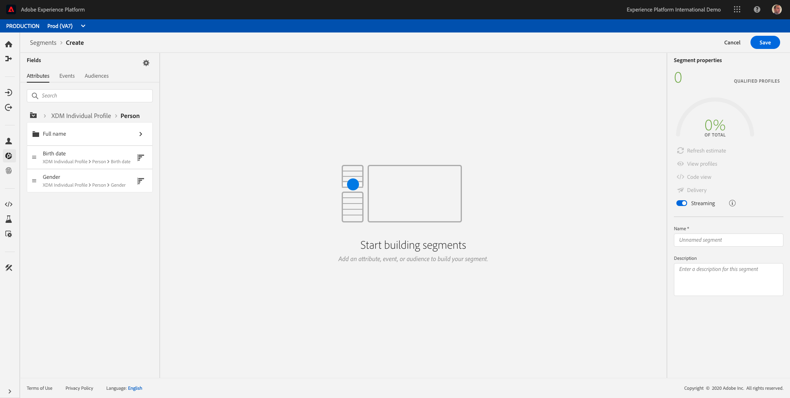

And in Person, you can find the Gender-attribute. Drag the Gender-attribute on the segment builder.

Now you can choose the specific gender out of the pre-populated options. In this case, let's pick ``Male``.

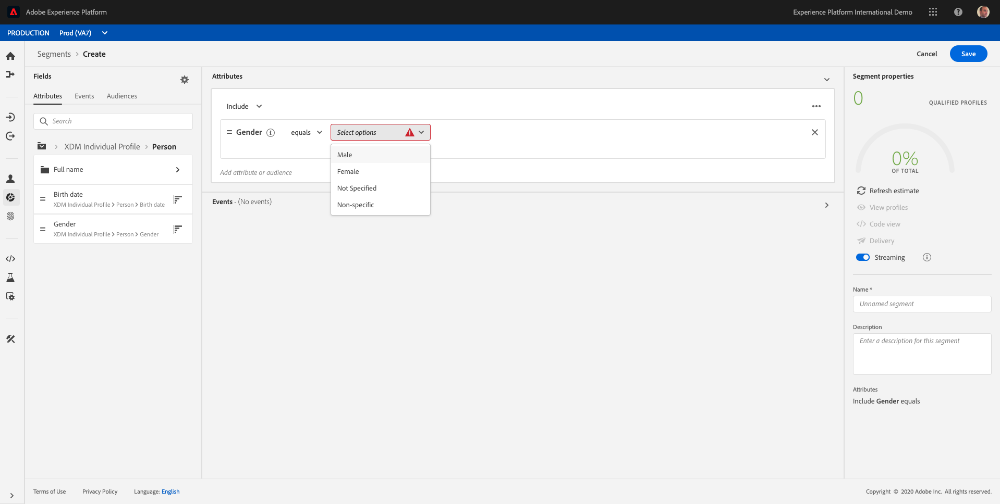

After selecting ``Male``, you can get an estimation of the segment's population by pushing the ``Refresh Estimate`` - button. This is very helpful for a business audience, so that they understand the impact of certain attribute selections on segment size and addressable audience.

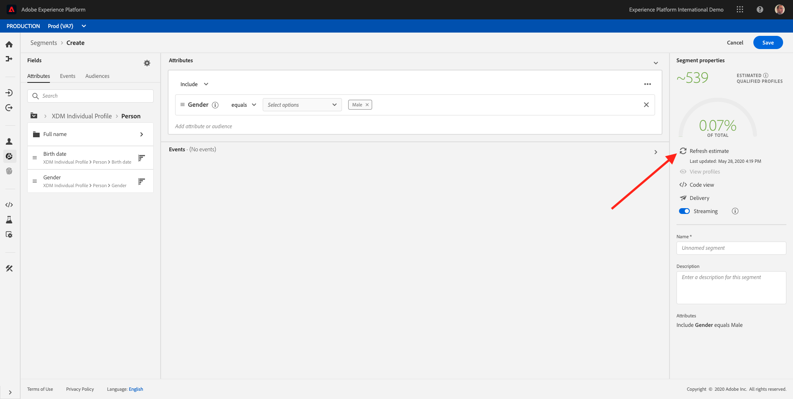

Next, we should refine our segment a bit. I'd like to build a segment out of all male customers that have viewed the product ``Proteus Fitness Jackshirt (Orange)``.

To build out this segment, you need to add an Experience Event. You can find all Experience Events by clicking on the ```Events``` - icon in the ```Segments``` - menu bar.

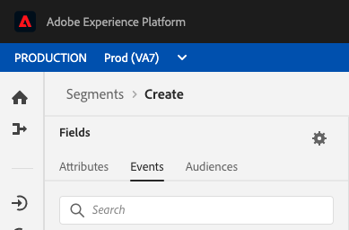

Next, you'll see the top level ``Experience Events``-node.

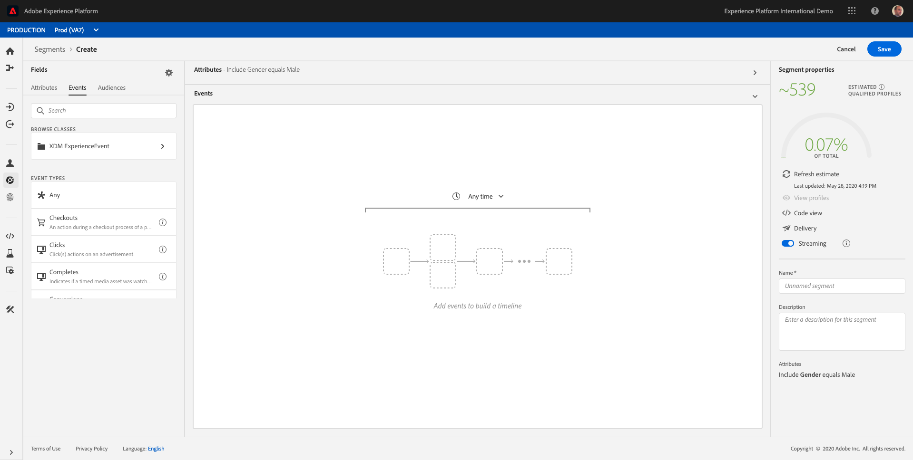

To find customers that have visited the ```Proteus Fitness Jackshirt (Orange)``` - product, click on ```XDM ExperienceEvent```.

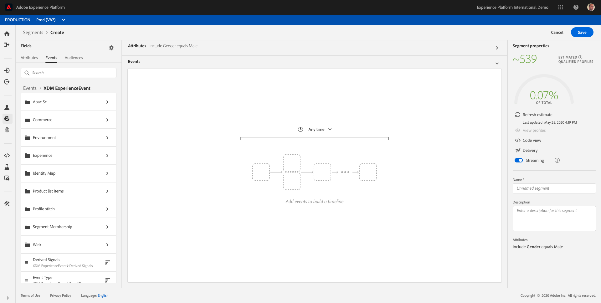

Go to ```Product List Items```.

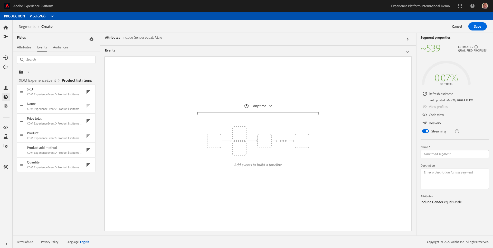

Select ```Name``` and drag and drop the ```Name```-object from the left ```Product List Items``` - menu onto the segment builder canvas into the ```Events```- section.

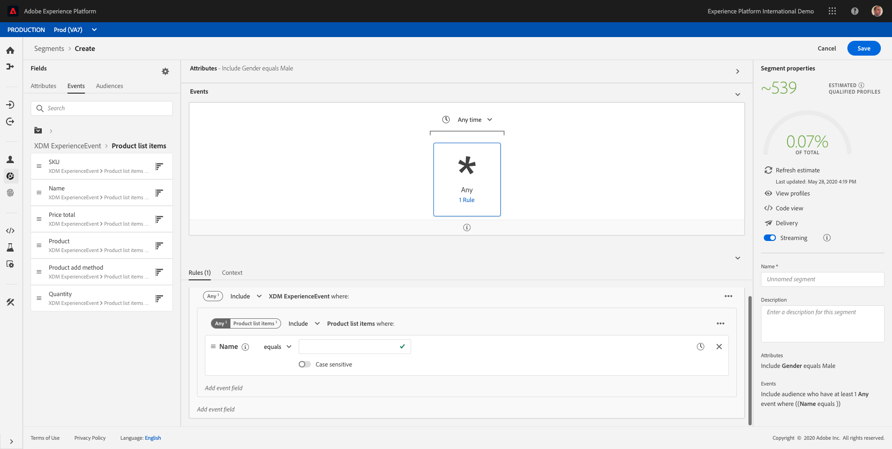

The comparison parameter should be ```equals``` and in the input field, enter ```Proteus Fitness Jackshirt (Orange)```.

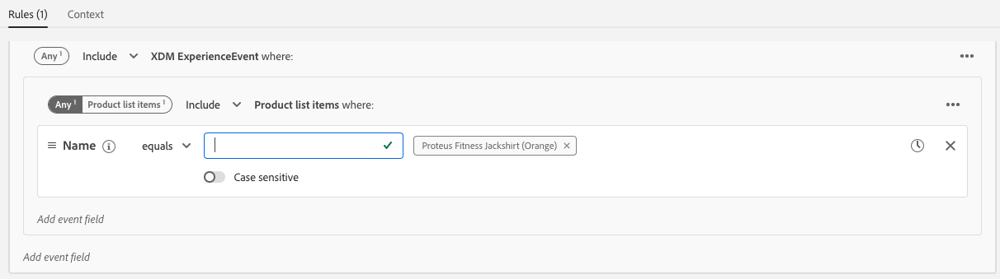

Every time you add an element to the segment builder, you can click the ``Refresh Estimate``-button to get a new estimate of the population in your segment.

So far, we've only used the UI to build our segment, but there's also a code-option to build a segment.
When building a segment, we're actually composing a PQL query: Profile Query Language. To visualize the PQL code, you can click on the ``Code View`` switcher in the upper right corner of the segment builder.

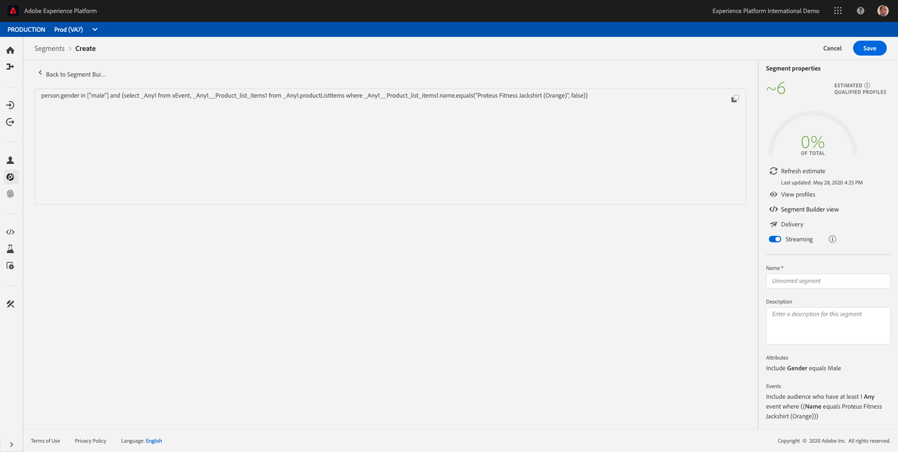

Now you can see the full PQL-statement:

```pql
person.gender in ["male"] and (select _Any1 from xEvent, _Any1__Product_list_items1 from _Any1.productListItems where _Any1__Product_list_items1.name.equals("Proteus Fitness Jackshirt (Orange)", false))
```

You can also preview a sample of the customer profiles that are part of this segment, by clicking on ``View Profiles``.


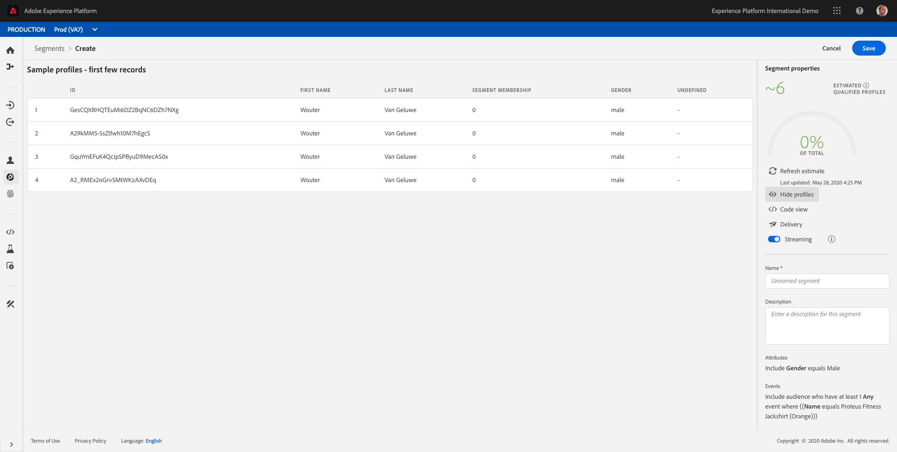

Finally, let's give your segment a name and save it.

As a naming convention, we'll use:

* all - Male customers with interest in Proteus Fitness Jackshirt (Orange) - ldap

Please replace **ldap** with your ldap.

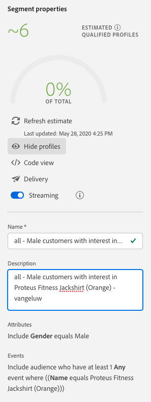

It's also important to note the ``Streaming`` - switch.

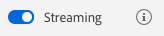

By enabling the ``Streaming``-switch, your segment will qualify in real-time and will be available for activation in real-time.

Then, click the ```Save``` - button to save your segment, after which you'll be taken back to the Segment overview - page.

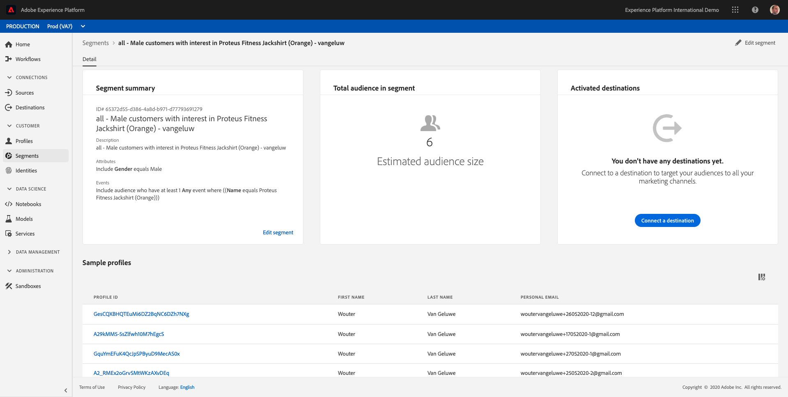

Let's now continue to the next exercise and build a segment through the API.

---

Next Step: [Exercise 5 - Create a segment - API](./ex5.md)

[Go Back to Foundation 2](./README.md)

[Go Back to All Modules](../../README.md)
