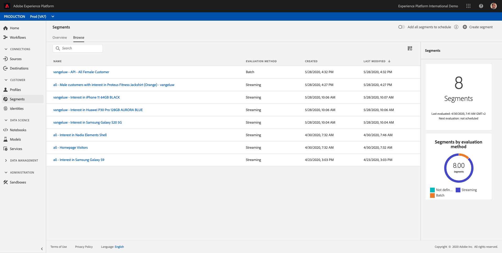
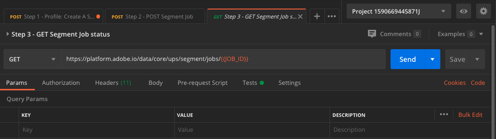

# Exercise 5 - Create a segment - API

In this exercise, you'll use Postman and Adobe I/O to create a segment and store the results of that segment as a dataset, by making use of Adobe Experience Platform's API's.

## Story

In the real-time customer profile, all profile data is shown alongside behavioral and transactional data and the view will also be enriched with existing segment memberships. The data that is shown here comes from anywhere, from any Adobe Solution to any external solution. This is the most powerful view of Adobe Experience Platform: the true Experience System of Record.

## Exercise 5.1 - Create a segment through the Platform API

Go to Postman.

Locate the collection: ```_Adobe Experience Platform Enablement```. In this collection, you'll see a folder ```2. Segmentation```. We'll be using these calls in this exercise.


What we'll do next is follow all the required steps to create a segment through the API. We're going to build a simple segment: "**ldap** - All Female Customers".

### Step 1 - Create a Segment Definition

Click on the call named ```Step 1 - Profile: Create A Segment Definition```.


Go the the ```Body``` section of this call.


In the ```Body``` of this call, you'll see the following:


The language used for this call is called ```PQL```: Profile Query Language.
You can find more info and documentation about PQL [here](https://www.adobe.io/apis/experienceplatform/home/profile-identity-segmentation/profile-identity-segmentation-services.html#!api-specification/markdown/narrative/technical_overview/unified_profile_architectural_overview/unified_profile_pql.md).

Attention: please update the variable **name** in the below call by replacing **ldap** with your specific **ldap**.

```json
{
    "name" : "ldap - API - All Female Customer",
    "expression" : {"type":"PQL", "format":"pql/json", "value":"{\"nodeType\":\"fnApply\",\"fnName\":\"in\",\"params\":[{\"nodeType\":\"fieldLookup\",\"fieldName\":\"gender\",\"object\":{\"nodeType\":\"fieldLookup\",\"fieldName\":\"person\",\"object\":{\"nodeType\":\"literal\",\"literalType\":\"XDMObject\",\"value\":\"profile\"}}},{\"literalType\":\"List\",\"nodeType\":\"literal\",\"value\":[\"female\"]}]}"},
    "createdBy": "ldap",
    "schema" : { "name" : "_xdm.context.profile"},
    "ttlInDays" : 90
}
```

After adding your specific **ldap**, the Body should look similar to this:

```json
{
    "name" : "vangeluw - API - All Female Customer",
    "expression" : {"type":"PQL", "format":"pql/json", "value":"{\"nodeType\":\"fnApply\",\"fnName\":\"in\",\"params\":[{\"nodeType\":\"fieldLookup\",\"fieldName\":\"gender\",\"object\":{\"nodeType\":\"fieldLookup\",\"fieldName\":\"person\",\"object\":{\"nodeType\":\"literal\",\"literalType\":\"XDMObject\",\"value\":\"profile\"}}},{\"literalType\":\"List\",\"nodeType\":\"literal\",\"value\":[\"female\"]}]}"},
    "createdBy": "vangeluw",
    "schema" : { "name" : "_xdm.context.profile"},
    "ttlInDays" : 90
}
```

Now, click the blue ```Send``` - button to create the segment and view the results of that.


After this step, you can view your Segment Definition in the Platform UI. To check this, log in to Platform and go to [https://platform.adobe.com/segment](https://platform.adobe.com/segment).



### Step 2 - Create a Segment POST Job

In the previous exercise, you've created a Streaming Segment. A Streaming Segment continuously evaluates qualifications in real-time. What you're doing here, is creating a Batch Segment. Batch Segments definitions don't mean that the segment has actually run, it only gives you a preview of what the segment could look like in terms of qualifications. At this moment, nobody qualifies for this segment. To make people qualify, the Batch Segment needs to run, which is exactly what we'll do here.

Let's now POST a Segment Job.

Go to Postman.


In your Postman-collection, click on the call named ```Step 2 - POST Segment Job``` to open it.


Click on the blue ```Send``` - button.

You should see a similar result:


This Segment Job is now running, and this may take some time. In Step 3, you'll be able to check the status of this job.

### Step 3 - GET Segment Job status

Go to Postman.


In your Postman-collection, click on the call named ```Step 3 - GET Segment Job status```.



Click on the blue ```Send``` - button.

You should see a similar result:


In this example, the ```status``` of the job is set to ```QUEUED```.

Repeat this call by clicking the blue ```Send``` - button every couple of minutes until the ```status``` is set to ```SUCCEEDED```.


Once the status is ```SUCCEEDED```, your segment job has run and customers are now qualifying for the segment.

Congrats, you've successfully completed the Segmentation exercise. Let's now have a look how the Real-Time Customer Profile can be activated across the enterprise.

Next Step: [Exercise 6 - See you Real-time Customer Profile in action in the Call Center](./ex6.md)

[Go Back to Foundation 2](./README.md)

[Go Back to All Modules](../../README.md)
