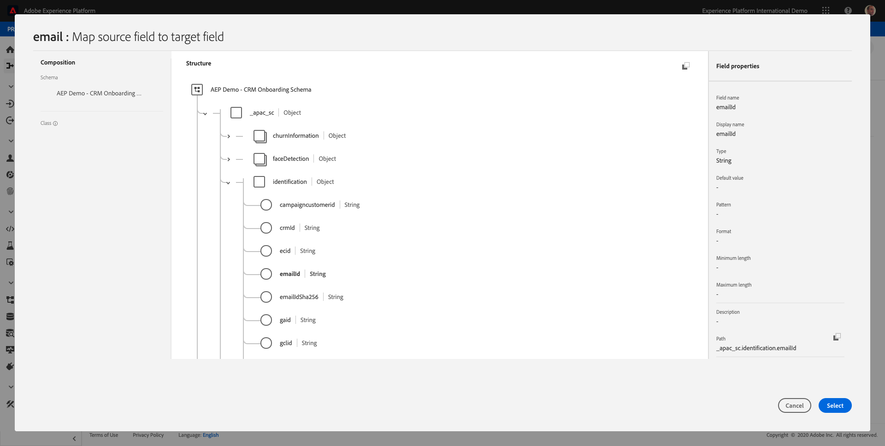
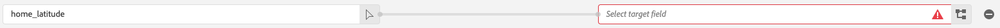
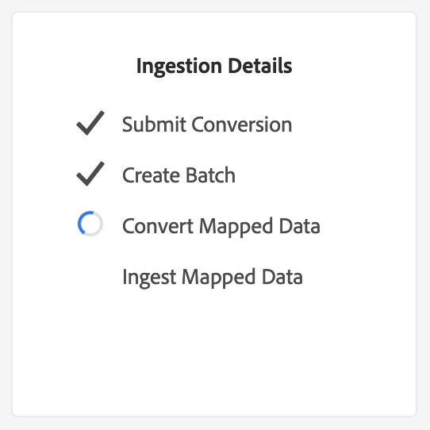

# Exercise 5: Data Ingestion from Offline Sources

In this exercise, the goal is to onboard external data like CRM Data in Platform.

## Learning Objectives

* Learn how to generate your demo data
* Learn how to ingest CSV
* Learn how to use the web UI for data ingestion through Workflows
* Understand the data governance features of Experience Platform

## Lab Resources

* Mockaroo UI: [https://www.mockaroo.com/](https://www.mockaroo.com/)
* Experience Platform UI: [https://platform.adobe.com/](https://platform.adobe.com/)

## Lab Tasks

* Create a CSV file with demo date. Ingest the CSV file in the Experience Platform UI by making use of the available workflows.
* Understand data governance options in Experience Platform UI

## Exercise 5.1 - Create your CRM Dataset through a data generator tool

For this exercise you need 1000 sample lines of CRM Data.

Open the Mockaroo Template by going to [https://www.mockaroo.com/12674210](https://www.mockaroo.com/12674210).


On the template, you'll notice the following fields:

* id
* first_name
* last_name
* email
* gender
* birthDate
* home_latitude
* home_longitude
* country_code
* city
* country

All these fields have been defined to produce data that is compatible with Platform.


To generate your CSV-file, click the ``Download Data``-button which will give you a CSV-file with 1000 lines of demo-data.

Open your CSV-file in Microsoft Excel to visualize its contents.


With your CSV-file ready, you can proceed with mapping it against XDM.

## Exercise 5.2 - Verify the CRM Onboarding Dataset in Adobe Experience Platform

Open [Adobe Experience Platform
](https://platform.adobe.com) and go to ``Datasets``.

Before you continue, make sure you are in the ``PRODUCTION Prod``-environment in the blue line on top of your screen.

We're going to use a shared dataset based in this enablement. The shared dataset has been created already and is called ``AEP Demo - CRM Onboarding``.


Open the dataset ``AEP Demo - CRM Onboarding``.


On the overview screen, you can see 3 main pieces of information.


First of all, the Dataset Activity dashboard shows the total number of CRM records in the dataset and the ingested batches and their status


Second, by scrolling down on the page you can check when batches of data were ingested, how many records were onboarded and also, whether or not the batch was successfully onboarded. The ``Batch ID`` is the identifier for a specific batch job, and the ``Batch ID`` is important as it can be used for troubleshooting why a specific batch was not successfully onboarded. More on that in Enablement Module 2.


Lastly, the Dataset Info tab shows important information like the Dataset ID (again, important from a troubleshooting perspective), the Dataset's Name and whether the dataset was enabled for Unified Profile and Streaming Ingestion.


Enabling a dataset for Streaming Ingestion can currently only be done through the API's.

The most important setting here is the link between the dataset and the Schema. The Schema defines what data can be ingested and how that data should look like.

In this case, we're using the ``AEP Demo - CRM Onboarding Schema``, which is mapped against the class of ``Profile`` and has implemented extensions, also called mixins.


By clicking on the name of the schema, you're taken to the Schema overview were you can see all the fields that have been activated for this schema.


Every schema needs to have a custom, primary descriptor defined. In the case of our CRM dataset, the schema has defined that the field ``email`` should be the primary identifier. If you want to create a schema and link it to the Unified Profile, you need to define a custom Mixin that refers to your primary descriptor.


In the above screenshot, you can see that our descriptor is located in ```<aepTenantId>.identification.emailId```, which is set as the Primary Identifier, linked to the namespace of ``email``.

Every schema and as such, every dataset that should be used in the Unified Profile should have 1 Primary identifier. This Primary Identifier is the identifier user by the brand for a customer in that dataset. In the case of a CRM dataset it might be the email-address or the CRM ID, in the case of a Call Center dataset it might be the mobile number of a customer.

It is best practice to create a separate, specific schema for every dataset and to set the descriptor for every dataset specifically to match how the current solutions used by the brand operate.

## Exercise 5.3 - Using a workflow to map a CSV file to an XDM Schema

The goal of this exercise is to onboard CRM data in Platform. All the data that is ingested in Platform should be mapped against the specific XDM Schema. What you currently have is a CSV dataset with 1000 lines on the one side, and a dataset that is linked to a schema on the other side. To load that CSV file in that dataset, a mapping exercise needs to take place. To facilitate this mapping exercise, we have ``Workflows`` available in Platform.


The workflow that we'll use here, is the workflow named ``Map CSV to XDM Schema`` in the Data Ingestion menu.

Click the ``Map CSV to XDM Schema``-button.


Click ``Launch`` to start the process.


Drag & Drop your CSV-file or click ``Browse`` and navigate on your computer to your desktop and select your CSV-file.


After selecting your CSV-file it will upload immediately and you will see a preview of your file within seconds.


Click ``Next`` to go to the next step. It can take a few seconds while the file is processed completely.


On the next screen, you need to select a dataset to ingest your file in. You have the choice between selecting an already existing dataset or creating a new one. For this exercise, we'll reuse an existing one: please select the ``AEP Demo - CRM Onboarding``-dataset as indicated below.


Click ``Next`` to go to the next step.


It's now time to map our CSV Column Headers with an XDM-property in our ``AEP Demo - CRM Onboarding Schema``.
Platform has already done some guessing for us, by trying to link the Source Attributes with the Target Schema Fields.


First of all, we need to add the required mapping for the descriptor field. The descriptor field is a required field in this workflow and expects you to indicate what the main identifier is of the file you're uploading.

Selecting the descriptor is actually the most important thing: you'll be defining the custom, brand-specific, primary identifier. Within Platform-context, we refer to this custom, brand-specific, primary identifier as the descriptor. The descriptor is a requirement for this data to be onboarded. Without the presence of the descriptor, the ingestion of this CSV-file will fail.
Our descriptor for the ``AEP Demo - CRM Onboarding``-dataset is the ``email`` as it's the unique identifier for our dataset.
In our case, based on the selection of the dataset and the schema that is linked to the dataset, the required Target Schema Field in XDM is ``<aepTenantId>.identification.emailId``. You need to map the ``email``-field from your CSV file as the source attribute for this required Target Schema Field.

To do this, click the ``Add new mapping``-button.


In the Source Field, click the ``arrow``-icon.


In the popup, select the field ``email``.


You'll then see this. Click the ``schema``-icon.


In the popup, select the field ``<aepTenantId>.identification.emailId``.



The result should look like this:


For the Schema Mappings, Platform has tried to link fields together already. However, not all proposals of mapping are correct.


For the Source Attribute ``email``, the Target Schema Field should be ``personalEmail.address``. You can either enter ``personalEmail.address`` in the field, or you can click the icon to visually locate the correct property in the ``AEP Demo - CRM Onboarding Schema``.


You also need to update 2 fields: ``home_latitude`` and ``home_longitude`` haven't been filled out by the Mapper tool.

Locate the ``home_latitude``-line.



Click the ``schema``-icon:


Locate the property ``homeAddress._schema.latitude`` by making use of the visual mapping tool.


Click ``Select`` to confirm your choice. You should then see this:


Repeat the process for the Source Field ``home_longitude``, linking it to the Target Field of ``homeAddress._schema.longitude`` so that you have this as a result:


And this should be the overall result of the mapping exercise:


Click ``Next`` to go to the next step.


On the next screen you'll see an overview of what you've done and you can start the ingestion.


Click the ``Ingest``-button.


Ingestion starts and will be running for a number of seconds/minutes (depending on file-size).



After a couple of minutes, the file will be successfully ingested.


Click the ``Finish``-button to finish the workflow.


After clicking ``Finish``, you're taken to your dataset.


On the dataset, you'll see a Batch ID that was ingested just now, with 1000 records ingested and a status of ``Success``.


Click on the ``Preview Dataset``- button to get a quick view of a small sample of the dataset to ensure that the loaded data is correct.


Once data is loaded, we can define the correct data governance approach for our dataset.

## Exercise 5.4 - Adding data governance to your dataset


Now that our customer data is ingested, we want to make sure that this dataset is properly governed for usage and export control. Click on the ``Data Governance`` tab and observe that we can set three types of restrictions: Contractual, Identity, and Sensitive Data.

You can find more info on the different labels and how they will be enforced in the future through the policy framework on this link: [https://www.adobe.io/apis/experienceplatform/home/dule/duleservices.html](https://www.adobe.io/apis/experienceplatform/home/dule/duleservices.html)


Let's restrict identity data for the entire dataset. Hover over your dataset name, and click the Pencil icon to edit the settings.


Go to ``Identity Data`` and you'll see that the ``I2`` option is checked - this will assume that all pieces of information in this dataset are _at least_ indirectly identifiable to the person.


Click ``Save Changes`` and observe that ``I2`` is now set for all data fields in the dataset.

You can also set these flags for individual data fields - for example, the ``firstName`` field is likely to be classified as an ``I1`` level for directly identifiable information.

Select the field ``firstName`` by checking the checkbox and click on ``Edit Governance Labels`` in the upper right corner of your screen.


Go to ``Identity Data`` and you'll see that the ``I2`` option is already checked (inherited from the dataset). The field firstName also has a field-specific configuration and is set as ``I1 - Directly Identifiable Data``.


With this, you've now successfully ingested and classified CRM Data in Adobe Experience Platform.

[Go Back to Module 1](./data-ingestion.md)

[Go Back to All Modules](../../README.md)
