# 3.1 - From unknown to known on the website

## **Context:**

The journey from unknown to known is one of the most important topics amongst brands these days, as is the customer journey from acquisition to retention. 

Adobe Experience Platform plays a huge role in this journey. Platform is the brains for communication, the Experience System of Record.

Platform is an environment in which the word **customer** is broader than just the **known**-customers. This is a very important thing to mention when speaking to brands: an unknown visitor on the website is also a customer from Platform's perspective and as such, all of the behavior as an unknown visitor is also sent to Platform. Thanks to that approach, when this customer eventually becomes a known customer, a brand can visualize what happened before that moment as well. This helps from an attribution and experience optimization perspective.

## **What are you going to do?**

You will now ingest data into Adobe Experience Platform and that data will be linked to identifiers like ECIDs and email-addresses. The goal of this exercise is to understand the business context of what you're about to do from a configuration perspective. In the next exercise, you'll start configuring everything you need to make all that data ingestion possible in your own sandbox environment.

## **Customer Journey flow:**

* Go to your AEP Demo website.

* You'll be redirected to the **Admin**-page

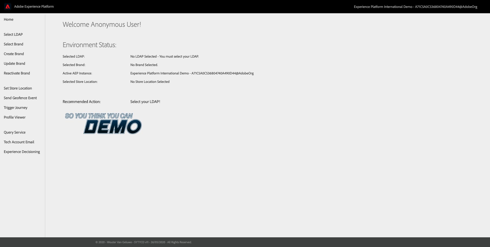
  
* On the **Admin**-page, click **Select LDAP**.
  

  
* Select your LDAP from the list of available LDAPs. Click **Save**.
  
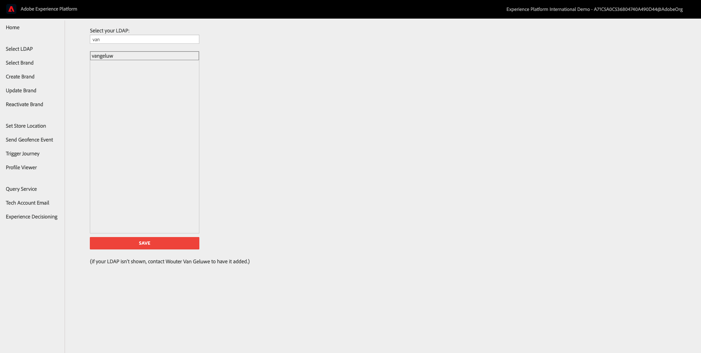
  
* back on the **Admin**-page, click **Select Brand**.
  
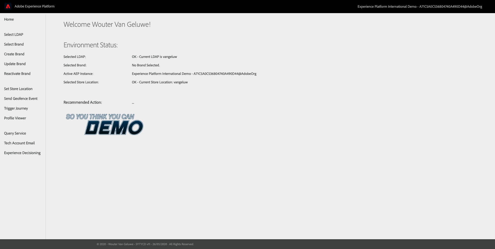
  
* Select the brand **Luma Retail** from the list of available brands. Click **Save**.
  
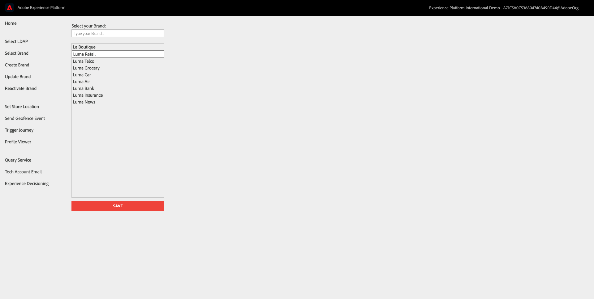
  
* Wait 10 seconds for the brand to load. You'll then be redirected to the Admin homepage.
  
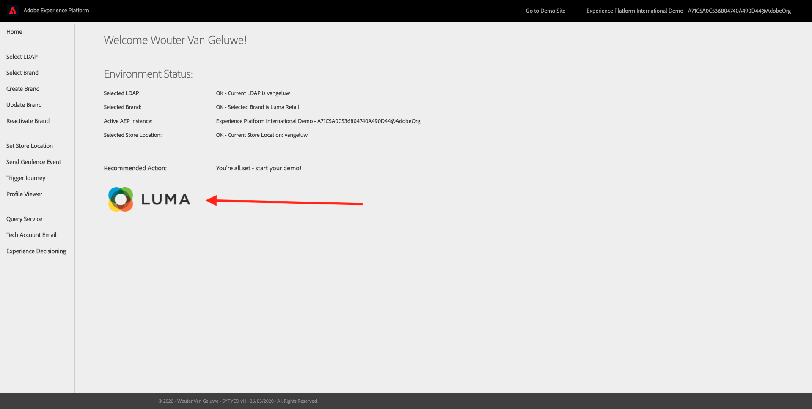
  
* Click the **Luma**-logo to go to the demo website. You'll then see this:
  
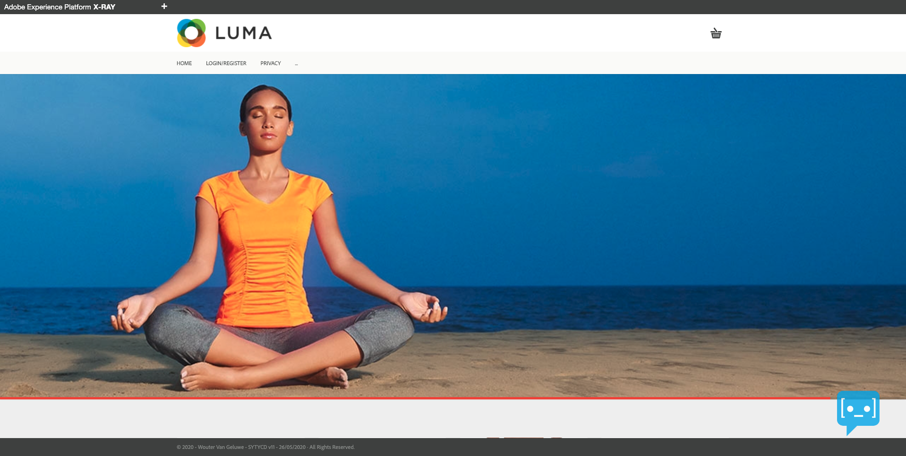
  
* Have a look at the X-ray panel and the Real-time Customer Profile:
  * **ECID** as the internal Adobe identifier
      

* You'll also see Experience Events

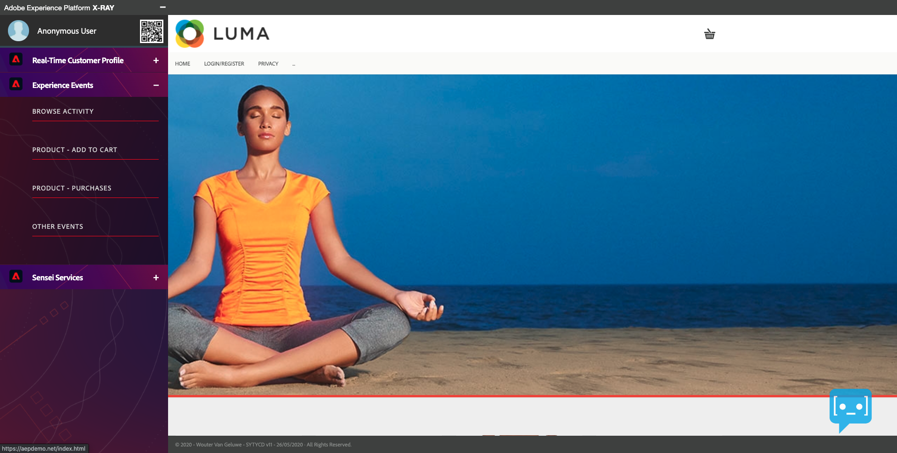
  
* Scroll down on the page until you see the products, click on the product **Nadia Elements Shell**.
  
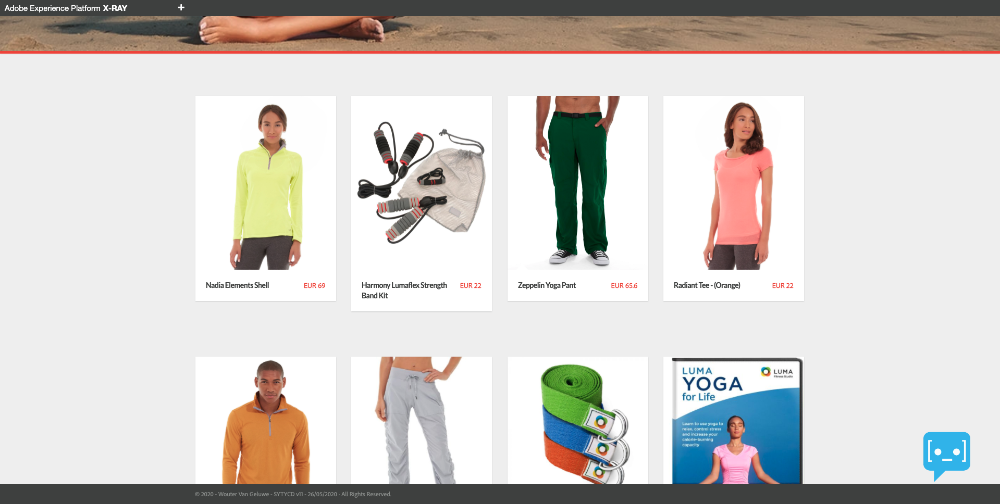
  
* Have a look at the product. An Experience Event of type **Product View** has been sent by to Adobe Experience Platform. 
  
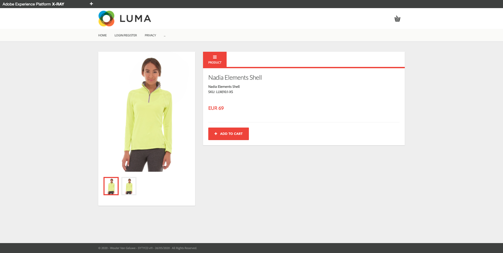
  
* Next, go to the Homepage. Open the X-ray panel and have a look at your **Experience Events**.
  

  
* On the **Home**-page, click another product. Another Experience Event has been sent to Adobe Experience Platform. 
  
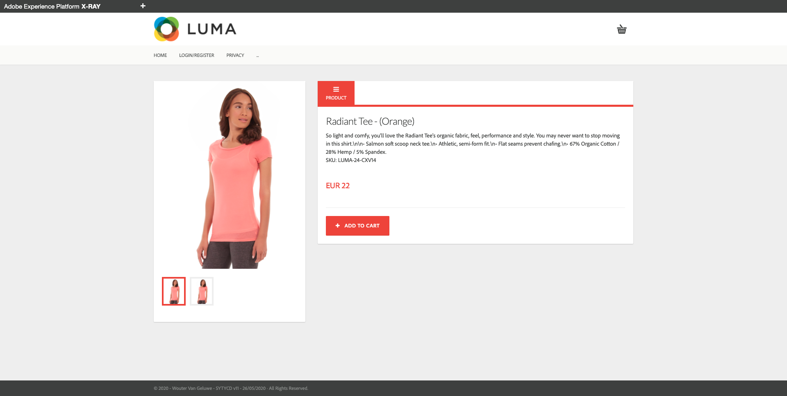
  
* Go back to the Homepage and open the X-ray panel. You'll now see 2 Experience Events of type **Product View**. While the behavior is anonymous, we're able to track every click and store it in in Adobe Experience Platform. Once the anonymous customer becomes known, we'll be able to merge all anonymous behavior automatically to the know profile.
  
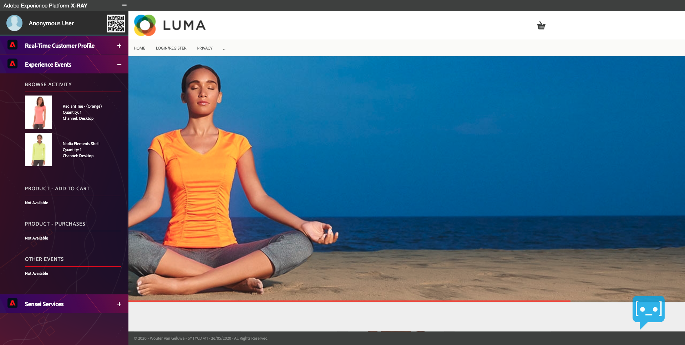

* Go to the Register/Login page. Fill out your registration details and click **CREATE ACCOUNT**.
  
 
  
* After clicking **Create Account**, you'll be redirected to the homepage. Open the X-ray panel and go to Real-time Customer Profile. On the X-ray panel, you should see all of your personal data displayed.
  
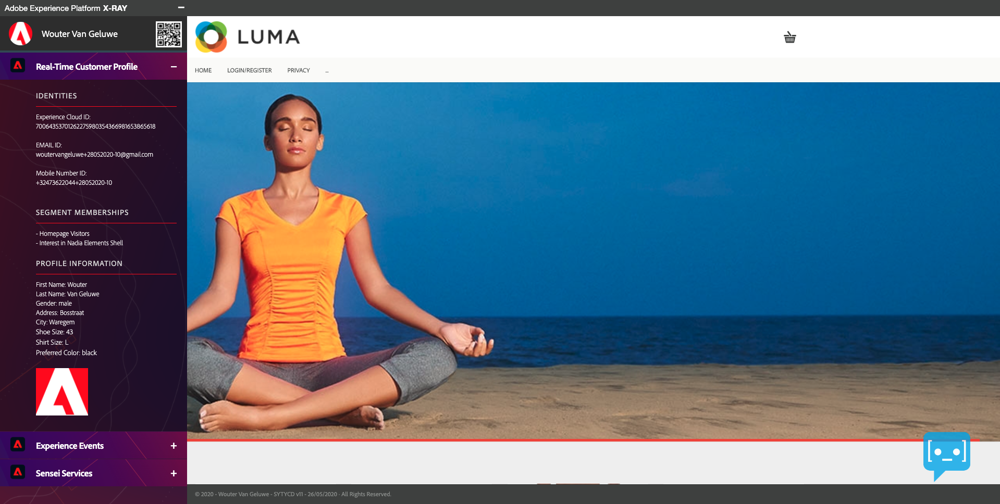

* On the X-ray panel, go to Experience Events. You should see the 2 products that you viewed before on the X-ray panel.

After becoming a known customer, it's time to open the mobile app on your iPhone and then login to the app. 

* You'll now see an updated homepage of the app, which matches the products and brand of the website you selected on the website.
  

* Go to the Account-screen.
  
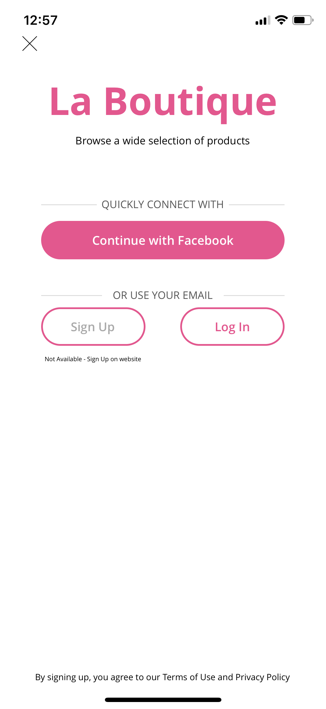

* Login with the Email ID you used in the previous exercise and the password of 1234.
  
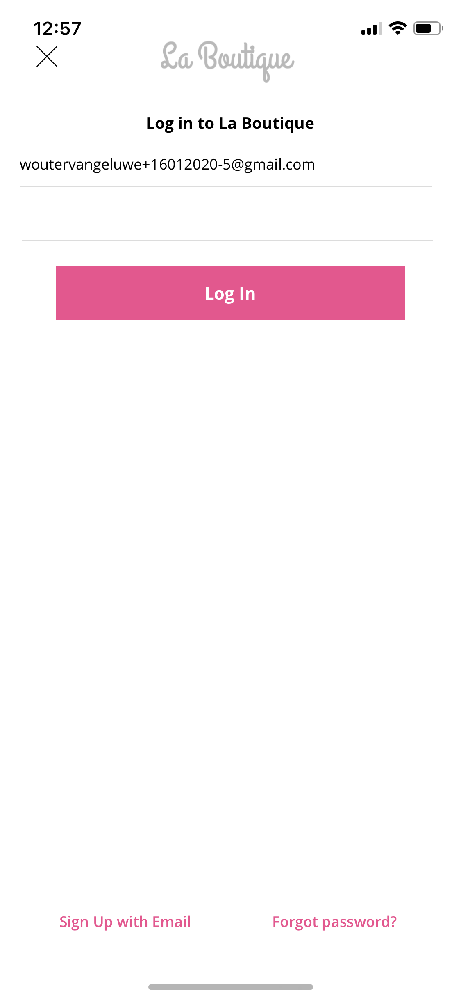

* See your Real-time Customer Profile data appear in the application, along with your Desktop Product Views

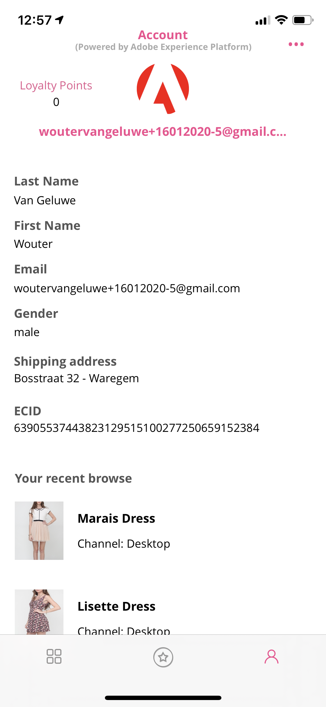

* Go to the app's Homepage
  

* Go to any category
  

* Click on a product to view it.
  

* Go back to the previous screen
  

* Go to the Account-screen and your Real-time Customer Profile data will be refreshed, after which you'll see the product you just viewed, be part of your Experience Events.
  
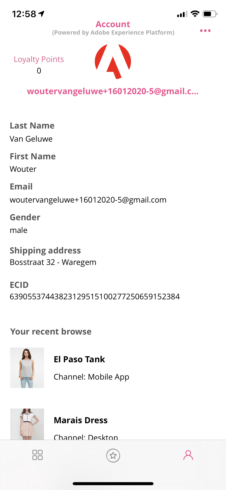

* Now go back to your desktop computer and refresh the homepage, after which you'll see the Carstensen product also appear there.
  
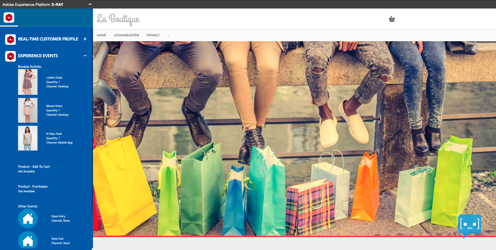
  
You've now ingested data into Adobe Experience Platform and you've linked that data to identifiers like ECIDs and email-addresses. The goal of this exercise is to understand the business context of what you're about to do. You've now effectively built a Real-time, Cross-Device Customer Profile. In the next exercise, you'll go ahead and visualize your profile by making use of Adobe Experience Platform.

Next Step: [3.2 Visualize your own real-time customer profile - UI](./ex2.md)

[Go Back to Module 3](./real-time-customer-profile.md)

[Go Back to All Modules](../../overview.md)
