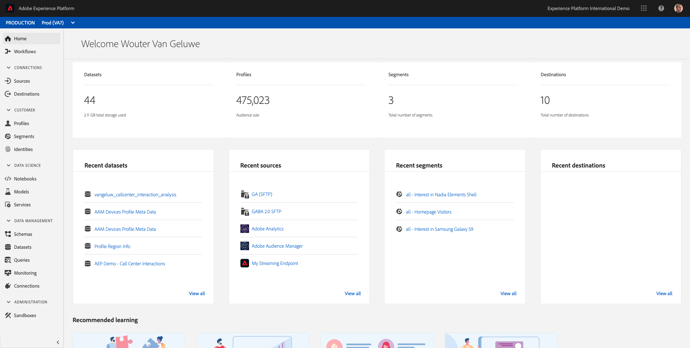

# 3.2 - Visualize your own Real-Time Customer Profile - UI

In this exercise, you'll login to Adobe Experience Platform and you'll view your own Real-Time Customer Profile in the UI.
 
## Story

In the real-time customer profile, all profile data is shown alongside behavioral and transactional data and the view will also be enriched with existing segment memberships. The data that is shown here comes from anywhere, from any Adobe solution to any external solution. This is the most powerful view of Adobe Experience Platform: the true Experience System of Record.

## 3.2.1 - Use the Customer Profile View in Adobe Experience Platform

In Adobe Experience Platform there's a new feature of visualizing the entire real-time customer profile. This one feature is what all of our customer's have been trying to get for years: a single view of the customer.

Log in to Adobe Experience Platform by going to this URL: [https://platform.adobe.com](https://platform.adobe.com).

After logging in, you'll land on the homepage of Adobe Experience Platform.

Before you continue, make sure you are in the **Production Prod (VA7)**-environment in the blue line on top of your screen.

In the menu on the left side, go to **`Profiles**`.

Go to **Browse**.

On the X-ray panel on your website, you can find multiple identities. Every Identity is linked to a namespace. 

On the X-ray panel, we can see 4 different combinations of ID's and Namespaces:

| Identity     | Namespace       |
|:-------------:| :---------------:|
| Experience Cloud ID (ECID)          | 70064353701262275980354366981653865618 |
| Email ID          | woutervangeluwe+28052020-10@gmail.com|
| Mobile Number ID          | +32473622044+28052020-10|

With Adobe Experience Platform, all these ID's are as important as the other. Previously, before Adobe Experience Platform, the ECID was the most important ID in the Adobe context and all other ID's were linked to the ECID in a hierarchical relation. 
With Adobe Experience Platform this is no longer the case, and every ID can be considered a primary identifier. Whether it really is the Primary Identifier is dependent of the solution you ask: if you ask the Call Center what the most important ID is, they will say: the mobile number. But if you ask the CRM team what the most important ID is, the answer will be the email-address. The thing is: Adobe Experience Platform understands this complexity and takes it away from you. Every solution, whether it's an Adobe solution or an external solution, will speak with Adobe Experience Platform by referring the ID they consider to be primary. And that simply works.

In this case, I'm taking my Email ID (woutervangeluwe+28052020-10@gmail.com), and selecting the namespace of **Email**.
You should do the same and specify your Email ID that you used to register on your local website in the previous exercise in the field **Identity Value**. As **Identity namespace**, use **Email**.

Click **Show profile**.

You'll then see you profile in the list:

Click the **Profile ID** of your profile to open it. You're now seeing all **Profile Attributes** of your customer profile.

And by going to the menu option **Events**, you can see records for every Experience Event that is linked to your Profile.

Finally, go to the menu option **Segment Membership**. You'll now see all segments that qualify for this profile.

Now that you've learned how to view any customer's real-time profile by making use of Adobe Experience Platform's User Interface, let's do the same thing through the API's by making use of Postman and Adobe I/O to query against Adobe Experience Platform's API's.

Next Step: [3.3 Visualize your own real-time customer profile - API](./ex3.md)

[Go Back to Module 3](./real-time-customer-profile.md)

[Go Back to All Modules](../../README.md)
