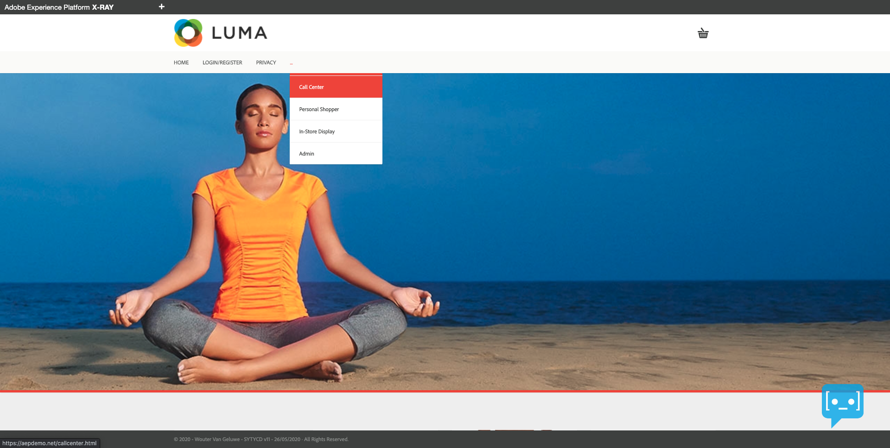
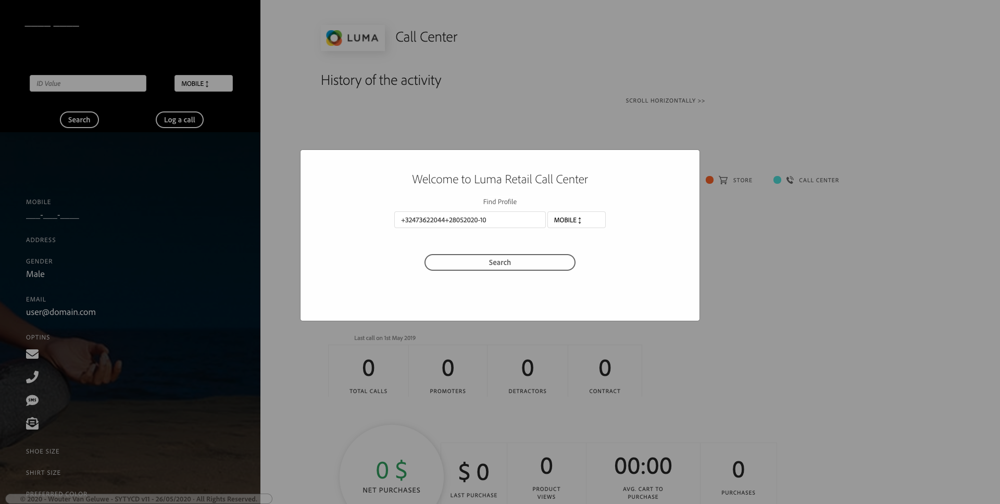
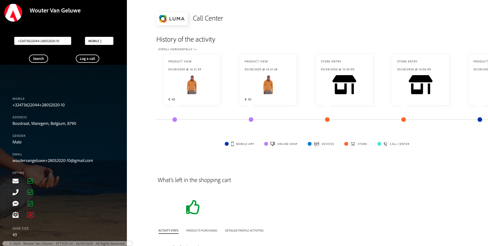
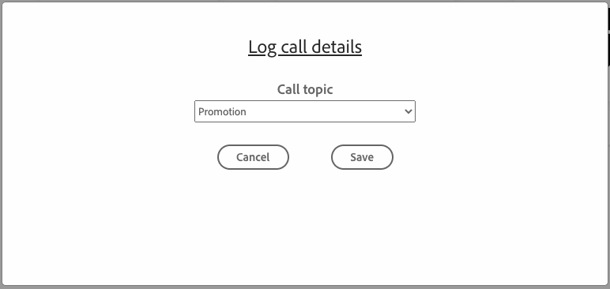
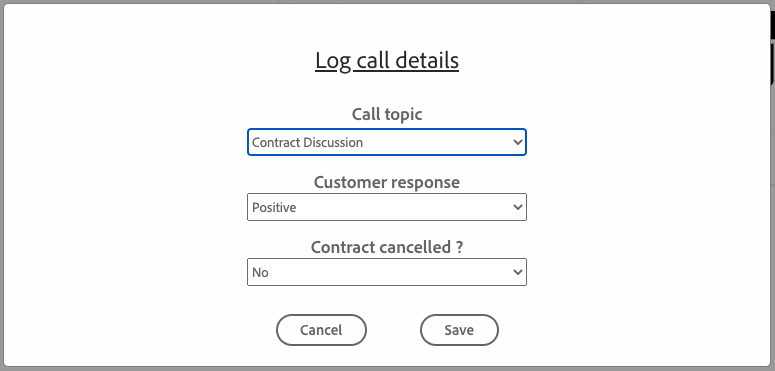
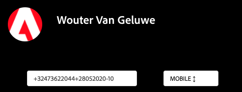
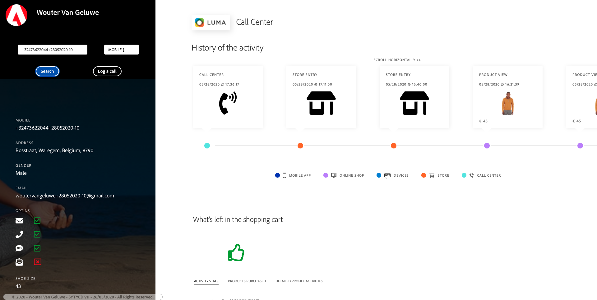

# Exercise 6 - See you Real-time Customer Profile in action in the Call Center

In this exercise, you'll follow a script and walk through the website.

## Story

In this exercise, the goal is to have you walk through the customer journey and act like a real customer.

On this website, we've implemented Adobe Experience Platform. Every activity is considered an Experience Event and is sent like that to Adobe Experience Platform in real-time, and hydrates the Real-time Customer Profile.

In the journey, you started as an anonymous customer who was browsing the website and after a couple of steps, you became a known customer which hydrated Adobe Experience Platform's Real-time Customer Profile.

Let's now see how the information on your Customer Profile can be used to impact the customer experience & a company's bottom line.

## Customer Journey

Go to to your AEP Demo website.

In the site's menu, click on the 3 dots ``...`` and then select Call Center to go to the Call Center simulator.



You'll see the phone number that you previously used when creating your account. Click the ``Search``-button.



You'll now see the information that would ideally be displayed in the Call Center, so that the Call Center employees have all relevant information available immediately when speaking to a customer.



To simulate the end of a call with the call center, you should log the call by clicking on the ``Log a call``-button after which a popup window will open.




Make a random selection of the Call Topic and the Customer Feeling and click ``Save`` to provide Adobe Experience Platform with the information.



Every choice that you make on the Call Details - screen will have an impact on the Real-time Customer Profile with things like Churn Score or Product Recommendations being impacted by any interaction, which may be negative of positive. You can verify the impact by clicking the ```Search``` - button again on the Call Center screen.



After clicking the ```Search``` - button again, you'll see a new Experience Event pop up on the Call Center Screen.



Congrats, you've successfully finished Module 2 - Real-time Customer Profile!

[Go Back to Module 2](./real-time-customer-profile.md)

[Go Back to All Modules](../../README.md)
