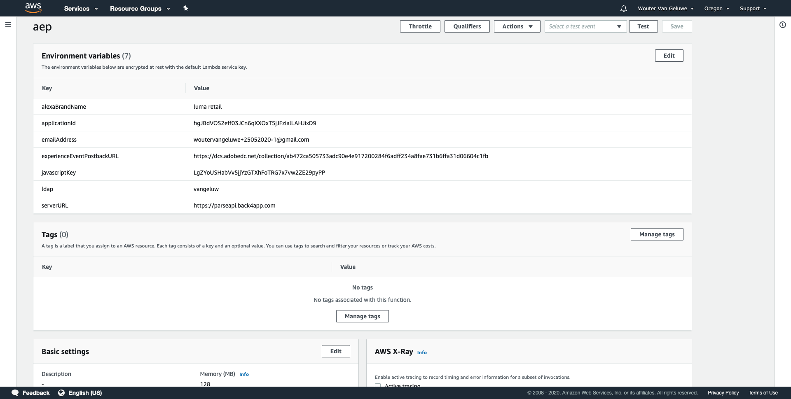
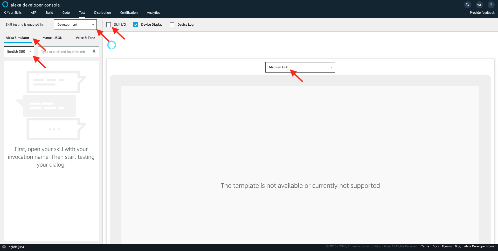
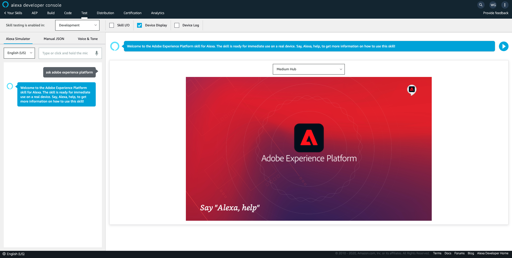
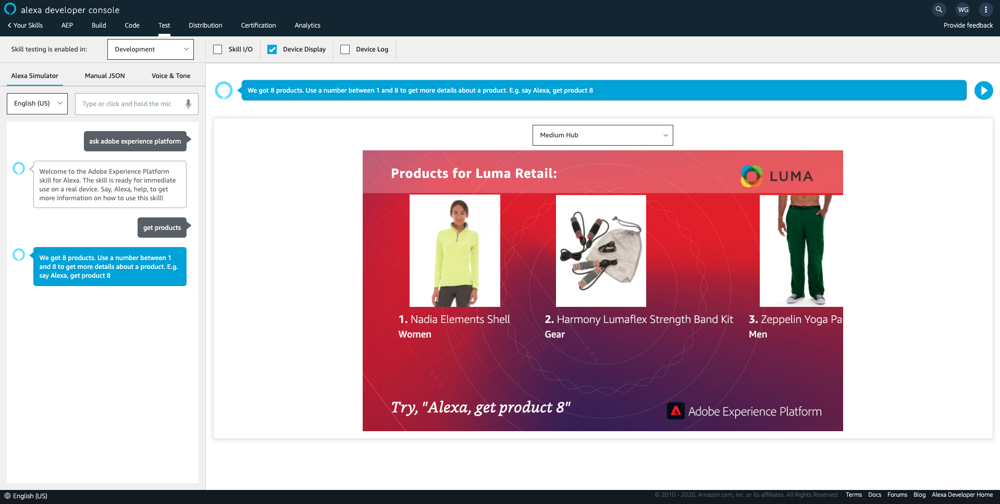
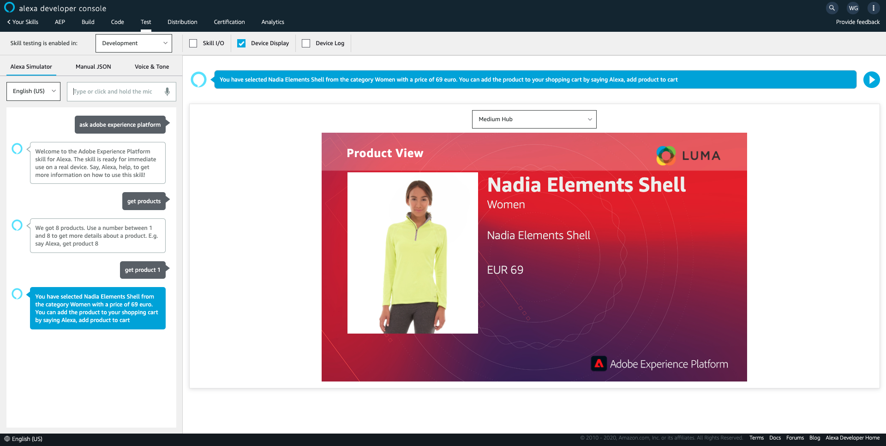
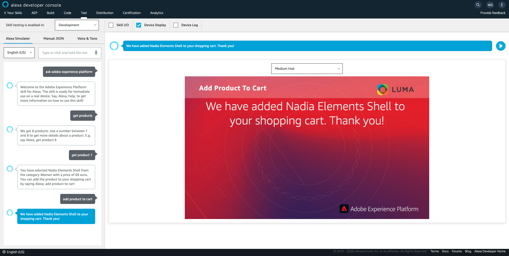
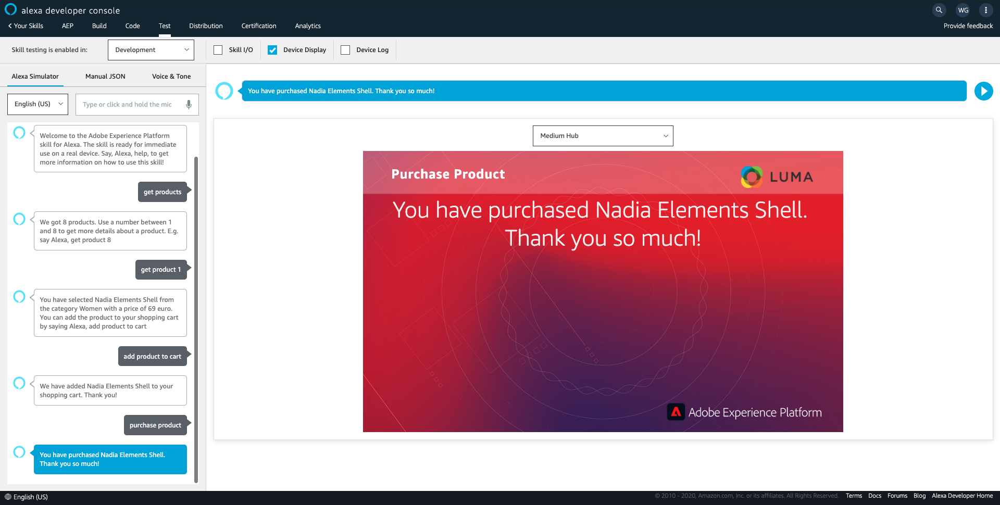
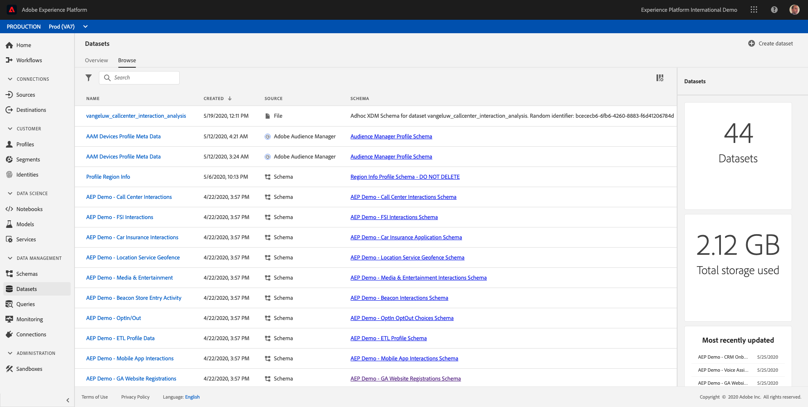
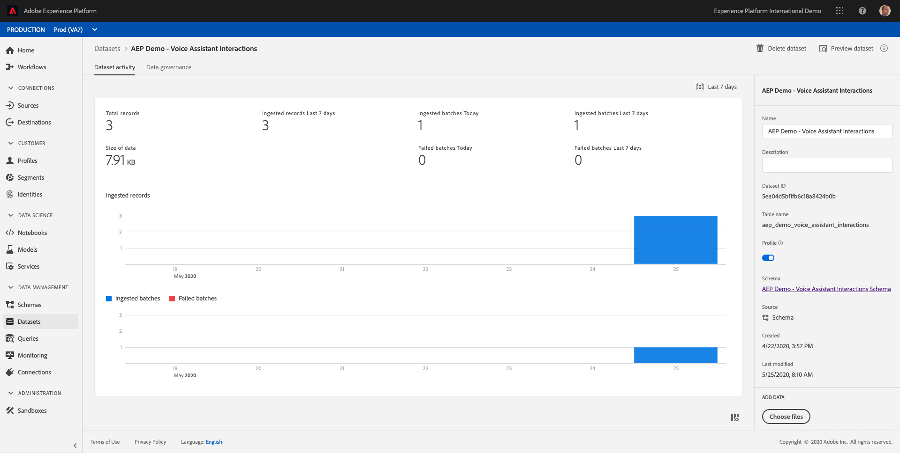
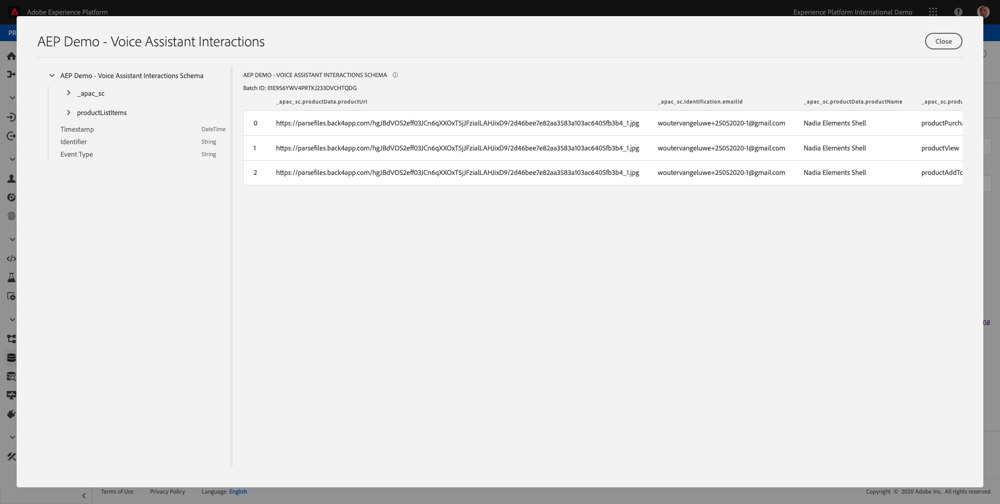

# Exercise 4.3: Use your Alexa skill

You can demonstrate your Alexa skill and its interaction with AEP, even if you do not have a real Alexa device with a display.

To do this, you'll use the Alexa Simulator.

Go to your **AWS Lambda** definition screen for **aep**.

Make sure you have all of these **Environment Variables** properly configured in your Lambda-function before your demonstration, and make sure that these 3 reflect the proper values for your demo: **ldap**, **alexaBrandName**, **emailAddress**.
 

If needed, update and save the **Environment variables**.

Go to your **alexa developer console** and open the **AEP** skill you created as part of [Exercise 4.2](./ex2.md).

In the **aep** skill definition screen within the **alexa developer console**, click on **Test**. 
You might be prompted if you want to allow use of the microphone. The instructions here are using text input for simulating the conversation.

Ensure to:
  
- Select **Development** from **Skill testing is enabled in:**.
- Select the **Alexa Simulator**.
- Select the language you have developed your skill in from the language dropdown list (e.g. **English (GB)**)
- Unselect **Skill I/O**, select **Device Display** and unselect **Device Log**.
- Select the type of device you want to use for your demonstration, e.g. **Small Hub** (Echo Spot) or **Medium Hub** (Echo Show) or another one from the dropdown list.

Your screen should now look like this:

Open the skill by entering **ask adobe experience platform** in the **Type or click and hold the mic**.

Your screen should look like this:

You are now all set to demonstrate the brand and product interaction using the simulator.

Type **get products** to get products.

The simulator will respond with **We got 8 products. Use a number between 1 and 8 to get more details about a product. E.g. say Alexa, get product 8**.

Your screen should look like this:

Type **get product 1** to get product 1.

The simulator will respond with **You have selected Nadia Elements Shell from the category Women with a price of 69 euro. You can add the product to your shopping cart by saying Alexa, add product to cart**.

Your screen should look like this:

Type **add product to cart** to add the product to the cart.

The simulator will respond with **We have added Nadia Elements Shell to your shopping cart. Thank you!**.

Your screen should look like this:

Type **purchase product** to purchase the product.

The simulator will respond with **You have purchased Nadia Elements Shell. Thank you so much!**.

Your screen should look like this:

## Exercise 4.3.3: Viewing the result in Adobe Experience Platform

You can view the experience events generated by your Alexa skill (either the real device or simulator). To do so:

Login to [Adobe Experience Platform](https://platform.adobe.com/home).

Click on **Datasets**.

Select **AEP Demo - Voice Assistant Interactions**.

You'll now see an overview of all ingested data in this dataset.

Click **Preview Dataset**.

You'll now see an overview of the most recent data that was ingested in this dataset.

You have finished this exercise. 

Next Step: [4.4 Walkthrough of Demo Scenario, now including Alexa](./ex4.md)

[Go Back to Module 4](./data-ingestion-amazon-alexa.md)

[Go Back to All Modules](./../../overview.md)
