# Exercise 5.1 - Setup an AWS S3 bucket

In this exercise, you'll learn how to setup an AWS S3 bucket in your own AWS environment and how to upload data in that S3 bucket.

First of all, in this module we'll use 4 CSV-files as datasources in Informatica. Please download [this zip-file](./downloads/csvfiles.zip) to your desktop and unzip its contents on your desktop.

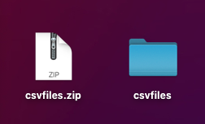

## Create your S3-bucket

Go to [https://console.aws.amazon.com](https://console.aws.amazon.com) and sign in with the Amazon-account you created in Module 4.

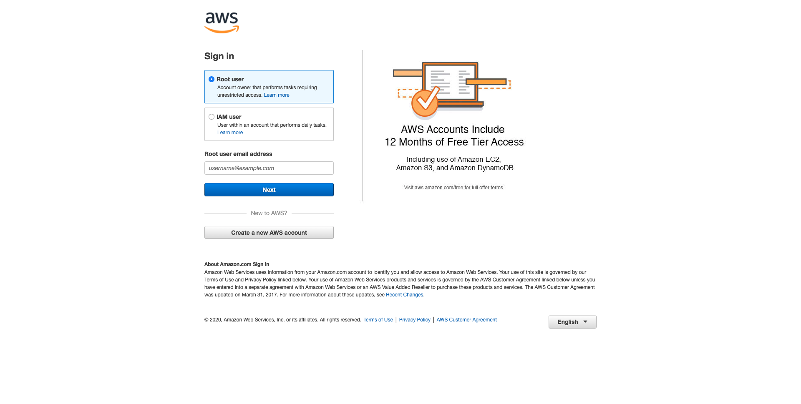

After logging in, you'll be redirected to the ``AWS Management Console``.

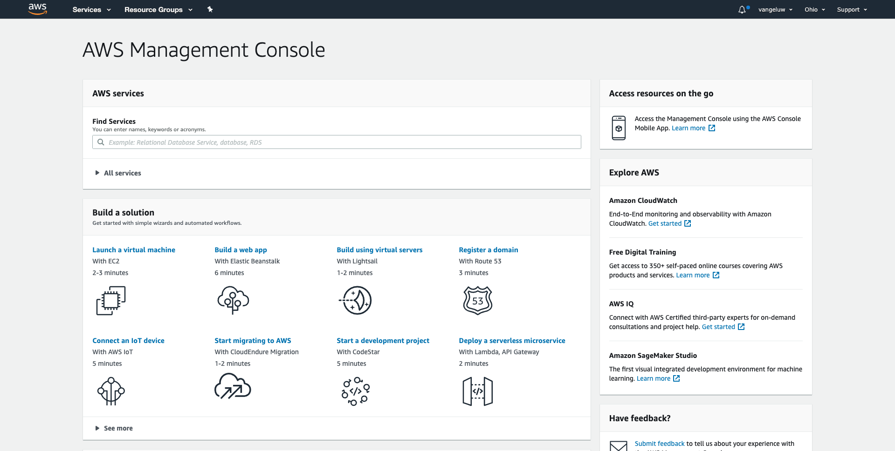

In the ``Find Services``-menu, search for ``s3``.

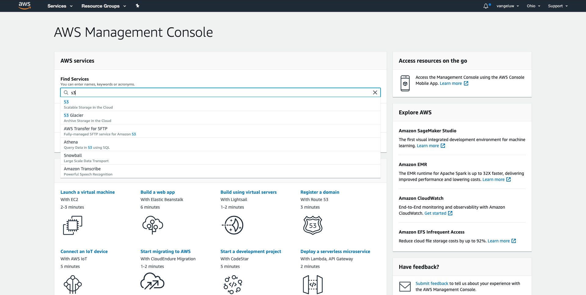

Click the first search result: ``S3 - Scalable Storage in the Cloud``.

You'll then see the ``Amazon S3``-homepage.

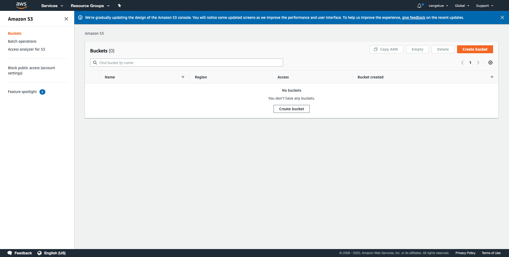

Click the ``Create Bucket``-button.

In the ``Create Bucket``-screen, you need to configure 2 things:
  
- Name: use the name ``aepmodule5LDAP`` and replace LDAP by your LDAP. As an example, in this exercise the bucket name is ``aepmodule5vangeluw``
- Region: use the region ``EU (Frankfurt) eu-central-1``

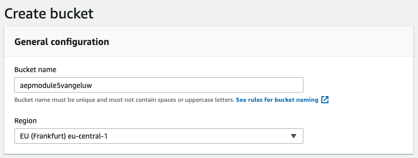

Scroll down on the page until you see ``Bucket settings for Block Public Access``. Leave these settings as they are, no need to change them.

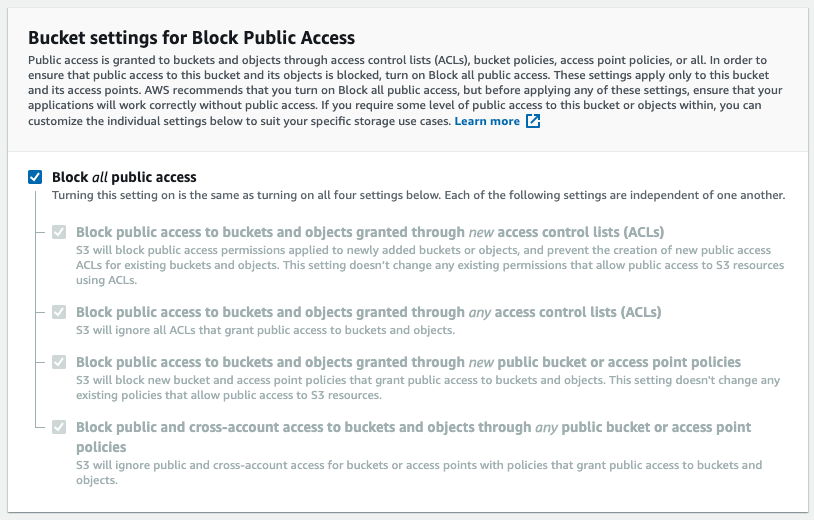

Click the ``Create Bucket``-button.

You'll then see your bucket being created and will be redirected to the Amazon S3-homepage.

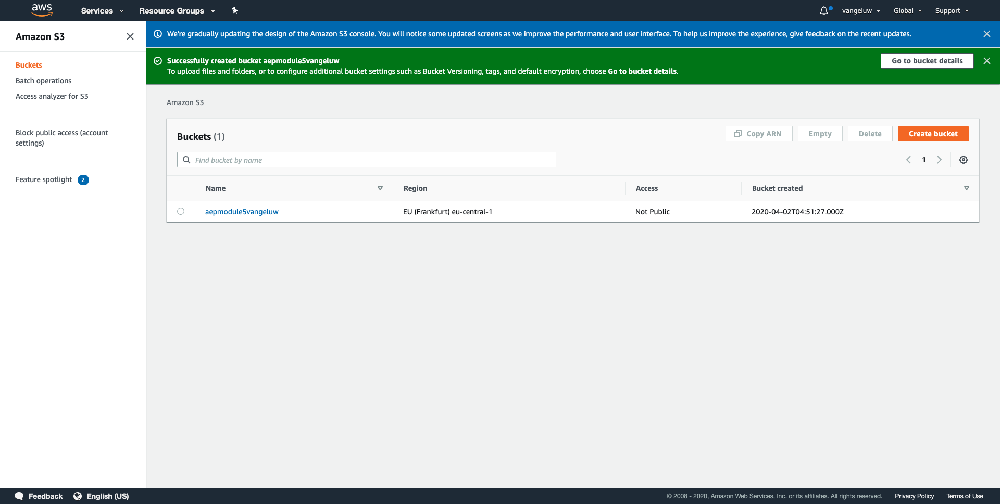

## Upload CSV-files to your S3-bucket

The next step is to upload the CSV-files we'll use for this module into your S3 bucket.

Click on your S3-bucket to open it. You'll then see this page.

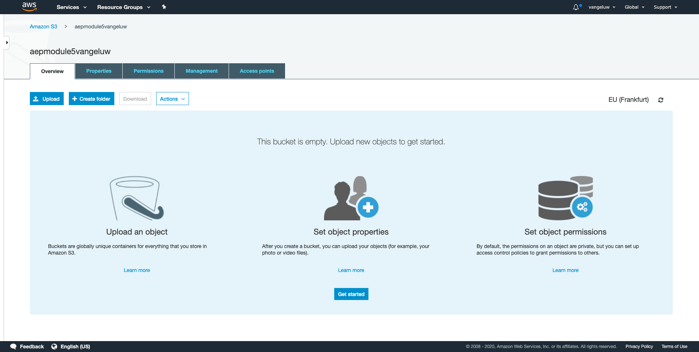

Click ``Upload`` to start uploading the 4 CSV-files.

You'll then see this popup.

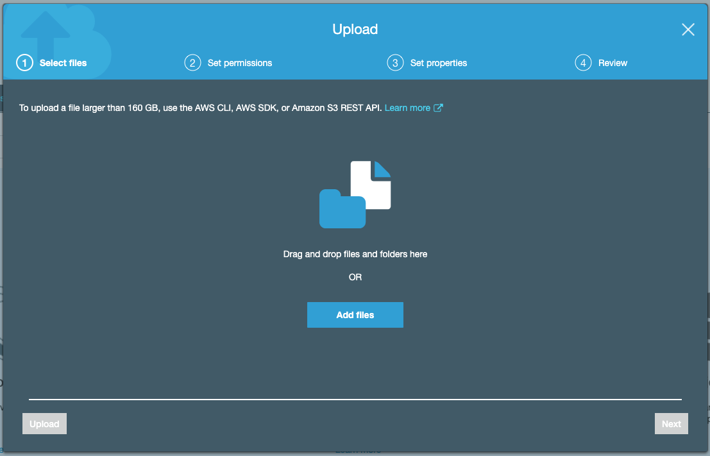

Click ``Add Files``.

Navigate to the directory ``csvfiles`` on your desktop, select all 4 files and then click ``Open``.

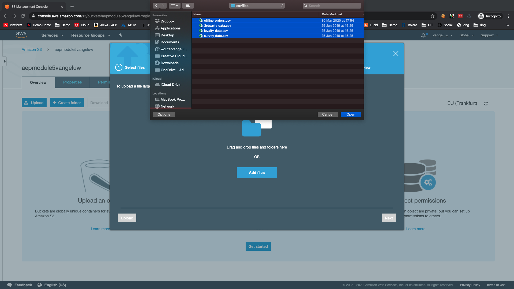

You'll then see this screen.

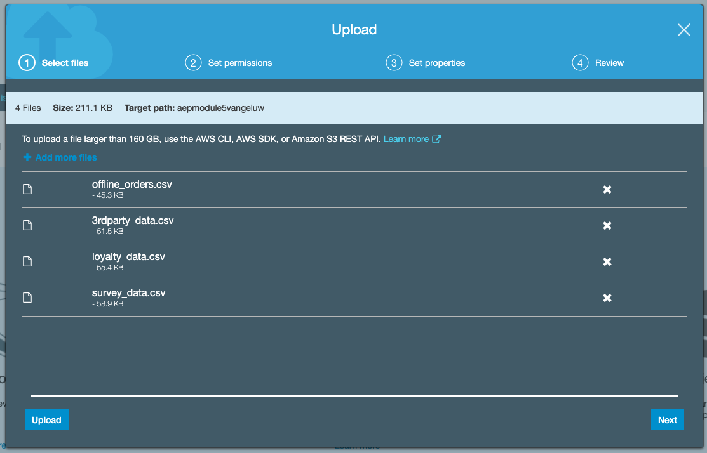

Click ``Upload``.

You'll now see your CSV-files uploaded in your S3-bucket.

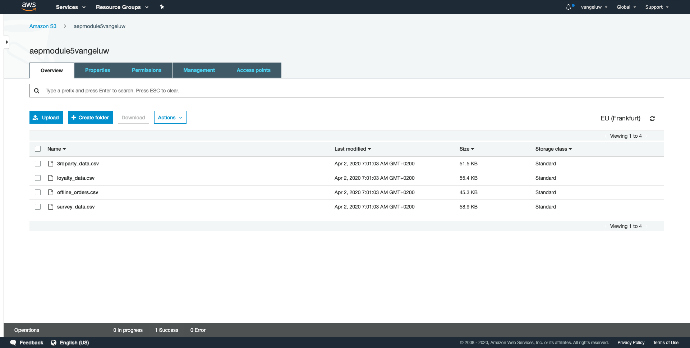

## Set permissions to access your S3-bucket

The next step is to setup access to your S3 bucket.

To do that, go to [https://console.aws.amazon.com/iam/home](https://console.aws.amazon.com/iam/home).

Access to AWS resources is controlled by Amazon Identity and Access Management (IAM).

You'll now see this page.

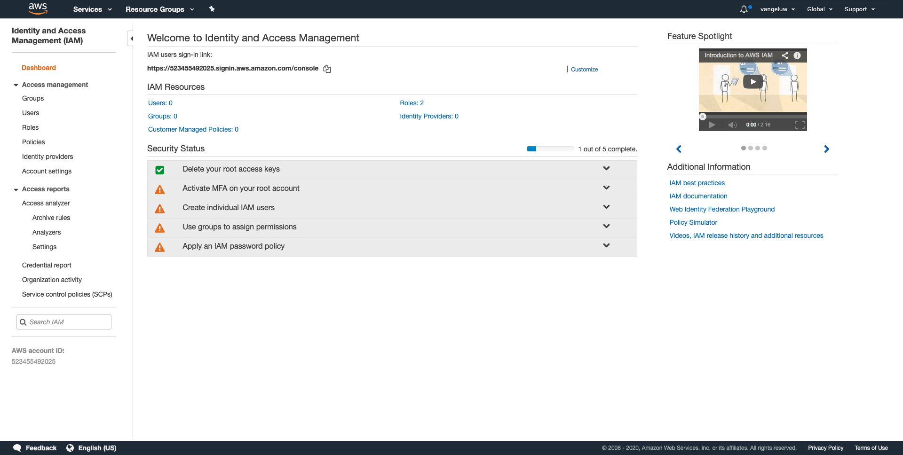

In the left menu, click ``Users``.

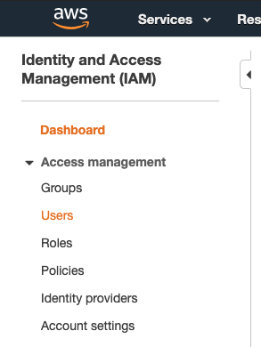

You'll then see the ``Users``-screen.

Click ``Add User``.

Next, configure your user:

- User Name: use ``s3_ldap`` as a name, so in this example the name is ``s3_vangeluw``.
- AWS access type: select ``Programmatic access``.

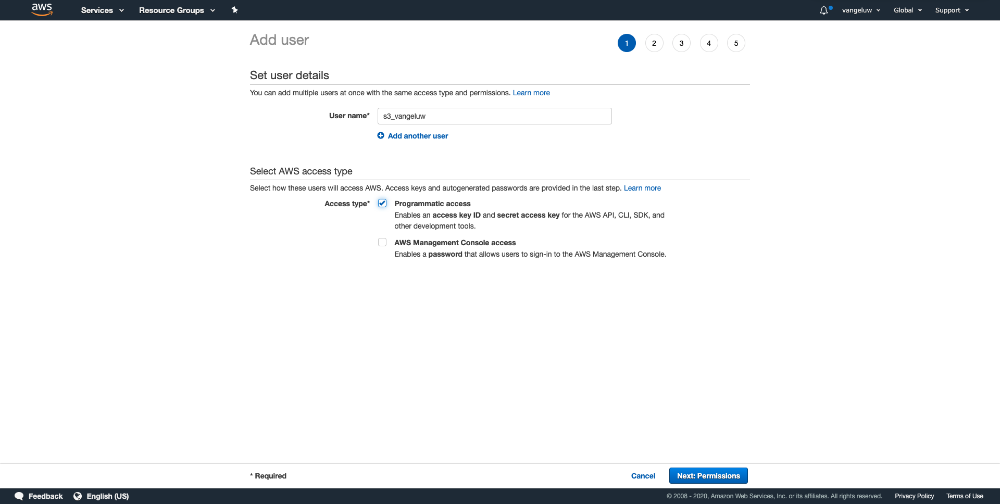

Click ``Next: Permissions``.

You'll then see this permissions screen. Click ``Attach existing policies directly``.

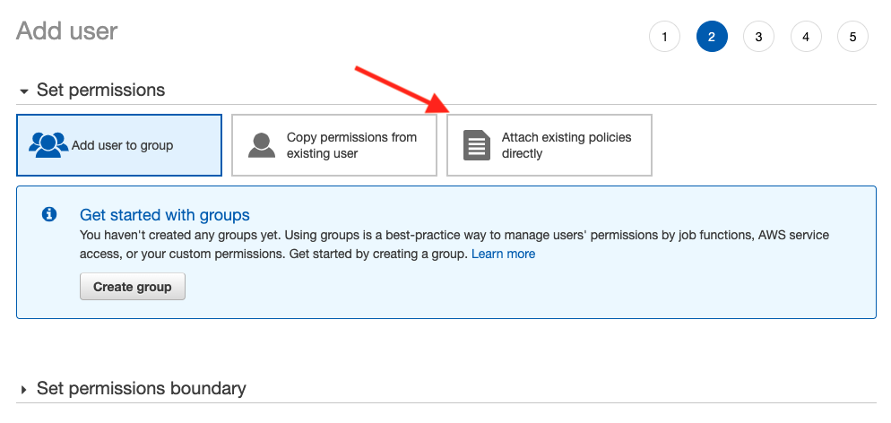

Enter the search term ``s3`` to see all related S3 policies. Select the policy ``AmazonS3FullAccess``.

Click ``Next: Tags``.

On the ``Tags``-screen, there's no need to configure anything.

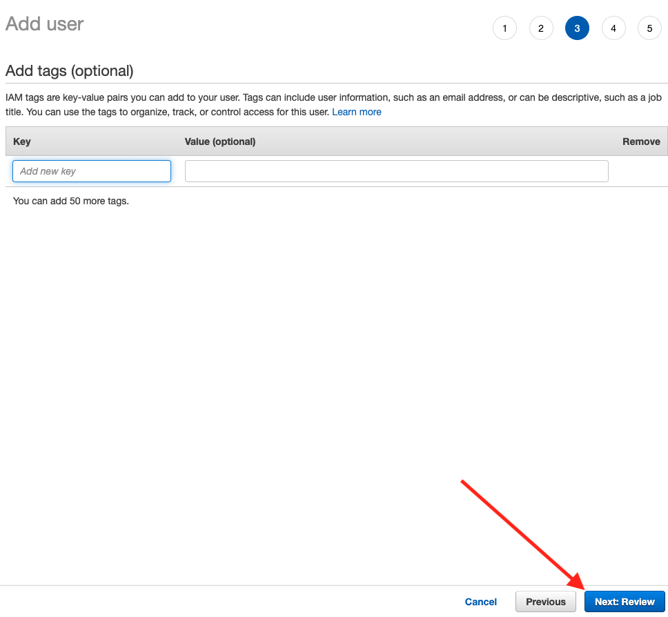

Click ``Next: Review``.

Review your configuration.

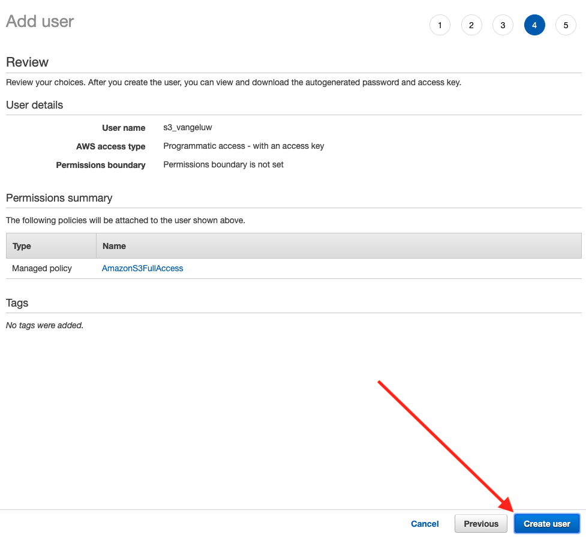

Click ``Create User``.

Your user is now created and you're seeing your Credentials to access your S3 environment. This is the only time you'll see your credentials so please write them down.

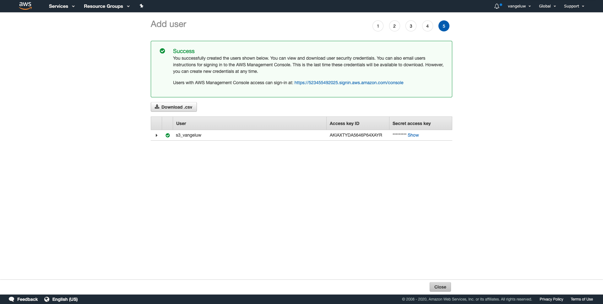

Click ``Show`` to see your Secret access key:

**!! IMPORTANT !!**

Store your credentials in a text-file in your computer.

- Access key ID: ...
- Secret access key: ...

**!! IMPORTANT !!**

Once you click ``Close`` you'll never see your credentials again...

Click ``Close``.

You've now successfully created an AWS S3 bucket, you've uploaded CSV files into that bucket and you've created a user with permissions to access this bucket.

Next Step: [Exercise 5.2 - Connect Informatica to your AWS S3 bucket](./ex2.md)

[Go Back to Module 5](./README.md)

[Go Back to All Modules](../../README.md)
